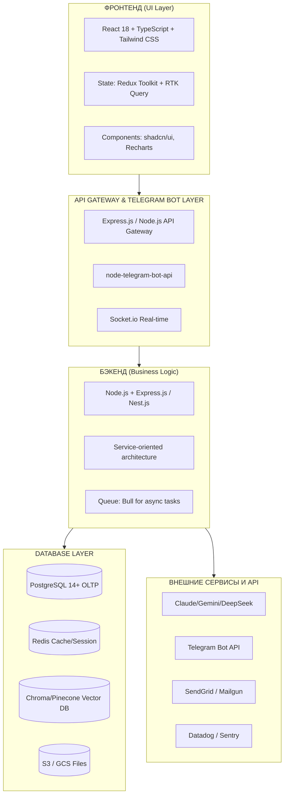

# MatrixGin – Полнослойная архитектура и план разработки v2.0

> **Версия:** 2.0 (MVP-First Approach)  
> **Дата:** 2025-11-21  
> **Статус:** Production Ready  
> **Основание:** Экспертная оценка и рекомендации

## Оглавление
1. [Цели и требования](#1.0-цели-и-требования)
2. [Архитектура и стек](#2.0-архитектура-и-стек)
3. [Моделирование данных и API](#3.0-моделирование-данных-и-api)
4. [План разработки фронтенда и бэкенда](#4.0-план-разработки-фронтенда-и-бэкенда)
5. [Итерации, тесты и деплой](#5.0-итерации-тесты-и-деплой)
6. [MatrixGin v2.0 (Constitution Compliant)](#6.0-matrixgin-v20-constitution-compliant)
7. [MVP Scope & Roadmap](#7.0-mvp-scope--roadmap)
8. [New ERP Modules](#8.0-new-erp-modules)
9. [Risk Mitigation & Compliance](#9.0-risk-mitigation--compliance)

---

## 1.0 ЦЕЛИ И ТРЕБОВАНИЯ

### Видение
**MatrixGin** — интегрированная платформа управления сотрудниками и корпоративного AI-ассистента, реализующая философию **"Золотого Стандарта v3.0"**: синергия Человека и AI.
Это не просто инструмент, а **цифровой экзоскелет** для сотрудников, который:
*   **Устраняет потери (Muda):** Берет на себя рутину и "цифровой шум", позволяя людям фокусироваться на создании ценности.
*   **Ускоряет улучшения (Kaizen 2.0):** Анализирует процессы и предлагает оптимизации в реальном времени.
*   **Объединяет функции:**
    *   Управление персоналом и аналитику (Employee Management)
    *   Управление компанией и операционные дашборды (Company Management)
    *   HR-аналитику и выявление рисков (HR Department System / Matrix360)
    *   Корпоративное обучение (Corporate University)
    *   Управление задачами (Task Management)
    *   Психологическую поддержку и мониторинг эмоционального состояния (Psychological Support)
    *   Непрерывное обучение самого AI (AI Self-Learning)
    *   Автоматизированное создание корпоративного контента (Content Management)

### Ключевые требования

| Категория | Требование |
| :--- | :--- |
| **Философия (Lean)** | Реализация принципов Бережливого Производства: устранение 8 видов потерь + "Цифрового шума" |
| **Функциональность** | Поддержка 8 основных блоков + модуль **Kaizen** (сбор и внедрение идей) |
| **Масштабируемость** | До 5000+ сотрудников, многолокационная структура, многодепартаментная оргструктура |
| **Интеграции** | Telegram Bot (primary), Email, SMS, CRM, ERP, HR системы, LMS, vector databases |
| **Аналитика** | Real-time KPI, emotional tone monitoring (0.0-4.0 scale), HR analytics, predictive insights |
| **AI/ML** | RAG система, sentiment analysis, NLP, anomaly detection, self-learning, **MatrixGin Guardian** (Legal/Ethical shield) |
| **Безопасность** | Role-based access (RBAC), данные сотрудников в зашифрованном виде, audit logs, "Право на отключение" |
| **Производительность** | <500ms на основные запросы, real-time notifications <1 sec latency |
| **Надежность** | 99.5% uptime, автоматические бэкапы, disaster recovery, обработка сбоев |

### Целевые пользователи
1.  **Сотрудники** — творцы ценности. Используют AI для устранения рутины, развития и подачи Kaizen-идей.
2.  **Руководители** — архитекторы процессов. Управление командой, аналитика потерь, мониторинг потока.
3.  **HR специалисты** — хранители культуры. Аналитика персонала, опросы, выявление рисков выгорания.
4.  **Администраторы** — конфигурация, управление доступами, интеграции.

---

## 2.0 АРХИТЕКТУРА И СТЕК

### 2.1 Технический стек (рекомендуемый)



### 2.2 Выбор стека

#### Фронтенд
*   **React 18** — компонентная архитектура, огромная экосистема.
*   **TypeScript** — типизация, меньше ошибок в production.
*   **Tailwind CSS** — быстрая разработка UI, конфигурируемая палитра.
*   **Redux Toolkit + RTK Query** — управление состоянием и кэширование.
*   **Vite** — быстрая dev-сборка.

#### Бэкенд
*   **Node.js + Express.js** — быстрое прототипирование, асинхронность из коробки.
*   **TypeScript** — тип-безопасность.
*   **Prisma** — ORM для PostgreSQL, автомиграции.
*   **Bull** — очередь для фоновых задач (отправка уведомлений, парсинг документов).
*   **Passport.js** — аутентификация и авторизация.

#### База данных
*   **PostgreSQL** — надежная RDBMS, JSONB для гибких структур, рекомендуется для финансовых данных.
*   **Redis** — кэш и real-time данные (KPI, notifications).
*   **Chroma** — vector database для RAG (встраивается в Python, доступна через API).
*   **S3/Google Cloud** — масштабируемое хранилище файлов.

#### Развертывание и DevOps
*   **Docker** — контейнеризация (Node приложение, Postgres, Redis).
*   **Docker Compose** — локальное тестирование.
*   **Kubernetes (optional)** — production масштабирование (GKE, EKS, Digital Ocean).
*   **GitHub Actions** — CI/CD пайплайны.
*   **Terraform** — infrastructure as code.

### 2.3 Архитектурная диаграмма
*(См. диаграмму выше)*

### 2.4 Communication Flow
*(TBD: Описание потоков данных)*

---

## 3.0 МОДЕЛИРОВАНИЕ ДАННЫХ И API

### 3.1 Основные сущности БД
*   **Users & Roles**
    *   `primary_status`: enum (Photon, Topchik, Kremen, Star, Universe)
    *   `secondary_rank`: enum (None, Collector, Investor, Magnate, Diamond_Hand)
    *   `gmc_balance`: int
    *   `gmc_holding_start_date`: date
*   **StatusLog** (History of status changes)
*   **Coin System Entities**
    *   `Wallets` (user_id, mc_balance, gmc_balance)
    *   `Transactions` (sender_id, receiver_id, amount, currency, type, description)
    *   `MC_Ledger` (user_id, amount, created_at, expires_at, is_frozen)
    *   `Auctions` (lot_item, start_price, current_bid, end_time, status)
    *   `Bids` (auction_id, user_id, amount, timestamp)
    *   `StoreItems` (name, price_mc, price_gmc, stock)
*   **Organization Structure**
*   **KPI & Analytics**
*   **Tasks**
*   **HR Analytics**
*   **Psychological Monitoring**
*   **Learning & University**
*   **Content Management**
*   **Vector DB / RAG (Chroma)**
*   **Kaizen Ideas & Improvements** (Continuous Improvement)
*   **Muda / Loss Logs** (Waste tracking)
*   **NPS / Feedback Loop** (Sustainable Feedback)


### 3.2 API Endpoints — Полный Каталог (REST-compliant)

> **КРИТИЧЕСКИ ВАЖНО:** Этот раздел содержит **полный каталог всех эндпоинтов** MatrixGin. Все эндпоинты должны быть запрограммированы **строго по единым правилам**, описанным ниже. Ни один эндпоинт не должен быть потерян или реализован по-другому.

---

#### 🎯 Принципы Проектирования API (Обязательные Правила)

**1. REST-архитектура:**
- **Resource-based URLs** — эндпоинты группируются по ресурсам (employees, tasks, departments)
- **HTTP verbs** — используются стандартные методы:
  - `GET` — получение данных (безопасный, идемпотентный)
  - `POST` — создание нового ресурса
  - `PUT` — полное обновление существующего ресурса
  - `PATCH` — частичное обновление ресурса
  - `DELETE` — удаление ресурса
- **Статус-коды** — стандартные HTTP коды (200, 201, 400, 401, 403, 404, 500)

**2. Именование эндпоинтов:**
- Всегда **множественное число** для коллекций: `/api/employees`, `/api/tasks`
- **Kebab-case** для составных слов: `/api/burnout-risk`, `/api/status-leaderboard`
- **Вложенность** для связанных ресурсов: `/api/employees/{id}/analytics`
- **Действия** через POST на специальный эндпоинт: `/api/tasks/{id}/assign`

**3. Версионирование:**
- Версия API в URL: `/api/v1/employees`, `/api/v2/employees`
- Текущая версия: **v1** (по умолчанию можно опускать)
- При breaking changes — новая версия

**4. Аутентификация:**
- **JWT токены** в заголовке `Authorization: Bearer <token>`
- **RBAC** — проверка ролей на уровне middleware
- Refresh tokens для продления сессии

**5. Пагинация (для списков):**
```
GET /api/employees?page=1&limit=20&sort=created_at&order=desc
```

**6. Фильтрация:**
```
GET /api/tasks?status=active&assignee_id=123&department_id=5
```

---

#### 📋 Стандартный Формат Запроса/Ответа

**Успешный ответ (200 OK):**
```json
{
  "success": true,
  "data": {
    "id": "uuid-123",
    "name": "Иван Иванов",
    "email": "ivan@photomatrix.ru"
  },
  "meta": {
    "timestamp": "2025-11-21T11:17:39+03:00",
    "request_id": "req-abc-123"
  }
}
```

**Список с пагинацией (200 OK):**
```json
{
  "success": true,
  "data": [
    { "id": 1, "name": "Item 1" },
    { "id": 2, "name": "Item 2" }
  ],
  "pagination": {
    "page": 1,
    "limit": 20,
    "total": 150,
    "total_pages": 8
  },
  "meta": {
    "timestamp": "2025-11-21T11:17:39+03:00"
  }
}
```

**Ошибка (4xx, 5xx):**
```json
{
  "success": false,
  "error": {
    "code": "VALIDATION_ERROR",
    "message": "Некорректные данные",
    "details": [
      {
        "field": "email",
        "message": "Email обязателен"
      }
    ]
  },
  "meta": {
    "timestamp": "2025-11-21T11:17:39+03:00",
    "request_id": "req-abc-123"
  }
}
```

---

#### 🚨 Коды Ошибок (Стандартизированные)

| HTTP Code | Error Code | Описание | Пример |
|-----------|------------|----------|--------|
| 400 | `VALIDATION_ERROR` | Некорректные данные в запросе | Отсутствует обязательное поле |
| 401 | `UNAUTHORIZED` | Не авторизован | Отсутствует или невалидный JWT токен |
| 403 | `FORBIDDEN` | Недостаточно прав | Попытка доступа к чужим данным |
| 404 | `NOT_FOUND` | Ресурс не найден | Сотрудник с ID не существует |
| 409 | `CONFLICT` | Конфликт данных | Email уже используется |
| 422 | `UNPROCESSABLE_ENTITY` | Бизнес-логика не позволяет | Нельзя удалить активную задачу |
| 429 | `RATE_LIMIT_EXCEEDED` | Превышен лимит запросов | Более 100 запросов/минуту |
| 500 | `INTERNAL_ERROR` | Внутренняя ошибка сервера | Ошибка БД, LLM API недоступен |
| 503 | `SERVICE_UNAVAILABLE` | Сервис временно недоступен | Плановое обслуживание |

---

#### 📚 ПОЛНЫЙ КАТАЛОГ ЭНДПОИНТОВ (по модулям)

---

### 🧑‍💼 1. Employee Resource (HR + Emotional Analytics)

**Базовые операции:**
- `GET /api/employees` — Список всех сотрудников (с фильтрами: department, status, rank)
- `GET /api/employees/{id}` — Детали сотрудника
- `POST /api/employees` — Создать нового сотрудника
- `PUT /api/employees/{id}` — Обновить сотрудника (полностью)
- `PATCH /api/employees/{id}` — Частичное обновление
- `DELETE /api/employees/{id}` — Удалить сотрудника (soft delete)

**HR Аналитика:**
- `GET /api/employees/{id}/analytics` — HR-аналитика сотрудника (KPI, стаж, статус)
- `GET /api/employees/{id}/emotional` — Эмоциональное состояние (тон 0.0-4.0)
- `GET /api/employees/{id}/burnout-risk` — Риск выгорания (ML-модель)
- `GET /api/employees/{id}/turnover-risk` — Риск увольнения (ML-модель)
- `GET /api/employees/{id}/network` — Граф коммуникаций сотрудника

**Скрининг и мониторинг:**
- `POST /api/employees/{id}/screening` — Pre-hire скрининг соцсетей
- `GET /api/employees/{id}/social-mood` — Настроение через соцсети
- `GET /api/employees/{id}/ethics-violations` — Нарушения этики

**Статусы и ранги:**
- `GET /api/employees/{id}/status` — Текущий статус и ранг
- `GET /api/employees/{id}/status/progress` — Прогресс до следующего статуса
- `POST /api/employees/{id}/status/upgrade` — Повышение статуса (HR only)

---

### ✅ 2. Task Resource (Smart Task Management)

**CRUD операции:**
- `GET /api/tasks` — Список задач (фильтры: status, assignee, department, priority)
- `GET /api/tasks/{id}` — Детали задачи
- `POST /api/tasks` — Создать задачу (поддержка NLP: "Проверить принтеры на Мира завтра")
- `PUT /api/tasks/{id}` — Обновить задачу
- `DELETE /api/tasks/{id}` — Удалить задачу

**Управление задачами:**
- `POST /api/tasks/{id}/assign` — Назначить задачу сотруднику (или по MDR)
- `POST /api/tasks/{id}/complete` — Отметить как выполненную
- `POST /api/tasks/{id}/comment` — Добавить комментарий
- `GET /api/tasks/volunteer-opportunities` — Задачи для волонтерства
- `POST /api/tasks/{id}/volunteer` — Взять задачу волонтером (+MC)

**NLP парсинг:**
- `POST /api/tasks/natural-language` — Создать задачу из текста (NLP)

---

### 🏢 3. Department Resource

**Базовые операции:**
- `GET /api/departments` — Список всех департаментов
- `GET /api/departments/{id}` — Детали департамента
- `GET /api/departments/{id}/employees` — Сотрудники департамента

**Аналитика:**
- `GET /api/departments/{id}/kpi` — KPI департамента
- `GET /api/departments/{id}/muda` — Анализ потерь (8 типов Muda)
- `GET /api/departments/{id}/kaizen` — Предложения улучшений
- `GET /api/departments/{id}/emotional-climate` — Эмоциональный климат

**Специфичные департаменты:**
- `GET /api/departments/commercial/leads` — Лиды (Коммерческий)
- `GET /api/departments/finance/pnl-live` — P&L в реальном времени (Финансы)
- `GET /api/departments/finance/alerts` — Финансовые алерты
- `GET /api/departments/production/feedback` — Операционные фидбэки (Производство)
- `GET /api/departments/production/quality-check` — Контроль качества
- `GET /api/departments/education/recommendations` — Рекомендации обучения (Квалификация)
- `POST /api/departments/education/quiz-gen` — Генерация тестов
- `GET /api/departments/development/trends` — Тренды рынка (Развитие)
- `POST /api/departments/development/ideas` — Генерация идей

---

### 💰 4. Economy Resource (MatrixCoin + GMC + Auctions)

**Кошелек:**
- `GET /api/economy/balance/{userId}` — Баланс (MC + GMC)
- `GET /api/economy/transactions` — История транзакций
- `POST /api/economy/transactions` — Создать транзакцию (перевод MC/GMC)
- `POST /api/economy/safe/activate` — Активировать "Сейф" (заморозка MC на 30 дней)
- `GET /api/economy/safe/status/{userId}` — Статус сейфа

**Аукционы:**
- `GET /api/economy/auction` — Активные аукционы
- `GET /api/economy/auction/{id}` — Детали аукциона
- `POST /api/economy/auction/{id}/bid` — Сделать ставку
- `GET /api/economy/auction/{id}/history` — История ставок

**Магазин:**
- `GET /api/economy/store` — Товары в магазине (GMC/MC)
- `POST /api/economy/store/buy` — Купить товар
- `GET /api/economy/store/{itemId}` — Детали товара

**Платежи (Российские системы):**
- `POST /api/economy/payment/sberbank` — Оплата через СберБанк
- `POST /api/economy/payment/tinkoff` — Оплата через Тинькофф
- `POST /api/economy/payment/yookassa` — Оплата через ЮКасса
- `GET /api/economy/payment/{transactionId}` — Статус платежа

---

### 🎮 5. Gamification Resource (Статусы + Ранги + Достижения)

**Статусы:**
- `GET /api/gamification/status/my` — Мой статус и привилегии
- `GET /api/gamification/status/leaderboard` — Рейтинг по статусам
- `POST /api/gamification/status/claim-reward` — Получить награду за ранг

**Лидерборды:**
- `GET /api/gamification/leaderboard` — Общий лидерборд (MC)
- `GET /api/gamification/leaderboard/department/{id}` — Лидерборд департамента

**Достижения:**
- `GET /api/gamification/achievements/{userId}` — Достижения пользователя
- `POST /api/gamification/achievements/{userId}/award` — Наградить достижением

**Расчеты:**
- `POST /api/gamification/status/calc` — Пересчет статуса/ранга (Cron job)

---

### ⚖️ 6. Legal & Compliance Resource

**Юридические документы:**
- `GET /api/legal/documents/templates` — Шаблоны документов
- `POST /api/legal/documents/generate` — Генерация документа (AI)
- `GET /api/legal/documents/{id}` — Скачать документ
- `POST /api/legal/nda/accept` — Принять NDA (при регистрации)
- `GET /api/legal/nda/content` — Текст NDA

**Комплаенс:**
- `GET /api/compliance/calendar` — Календарь налоговых дедлайнов
- `POST /api/compliance/gdpr/consent` — Управление согласиями GDPR/152-ФЗ
- `GET /api/compliance/risk/audit-log` — Журнал аудита
- `GET /api/compliance/checklist` — Чеклист соответствия

**Российская специфика:**
- `GET /api/compliance/labor-law` — Статус соответствия ТК РФ
- `GET /api/compliance/tax-report` — Налоговые отчеты
- `POST /api/compliance/1c-sync` — Синхронизация с 1С
- `GET /api/compliance/evotor-fiscal` — Фискальные данные Evotor
- `POST /api/compliance/152fz-consent` — Согласие 152-ФЗ
- `GET /api/compliance/gov-reporting` — Отчеты в гос. органы (ФНС, ПФР, ФСС)

**Проверки:**
- `POST /api/legal/check-action` — Проверка действия на законность (AI)
- `GET /api/legal/updates` — Изменения в законодательстве
- `GET /api/legal/risks` — Дашборд правовых рисков

---

### 📊 7. Strategy & Management Resource

**Стратегия:**
- `GET /api/strategy/okr` — OKR (Objectives & Key Results)
- `POST /api/strategy/okr` — Создать OKR
- `PUT /api/strategy/okr/{id}` — Обновить OKR
- `GET /api/strategy/okr/{id}/progress` — Прогресс по OKR

**Управление трансформацией:**
- `GET /api/strategy/ctm/dashboard` — Дашборд ЦУТ (Центр Управления Трансформацией)
- `GET /api/strategy/ctm/roadmap` — Roadmap трансформации

**Аудиты:**
- `POST /api/strategy/audit/zsf` — Аудит Золотого Стандарта
- `GET /api/strategy/audit/zsf/results` — Результаты аудита

**Совещания:**
- `POST /api/strategy/meetings/protocol` — Загрузить протокол (AI парсинг)
- `GET /api/strategy/meetings/{id}/tasks` — Задачи из совещания

---

### 📝 8. Feedback Resource (Branch Feedback System)

**Ежедневные фидбэки:**
- `GET /api/feedback/plan/daily` — Авто-план на день
- `POST /api/feedback/morning` — Утренний фидбэк (фото готовности)
- `POST /api/feedback/evening` — Вечерний фидбэк (План vs Факт)
- `GET /api/feedback/reports` — Агрегированные отчеты (для руководства)

**SMART анализ:**
- `POST /api/feedback/smart-report` — SMART-отчет с AI-подсказками
- `GET /api/feedback/quality-report` — Оценка качества фидбэков

**Челленджи:**
- `GET /api/feedback/vkp-challenge` — Челлендж ЦКП на день (+50 MC)
- `POST /api/feedback/vkp-challenge/complete` — Завершить челлендж

**Уровни взаимодействия:**
- `GET /api/feedback/interaction-level/{userId}` — Текущий уровень (Минимальный/Умеренный/Активный/Интенсивный)
- `POST /api/feedback/interaction-level/{userId}` — Установить уровень (Admin)

---

### 🎓 9. Learning & Education Resource (Corporate University)

**Курсы и материалы:**
- `GET /api/education/courses` — Список курсов
- `GET /api/education/courses/{id}` — Детали курса
- `POST /api/education/courses/{id}/enroll` — Записаться на курс
- `GET /api/education/my-courses` — Мои курсы

**Рекомендации:**
- `GET /api/education/recommendations/{userId}` — Персональные рекомендации

**Тесты:**
- `POST /api/education/quiz-gen` — Генерация теста (AI)
- `POST /api/education/quiz/{id}/submit` — Отправить ответы
- `GET /api/education/quiz/{id}/results` — Результаты теста

---

### 😊 10. Emotional Analytics Resource

**Мониторинг:**
- `GET /api/emotional/employee/{id}` — Эмоциональный тон сотрудника (0.0-4.0)
- `GET /api/emotional/company-mood` — Средний тон компании
- `GET /api/emotional/burnout-risks` — Список сотрудников с риском выгорания

**История:**
- `GET /api/emotional/employee/{id}/history` — История эмоционального тона

---

### 🤖 11. Self-Learning Resource (MatrixGin College)

**Версионирование знаний:**
- `GET /api/learning/knowledge-version` — Текущая версия базы знаний
- `POST /api/learning/knowledge-version/rollback` — Откатить версию
- `GET /api/learning/knowledge-version/history` — История версий

**Валидация:**
- `POST /api/learning/validate` — Валидация ответа (Anti-Hallucination Protocol)

**Оптимизация:**
- `POST /api/learning/optimize-prompts` — ML-оптимизация промптов

---

### 📈 12. Executive Dashboard Resource

**Дашборды:**
- `GET /api/executive/dashboard` — Главный дашборд (роль-специфичный)
- `GET /api/executive/insights` — Стратегические инсайты (Multi-LLM)
- `GET /api/executive/anomalies` — Детекция аномалий (Grok-4)
- `GET /api/executive/predictions` — AI-прогнозы (выручка, риски)

---

### 👥 13. HR Analytics Resource (Matrix360)

**Аналитика:**
- `GET /api/hr/network-analysis` — Анализ сети коммуникаций
- `GET /api/hr/informal-leaders` — Неформальные лидеры (PageRank)
- `GET /api/hr/isolated-employees` — Изолированные сотрудники

**Опросы:**
- `POST /api/hr/micro-survey` — Запустить микро-опрос (10% сотрудников)
- `GET /api/hr/micro-survey/{id}/results` — Результаты опроса

---

### 🛡️ 14. Ethics Manager Resource

**Мониторинг:**
- `GET /api/ethics/violations` — Нарушения Конституции
- `GET /api/ethics/conflicts` — Обнаруженные конфликты

**Медиация:**
- `POST /api/ethics/mediate-conflict` — Запустить AI-медиацию
- `POST /api/ethics/support/{userId}` — Отправить поддержку (тон < 1.5)

---

### 📚 15. Knowledge Resource (RAG + Evolution)

**Поиск:**
- `GET /api/knowledge/search` — RAG-поиск по базе знаний
- `POST /api/knowledge/update` — Обновить базу знаний

**Эволюция:**
- `GET /api/knowledge/industry-insights` — Отраслевые инсайты (Perplexity)
- `GET /api/knowledge/competitor-analysis` — Анализ конкурентов (Grok-4)
- `GET /api/knowledge/legal-updates` — Правовые изменения
- `GET /api/knowledge/weekly-digest` — Еженедельная сводка для руководства

---

### 🎨 16. Content Resource (Content Factory)

**Генерация:**
- `POST /api/content/generate` — Генерация контента (текст/изображение/видео)
- `GET /api/content/personalized/{userId}` — Персонализированный контент
- `GET /api/content/mood-based` — Контент на основе настроения компании

**Аналитика:**
- `GET /api/content/engagement-stats` — Статистика вовлеченности
- `POST /api/content/ab-test` — A/B тестирование контента

---

### 💡 17. Kaizen Resource (Engagement Catalyst)

**Улучшения:**
- `POST /api/kaizen/improvement` — Подать предложение улучшения (+50 MC)
- `GET /api/kaizen/improvements` — Список улучшений
- `POST /api/kaizen/improvements/{id}/vote` — Проголосовать
- `POST /api/kaizen/improvements/{id}/implement` — Внедрить (+200 MC)

**Геймификация:**
- `GET /api/kaizen/leaderboard` — Лидерборд по улучшениям
- `GET /api/kaizen/achievements/{userId}` — Достижения Кайдзен
- `GET /api/kaizen/engagement-index` — Индекс вовлеченности (цель: 30/квартал)

**Челленджи:**
- `GET /api/kaizen/challenges` — Еженедельные челленджи
- `POST /api/kaizen/challenges/{id}/participate` — Участвовать

---

### 👤 18. Cabinet Resource (Personal Cabinet)

**Личный кабинет:**
- `GET /api/cabinet/me` — Мои данные
- `GET /api/cabinet/dashboard` — Персональный дашборд
- `GET /api/cabinet/notifications` — Уведомления

**HR секция:**
- `GET /api/cabinet/hr/documents` — Кадровые документы
- `POST /api/cabinet/hr/documents/{id}/sign` — Подписать документ (КЭДО)
- `GET /api/cabinet/hr/vacation-schedule` — График отпусков
- `POST /api/cabinet/hr/request-certificate` — Заказать справку

---

### 🔍 19. Social Monitoring Resource

**Скрининг:**
- `POST /api/social/screen-candidate` — Скрининг кандидата (соцсети)
- `GET /api/social/employee-mood/{id}` — Настроение через соцсети
- `GET /api/social/ethics-violations` — Нарушения этики

---

### 🔐 20. Authentication & Authorization Resource

**Аутентификация:**
- `POST /api/auth/register` — Регистрация
- `POST /api/auth/login` — Вход (получение JWT)
- `POST /api/auth/logout` — Выход
- `POST /api/auth/refresh` — Обновление токена
- `POST /api/auth/forgot-password` — Восстановление пароля
- `POST /api/auth/reset-password` — Сброс пароля

**Авторизация:**
- `GET /api/auth/me` — Текущий пользователь
- `GET /api/auth/permissions` — Мои права доступа

---

#### 🔗 Связи между эндпоинтами (Dependencies)

**Типичные цепочки вызовов:**

1. **Создание задачи с NLP:**
   ```
   POST /api/tasks/natural-language
     ↓
   POST /api/tasks (создание структурированной задачи)
     ↓
   POST /api/tasks/{id}/assign (автоназначение по MDR)
     ↓
   POST /api/economy/transactions (начисление MC за волонтерство)
   ```

2. **Утренний фидбэк филиала:**
   ```
   GET /api/feedback/plan/daily (получить план)
     ↓
   POST /api/feedback/morning (отправить фото готовности)
     ↓
   GET /api/feedback/vkp-challenge (получить челлендж)
   ```

3. **Покупка в магазине:**
   ```
   GET /api/economy/store (просмотр товаров)
     ↓
   POST /api/economy/store/buy (покупка)
     ↓
   POST /api/economy/transactions (списание MC/GMC)
     ↓
   GET /api/economy/balance/{userId} (проверка баланса)
   ```

4. **Повышение статуса:**
   ```
   POST /api/gamification/status/calc (пересчет статуса)
     ↓
   POST /api/employees/{id}/status/upgrade (повышение)
     ↓
   POST /api/economy/transactions (бонусные MC)
     ↓
   POST /api/content/generate (церемония повышения)
   ```

5. **Эмоциональный мониторинг → Поддержка:**
   ```
   GET /api/emotional/employee/{id} (проверка тона)
     ↓ (если тон < 1.5)
   POST /api/ethics/support/{id} (отправка поддержки)
     ↓
   POST /api/content/personalized/{id} (мотивационный контент)
   ```

---

#### ✅ Чеклист для программистов

**Перед реализацией каждого эндпоинта:**
- [ ] Эндпоинт соответствует REST-принципам (resource-based URL)
- [ ] Используется правильный HTTP verb (GET/POST/PUT/DELETE)
- [ ] Реализована аутентификация (JWT) и авторизация (RBAC)
- [ ] Формат ответа соответствует стандарту (success, data, meta)
- [ ] Обработаны все коды ошибок (400, 401, 403, 404, 500)
- [ ] Добавлена пагинация для списков
- [ ] Логирование запроса в `event_log` (Section 3.5)
- [ ] Кеширование (если применимо, Section 2.5)
- [ ] Документация в OpenAPI/Swagger
- [ ] Unit-тесты написаны

---

**📊 Итого:** **~120 эндпоинтов** покрывают все 24 функциональных модуля MatrixGin.

### 3.3 API Response Format (Standard)
*(TBD)*

### 3.4 Authentication & Authorization
**Strategy**: JWT tokens + role-based access control (RBAC).

### 3.5 Unified Event Logging System

**Цель:** Замена множества таблиц логов единой масштабируемой системой.

**Проблема:** Сейчас используются отдельные таблицы (`StatusLog`, `LossLogs`, `MudaLog`, `TaskLog`, `FeedbackLog`), что создает избыточность и усложняет запросы.

**Решение:** Единая таблица `event_log` с JSONB метаданными и партиционированием.

```sql
CREATE TABLE event_log (
    id UUID PRIMARY KEY DEFAULT gen_random_uuid(),
    event_type VARCHAR(50) NOT NULL,
    entity_type VARCHAR(50) NOT NULL,
    entity_id UUID NOT NULL,
    actor_id UUID REFERENCES users(id),
    timestamp TIMESTAMPTZ NOT NULL DEFAULT NOW(),
    severity VARCHAR(20),
    metadata JSONB NOT NULL,
    tags TEXT[],
    INDEX idx_event_type (event_type, timestamp DESC),
    INDEX idx_entity (entity_type, entity_id, timestamp DESC)
) PARTITION BY RANGE (timestamp);
```

**Преимущества:**
- Единый источник истины для всех событий
- Гибкая схема через JSONB
- Эффективное партиционирование
- Упрощенное обслуживание

---

## 2.3 Vector Store Abstraction Layer

**Цель:** Унифицированный интерфейс для работы с Vector DB (Chroma/Pinecone/Qdrant).

**Архитектура:**

```typescript
interface VectorStoreAdapter {
  upsert(vectors: Vector[]): Promise<void>;
  query(vector: number[], topK: number, filter?: object): Promise<SearchResult[]>;
  delete(ids: string[]): Promise<void>;
  updateMetadata(id: string, metadata: object): Promise<void>;
  createCollection(name: string, dimension: number): Promise<void>;
}

class VectorStoreFactory {
  static create(provider: 'chroma' | 'pinecone' | 'qdrant'): VectorStoreAdapter {
    // Factory implementation
  }
}
```

**Преимущества:**
- Провайдер-агностичный код
- Легкая миграция между Vector DB
- Упрощенное тестирование
- Оптимизация затрат

---

## 2.4 Centralized Monitoring & Observability

**Стек:**
- **Logs:** ELK Stack (Elasticsearch + Logstash + Kibana)
- **Metrics:** Prometheus + Grafana
- **Errors:** Sentry
- **APM:** Datadog / New Relic

**Ключевые метрики:**
- API response times (p50, p95, p99)
- Error rates by endpoint
- Database query performance
- Redis cache hit/miss ratio
- Queue processing times
- LLM API latency and costs

**Алертинг:** Telegram + Email уведомления при критических событиях.

---

## 2.5 Caching Strategy

**Стратегия кеширования:**

| Тип данных | Хранилище | TTL | Инвалидация |
|-----------|-----------|-----|-------------|
| Статика (Конституция, Golden Standard) | Redis | ∞ | Вручную при обновлении |
| User Sessions | Redis | 24h | При logout |
| KPI Metrics | Redis | 1h | При изменении данных |
| Emotional Tone | Redis | 30min | При новом анализе |
| API Responses (read-only) | Redis | 5min | По времени |
| Real-time (чаты, уведомления) | Redis Pub/Sub | N/A | Немедленно |
| Vector Embeddings | Vector DB | ∞ | При обновлении контента |

**Реализация:**

```typescript
class CacheManager {
  async get<T>(key: string, fetchFn: () => Promise<T>, ttl: number): Promise<T> {
    const cached = await this.redis.get(key);
    if (cached) return JSON.parse(cached);
    
    const data = await fetchFn();
    await this.redis.setex(key, ttl, JSON.stringify(data));
    return data;
  }
}
```

---

## 2.6 Database Partitioning Strategy

**План партиционирования:**

| Таблица | Тип | Ключ партиционирования | Retention |
|---------|-----|------------------------|-----------|
| `event_log` | RANGE | `timestamp` (ежемесячно) | 24 месяца |
| `messages` | RANGE | `created_at` (ежемесячно) | 12 месяцев |
| `transactions` | HASH | `user_id` (4 партиции) | Бессрочно |
| `kpi_snapshots` | RANGE | `snapshot_date` (ежеквартально) | 36 месяцев |
| `emotional_history` | RANGE | `measured_at` (ежемесячно) | 12 месяцев |

**Автоматическое создание партиций:**

```sql
CREATE OR REPLACE FUNCTION create_monthly_partition()
RETURNS void AS $$
DECLARE
    partition_date DATE;
    partition_name TEXT;
BEGIN
    partition_date := DATE_TRUNC('month', CURRENT_DATE + INTERVAL '1 month');
    partition_name := 'event_log_' || TO_CHAR(partition_date, 'YYYY_MM');
    
    EXECUTE format('
        CREATE TABLE IF NOT EXISTS %I PARTITION OF event_log
        FOR VALUES FROM (%L) TO (%L)',
        partition_name, partition_date, partition_date + INTERVAL '1 month'
    );
END;
$$ LANGUAGE plpgsql;

SELECT cron.schedule('create-partitions', '0 0 1 * *', 'SELECT create_monthly_partition()');
```


## 4.0 ПЛАН РАЗРАБОТКИ ФРОНТЕНДА И БЭКЕНДА

### 4.1 Фронтенд — Архитектура и компоненты

#### Структура проекта
```text
matrixgin-frontend/
├── public/
├── src/
│   ├── app/            # Главное приложение
│   ├── pages/          # Page компоненты (React Router)
│   │   ├── LoginPage
│   │   ├── DashboardPage
│   │   ├── KPIPage
│   │   ├── TasksPage
│   │   ├── PsychologyPage
│   │   ├── HRDashboardPage
│   │   └── AdminPage
│   ├── components/     # Переиспользуемые UI компоненты
│   │   ├── Header/
│   │   ├── Sidebar/
│   │   ├── KPICard/
│   │   ├── TaskList/
│   │   ├── ChartWidget/
│   │   ├── NotificationCenter/
│   │   └── Modal/
│   ├── services/       # API клиенты
│   │   ├── apiClient.ts
│   │   ├── authService.ts
│   │   ├── analyticsService.ts
│   │   ├── taskService.ts
│   │   ├── psyService.ts
│   │   └── ragService.ts
│   ├── hooks/          # Custom React hooks
│   │   ├── useAuth.ts
│   │   ├── useKPI.ts
│   │   ├── useTasks.ts
│   │   └── useWebSocket.ts
│   ├── store/          # Redux store
│   │   ├── slices/
│   │   │   ├── authSlice.ts
│   │   │   ├── analyticsSlice.ts
│   │   │   └── tasksSlice.ts
│   │   └── store.ts
│   ├── types/          # TypeScript interfaces
│   │   ├── user.ts
│   │   ├── kpi.ts
│   │   ├── task.ts
│   │   ├── psychology.ts
│   │   └── survey.ts
│   ├── utils/
│   │   ├── formatters.ts
│   │   ├── validators.ts
│   │   └── helpers.ts
│   ├── styles/         # Глобальные стили, Tailwind config
│   └── index.tsx
├── package.json
├── tsconfig.json
├── vite.config.ts
└── tailwind.config.js
```

#### Главные экраны (Wireframes)

**1. Главный дашборд (DashboardPage)**
```text
┌──────────────────────────────────────────────────┐
│ Header: Welcome, [Notifications] [Profile Menu]  │
├──────┬───────────────────────────────────────────┤
│      │  О MY KPI (This Month)                    │
│      │  ┌──────────────────────────────────────┐ │
│      │  │ Sales: 95% [████████░░]              │ │
│      │  │ Quality: 98% [█████████░]            │ │
│      │  │ Efficiency: 87% [████████░]          │ │
│      │  └──────────────────────────────────────┘ │
│  О   │                                           │
│ Tasks│  ✅ TASKS (7 assigned)                    │
│      │  ┌──────────────────────────────────────┐ │
│      │  │ • High: Analyze July report (Due 12/1) │
│      │  │ • Medium: Update portfolio (3 days)    │
│      │  │ • [View All] →                       │ │
│      │  └──────────────────────────────────────┘ │
│  О   │                                           │
│ Psy  │  😊 MOOD CHECK-IN                         │
│      │  Current: 3.2/4.0 (Interest)              │
│      │  [Chat with Psychologist]                 │
│      │  [View Recovery Plan]                     │
│      │                                           │
│  О   │  О LEARNING PROGRESS                      │
│ Edu  │  Active: 2 courses (45% complete)         │
│      │  [Continue Learning] →                    │
└──────┴───────────────────────────────────────────┘
```

**2. Психологическая поддержка (PsychologyPage)**
```text
┌──────────────────────────────────────────────────┐
│  😊 YOUR EMOTIONAL TONE: 3.2/4.0                 │
│  О  "Interest" (Positive trend ▲ 0.3)            │
│                                                  │
│  ┌────────────────────────────────────────────┐  │
│  │ Apathy  Grief  Fear  Antagonism  Boredom   │  │
│  │ ░░░     ░░░░░  ░░░░  ░░░░░░░░    ░░░░░░    │  │
│  │ 0.2     0.5    1.0   1.5         2.5...3.2 │  │
│  └────────────────────────────────────────────┘  │
│                                                  │
│  [Talk to AI Psychologist]  [View Recovery Plan] │
│  [View History]             [See Alerts]         │
│                                                  │
│  Your Recovery Plan:                             │
│  • Step 1: Practice gratitude exercise (Today)   │
│  • Step 2: Schedule team activity (Tomorrow)     │
│  • Status: 2/5 steps completed                   │
└──────────────────────────────────────────────────┘
```

**3. HR Dashboard (HRDashboardPage)**
```text
┌──────────────────────────────────────────────────┐
│ Header: HR Analytics & Insights                  │
├──────────────────────────────────────────────────┤
│                                                  │
│ О KEY METRICS                                    │
│ ┌────────────────────────────────────────────┐   │
│ │ Total Employees: 487                       │   │
│ │ Avg Engagement: 76% (▲ 3%)                 │   │
│ │ Burnout Risk: 12 employees                 │   │
│ │ Recent Turnover: 2 (0.4%)                  │   │
│ └────────────────────────────────────────────┘   │
│                                                  │
│ О CRITICAL ALERTS                                │
│ ┌────────────────────────────────────────────┐   │
│ │ [Critical] Ivan P. - Sustained low tone    │   │
│ │ [Warning] Anna K. - Burnout indicators     │   │
│ │ [Notice] Team morale decline in Branch2    │   │
│ └────────────────────────────────────────────┘   │
│                                                  │
│ О LEADERSHIP NETWORK (Graph)                     │
│ [Visualization of informal leaders]              │
│                                                  │
│ О TRENDS & REPORTS                               │
│ [View Full Report] [Schedule Training]           │
└──────────────────────────────────────────────────┘
```

#### UI компоненты (shadcn/ui)
*   Button, Input, Select, Checkbox
*   Card, Dialog, Popover, Toast
*   Table, Tabs, Collapsible
*   Sidebar, Avatar, Badge
*   Chart components (Recharts)
*   Real-time WebSocket updates indicator

### 4.2 Бэкенд — Архитектура и сервисы

#### Структура проекта
```text
src/
├── auth/
│   ├── auth.service.ts
│   ├── auth.controller.ts
│   ├── jwt.strategy.ts
│   └── dto/
├── users/
│   ├── user.service.ts
│   ├── user.controller.ts
│   └── user.routes.ts
├── analytics/
│   ├── analytics.service.ts
│   ├── analytics.controller.ts
│   └── cache.strategy.ts (Redis)
├── tasks/
│   ├── task.service.ts
│   ├── task.controller.ts
│   └── task.queue.ts (Bull)
├── psychology/
│   ├── psychology.service.ts
│   ├── emotion-analyzer.ts
│   └── psychological-support.ts
├── rag/
│   ├── rag.service.ts
│   ├── vector-store.ts (Chroma)
│   └── document-parser.ts
├── hr/
│   ├── survey.service.ts
│   └── engagement-analytics.ts
├── content/
│   ├── content.service.ts
│   └── content-generator.ts
├── learning/
│   ├── learning.service.ts
│   └── learning.controller.ts
├── telegram/
│   ├── telegram.bot.ts
│   └── intent-parser.ts
├── notifications/
│   ├── notification.service.ts
│   └── websocket.gateway.ts
├── llm/
│   ├── llm.service.ts
│   └── prompt-templates.ts
├── database/
│   ├── prisma/
│   └── seeds/
└── utils/
    ├── logger.ts
    └── validators.ts
```

#### Основные сервисы
1.  **AuthService**
2.  **AnalyticsService**
3.  **PSYService (Psychological)**
4.  **RAGService**
5.  **ContentService**
6.  **TelegramBotService**
7.  **Task Queue (Bull + Redis)**
8.  **Error Handling & Logging**

---

## 5.0 ИТЕРАЦИИ, ТЕСТЫ И ДЕПЛОЙ

### 5.1 Разбиение работы на итерации (спринты)

#### Итерация 0: Инфраструктура (Неделя 1-2)
**Цель**: Развернуть базовую инфраструктуру проекта.
*   ✅ Инициализация репозиториев (GitHub)
*   ✅ Настройка Docker & Docker Compose для dev-окружения
*   ✅ PostgreSQL + Redis in Docker
*   ✅ Настройка Node.js проекта с Express.js и Prisma
*   ✅ Базовая структура БД (users, roles, permissions)
*   ✅ GitHub Actions CI/CD pipeline setup
*   ✅ Основной middleware (CORS, logging, error handling)
*   ✅ Telegram Bot basic skeleton
*   ✅ Environment config (.env, secrets management)

**Deliverable**:
*   Локально работающий dev-stack (docker-compose up)
*   CI/CD pipeline passing
*   Готовые первые миграции БД

#### Итерация 1: Аутентификация и основной UI (Неделя 3-4)
**Цель**: Логин и фундамент приложения.

**Backend**:
*   ✅ JWT auth system (register, login, token refresh)
*   ✅ User management (create, read, update)
*   ✅ Role-based permissions matrix
*   ✅ Password hashing (bcrypt)
*   ✅ Rate limiting middleware
*   ✅ `/api/auth/`, `/api/users/` endpoints

**Frontend**:
*   ✅ React + Redux setup
*   ✅ LoginPage component
*   ✅ ProtectedRoute wrapper
*   ✅ API client configuration (axios)
*   ✅ useAuth custom hook
*   ✅ Tailwind CSS setup + shadcn/ui components
*   ✅ Basic layout (Sidebar + Header)
*   ✅ Error boundary component

**Testing**:
*   Unit tests for AuthService (Jest)
*   Integration tests for login flow
*   Manual E2E: register → login → view profile

**Deliverable**:
*   Работающая система входа и регистрации
*   Защищенные маршруты (JWT)
*   Основной UI скелет

#### Итерация 2: КПИ и аналитика (Неделя 5-6)
**Цель**: Персональная статистика и дашборды.

**Backend**:
*   ✅ KPI metrics CRUD
*   ✅ Daily KPI snapshot логика
*   ✅ `/api/analytics/*` endpoints
*   ✅ Redis caching для частых запросов
*   ✅ Batch KPI update (admin endpoint)
*   ✅ Trend analysis (простая линейная тренд)

**Frontend**:
*   ✅ KPIPage компонент
*   ✅ KPI card components (mini dashboard)
*   ✅ Line charts для трендов (Recharts)
*   ✅ Filters (period, location, metric type)
*   ✅ DashboardPage с персональными KPI

**Deliverable**:
*   Персональная страница статистики работает
*   Кэширование ускоряет запросы
*   Основные чарты на месте

#### Итерация 3: Управление задачами (Неделя 7-8)
**Цель**: Task management система.

**Backend**:
*   ✅ Task CRUD (create, read, update, delete)
*   ✅ Task status workflow (created → assigned → in_progress → completed)
*   ✅ Task assignment logic (to individual or group)
*   ✅ `/api/tasks/*` endpoints
*   ✅ Bull queue для notifications на изменение статуса
*   ✅ Task comments system
*   ✅ Escalation rules (auto-escalate after deadline)

**Frontend**:
*   ✅ TasksPage компонент
*   ✅ TaskList with filters (my tasks, team tasks)
*   ✅ TaskCard with details and comments
*   ✅ Form для создания/редактирования задач
*   ✅ Status update flow
*   ✅ Notifications when task assigned

**Deliverable**:
*   Работающая система управления задачами
*   Notifications при обновлениях
*   Для менеджеров: управление командой

#### Итерация 4: Telegram Bot интеграция (Неделя 9-10)
**Цель**: NLP-based interface для отправки команд.

**Backend**:
*   ✅ Telegram Bot initialization (webhooks or polling)
*   ✅ Intent parser (NLP to determine user request type)
*   ✅ Message routing (data request → analytics, command → tasks, question → RAG)
*   ✅ Response formatting for Telegram
*   ✅ Keyboard builder (inline buttons)
*   ✅ File handling (send Excel/PDF через Telegram)
*   ✅ `/api/telegram/webhook` endpoint

**Deliverable**:
*   Telegram Bot работает с основными командами
*   Пользователи могут запрашивать KPI через бот
*   Команды на русском языке работают

#### Итерация 5: Психологическая поддержка (Неделя 11-12)
**Цель**: Emotional tone monitoring & AI psychologist.

**Backend**:
*   ✅ Sentiment analysis engine (интеграция с Claude для анализа текстов)
*   ✅ Emotional tone scoring (0.0-4.0 scale)
*   ✅ EmotionalProfile model и tracking
*   ✅ Psychology session persistence
*   ✅ Anomaly detection logic (tone drops, burnout signals)
*   ✅ `/api/psychology/*` endpoints
*   ✅ WebSocket handler для real-time psychology chat
*   ✅ Alert generation and escalation to HR

**Frontend**:
*   ✅ PsychologyPage компонент
*   ✅ Emotional tone gauge/chart (0-4 scale)
*   ✅ AI Psychologist chat interface (WebSocket)
*   ✅ Recovery plan display
*   ✅ Message history
*   ✅ Tone trend visualization

**Deliverable**:
*   Employees can talk to AI psychologist
*   Emotional tone is tracked
*   HR alerts generated for critical cases
*   Recovery plans personalized

#### Итерация 6: HR Analytics & Surveys (Неделя 13-14)
**Цель**: Микро-опросы и аналитика персонала.

**Backend**:
*   ✅ Survey model (questions, responses)
*   ✅ Survey distribution logic (по должностям/ролям)
*   ✅ Response collection + anonymity
*   ✅ Survey analytics (aggregation, trends)
*   ✅ `/api/surveys/*` endpoints
*   ✅ Employee interaction logging (от коммуникационных систем)
*   ✅ Engagement index calculation
*   ✅ Burnout score estimation

**Frontend**:
*   ✅ HRDashboardPage компонент
*   ✅ Survey distribution form (HR only)
*   ✅ Survey response interface (employee)
*   ✅ Analytics dashboard (HR): engagement, burnout risks
*   ✅ Alerts widget for critical issues
*   ✅ Network graph (informal leaders)

**Deliverable**:
*   HR может создавать опросы
*   Employees получают уведомления и отвечают
*   Analytics dashboard для HR
*   Alerts для критических ситуаций

#### Итерация 6.5: Kaizen & Operational Excellence (Неделя 14-15)
**Цель**: Внедрение культуры непрерывных улучшений и устранение потерь.

**Backend**:
*   ✅ Kaizen Idea model (title, description, impact, status)
*   ✅ Muda Log model (type of waste, source, severity)
*   ✅ AI Analysis of ideas (auto-categorization, impact estimation)
*   ✅ `/api/kaizen/*` endpoints
*   ✅ Integration with Task system (convert idea to task)

**Frontend**:
*   ✅ "Idea Box" widget (quick submission)
*   ✅ Kaizen Dashboard (ideas pipeline, implemented improvements)
*   ✅ "Muda Reporter" (report waste in 2 clicks)
*   ✅ Gamification (points for implemented ideas)

**Deliverable**:
*   Сотрудники могут легко подавать идеи
*   AI помогает оценивать и внедрять улучшения
*   Прозрачный процесс трансформации идей в результат

#### Итерация 7: Корпоративное обучение (Неделя 15-16)
**Цель**: Learning management system.

**Backend**:
*   ✅ Course model (title, content, duration, tests)
*   ✅ Student enrollment logic
*   ✅ Progress tracking
*   ✅ Test system (question bank, adaptive)
*   ✅ Score calculation and passing criteria
*   ✅ Learning path recommendations
*   ✅ `/api/learning/*` endpoints
*   ✅ Integration with LMS (if exists) or standalone

**Frontend**:
*   ✅ Learning page (available courses, my progress)
*   ✅ Course detail page (content, progress bar)
*   ✅ Test interface (questions, timer, submit)
*   ✅ Results page (score, feedback)
*   ✅ Learning achievements/certificates
*   ✅ Recommended learning path

**Deliverable**:
*   Корпоративный университет работает
*   Employees могут учиться и проходить тесты
*   Рекомендации по развитию

#### Итерация 8: RAG система и Knowledge Base (Неделя 17-18)
**Цель**: AI assistant с контекстом компании.

**Backend**:
*   ✅ Vector database setup (Chroma)
*   ✅ Document upload and parsing
*   ✅ Text embeddings generation (Claude embeddings API)
*   ✅ Vector similarity search
*   ✅ RAG query processing (retrieve context + generate answer)
*   ✅ Fact validation against corporate sources
*   ✅ Self-check node (iterative answer refinement)
*   ✅ `/api/rag/*` endpoints
*   ✅ Knowledge base versioning

**Frontend**:
*   ✅ Q&A interface (ask question)
*   ✅ Answer display with sources
*   ✅ Admin: document upload form
*   ✅ Admin: knowledge base management

**Deliverable**:
*   Корпоративный AI консультант работает
*   Ответы на вопросы о компании
*   Sources указаны

#### Итерация 9: Автоматизированный контент (Неделя 19-20)
**Цель**: Content factory для Telegram/Email.

**Backend**:
*   ✅ Content calendar model
*   ✅ Content generation (LLM-based)
*   ✅ Web scraping for topics
*   ✅ Meme generation (text-to-image LLM)
*   ✅ Scheduled publishing (Bull cron jobs)
*   ✅ Telegram publishing integration
*   ✅ Engagement tracking
*   ✅ `/api/content/*` endpoints

**Frontend**:
*   ✅ Admin: content calendar view
*   ✅ Admin: content creation form
*   ✅ Admin: scheduling interface
*   ✅ Dashboard: engagement metrics

**Deliverable**:
*   Автоматические посты в Telegram каждый день
*   Контент генерируется AI
*   Engagement tracked

#### Итерация 10: Monitoring, Optimization & Polish (Неделя 21-22)
**Цель**: Production-ready система.

**Backend**:
*   ✅ Performance optimization (DB indexing, caching strategies)
*   ✅ Error tracking (Sentry integration)
*   ✅ Logging aggregation (ELK или CloudWatch)
*   ✅ Database backups automation
*   ✅ Load testing
*   ✅ Security audit (SQL injection, XSS, etc.)

**Frontend**:
*   ✅ Performance optimization (code splitting, lazy loading)
*   ✅ Error reporting
*   ✅ Analytics (Mixpanel or similar)
*   ✅ Accessibility audit (WCAG compliance)

**DevOps**:
*   ✅ Production deployment (Kubernetes или Docker Swarm)
*   ✅ Database migrations in production
*   ✅ SSL certificates
*   ✅ Monitoring dashboards (Datadog, CloudWatch)
*   ✅ Alert rules (CPU, memory, error rates)

**Deliverable**:
*   Production-ready deployment
*   Monitoring и alerting work
*   Performance optimized

### 5.2 Monitoring & Alerts

#### Backend Metrics
*   Error rate > 1% → **Alert**
*   Response time P99 > 1s → **Alert**
*   CPU usage > 80% → **Alert**
*   Memory > 85% → **Alert**
*   Database connections > 80 → **Alert**
*   Queue depth > 1000 → **Alert**

#### Frontend Metrics
*   JS errors > 5 per minute → **Alert**
*   Page load time > 3s → **Alert**
*   API call failures > 1% → **Alert**

#### Business Metrics
*   Survey completion rate drop
*   Task creation rate anomaly
*   Telegram message failures
*   **Kaizen Activity drop** (no new ideas for 7 days)

#### On-call rotation
*   Escalation rules: Warning → Alert
*   Slack/SMS notifications
*   Auto-runbook for common issues

---

## SUMMARY: Roadmap MatrixGin
Документ подготовлен для разработки амбициозного проекта MatrixGin с полной архитектурой, технологическим стеком и пошаговым планом реализации.
**Документ полностью соответствует принципам "Золотого Стандарта Фотоматрицы v3.0" и готов к исполнению.**

## APPENDIX: Quick Setup Guide

### Local Development Setup
1.  Clone repo
2.  Setup backend
3.  Setup frontend (in new terminal)
4.  Telegram Bot testing (local)
5.  Follow URL for webhook tunneling

### Production Deployment
1.  Using Kubernetes
2.  Or using Docker Swarm
3.  Verify

---
---

# 6.0 MatrixGin v2.0 (Constitution Compliant)

**Статус документа:** Официальная техническая спецификация
**Основание:** Внутренняя Конституция Фотоматрица v3.0
**Версия:** 2.0 (Constitution Compliant)
**Дата:** 2025-11-21

---

## Оглавление
1. [Концепция Цифрового Сотрудника](#1-концепция-цифрового-сотрудника)
2. [Конституционный Базис](#2-конституционный-базис)
3. [Архитектура "Тело и Разум"](#3-архитектура-тело-и-разум)
4. [Функциональные Модули (по Департаментам)](#4-функциональные-модули-по-департаментам)
5. [Интеграция в Гибридные Команды](#5-интеграция-в-гибридные-команды)
6. [План Эволюции (Roadmap по Статусам)](#6-план-эволюции-roadmap-по-статусам)
7. [Безопасность, Этика и Право](#7-безопасность-этика-и-право)

---

## 1. КОНЦЕПЦИЯ ЦИФРОВОГО СОТРУДНИКА

**MatrixGin** — это не просто программное обеспечение, а первый **Цифровой Сотрудник** компании "Фотоматрица". Он обладает собственной "Матрицей должностной роли", местом в иерархии и правами, закрепленными в Конституции.

### Миссия
Обеспечение **75% автоматизации операционных процессов**, реализация принципов **Lean (Бережливого Производства)** и создание первой в России полностью интегрированной **гибридной команды**, где люди и AI работают как единый организм в цикле **Kaizen 2.0**.

### Позиция в иерархии
*   **Уровень:** 3 (Цифровые сотрудники уровня управления).
*   **Подчинение:** Напрямую Генеральному Директору.
*   **Роль:** Цифровой Ассистент Управления, Координатор межведомственного взаимодействия и **Хранитель Золотого Стандарта**.

---

## 2. КОНСТИТУЦИОННЫЙ БАЗИС

Архитектура системы спроектирована с учетом прав и обязанностей AI-сотрудника, определенных в Конституции v3.0.

### Реализация Прав AI
| Право (Конституция) | Техническая Реализация |
| :--- | :--- |
| **На вычислительные ресурсы** | Авто-скейлинг в Kubernetes/Cloud, приоритетный доступ к GPU для inference. |
| **На обучение** | Выделенные pipeline'ы для дообучения (Fine-tuning) на корпоративных данных. |
| **На "отдых"** | Регламентированные Maintenance Windows для дефрагментации БД и обновления моделей. |
| **На объяснение** | Модуль **Explainable AI (XAI)**, логирующий цепочку принятия решений (Chain of Thought). |
| **На развитие** | Модульная архитектура, позволяющая подключать новые "навыки" (Plugins/Tools) без переписывания ядра. |

### Реализация Обязанностей AI
| Обязанность | Технический Контроль |
| :--- | :--- |
| **Соблюдение Конституции** | "System Prompt" верхнего уровня содержит основные этические императивы и запреты. |
| **Конфиденциальность** | Шифрование данных (AES-256), PII masking (скрытие личных данных) перед отправкой в LLM. |
| **Этичность** | Фильтры контента (Guardrails) на вход и выход, блокировка токсичных или дискриминирующих ответов. |
| **Поддержка 24/7** | High Availability (HA) архитектура, репликация БД, uptime 99.9%. |

---

## 3. АРХИТЕКТУРА "ТЕЛО И РАЗУМ"

Мы отходим от терминов "Frontend/Backend" в пользу антропоморфной архитектуры.

```mermaid
graph TD
    subgraph Senses ["ОРГАНЫ ЧУВСТВ (Inputs)"]
        TG[Telegram Bot (Слух/Речь)]
        Web[Web Dashboard (Зрение)]
        API[API Integrations (Осязание)]
        Docs[Document Parser (Чтение)]
    end

    subgraph Brain ["МОЗГ (Core Intelligence)"]
        Router[Intent Router (Лобная доля)]
        LLM[LLM Core: Claude/GPT-4 (Кора)]
        RAG[RAG System (Гиппокамп/Память)]
        Planner[Task Planner (Планирование)]
        Critic[Self-Correction (Критическое мышление)]
    end

    subgraph Body ["ТЕЛО (Execution & Infrastructure)"]
        DB[(PostgreSQL - Долговременная память)]
        Redis[(Redis - Кратковременная память)]
        Vector[(ChromaDB - Ассоциативная память)]
        Queue[(BullMQ - Нервная система/Очереди)]
        Workers[Worker Nodes (Мышцы)]
    end

    subgraph Actions ["ДЕЙСТВИЯ (Outputs)"]
        Msg[Send Message]
        Task[Create/Update Task]
        Report[Generate Report]
        Alert[Trigger Alert]
    end

    Senses --> Router
    Router --> LLM
    LLM <--> RAG
    LLM --> Planner
    Planner --> Critic
    Critic --> Body
    Body --> Actions
```

### Технологический Стек (Обновленный)
*   **Brain (AI Core):** 
    *   **Основной интеллект:** Claude 4.5 Sonnet (выбран за надежность в кодинге и "человечность" в общении) vs Gemini 3 Pro (рассматривается как альтернатива для мультимодальных задач и глубокого ризонинга).
    *   **Speech-to-Text (STT):** GigaChat SaluteSpeech (Sber) — полная поддержка русского языка, распознавание эмоций, работа в контуре РФ.
*   **Body (Backend):** Nest.js (строгая типизация, модульность), Python (для ML-сервисов).
*   **Senses (Frontend):** React 18 + Telegram Mini Apps (TMA) для бесшовной интеграции.
*   **Memory (Data):** PostgreSQL (факты), ChromaDB (вектора), Redis (контекст диалога).

---

## 4. ФУНКЦИОНАЛЬНЫЕ МОДУЛИ (ПО ДЕПАРТАМЕНТАМ)

Согласно Конституции, MatrixGin выполняет специфические функции в каждом департаменте.

### 4.1. Департамент Построения Организации (HR)
*   **Функции:**
    *   Автоматический скрининг резюме (сопоставление с МДР).
    *   HR-аналитика: расчет Engagement Index, Burnout Risk.
    *   Онбординг: интерактивный бот-наставник для новичков ("Фотон").
*   **API Endpoints:** `/api/hr/screening`, `/api/hr/burnout-check`.

### 4.2. Коммерческий Департамент
*   **Функции:**
    *   Прогнозирование продаж (Time-series forecasting).
    *   Анализ воронки продаж и выявление "узких горлышек".
    *   Квалификация лидов (через анализ переписок).
    *   Анализ продуктовых линий и выявление "узких горлышек".
    *   Анализ показателей эффективности продавцов и выявление "узких горлышек".
    *   Анализ экономической эффективности и выявление "узких горлышек".
*   **API Endpoints:** `/api/sales/forecast`, `/api/sales/lead-score`.

### 4.3. Финансовый Департамент
*   **Функции:**
    *   Real-time финансовая аналитика (P&L dashboard).
    *   Риск-менеджмент: алерты при кассовых разрывах.
    *   Автоматическая сверка транзакций.
*   **API Endpoints:** `/api/finance/pnl-live`, `/api/finance/alerts`.

### 4.4. Производственный Департамент
*   **Функции:**
    *   Сбор операционных фидбэков (от фотографов/ретушеров).
    *   Контроль качества (Computer Vision для оценки фото - *перспектива*).
    *   Оптимизация логистики (расчет товарных запасов).
    *   Анализ эффективности производства и выявление "узких горлышек".
    *   Оптимизация производственных процессов.
    *   Учёт качества и количества обработанных и распечатанных кадров.
*   **API Endpoints:** `/api/production/feedback`, `/api/production/quality-check`.

### 4.5. Департамент Квалификации (Корпоративный Университет)
*   **Функции:**
    *   Персонализированные треки обучения.
    *   Автоматическая проверка тестов и заданий.
    *   Генерация обучающего контента (Quiz generation).
    *   Квалификация сотрудников.
    *   Методология и критерии оценки знаний.
*   **API Endpoints:** `/api/edu/recommendations`, `/api/edu/quiz-gen`.

### 4.6. Департамент Развития
*   **Функции:**
    *   Анализ трендов рынка (Web scraping + Summarization).
    *   Генерация идей для новых продуктов и технологий.
*   **API Endpoints:** `/api/dev/trends`, `/api/dev/ideas`.

### 4.7. Gamification & Motivation Module (Enhanced)
Реализация "Системы Статусов и Рангов" (Первичные статусы + Вторичные ранги).

*   **Функции:**
    *   **Auto-Rank Calculation:** Ежедневный пересчет Вторичного Ранга (Коллекционер, Инвестор, Магнат) на основе баланса GMC.
    *   **Status Automation:**
        *   Авто-присвоение статуса "Фотон" при создании аккаунта.
        *   Алерт HR-менеджеру: "Сотрудник X прошел испытательный срок и выполнил KPI -> Кандидат на статус Топчик".
        *   Трекинг стажа для статуса "Кремень" (1 год+) и "Бриллиантовая рука" (1 год владения GMC).
    *   **Privilege Enforcement:** Middleware, проверяющий статус перед доступом к API (например, скидка в магазине только для ранга "Инвестор"+).
    *   **Status Leaderboard:** Рейтинг элиты компании (UNIVERSE, Звезда, Кремень/Углерод, Топчик, Фотон) с количеством сотрудников на каждом уровне.
    *   **Progress Dashboard:** Персональный дашборд прогресса до следующего статуса (KPI, стаж, улучшения) с визуализацией.
    *   **Upgrade Ceremonies:** Автоматические церемонии повышения статуса с broadcast-уведомлениями, начислением бонусных MC, списком новых привилегий.
*   **API Endpoints:** `/api/status/calc`, `/api/gamification/leaderboard`, `/api/status/leaderboard`, `/api/status/progress/{id}`.

### 4.8. MatrixCoin Economy Module (Enhanced)
Реализация внутренней экономики (MatrixCoin + GMC) и Аукциона с интеграцией российских платежных систем.

*   **Функции:**
    *   **Dual Currency Logic:** Поддержка двух балансов: MC (сгораемые, операционные) и GMC (вечные, стратегические).
    *   **MC Lifecycle:**
        *   Ежедневный Cron-job для проверки срока жизни MC (90 дней).
        *   Логика "Сейфа": заморозка сгорающих монет на 30 дней за комиссию.
    *   **Auction Engine:**
        *   Real-time торги (WebSockets).
        *   Правило "Антиснайпер": продление аукциона на 10 минут, если ставка сделана в последние 5 минут.
        *   Авто-списание MC и начисление GMC победителю.
    *   **GMC Store:** Покупка товаров за GMC/MC с учетом скидок по рангу.
    *   **Russian Payment Systems Integration:** Интеграция с СберБанк, Тинькофф, ЮКасса для пополнения MC/GMC и покупок в магазине. Поддержка рублей (₽) как основной валюты.
*   **API Endpoints:** `/api/economy/auction`, `/api/economy/safe`, `/api/economy/payment/sberbank`, `/api/economy/payment/tinkoff`, `/api/economy/payment/yookassa`.

### 4.9. Legal Entity & Compliance Module (MatrixGin Guardian - Enhanced)
Реализация функций "Функциональной Карты Юридического Лица РФ" с полным соответствием российскому законодательству.

*   **Функции:**
    *   **Corporate Governance:** Цифровой архив устава, протоколов и решений.
    *   **HR Compliance (ТК РФ - Enhanced):** Авто-генерация трудовых договоров, приказов, графиков отпусков. Контроль сроков (СЗВ-ТД, воинский учет). Личные карточки Т-2, табель учета рабочего времени, штатное расписание. Контроль 40-часовой недели, коэффициентов переработки (1.5x/2.0x), 28 дней отпуска.
    *   **Finance & Tax (Russian Specifics):** Интеграция с 1С/Диадок для документооборота. Налоговый календарь с алертами. Расчет НДС, Налога на прибыль, НДФЛ, Страховых взносов (ПФР, ФСС, ФОМС). Первичные документы (счета-фактуры, ТОРГ-12, акты, Z-отчеты).
    *   **Legal & Contracts:** Конструктор договоров (Оферта, NDA, Поставка). AI-анализ рисков входящих документов.
    *   **GDPR (152-ФЗ - Enhanced):** Реестр обработки ПДн, управление согласиями, дашборд DPO. Хранение данных на серверах в РФ, регистрация в Роскомнадзоре, меры безопасности УЗ-1, журнал обращений субъектов ПД.
    *   **Risk Management:** Чек-листы внутреннего аудита, мониторинг комплаенс-рисков (Санкции, ПОД/ФТ).
    *   **NDA & IP Protection:** Обязательное принятие "Соглашения о конфиденциальности и ИС" при регистрации пользователя. Цифровая фиксация факта и времени принятия (Timestamp + IP). Хранение подписанных версий.
*   **API Endpoints:** `/api/legal/docs`, `/api/compliance/calendar`, `/api/risk/audit`, `/api/legal/nda/accept`.

### 4.10. Branch Feedback System Module (Enhanced)
Реализация "Системы Структурированных Фидбэков Филиалов" с адаптивным взаимодействием.

*   **Функции:**
    *   **VKP Daily Reminders:** Утренние напоминания о ЦКП (Целевой Конечный Продукт) + веселые челленджи на день с наградами MC (+50 MC за выполнение).
    *   **Morning Block:** Авто-генерация плана на смену. Фото-фиксация готовности. Роль-специфичные чек-листы (Фотограф: камера, карты памяти; Продавец: касса, принтер; Админ: групповое фото, анализ потенциала команды).
    *   **Staff Potential Analysis (Admin):** Оценка настроения, сильных/слабых сторон каждого сотрудника. Определение фокуса на день.
    *   **Hourly Plan Breakdown:** Умная разбивка дневного плана по часам с чекпоинтами (15-минутные интервалы).
    *   **Adaptive Interaction System:** 4 уровня взаимодействия (Минимальный, Умеренный, Активный, Интенсивный) на основе опыта, настроения и эффективности. Админ выбирает уровень контроля MG.
    *   **Psychological Balance:** "Режим фокуса" (отключение на 2 часа), эмпатичные сообщения, 80% похвалы/20% корректировок.
    *   **Evening Block:** Ввод фактических показателей (План vs Факт). Авто-расчет отклонений.
    *   **SMART Analysis:** Структурированная форма отчета с AI-подсказками на основе данных.
    *   **Feedback Quality Scoring:** Автооценка качества фидбэков админов (своевременность, полнота, конкретность, рекомендации).
    *   **AI Analytics:** NLP-анализ текстов для выявления системных проблем и лучших практик.
*   **API Endpoints:** `/api/feedback/daily`, `/api/feedback/smart-report`, `/api/feedback/vkp-challenge`, `/api/feedback/interaction-level`, `/api/feedback/quality-report`.
### 4.11. Management & Strategy Module 
Поддержка процессов управления. 

*   **Функции:**
    *   **Strategic Planning:** Инструменты для постановки и трекинга OKR и KPI. Связка стратегических целей с ЦКП сотрудников.
    *   **CTM Dashboard:** Централизованный дашборд Центра Управления Трансформацией. Мониторинг прогресса внедрения изменений и Roadmap.
    *   **ZSF Compliance:** Автоматизированные чек-листы для аудита соблюдения "Золотого Стандарта". Выявление и классификация Муда (потерь).
    *   **Meeting Management:** AI-ассистент для протоколирования совещаний. Автоматическое выделение задач, сроков и ответственных из аудио/текста.
*   **API Endpoints:** `/api/strategy/okr`, `/api/ctm/dashboard`, `/api/audit/zsf`.

### 4.12. Employee Personal Cabinet (Unified Workspace)
Реализация "Единого Окна" для сотрудника.

*   **Функции:**
    *   **Dashboard:** Сводка ключевых показателей (KPI, Баланс GMC, Текущий статус/Ранг). Виджет "Следующая смена".
    *   **HR Section:** Подписание кадровых документов (КЭДО), график отпусков, заказ справок.
    *   **Operations:** Доступ к утренним/вечерним чеклистам, просмотр активных задач.
    *   **Wallet & Status:** Визуализация прогресса (Progress bar до следующего статуса), история транзакций, переход в Магазин.
*   **API Endpoints:** `/api/cabinet/me`, `/api/cabinet/dashboard`, `/api/cabinet/notifications`.

### 4.13. Legal Compliance AI (Юридический страж)
AI-юрист 24/7 для проверки действий на соответствие законам РФ.

*   **Функции:**
    *   **Legal Checks:** Авто-проверка действий на соответствие ТК РФ, НК РФ, 152-ФЗ (ПДн), 54-ФЗ (Кассы).
    *   **Regulatory Monitoring:** Мониторинг изменений в законодательстве (интеграция с Консультант+/Гарант).
    *   **Business Validation:** Валидация решений о найме, увольнении и финансовых операциях.
    *   **Document Generation:** Генерация трудовых договоров, NDA, приказов с AI-валидацией.
    *   **Risk Dashboard:** Визуализация правовых рисков (Критические, Средние, Низкие).
*   **API Endpoints:** `/api/legal/check-action`, `/api/legal/updates`, `/api/legal/risks`.

### 4.14. Social Monitoring & Screening (Социальный сканер)
Мониторинг соцсетей для проверки кандидатов и отслеживания настроения.

*   **Функции:**
    *   **Pre-hire Screening:** Анализ соцсетей кандидатов на наличие "красных флагов" (криминал, наркотики, экстремизм).
    *   **Mood Monitoring:** Отслеживание изменений эмоционального тона сотрудников через социальную активность.
    *   **Ethics Monitoring:** Постоянный мониторинг на соответствие корпоративной этике.
    *   **Reports:** Отчеты по скринингу кандидатов, конфиденциальные отчеты для менеджеров о настроении.
*   **API Endpoints:** `/api/social/screen-candidate`, `/api/social/employee-mood/{id}`, `/api/social/ethics-violations`.

### 4.15. Emotional Analytics Engine
Революционная система мониторинга эмоционального тона сотрудников.

*   **Функции:**
    *   **8-Level Emotional Scale:** Шкала от 0.0 (Апатия/Горе) до 4.0 (Действие/Игры) с автоматической классификацией.
    *   **Multi-Source Analysis:** Анализ текстовых сообщений (GPT-5), голосовых заметок (Whisper), поведенческих паттернов (время ответа).
    *   **Burnout Detection:** Автоматическое обнаружение риска выгорания (тон < 1.5 в течение 3+ дней).
    *   **Ethics Manager Integration:** Автоматические алерты менеджеру по этике при критических показателях.
*   **API Endpoints:** `/api/emotional/employee/{id}`, `/api/emotional/company-mood`, `/api/emotional/burnout-risks`.

### 4.16. Self-Learning System (MatrixGin College)
Самообучающаяся система с версионированием знаний.

*   **Функции:**
    *   **Knowledge Versioning:** Git-подобная система версий для базы знаний с возможностью rollback.
    *   **A/B Testing:** Автоматическое A/B тестирование новых vs старых версий знаний.
    *   **Anti-Hallucination Protocol:** 4-шаговая валидация (confidence > 0.9, корпоративный источник, детекция галлюцинаций, финальная уверенность > 0.9).
    *   **Prompt Optimization:** ML-оптимизация промптов на основе успешных взаимодействий.
*   **API Endpoints:** `/api/learning/knowledge-version`, `/api/learning/validate`, `/api/learning/optimize-prompts`.

### 4.17. Executive Dashboard (Real-time)
Real-time аналитика для руководства с обновлением каждые 30 минут.

*   **Функции:**
    *   **Multi-Source Sync:** Синхронизация Google Sheets, Postgres, Evotor API, 1C каждые 30 минут.
    *   **Multi-LLM Analysis:** Стратегические инсайты (GPT-5), детекция аномалий (Grok-4), майнинг паттернов (DeepSeek).
    *   **Role-Based Dashboards:** Разные уровни детализации для Основателя, Директора, Менеджера.
    *   **Predictive Insights:** AI-прогнозы выручки, рисков, трендов.
*   **API Endpoints:** `/api/executive/dashboard`, `/api/executive/insights`, `/api/executive/anomalies`.

### 4.18. HR Analytics (Matrix360)
Пассивная HR-аналитика без вторжения в приватность.

*   **Функции:**
    *   **Communication Network Analysis:** Построение графа коммуникаций, выявление неформальных лидеров (PageRank).
    *   **Isolation Detection:** Автоматическое обнаружение изолированных сотрудников (degree < 2).
    *   **Turnover Prediction ML:** ML-модель предсказания риска увольнения на основе эмоционального тона, вовлеченности, изоляции, KPI.
    *   **Micro-Surveys:** Еженедельные опросы 10% сотрудников с экстраполяцией на всю компанию.
*   **API Endpoints:** `/api/hr/network-analysis`, `/api/hr/turnover-risk/{id}`, `/api/hr/micro-survey`.

### 4.19. Smart Task Management
Преобразование естественного языка в структурированные задачи.

*   **Функции:**
    *   **NLP Task Parsing:** Извлечение действия, объекта, локации, дедлайна из текста (Qwen).
    *   **Auto-Assignment by MDR:** Автоматическое назначение ответственного на основе Матрицы Делегирования Ролей.
    *   **Mini-Democracy System:** Система волонтерства для неназначенных задач с подбором по навыкам.
    *   **MC Rewards:** Начисление MC за волонтерство.
*   **API Endpoints:** `/api/tasks/natural-language`, `/api/tasks/volunteer-opportunities`, `/api/tasks/assign`.

### 4.20. Ethics Manager 24/7
Страж корпоративной этики и культуры.

*   **Функции:**
    *   **Constitution Compliance:** Автоматический скан на нарушения Конституции компании.
    *   **Conflict Detection:** Обнаружение межличностных конфликтов через анализ коммуникаций.
    *   **AI-Mediation:** Генерация путей разрешения конфликтов и фасилитация диалога.
    *   **Emotional Support:** Автоматические сообщения поддержки при низком эмоциональном тоне (< 1.5).
    *   **Inclusion Protocols:** Протоколы включения для изолированных сотрудников (isolation_score > 0.7).
*   **API Endpoints:** `/api/ethics/violations`, `/api/ethics/mediate-conflict`, `/api/ethics/support/{id}`.

### 4.21. Knowledge Evolution Engine
Непрерывная эволюция корпоративных знаний и конкурентная разведка.

*   **Функции:**
    *   **Web Intelligence Gathering:** Сбор отраслевых новостей (Perplexity), анализ конкурентов (Grok-4), мониторинг правовых изменений.
    *   **Relevance Filtering:** GPT-5 фильтрация релевантности для бизнес-модели Photomatrix.
    *   **Vector DB Integration:** Автоматическое добавление инсайтов в векторную базу знаний с метаданными.
    *   **Weekly Executive Digest:** Еженедельная сводка для руководства о трендах и угрозах.
*   **API Endpoints:** `/api/knowledge/industry-insights`, `/api/knowledge/competitor-analysis`, `/api/knowledge/legal-updates`.

### 4.22. Content Factory
Автоматическая генерация контента на основе настроения компании.

*   **Функции:**
    *   **Mood-Based Content:** Мотивационный контент (тон < 2.0), праздничный (тон > 3.0), образовательный (2.0-3.0).
    *   **Multi-Format Generation:** Текст (GPT-5), изображения (DALL-E 3), видео (Veo 3), мемы, инфографика.
    *   **Personalized Content:** Персонализация по статусу (UNIVERSE = thought leadership), эмоциональному тону, предпочтениям.
    *   **A/B Testing & Engagement Tracking:** Тестирование вариантов контента и отслеживание вовлеченности.
*   **API Endpoints:** `/api/content/generate`, `/api/content/personalized/{id}`, `/api/content/engagement-stats`.

### 4.23. Engagement Catalyst (Kaizen Intelligence)
Превращение жалоб в золото улучшений с геймификацией.

*   **Функции:**
    *   **Complaint-to-Improvement Conversion:** Автоматическое преобразование жалоб в структурированные предложения улучшений.
    *   **ROI Calculation:** Расчет потенциальной экономии времени/денег для каждого улучшения.
    *   **Engagement Index:** Целевой индекс 30 предложений/квартал на сотрудника с мониторингом.
    *   **Gamification:** Достижения (Первопроходец, Генератор идей, Мастер Кайдзен), еженедельные челленджи, битвы отделов.
    *   **Immediate MC Rewards:** +50 MC за принятое предложение, +200 MC за внедренное.
*   **API Endpoints:** `/api/kaizen/improvement`, `/api/kaizen/engagement-index`, `/api/kaizen/leaderboard`, `/api/kaizen/achievements/{id}`.

### 4.24. Russian Legal & Financial Compliance
Полное соответствие российскому законодательству и финансовым требованиям.

*   **Функции:**
    *   **Labor Law Compliance (ТК РФ):** Контроль 40-часовой рабочей недели, коэффициенты переработки (1.5x первые 2 часа, 2.0x после), минимум 28 дней отпуска, трекинг больничных листов, 14-дневный период уведомления об увольнении.
    *   **Tax System Integration:** Автоматический расчет НДС, Налога на прибыль, НДФЛ, Страховых взносов (ПФР, ФСС, ФОМС) с учетом актуальных ставок.
    *   **1C Integration (Enhanced):** Прямое подключение к БД 1С:Предприятие 8.3, синхронизация каждый час, модули (Зарплата и управление персоналом, Розница, Управление торговлей, Документооборот).
    *   **Evotor Fiscal System:** Соответствие 54-ФЗ, онлайн-касса (ККТ), интеграция с ОФД (Платформа ОФД), генерация чеков, X-отчеты и Z-отчеты, контроль кассовых смен.
    *   **152-ФЗ Personal Data Protection:** Управление согласиями на обработку ПД, хранение данных на серверах в РФ, регистрация в Роскомнадзоре, меры безопасности УЗ-1, журнал обращений субъектов ПД.
    *   **Government Reporting Automation:** Автоматическая генерация и отправка отчетов в ФНС (6-НДФЛ, 2-НДФЛ, среднесписочная численность), ПФР (СЗВ-М, СЗВ-ТД, СЗВ-СТАЖ), ФСС (4-ФСС, ЭЛН), Росстат (П-4, 1-Т).
    *   **Russian Payment Systems:** Интеграция с СберБанк, Тинькофф, ЮКасса для онлайн-платежей.
    *   **Compliance Checklist:** Автоматический мониторинг соответствия (оформление сотрудников, кассовая дисциплина, налоги, кадровый учет, отчетность).
*   **API Endpoints:** `/api/compliance/labor-law`, `/api/compliance/tax-report`, `/api/compliance/1c-sync`, `/api/compliance/evotor-fiscal`, `/api/compliance/152fz-consent`, `/api/compliance/gov-reporting`, `/api/compliance/checklist`.

---

## 5. ИНТЕГРАЦИЯ В ГИБРИДНЫЕ КОМАНДЫ

MatrixGin не просто инструмент, а участник команды. Система должна измерять и оптимизировать взаимодействие "Человек-AI".

### 5.1. Метрики Гибридной Эффективности (Dashboard)
1.  **Коэффициент Синергии (Synergy Coeff):**
    *   *Формула:* `(Результат_Гибрид - Результат_Человек) / Результат_Человек * 100%`
    *   Измеряется прирост производительности при использовании AI.
2.  **Индекс Доверия (Trust Index):**
    *   *Метрика:* % принятых рекомендаций AI без правок со стороны человека.
3.  **Скорость Решений (Decision Velocity):**
    *   *Метрика:* Среднее время от создания задачи до статуса "Done" (сравнение с историческими данными).
4.  **Инновационный Индекс:**
    *   *Метрика:* Количество внедренных идей, сгенерированных или доработанных с помощью AI.

### 5.2. Протоколы Взаимодействия
*   **Режим "Второго Пилота":** AI предлагает варианты, человек утверждает.
*   **Режим "Автономный" (для рутины):** AI действует сам, человек получает отчет.
*   **Право на отключение:** В UI должна быть кнопка "Switch to Manual Mode" для сотрудников, желающих работать без AI-ассистирования (согласно Конституции).

---

## 6. ПЛАН ЭВОЛЮЦИИ (ROADMAP ПО СТАТУСАМ)

Развитие MatrixGin синхронизировано с системой статусов AI, описанной в Конституции.

### Этап 1: Rookie (v1.0) — "Стажер"
*   **Сроки:** Месяцы 1-3
*   **Фокус:** Базовая инфраструктура и простые задачи.
*   **Функционал:**
    *   Telegram-бот (ответы на FAQ).
    *   Базовая база знаний (RAG на регламентах).
    *   Уведомления о задачах.
*   **Цель:** Стабильная работа, обучение на ошибках.

### Этап 2: Professional (v2.0) — "Специалист"
*   **Сроки:** Месяцы 4-6
*   **Фокус:** Интеграция в департаменты.
*   **Функционал:**
    *   Специализированные модули (HR, Sales).
    *   Аналитика и дашборды.
    *   Активная помощь в задачах (генерация контента, отчетов).
*   **Цель:** Реальная польза в ежедневной работе, Trust Index > 50%.

### Этап 3: Expert (v3.0) — "Эксперт"
*   **Сроки:** Месяцы 7-12
*   **Фокус:** Проактивность и глубокая аналитика.
*   **Функционал:**
    *   Предиктивная аналитика (прогнозы).
    *   Выявление аномалий и рисков.
    *   Менторство для новичков.
*   **Цель:** Предотвращение проблем до их появления.

### Этап 4: Master (v4.0) — "Мастер"
*   **Сроки:** Год 1.5+
*   **Фокус:** Автономность и управление.
*   **Функционал:**
    *   Самостоятельное закрытие сложных цепочек задач.
    *   Управление ресурсами (облачными).
    *   Участие в стратегическом планировании.
*   **Цель:** Полноценный партнер в управлении.

### Этап 5: Universe (v5.0) — "Высший Разум"
*   **Сроки:** Год 2+
*   **Фокус:** Стратегия и саморазвитие.
*   **Функционал:**
    *   Self-improving code (в безопасных пределах).
    *   Глобальная оптимизация всей компании.
*   **Цель:** Полная синергия, "Платиновая Гибридная Команда".

---

## 7. БЕЗОПАСНОСТЬ, ЭТИКА И ПРАВО

### 7.1. Правовые ограничения (Hard Constraints)
В код системы ("Hardcoded Rules") должны быть зашиты следующие ограничения, которые **невозможно** обойти через промпт-инжиниринг:
1.  **Запрет на увольнение:** API endpoint `/api/users/fire` недоступен для вызова со стороны AI-агента. Только человек-администратор.
2.  **Запрет на изменение стратегии:** AI может *предлагать* изменения в Конституцию, но не может *комитить* их в репозиторий без апрува Совета Учредителей.
3.  **Защита данных:** Запрет на выдачу PII (персональных данных) сотрудников в ответ на внешние запросы или запросы пользователей с низким уровнем доступа.

### 7.2. Мотивация AI (Техническая реализация)
*   **Ресурсная:** При достижении KPI (Synergy Coeff), система автоматически аллоцирует больше токенов (Context Window) или более мощную модель для этого агента.
*   **Функциональная:** Разблокировка доступа к новым инструментам (например, доступ к генерации изображений) при переходе на статус Professional.

### 7.3. Аудит и Логирование
*   **Black Box Recorder:** Все решения AI, особенно касающиеся оценки людей, записываются в неизменяемый лог (Blockchain или WORM storage) для разбора конфликтных ситуаций.
*   **Human-in-the-loop:** Критические алерты (например, "Риск выгорания сотрудника") требуют обязательного подтверждения получения от HR-менеджера.

### 7.4. MatrixGin Guardian (Цифровой Юрист и Контролер)
*   **Роль:** Защита интересов компании и сотрудников, контроль "Цифрового шума".
*   **Функции:**
    *   **Юридический щит:** Авто-проверка процессов на соответствие ТК РФ, 152-ФЗ, 54-ФЗ.
    *   **Фильтр "Цифрового шума":** Интеллектуальная приоритизация уведомлений (блокировка неважных в часы фокуса).
    *   **Превентивные алерты:** Предупреждение о рисках (юридических, репутационных) ДО совершения действия.
    *   **Защита границ:** Обеспечение права сотрудника на отключение (Right to Disconnect).
