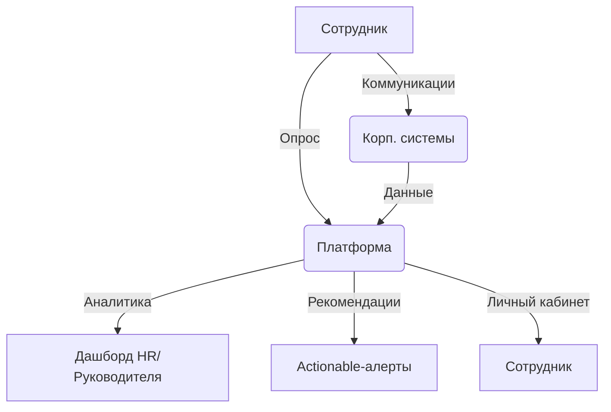

# 🎯 Matrix360 — Концепция собственной HR-аналитической платформы

## 1. Главная цель
Создать систему, которая:
- В реальном времени показывает, что реально происходит с людьми в компании (вовлечённость, выгорание, эффективность, неформальное лидерство).
- Автоматически собирает и анализирует данные из всех рабочих инструментов (почта, мессенджеры, таск-трекеры).
- Делает выводы и даёт рекомендации руководителям и HR, а не просто рисует красивые графики.

## 2. Ключевые компоненты

### A. Умные опросы (Active Feedback)
- Микро-опросы каждую неделю (5-10 вопросов, не больше 2 минут).
- ИИ сам выбирает, кто о ком даёт фидбек — только те, кто реально работал вместе за последние 2 недели.
- Вопросы кастомизируются под специфику компании и должностей.
- Анонимность — никто не узнает, кто что ответил.

### B. Пассивная аналитика (Collaboration Analytics)
- Интеграция с корпоративными системами (почта, Slack/Telegram, CRM, таск-менеджеры).
- Анализ паттернов коммуникаций: кто с кем общается, как часто, в каком тоне, кто тормозит задачи, кто реально двигает проекты.
- Выявление признаков выгорания (длина рабочего дня, частота негативных сообщений, снижение активности).

### C. Дашборды и рекомендации
- Личный кабинет для каждого: сотрудник видит свой прогресс, зоны роста, рекомендации.
- Дашборд для руководителя: кто на грани выгорания, кто неформальный лидер, где проблемы в команде.
- Actionable-рекомендации: не просто "у вас низкая вовлечённость", а "поговори с Петей, у него стресс, а Катя — скрытый лидер, дай ей проект".

### D. Система тревог и триггеров
- Автоматические алерты: если кто-то на грани выгорания, если резко падает вовлечённость, если в команде конфликт.
- Рекомендации по действиям: что делать прямо сейчас, чтобы не потерять ключевого сотрудника.

### E. Приватность и этика
- Все данные анонимны на уровне индивидуальных ответов.
- On-premise или облако — по выбору клиента.
- Прозрачная политика: сотрудники знают, что и зачем анализируется.

## 3. Технологический стек (примерно)
- Backend: Python (FastAPI), Node.js
- Frontend: React/Vue, мобильное приложение (React Native)
- ИИ/ML: Python (scikit-learn, transformers), интеграция с GPT/LLM для анализа текстов
- Интеграции: API для почты, мессенджеров, Jira, Bitrix24, 1С и т.д.
- База: PostgreSQL + Clickhouse (для быстрой аналитики)
- Безопасность: шифрование, аудит доступа, соответствие GDPR/ФЗ-152

## 4. Примеры сценариев использования
- HR видит, что в отделе продаж растёт уровень стресса — запускает встречу, меняет нагрузку.
- Руководитель получает алерт: "У тебя в команде появился новый неформальный лидер — дай ему больше ответственности".
- Сотрудник видит, что у него падает вовлечённость — получает советы, как прокачать мотивацию или обратиться за поддержкой.
- CEO смотрит на карту компании: где узкие места, где риски ухода, где потенциал для роста.

## 5. Ключевые отличия от Yva.ai
- Максимальная кастомизация под бизнес (можно менять вопросы, метрики, интеграции).
- Прозрачность алгоритмов — объясняем, почему система делает такие выводы.
- Фокус на действия, а не на отчёты — система не просто показывает метрики, а говорит, что делать.
- Возможность внедрять элементы геймификации (мотивационные баллы, челленджи, признание лучших).

## 6. MVP (минимально жизнеспособный продукт)
- Микро-опросы раз в неделю (web/mobile)
- Интеграция с почтой и Slack/Telegram
- Дашборд для HR и руководителя
- Примитивная аналитика по вовлечённости и выгоранию
- Алерты по ключевым событиям

## 7. Дальнейшее развитие
- Расширение интеграций (Jira, 1С, Bitrix24)
- Расширенная ML-аналитика (выявление паттернов ухода, скрытых конфликтов)
- Автоматизация HR-процессов (онбординг, offboarding, карьерные треки)
- Внедрение системы мотивации (Matrix Coin, как в твоей компании)

## 8. Риски и ограничения
- Сопротивление сотрудников — надо объяснять, что это не "большой брат", а инструмент для улучшения жизни.
- Качество данных — если люди не отвечают честно или мало пользуются корпоративными системами, аналитика будет хромать.
- Юридические нюансы — соответствие законам о персональных данных.

## 9. Пример архитектуры (схематично)

## 10. Мой вердикт
Если сделать такую систему — это будет реально рабочий инструмент, который не просто собирает "шляпу ради галочки", а реально помогает управлять людьми, удерживать лучших и вовремя тушить пожары. Главное — не скатиться в бюрократию и не забыть про приватность.

---

Если надо — могу расписать конкретный роадмап, архитектуру MVP, примеры вопросов для опросов, или даже прототип интерфейса. Готов копать глубже, если решишь реально запускать!

## Глоссарий

**Active Feedback (Активная обратная связь)** — регулярные микро-опросы сотрудников для сбора мнений и оценки атмосферы в коллективе.

**Пассивная аналитика (Collaboration Analytics)** — автоматический сбор и анализ данных о взаимодействии сотрудников в корпоративных системах (почта, мессенджеры, таск-трекеры и т.д.).

**Вовлечённость (Engagement)** — степень заинтересованности и включённости сотрудника в рабочие процессы и цели компании.

**Выгорание (Burnout)** — состояние эмоционального и физического истощения, связанное с работой, приводящее к снижению продуктивности и мотивации.

**Неформальный лидер** — сотрудник, обладающий влиянием на команду вне формальной иерархии.

**Actionable-рекомендации** — конкретные, практически применимые советы и действия, которые система предлагает руководителю или HR.

**Дашборд** — визуальная панель с ключевыми метриками, аналитикой и рекомендациями для пользователя.

**Алерт (Alert)** — автоматическое уведомление о критическом событии или риске (например, выгорание, падение вовлечённости).

**On-premise** — развёртывание системы на собственных серверах компании, а не в облаке.

**Continuous 360** — непрерывная система сбора обратной связи по принципу 360 градусов (от коллег, подчинённых, руководителей).

**Matrix Coin** — внутренняя мотивационная валюта компании для поощрения сотрудников (пример из корпоративной системы мотивации).

**MVP (Minimum Viable Product)** — минимально жизнеспособная версия продукта, содержащая только основные функции для тестирования идеи.

**GDPR/ФЗ-152** — международные и российские стандарты по защите персональных данных.

**Геймификация** — внедрение игровых механик (баллы, челленджи, признание) для повышения мотивации сотрудников.
