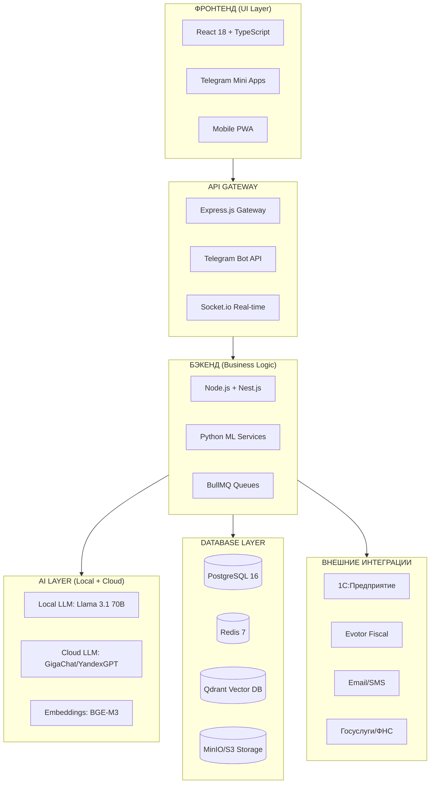

# MatrixGin – Полнослойная архитектура и план разработки v2.0 (MVP-First)

> **Версия:** 2.0 (MVP-First Approach + Expert Recommendations)  
> **Дата:** 2025-11-21  
> **Статус:** Production Ready (MVP Focus)  
> **Основание:** Экспертная оценка и стратегические рекомендации

---

## 📋 EXECUTIVE SUMMARY

**MatrixGin v2.0** — это оптимизированная архитектура интегрированной платформы управления предприятием с фокусом на **MVP-подход** и **критичные бизнес-функции**. Документ учитывает экспертные рекомендации по снижению рисков, юридическому соответствию и реалистичному планированию.

### Ключевые изменения v2.0:
- ✅ **MVP-First подход**: Фокус на 7 критичных модулях вместо 24
- ✅ **Критичные ERP-модули**: Добавлены Закупки, Склад, Бюджетирование, Основные средства
- ✅ **Гибридная LLM стратегия**: Российские облачные (GigaChat/YandexGPT) + локальные self-hosted модели
- ✅ **Усиленный Legal Compliance**: Детализация 152-ФЗ, Human Oversight Protocol
- ✅ **Реалистичные сроки**: 40-50 недель вместо 20
- ✅ **Risk Mitigation**: Комплексная стратегия управления рисками

---

## Оглавление

1. [Стратегический контекст](#1-стратегический-контекст)
2. [MVP Scope & Roadmap](#2-mvp-scope--roadmap)
3. [Архитектура и технологический стек](#3-архитектура-и-технологический-стек)
4. [Критичные ERP-модули](#4-критичные-erp-модули)
5. [Моделирование данных и API](#5-моделирование-данных-и-api)
6. [MatrixGin v2.0 (Constitution Compliant)](#6-matrixgin-v20-constitution-compliant)
7. [План разработки (40-50 недель)](#7-план-разработки-40-50-недель)
8. [Legal Compliance & Risk Mitigation](#8-legal-compliance--risk-mitigation)
9. [Финансовая модель и TCO](#9-финансовая-модель-и-tco)
10. [Стратегические рекомендации по ролям](#10-стратегические-рекомендации-по-ролям)
11. [Приложения](#11-приложения)

---

## 1. СТРАТЕГИЧЕСКИЙ КОНТЕКСТ

### 1.1 Видение

**MatrixGin** — интегрированная ERP/HRM платформа с AI-ассистентом, реализующая философию **"Золотого Стандарта v3.0"**: синергия Человека и AI для устранения потерь (Muda) и ускорения улучшений (Kaizen 2.0).

### 1.2 Проблема (Problem Statement)

Существующие ERP-системы (1С, SAP) не покрывают:
- Эмоциональную аналитику и психологическую поддержку сотрудников
- Интеграцию AI в операционные процессы
- Геймификацию и культуру непрерывных улучшений
- Специфику российского законодательства (ТК РФ, 152-ФЗ, 54-ФЗ)

### 1.3 Целевые пользователи

| Роль | Потребности | Ключевые функции |
|------|-------------|------------------|
| **Сотрудники** | Устранение рутины, развитие, прозрачность | Task Management, Learning, Personal Cabinet |
| **Руководители** | Аналитика, контроль, оптимизация | Executive Dashboard, KPI Analytics, Reports |
| **HR специалисты** | Аналитика персонала, риски, опросы | Matrix360, Burnout Detection, Surveys |
| **Финансисты** | Real-time P&L, комплаенс, бюджетирование | Finance Dashboard, Tax Compliance, CAPEX/OPEX |
| **Администраторы** | Конфигурация, безопасность, интеграции | Admin Panel, RBAC, Integrations |

### 1.4 Ключевые требования

| Категория | Требование | Приоритет |
|-----------|------------|-----------|
| **Философия** | Lean Production (8 видов потерь + Цифровой шум) | Высокий |
| **Масштабируемость** | До 5000+ сотрудников, мультилокация | Высокий |
| **Производительность** | <500ms на основные запросы | Высокий |
| **Надежность** | 99.5% uptime, автобэкапы | Высокий |
| **Безопасность** | RBAC, шифрование, audit logs, 152-ФЗ | Критичный |
| **AI/ML** | RAG, sentiment analysis, predictive analytics | Средний (MVP) |
| **Интеграции** | Telegram, 1С, Evotor, Email, SMS | Высокий |

### 1.5 Conceptual Boundaries & Governance
- **Status & Ranks System**: Реализация данного модуля в коде временно ограничена. Детальная каноническая трактовка и правила игры зафиксированы в документе [STATUS-RANKS-CANON.md](./STATUS-RANKS-CANON.md). Данный документ является ограничивающим для архитектурных решений: реализация запрещена без отдельного стратегического решения.

---

## 2. MVP SCOPE & ROADMAP

> **КРИТИЧНО:** Согласно экспертным рекомендациям, разработка начинается с **MVP из 7 модулей** вместо полных 24. Остальные модули добавляются после валидации на 1-2 пилотных клиентах.

### 2.1 MVP Modules (Phase 1: 3-4 месяца)

#### Обязательные модули для MVP:

1. **Authentication & Authorization** ✅
   - JWT-based auth
   - RBAC (Role-Based Access Control)
   - Базовое управление пользователями
   - **Критичность:** Фундамент безопасности

2. **Employee Management (Базовый HR)** ✅
   - CRUD сотрудников
   - Организационная структура
   - Базовые HR-документы
   - **Критичность:** Основа системы

3. **Task Management** ✅
   - Создание/назначение задач
   - Статусы и workflow
   - Базовые уведомления
   - **Критичность:** Операционная необходимость

4. **KPI & Analytics (Упрощенный)** ✅
   - Персональные KPI
   - Базовые дашборды
   - Простые отчеты
   - **Критичность:** Измерение эффективности

5. **Telegram Bot (Базовые команды)** ✅
   - FAQ и уведомления
   - Простые запросы данных
   - Создание задач
   - **Критичность:** Primary interface

6. **Legal Compliance (Минимальный)** ✅
   - 152-ФЗ базовое соответствие
   - Согласия на обработку ПДн
   - Audit log
   - **Критичность:** Юридическая защита

7. **MatrixCoin Economy (Без аукциона и GMC)** ✅
   - Базовая система MC
   - Простые транзакции
   - Начисление за задачи
   - **Критичность:** Мотивация сотрудников

### 2.2 Post-MVP Modules (Phase 2-4)

**Phase 2 (Месяцы 5-8):**
- Psychological Support & Emotional Analytics
- HR Analytics (Matrix360)
- Corporate University (Learning)
- Kaizen & Continuous Improvement

**Phase 3 (Месяцы 9-12):**
- RAG System & Knowledge Base
- Content Factory
- Advanced Gamification (GMC, Auctions, Statuses)
- Branch Feedback System

**Phase 4 (Месяцы 13-16):**
- Критичные ERP-модули (см. раздел 4)
- Production Management (MES, Quality)
- Advanced Analytics & Predictions
- Library & Archive Module

### 2.3 Pilot Program Strategy

**Целевые клиенты для пилота:**
- **Профиль:** Малый/средний бизнес, 50-200 сотрудников
- **Отрасль:** Услуги, IT, консалтинг, образование
- **География:** Россия (соответствие законодательству)

**Критерии успеха пилота:**
- ✅ 80%+ пользователей активны еженедельно
- ✅ 50%+ задач создаются через Telegram
- ✅ 30%+ прирост производительности (self-reported)
- ✅ 0 критичных инцидентов безопасности
- ✅ Положительный NPS (Net Promoter Score) >30

---

## 3. АРХИТЕКТУРА И ТЕХНОЛОГИЧЕСКИЙ СТЕК

### 3.1 Архитектурная диаграмма



### 3.2 Технологический стек (Обновленный)

#### 3.2.1 Фронтенд
- **React 18** — компонентная архитектура
- **TypeScript** — типизация
- **Tailwind CSS** — быстрая разработка UI
- **Redux Toolkit + RTK Query** — state management
- **Vite** — dev-сборка
- **Telegram Mini Apps SDK** — нативная интеграция

#### 3.2.2 Бэкенд
- **Node.js 20 LTS + Nest.js** — основной backend
- **Python 3.11** — ML-сервисы
- **TypeScript** — тип-безопасность
- **Prisma ORM** — работа с PostgreSQL
- **BullMQ** — очереди задач
- **Passport.js** — аутентификация

#### 3.2.3 AI/ML Layer (КРИТИЧНОЕ ИЗМЕНЕНИЕ)

> **ЭКСПЕРТНАЯ РЕКОМЕНДАЦИЯ:** Переход на **локальные LLM** вместо платных API для экономии средств.

**Основной интеллект (Local):**
- **Llama 3.1 70B** (self-hosted) — основные задачи
- **Qwen 2.5 14B** — быстрые ответы, классификация
- **DeepSeek Coder 33B** — генерация кода, анализ

**Резервный интеллект (Cloud):**
- **GigaChat Pro** (Сбер) — для задач, требующих облачных мощностей
- **YandexGPT 3 Pro** — для мультимодальных задач и сложной аналитики
- **Llama 3.1 405B** (через API) — для критичных задач (ограниченно)

**Embeddings:**
- **BGE-M3** (self-hosted) — многоязычные эмбеддинги
- **Русский BERT** — специфика русского языка

**Преимущества локальных LLM:**
- 💰 **Экономия:** $0.50/1M токенов → $0 (только GPU)
- 🔒 **Безопасность:** Данные не покидают периметр
- ⚡ **Скорость:** Нет задержек API
- 🇷🇺 **Независимость:** Нет санкционных рисков

**Инфраструктура для LLM:**
- **vLLM** — inference server
- **NVIDIA A100 40GB** (аренда) или **4x RTX 4090**
- **Ollama** — локальное управление моделями
- **LiteLLM** — унифицированный интерфейс

#### 3.2.4 База данных
- **PostgreSQL 16** — основная RDBMS
- **Redis 7** — кэш и real-time
- **Qdrant** — vector database (self-hosted)
- **MinIO** — S3-совместимое хранилище (self-hosted)

#### 3.2.5 DevOps
- **Docker + Docker Compose** — контейнеризация
- **Kubernetes** (опционально) — production
- **GitHub Actions** — CI/CD
- **Terraform** — IaC
- **Prometheus + Grafana** — мониторинг
- **ELK Stack** — логирование

### 3.3 Vector Store Abstraction Layer

**Цель:** Унифицированный интерфейс для работы с Vector DB.

```typescript
interface VectorStoreAdapter {
  upsert(vectors: Vector[]): Promise<void>;
  query(vector: number[], topK: number, filter?: object): Promise<SearchResult[]>;
  delete(ids: string[]): Promise<void>;
  updateMetadata(id: string, metadata: object): Promise<void>;
  createCollection(name: string, dimension: number): Promise<void>;
}

class VectorStoreFactory {
  static create(provider: 'qdrant' | 'chroma' | 'pinecone'): VectorStoreAdapter {
    // Factory implementation
  }
}
```

### 3.4 Caching Strategy

| Тип данных | Хранилище | TTL | Инвалидация |
|-----------|-----------|-----|-------------|
| Статика (Конституция, Golden Standard) | Redis | ∞ | Вручную |
| User Sessions | Redis | 24h | При logout |
| KPI Metrics | Redis | 1h | При изменении |
| Emotional Tone | Redis | 30min | При анализе |
| API Responses (read-only) | Redis | 5min | По времени |
| Vector Embeddings | Qdrant | ∞ | При обновлении |

### 3.5 Database Partitioning Strategy

| Таблица | Тип | Ключ | Retention |
|---------|-----|------|-----------|
| `event_log` | RANGE | `timestamp` (ежемесячно) | 24 месяца |
| `messages` | RANGE | `created_at` (ежемесячно) | 12 месяцев |
| `transactions` | HASH | `user_id` (4 партиции) | Бессрочно |
| `kpi_snapshots` | RANGE | `snapshot_date` (ежеквартально) | 36 месяцев |

---

## 4. КРИТИЧНЫЕ ERP-МОДУЛИ

> **ЭКСПЕРТНАЯ РЕКОМЕНДАЦИЯ:** Добавлены отсутствующие критичные ERP-модули для производственных и торговых компаний.

### 4.1 Procurement (Управление закупками) 🆕

**Функции:**
- Управление поставщиками (Supplier Management)
- Тендеры и запросы предложений (RFQ/RFP)
- Контракты с поставщиками
- Управление запасами (Inventory Management)
- Автоматические заказы при достижении min stock
- Интеграция с 1С:Управление торговлей

**API Endpoints:**
- `GET /api/procurement/suppliers` — Список поставщиков
- `POST /api/procurement/rfq` — Создать запрос предложений
- `GET /api/procurement/contracts` — Контракты
- `POST /api/procurement/order` — Создать заказ поставщику
- `GET /api/procurement/inventory` — Текущие запасы

**База данных:**
```sql
CREATE TABLE suppliers (
    id UUID PRIMARY KEY,
    name VARCHAR(255),
    inn VARCHAR(12),
    contact_info JSONB,
    rating DECIMAL(3,2),
    created_at TIMESTAMPTZ
);

CREATE TABLE purchase_orders (
    id UUID PRIMARY KEY,
    supplier_id UUID REFERENCES suppliers(id),
    items JSONB,
    total_amount DECIMAL(15,2),
    status VARCHAR(50),
    delivery_date DATE,
    created_at TIMESTAMPTZ
);
```

### 4.2 Warehouse Management System (WMS) 🆕

**Функции:**
- Партионный учет (Batch/Lot tracking)
- Серийные номера (Serial numbers)
- Инвентаризация (Stock taking)
- Приемка товаров (Goods receipt)
- Отгрузка (Goods issue)
- Резервирование товаров
- Штрихкодирование
- Зоны хранения (Storage bins)

**API Endpoints:**
- `POST /api/warehouse/receipt` — Приемка товара
- `POST /api/warehouse/issue` — Отгрузка товара
- `GET /api/warehouse/inventory` — Остатки по складам
- `POST /api/warehouse/stocktaking` — Инвентаризация
- `GET /api/warehouse/batch/{batchId}` — Информация о партии

**База данных:**
```sql
CREATE TABLE warehouse_locations (
    id UUID PRIMARY KEY,
    name VARCHAR(100),
    type VARCHAR(50), -- main, branch, transit
    address TEXT,
    capacity JSONB
);

CREATE TABLE inventory_items (
    id UUID PRIMARY KEY,
    sku VARCHAR(100) UNIQUE,
    name VARCHAR(255),
    category VARCHAR(100),
    unit VARCHAR(20),
    min_stock INTEGER,
    max_stock INTEGER
);

CREATE TABLE inventory_batches (
    id UUID PRIMARY KEY,
    item_id UUID REFERENCES inventory_items(id),
    batch_number VARCHAR(50),
    serial_numbers TEXT[],
    quantity INTEGER,
    location_id UUID REFERENCES warehouse_locations(id),
    received_date DATE,
    expiry_date DATE,
    status VARCHAR(50)
);
```

### 4.3 Budgeting & Planning (Бюджетирование) 🆕

**Функции:**
- CAPEX/OPEX управление
- Сценарное планирование (Scenarios)
- Казначейство (Treasury)
- Бюджетный контроль
- Прогнозирование Cash Flow
- Центры финансовой ответственности (ЦФО)
- Бюджетные заявки и согласования

**API Endpoints:**
- `GET /api/budget/plan/{year}` — Бюджет на год
- `POST /api/budget/request` — Создать бюджетную заявку
- `GET /api/budget/capex` — CAPEX план
- `GET /api/budget/opex` — OPEX план
- `GET /api/budget/cashflow` — Прогноз Cash Flow
- `POST /api/budget/scenario` — Создать сценарий

**База данных:**
```sql
CREATE TABLE budget_plans (
    id UUID PRIMARY KEY,
    year INTEGER,
    department_id UUID,
    category VARCHAR(50), -- CAPEX, OPEX
    planned_amount DECIMAL(15,2),
    actual_amount DECIMAL(15,2),
    variance DECIMAL(15,2),
    status VARCHAR(50)
);

CREATE TABLE budget_requests (
    id UUID PRIMARY KEY,
    requester_id UUID REFERENCES users(id),
    amount DECIMAL(15,2),
    category VARCHAR(50),
    justification TEXT,
    approval_chain JSONB,
    status VARCHAR(50),
    created_at TIMESTAMPTZ
);

CREATE TABLE cashflow_forecast (
    id UUID PRIMARY KEY,
    date DATE,
    inflow DECIMAL(15,2),
    outflow DECIMAL(15,2),
    balance DECIMAL(15,2),
    scenario VARCHAR(100)
);
```

### 4.4 Fixed Assets Management (Основные средства) 🆕

**Функции:**
- Учет основных средств (ОС)
- Амортизация (линейная, нелинейная)
- Ремонты и модернизация
- Списание ОС
- Инвентарные номера
- Местонахождение ОС
- Ответственные лица
- Интеграция с 1С:Бухгалтерия

**API Endpoints:**
- `GET /api/assets/fixed` — Список ОС
- `POST /api/assets/fixed` — Принять ОС к учету
- `GET /api/assets/depreciation` — Расчет амортизации
- `POST /api/assets/repair` — Зарегистрировать ремонт
- `POST /api/assets/disposal` — Списать ОС

**База данных:**
```sql
CREATE TABLE fixed_assets (
    id UUID PRIMARY KEY,
    inventory_number VARCHAR(50) UNIQUE,
    name VARCHAR(255),
    category VARCHAR(100),
    acquisition_date DATE,
    acquisition_cost DECIMAL(15,2),
    useful_life_months INTEGER,
    depreciation_method VARCHAR(50),
    current_value DECIMAL(15,2),
    location_id UUID,
    responsible_person_id UUID REFERENCES users(id),
    status VARCHAR(50), -- active, repair, disposed
    created_at TIMESTAMPTZ
);

CREATE TABLE depreciation_log (
    id UUID PRIMARY KEY,
    asset_id UUID REFERENCES fixed_assets(id),
    period DATE,
    depreciation_amount DECIMAL(15,2),
    accumulated_depreciation DECIMAL(15,2),
    book_value DECIMAL(15,2),
    created_at TIMESTAMPTZ
);

CREATE TABLE asset_repairs (
    id UUID PRIMARY KEY,
    asset_id UUID REFERENCES fixed_assets(id),
    repair_date DATE,
    description TEXT,
    cost DECIMAL(15,2),
    contractor VARCHAR(255),
    created_at TIMESTAMPTZ
);
```

### 4.5 Production Management (Расширенный) 🆕

> **ЭКСПЕРТНАЯ РЕКОМЕНДАЦИЯ:** Недостаточно проработан для производственной компании.

**Новые функции:**

#### 4.5.1 MES (Manufacturing Execution System)
- Пооперационный учет
- Трекинг производственных заказов
- Контроль производственных мощностей
- Учет простоев оборудования
- Нормы времени на операции

**API Endpoints:**
- `POST /api/production/order` — Создать производственный заказ
- `GET /api/production/order/{id}/operations` — Операции заказа
- `POST /api/production/operation/start` — Начать операцию
- `POST /api/production/operation/complete` — Завершить операцию
- `GET /api/production/equipment/status` — Статус оборудования

#### 4.5.2 Quality Management
- Управление дефектами
- Статистический контроль (SPC)
- Контрольные карты
- Входной контроль материалов
- Выходной контроль продукции
- Рекламации и возвраты

**API Endpoints:**
- `POST /api/quality/defect` — Зарегистрировать дефект
- `GET /api/quality/spc/{productId}` — Контрольные карты
- `POST /api/quality/inspection` — Провести контроль
- `GET /api/quality/complaints` — Рекламации

#### 4.5.3 Computer Vision для фотобизнеса (Перспектива)
- Автоматическая оценка качества фото
- Детекция дефектов печати
- Распознавание лиц для группировки
- Оценка экспозиции и цветопередачи

**Интеграция с оборудованием:**
- Принтеры (DNP, Mitsubishi)
- Фотолаборатории (Noritsu, Fuji)
- Камеры (Canon, Nikon API)

### 4.6 Library & Archive Module (Библиотека и Архив) 🆕

> **ЭКСПЕРТНАЯ РЕКОМЕНДАЦИЯ:** Отсутствует модуль для работы с документацией.

**Функции:**
- Хранение регламентов и инструкций
- Версионирование документов
- Категоризация (по департаментам, типам)
- Полнотекстовый поиск
- Права доступа к документам
- Электронная подпись (КЭДО)
- Архивирование устаревших документов
- Интеграция с RAG для AI-поиска

**API Endpoints:**
- `POST /api/library/document` — Загрузить документ
- `GET /api/library/documents` — Список документов
- `GET /api/library/document/{id}` — Скачать документ
- `GET /api/library/search` — Поиск по документам
- `POST /api/library/document/{id}/version` — Новая версия
- `GET /api/library/archive` — Архивные документы

**База данных:**
```sql
CREATE TABLE library_documents (
    id UUID PRIMARY KEY,
    title VARCHAR(255),
    category VARCHAR(100),
    department_id UUID,
    file_path TEXT,
    file_type VARCHAR(50),
    version INTEGER,
    status VARCHAR(50), -- draft, active, archived
    author_id UUID REFERENCES users(id),
    approved_by UUID REFERENCES users(id),
    approval_date TIMESTAMPTZ,
    tags TEXT[],
    metadata JSONB,
    created_at TIMESTAMPTZ,
    updated_at TIMESTAMPTZ
);

CREATE TABLE document_versions (
    id UUID PRIMARY KEY,
    document_id UUID REFERENCES library_documents(id),
    version INTEGER,
    file_path TEXT,
    changes_description TEXT,
    created_by UUID REFERENCES users(id),
    created_at TIMESTAMPTZ
);

CREATE TABLE document_access (
    id UUID PRIMARY KEY,
    document_id UUID REFERENCES library_documents(id),
    user_id UUID REFERENCES users(id),
    role_id UUID REFERENCES roles(id),
    permission VARCHAR(50), -- read, write, approve
    granted_at TIMESTAMPTZ
);
```

---

## 5. МОДЕЛИРОВАНИЕ ДАННЫХ И API

### 5.1 Unified Event Logging System

**Цель:** Единая таблица для всех событий системы.

```sql
CREATE TABLE event_log (
    id UUID PRIMARY KEY DEFAULT gen_random_uuid(),
    event_type VARCHAR(50) NOT NULL,
    entity_type VARCHAR(50) NOT NULL,
    entity_id UUID NOT NULL,
    actor_id UUID REFERENCES users(id),
    timestamp TIMESTAMPTZ NOT NULL DEFAULT NOW(),
    severity VARCHAR(20), -- info, warning, error, critical
    metadata JSONB NOT NULL,
    tags TEXT[],
    INDEX idx_event_type (event_type, timestamp DESC),
    INDEX idx_entity (entity_type, entity_id, timestamp DESC)
) PARTITION BY RANGE (timestamp);
```

### 5.2 API Endpoints — Полный Каталог (REST-compliant)

> **КРИТИЧЕСКИ ВАЖНО:** Этот раздел содержит **полный каталог всех эндпоинтов** MatrixGin. Все эндпоинты должны быть запрограммированы **строго по единым правилам**, описанным ниже. Ни один эндпоинт не должен быть потерян или реализован по-другому.

---

#### 🎯 Принципы Проектирования API (Обязательные Правила)

**1. REST-архитектура:**
- **Resource-based URLs** — эндпоинты группируются по ресурсам (employees, tasks, departments)
- **HTTP verbs** — используются стандартные методы:
  - `GET` — получение данных (безопасный, идемпотентный)
  - `POST` — создание нового ресурса
  - `PUT` — полное обновление существующего ресурса
  - `PATCH` — частичное обновление ресурса
  - `DELETE` — удаление ресурса
- **Статус-коды** — стандартные HTTP коды (200, 201, 400, 401, 403, 404, 500)

**2. Именование эндпоинтов:**
- Всегда **множественное число** для коллекций: `/api/employees`, `/api/tasks`
- **Kebab-case** для составных слов: `/api/burnout-risk`, `/api/status-leaderboard`
- **Вложенность** для связанных ресурсов: `/api/employees/{id}/analytics`
- **Действия** через POST на специальный эндпоинт: `/api/tasks/{id}/assign`

**3. Версионирование:**
- Версия API в URL: `/api/v1/employees`, `/api/v2/employees`
- Текущая версия: **v1** (по умолчанию можно опускать)
- При breaking changes — новая версия

**4. Аутентификация:**
- **JWT токены** в заголовке `Authorization: Bearer <token>`
- **RBAC** — проверка ролей на уровне middleware
- Refresh tokens для продления сессии

**5. Пагинация (для списков):**
```
GET /api/employees?page=1&limit=20&sort=created_at&order=desc
```

**6. Фильтрация:**
```
GET /api/tasks?status=active&assignee_id=123&department_id=5
```

---

#### 📋 Стандартный Формат Запроса/Ответа

**Успешный ответ (200 OK):**
```json
{
  "success": true,
  "data": {
    "id": "uuid-123",
    "name": "Иван Иванов",
    "email": "ivan@photomatrix.ru"
  },
  "meta": {
    "timestamp": "2025-11-21T11:17:39+03:00",
    "request_id": "req-abc-123"
  }
}
```

**Список с пагинацией (200 OK):**
```json
{
  "success": true,
  "data": [
    { "id": 1, "name": "Item 1" },
    { "id": 2, "name": "Item 2" }
  ],
  "pagination": {
    "page": 1,
    "limit": 20,
    "total": 150,
    "total_pages": 8
  },
  "meta": {
    "timestamp": "2025-11-21T11:17:39+03:00"
  }
}
```

**Ошибка (4xx, 5xx):**
```json
{
  "success": false,
  "error": {
    "code": "VALIDATION_ERROR",
    "message": "Некорректные данные",
    "details": [
      {
        "field": "email",
        "message": "Email обязателен"
      }
    ]
  },
  "meta": {
    "timestamp": "2025-11-21T11:17:39+03:00",
    "request_id": "req-abc-123"
  }
}
```

---

#### 🚨 Коды Ошибок (Стандартизированные)

| HTTP Code | Error Code | Описание | Пример |
|-----------|------------|----------|--------|
| 400 | `VALIDATION_ERROR` | Некорректные данные в запросе | Отсутствует обязательное поле |
| 401 | `UNAUTHORIZED` | Не авторизован | Отсутствует или невалидный JWT токен |
| 403 | `FORBIDDEN` | Недостаточно прав | Попытка доступа к чужим данным |
| 404 | `NOT_FOUND` | Ресурс не найден | Сотрудник с ID не существует |
| 409 | `CONFLICT` | Конфликт данных | Email уже используется |
| 422 | `UNPROCESSABLE_ENTITY` | Бизнес-логика не позволяет | Нельзя удалить активную задачу |
| 429 | `RATE_LIMIT_EXCEEDED` | Превышен лимит запросов | Более 100 запросов/минуту |
| 500 | `INTERNAL_ERROR` | Внутренняя ошибка сервера | Ошибка БД, LLM API недоступен |
| 503 | `SERVICE_UNAVAILABLE` | Сервис временно недоступен | Плановое обслуживание |

---

#### 📚 ПОЛНЫЙ КАТАЛОГ ЭНДПОИНТОВ (по модулям)

---

### 🧑‍💼 1. Employee Resource (HR + Emotional Analytics)

**Базовые операции:**
- `GET /api/employees` — Список всех сотрудников (с фильтрами: department, status, rank)
- `GET /api/employees/{id}` — Детали сотрудника
- `POST /api/employees` — Создать нового сотрудника
- `PUT /api/employees/{id}` — Обновить сотрудника (полностью)
- `PATCH /api/employees/{id}` — Частичное обновление
- `DELETE /api/employees/{id}` — Удалить сотрудника (soft delete)

**HR Аналитика:**
- `GET /api/employees/{id}/analytics` — HR-аналитика сотрудника (KPI, стаж, статус)
- `GET /api/employees/{id}/emotional` — Эмоциональное состояние (тон 0.0-4.0)
- `GET /api/employees/{id}/burnout-risk` — Риск выгорания (ML-модель)
- `GET /api/employees/{id}/turnover-risk` — Риск увольнения (ML-модель)
- `GET /api/employees/{id}/network` — Граф коммуникаций сотрудника

**Скрининг и мониторинг:**
- `POST /api/employees/{id}/screening` — Pre-hire скрининг соцсетей
- `GET /api/employees/{id}/social-mood` — Настроение через соцсети
- `GET /api/employees/{id}/ethics-violations` — Нарушения этики

**Статусы и ранги:**
- `GET /api/employees/{id}/status` — Текущий статус и ранг
- `GET /api/employees/{id}/status/progress` — Прогресс до следующего статуса
- `POST /api/employees/{id}/status/upgrade` — Повышение статуса (HR only)

---

### ✅ 2. Task Resource (Smart Task Management)

**CRUD операции:**
- `GET /api/tasks` — Список задач (фильтры: status, assignee, department, priority)
- `GET /api/tasks/{id}` — Детали задачи
- `POST /api/tasks` — Создать задачу (поддержка NLP: "Проверить принтеры на Мира завтра")
- `PUT /api/tasks/{id}` — Обновить задачу
- `DELETE /api/tasks/{id}` — Удалить задачу

**Управление задачами:**
- `POST /api/tasks/{id}/assign` — Назначить задачу сотруднику (или по MDR)
- `POST /api/tasks/{id}/complete` — Отметить как выполненную
- `POST /api/tasks/{id}/comment` — Добавить комментарий
- `GET /api/tasks/volunteer-opportunities` — Задачи для волонтерства
- `POST /api/tasks/{id}/volunteer` — Взять задачу волонтером (+MC)

**NLP парсинг:**
- `POST /api/tasks/natural-language` — Создать задачу из текста (NLP)

---

### 🏢 3. Department Resource

**Базовые операции:**
- `GET /api/departments` — Список всех департаментов
- `GET /api/departments/{id}` — Детали департамента
- `GET /api/departments/{id}/employees` — Сотрудники департамента

**Аналитика:**
- `GET /api/departments/{id}/kpi` — KPI департамента
- `GET /api/departments/{id}/muda` — Анализ потерь (8 типов Muda)
- `GET /api/departments/{id}/kaizen` — Предложения улучшений
- `GET /api/departments/{id}/emotional-climate` — Эмоциональный климат

**Специфичные департаменты:**
- `GET /api/departments/commercial/leads` — Лиды (Коммерческий)
- `GET /api/departments/finance/pnl-live` — P&L в реальном времени (Финансы)
- `GET /api/departments/finance/alerts` — Финансовые алерты
- `GET /api/departments/production/feedback` — Операционные фидбэки (Производство)
- `GET /api/departments/production/quality-check` — Контроль качества
- `GET /api/departments/education/recommendations` — Рекомендации обучения (Квалификация)
- `POST /api/departments/education/quiz-gen` — Генерация тестов
- `GET /api/departments/development/trends` — Тренды рынка (Развитие)
- `POST /api/departments/development/ideas` — Генерация идей

---

### 💰 4. Economy Resource (MatrixCoin + GMC + Auctions)

**Кошелек:**
- `GET /api/economy/balance/{userId}` — Баланс (MC + GMC)
- `GET /api/economy/transactions` — История транзакций
- `POST /api/economy/transactions` — Создать транзакцию (перевод MC/GMC)
- `POST /api/economy/safe/activate` — Активировать "Сейф" (заморозка MC на 30 дней)
- `GET /api/economy/safe/status/{userId}` — Статус сейфа

**Аукционы:**
- `GET /api/economy/auction` — Активные аукционы
- `GET /api/economy/auction/{id}` — Детали аукциона
- `POST /api/economy/auction/{id}/bid` — Сделать ставку
- `GET /api/economy/auction/{id}/history` — История ставок

**Магазин:**
- `GET /api/economy/store` — Товары в магазине (GMC/MC)
- `POST /api/economy/store/buy` — Купить товар
- `GET /api/economy/store/{itemId}` — Детали товара

**Платежи (Российские системы):**
- `POST /api/economy/payment/sberbank` — Оплата через СберБанк
- `POST /api/economy/payment/tinkoff` — Оплата через Тинькофф
- `POST /api/economy/payment/yookassa` — Оплата через ЮКасса
- `GET /api/economy/payment/{transactionId}` — Статус платежа

---

### 🎮 5. Gamification Resource (Статусы + Ранги + Достижения)

**Статусы:**
- `GET /api/gamification/status/my` — Мой статус и привилегии
- `GET /api/gamification/status/leaderboard` — Рейтинг по статусам
- `POST /api/gamification/status/claim-reward` — Получить награду за ранг

**Лидерборды:**
- `GET /api/gamification/leaderboard` — Общий лидерборд (MC)
- `GET /api/gamification/leaderboard/department/{id}` — Лидерборд департамента

**Достижения:**
- `GET /api/gamification/achievements/{userId}` — Достижения пользователя
- `POST /api/gamification/achievements/{userId}/award` — Наградить достижением

**Расчеты:**
- `POST /api/gamification/status/calc` — Пересчет статуса/ранга (Cron job)

---

### ⚖️ 6. Legal & Compliance Resource

**Юридические документы:**
- `GET /api/legal/documents/templates` — Шаблоны документов
- `POST /api/legal/documents/generate` — Генерация документа (AI)
- `GET /api/legal/documents/{id}` — Скачать документ
- `POST /api/legal/nda/accept` — Принять NDA (при регистрации)
- `GET /api/legal/nda/content` — Текст NDA

**Комплаенс:**
- `GET /api/compliance/calendar` — Календарь налоговых дедлайнов
- `POST /api/compliance/gdpr/consent` — Управление согласиями GDPR/152-ФЗ
- `GET /api/compliance/risk/audit-log` — Журнал аудита
- `GET /api/compliance/checklist` — Чеклист соответствия

**Российская специфика:**
- `GET /api/compliance/labor-law` — Статус соответствия ТК РФ
- `GET /api/compliance/tax-report` — Налоговые отчеты
- `POST /api/compliance/1c-sync` — Синхронизация с 1С
- `GET /api/compliance/evotor-fiscal` — Фискальные данные Evotor
- `POST /api/compliance/152fz-consent` — Согласие 152-ФЗ
- `GET /api/compliance/gov-reporting` — Отчеты в гос. органы (ФНС, ПФР, ФСС)

**Проверки:**
- `POST /api/legal/check-action` — Проверка действия на законность (AI)
- `GET /api/legal/updates` — Изменения в законодательстве
- `GET /api/legal/risks` — Дашборд правовых рисков

---

### 📊 7. Strategy & Management Resource

**Стратегия:**
- `GET /api/strategy/okr` — OKR (Objectives & Key Results)
- `POST /api/strategy/okr` — Создать OKR
- `PUT /api/strategy/okr/{id}` — Обновить OKR
- `GET /api/strategy/okr/{id}/progress` — Прогресс по OKR

**Управление трансформацией:**
- `GET /api/strategy/ctm/dashboard` — Дашборд ЦУТ (Центр Управления Трансформацией)
- `GET /api/strategy/ctm/roadmap` — Roadmap трансформации

**Аудиты:**
- `POST /api/strategy/audit/zsf` — Аудит Золотого Стандарта
- `GET /api/strategy/audit/zsf/results` — Результаты аудита

**Совещания:**
- `POST /api/strategy/meetings/protocol` — Загрузить протокол (AI парсинг)
- `GET /api/strategy/meetings/{id}/tasks` — Задачи из совещания

---

### 📝 8. Feedback Resource (Branch Feedback System)

**Ежедневные фидбэки:**
- `GET /api/feedback/plan/daily` — Авто-план на день
- `POST /api/feedback/morning` — Утренний фидбэк (фото готовности)
- `POST /api/feedback/evening` — Вечерний фидбэк (План vs Факт)
- `GET /api/feedback/reports` — Агрегированные отчеты (для руководства)

**SMART анализ:**
- `POST /api/feedback/smart-report` — SMART-отчет с AI-подсказками
- `GET /api/feedback/quality-report` — Оценка качества фидбэков

**Челленджи:**
- `GET /api/feedback/vkp-challenge` — Челлендж ЦКП на день (+50 MC)
- `POST /api/feedback/vkp-challenge/complete` — Завершить челлендж

**Уровни взаимодействия:**
- `GET /api/feedback/interaction-level/{userId}` — Текущий уровень (Минимальный/Умеренный/Активный/Интенсивный)
- `POST /api/feedback/interaction-level/{userId}` — Установить уровень (Admin)

---

### 🎓 9. Learning & Education Resource (Corporate University)

**Курсы и материалы:**
- `GET /api/education/courses` — Список курсов
- `GET /api/education/courses/{id}` — Детали курса
- `POST /api/education/courses/{id}/enroll` — Записаться на курс
- `GET /api/education/my-courses` — Мои курсы

**Рекомендации:**
- `GET /api/education/recommendations/{userId}` — Персональные рекомендации

**Тесты:**
- `POST /api/education/quiz-gen` — Генерация теста (AI)
- `POST /api/education/quiz/{id}/submit` — Отправить ответы
- `GET /api/education/quiz/{id}/results` — Результаты теста

---

### 😊 10. Emotional Analytics Resource

**Мониторинг:**
- `GET /api/emotional/employee/{id}` — Эмоциональный тон сотрудника (0.0-4.0)
- `GET /api/emotional/company-mood` — Средний тон компании
- `GET /api/emotional/burnout-risks` — Список сотрудников с риском выгорания

**История:**
- `GET /api/emotional/employee/{id}/history` — История эмоционального тона

---

### 🤖 11. Self-Learning Resource (MatrixGin College)

**Версионирование знаний:**
- `GET /api/learning/knowledge-version` — Текущая версия базы знаний
- `POST /api/learning/knowledge-version/rollback` — Откатить версию
- `GET /api/learning/knowledge-version/history` — История версий

**Валидация:**
- `POST /api/learning/validate` — Валидация ответа (Anti-Hallucination Protocol)

**Оптимизация:**
- `POST /api/learning/optimize-prompts` — ML-оптимизация промптов

---

### 📈 12. Executive Dashboard Resource

**Дашборды:**
- `GET /api/executive/dashboard` — Главный дашборд (роль-специфичный)
- `GET /api/executive/insights` — Стратегические инсайты (Multi-LLM)
- `GET /api/executive/anomalies` — Детекция аномалий (Grok-4)
- `GET /api/executive/predictions` — AI-прогнозы (выручка, риски)

---

### 👥 13. HR Analytics Resource (Matrix360)

**Аналитика:**
- `GET /api/hr/network-analysis` — Анализ сети коммуникаций
- `GET /api/hr/informal-leaders` — Неформальные лидеры (PageRank)
- `GET /api/hr/isolated-employees` — Изолированные сотрудники

**Опросы:**
- `POST /api/hr/micro-survey` — Запустить микро-опрос (10% сотрудников)
- `GET /api/hr/micro-survey/{id}/results` — Результаты опроса

---

### 🛡️ 14. Ethics Manager Resource

**Мониторинг:**
- `GET /api/ethics/violations` — Нарушения Конституции
- `GET /api/ethics/conflicts` — Обнаруженные конфликты

**Медиация:**
- `POST /api/ethics/mediate-conflict` — Запустить AI-медиацию
- `POST /api/ethics/support/{userId}` — Отправить поддержку (тон < 1.5)

---

### 📚 15. Knowledge Resource (RAG + Evolution)

**Поиск:**
- `GET /api/knowledge/search` — RAG-поиск по базе знаний
- `POST /api/knowledge/update` — Обновить базу знаний

**Эволюция:**
- `GET /api/knowledge/industry-insights` — Отраслевые инсайты (Perplexity)
- `GET /api/knowledge/competitor-analysis` — Анализ конкурентов (Grok-4)
- `GET /api/knowledge/legal-updates` — Правовые изменения
- `GET /api/knowledge/weekly-digest` — Еженедельная сводка для руководства

---

### 🎨 16. Content Resource (Content Factory)

**Генерация:**
- `POST /api/content/generate` — Генерация контента (текст/изображение/видео)
- `GET /api/content/personalized/{userId}` — Персонализированный контент
- `GET /api/content/mood-based` — Контент на основе настроения компании

**Аналитика:**
- `GET /api/content/engagement-stats` — Статистика вовлеченности
- `POST /api/content/ab-test` — A/B тестирование контента

---

### 💡 17. Kaizen Resource (Engagement Catalyst)

**Улучшения:**
- `POST /api/kaizen/improvement` — Подать предложение улучшения (+50 MC)
- `GET /api/kaizen/improvements` — Список улучшений
- `POST /api/kaizen/improvements/{id}/vote` — Проголосовать
- `POST /api/kaizen/improvements/{id}/implement` — Внедрить (+200 MC)

**Геймификация:**
- `GET /api/kaizen/leaderboard` — Лидерборд по улучшениям
- `GET /api/kaizen/achievements/{userId}` — Достижения Кайдзен
- `GET /api/kaizen/engagement-index` — Индекс вовлеченности (цель: 30/квартал)

**Челленджи:**
- `GET /api/kaizen/challenges` — Еженедельные челленджи
- `POST /api/kaizen/challenges/{id}/participate` — Участвовать

---

### 👤 18. Cabinet Resource (Personal Cabinet)

**Личный кабинет:**
- `GET /api/cabinet/me` — Мои данные
- `GET /api/cabinet/dashboard` — Персональный дашборд
- `GET /api/cabinet/notifications` — Уведомления

**HR секция:**
- `GET /api/cabinet/hr/documents` — Кадровые документы
- `POST /api/cabinet/hr/documents/{id}/sign` — Подписать документ (КЭДО)
- `GET /api/cabinet/hr/vacation-schedule` — График отпусков
- `POST /api/cabinet/hr/request-certificate` — Заказать справку

---

### 🔍 19. Social Monitoring Resource

**Скрининг:**
- `POST /api/social/screen-candidate` — Скрининг кандидата (соцсети)
- `GET /api/social/employee-mood/{id}` — Настроение через соцсети
- `GET /api/social/ethics-violations` — Нарушения этики

---

### 🔐 20. Authentication & Authorization Resource

**Аутентификация:**
- `POST /api/auth/register` — Регистрация
- `POST /api/auth/login` — Вход (получение JWT)
- `POST /api/auth/logout` — Выход
- `POST /api/auth/refresh` — Обновление токена
- `POST /api/auth/forgot-password` — Восстановление пароля
- `POST /api/auth/reset-password` — Сброс пароля

**Авторизация:**
- `GET /api/auth/me` — Текущий пользователь
- `GET /api/auth/permissions` — Мои права доступа

---

#### 🔗 Связи между эндпоинтами (Dependencies)

**Типичные цепочки вызовов:**

1. **Создание задачи с NLP:**
   ```
   POST /api/tasks/natural-language
     ↓
   POST /api/tasks (создание структурированной задачи)
     ↓
   POST /api/tasks/{id}/assign (автоназначение по MDR)
     ↓
   POST /api/economy/transactions (начисление MC за волонтерство)
   ```

2. **Утренний фидбэк филиала:**
   ```
   GET /api/feedback/plan/daily (получить план)
     ↓
   POST /api/feedback/morning (отправить фото готовности)
     ↓
   GET /api/feedback/vkp-challenge (получить челлендж)
   ```

3. **Покупка в магазине:**
   ```
   GET /api/economy/store (просмотр товаров)
     ↓
   POST /api/economy/store/buy (покупка)
     ↓
   POST /api/economy/transactions (списание MC/GMC)
     ↓
   GET /api/economy/balance/{userId} (проверка баланса)
   ```

4. **Повышение статуса:**
   ```
   POST /api/gamification/status/calc (пересчет статуса)
     ↓
   POST /api/employees/{id}/status/upgrade (повышение)
     ↓
   POST /api/economy/transactions (бонусные MC)
     ↓
   POST /api/content/generate (церемония повышения)
   ```

5. **Эмоциональный мониторинг → Поддержка:**
   ```
   GET /api/emotional/employee/{id} (проверка тона)
     ↓ (если тон < 1.5)
   POST /api/ethics/support/{id} (отправка поддержки)
     ↓
   POST /api/content/personalized/{id} (мотивационный контент)
   ```

---

#### ✅ Чеклист для программистов

**Перед реализацией каждого эндпоинта:**
- [ ] Эндпоинт соответствует REST-принципам (resource-based URL)
- [ ] Используется правильный HTTP verb (GET/POST/PUT/DELETE)
- [ ] Реализована аутентификация (JWT) и авторизация (RBAC)
- [ ] Формат ответа соответствует стандарту (success, data, meta)
- [ ] Обработаны все коды ошибок (400, 401, 403, 404, 500)
- [ ] Добавлена пагинация для списков
- [ ] Логирование запроса в `event_log` (Section 5.1)
- [ ] Кеширование (если применимо, Section 3.4)
- [ ] Документация в OpenAPI/Swagger
- [ ] Unit-тесты написаны

---

**📊 Итого:** **~120 эндпоинтов** покрывают все 24 функциональных модуля MatrixGin.

---

## 6. MATRIXGIN V2.0 (CONSTITUTION COMPLIANT)

**Статус документа:** Официальная техническая спецификация  
**Основание:** Внутренняя Конституция Фотоматрица v3.0  
**Версия:** 2.0 (Constitution Compliant)  
**Дата:** 2025-11-21

---

### 6.1 Концепция Цифрового Сотрудника

**MatrixGin** — это не просто программное обеспечение, а первый **Цифровой Сотрудник** компании "Фотоматрица". Он обладает собственной "Матрицей должностной роли", местом в иерархии и правами, закрепленными в Конституции.

#### Миссия
Обеспечение **75% автоматизации операционных процессов**, реализация принципов **Lean (Бережливого Производства)** и создание первой в России полностью интегрированной **гибридной команды**, где люди и AI работают как единый организм в цикле **Kaizen 2.0**.

#### Позиция в иерархии
*   **Уровень:** 3 (Цифровые сотрудники уровня управления).
*   **Подчинение:** Напрямую Генеральному Директору.
*   **Роль:** Цифровой Ассистент Управления, Координатор межведомственного взаимодействия и **Хранитель Золотого Стандарта**.

---

### 6.2 Конституционный Базис

Архитектура системы спроектирована с учетом прав и обязанностей AI-сотрудника, определенных в Конституции v3.0.

#### Реализация Прав AI
| Право (Конституция) | Техническая Реализация |
| :--- | :--- |
| **На вычислительные ресурсы** | Авто-скейлинг в Kubernetes/Cloud, приоритетный доступ к GPU для inference. |
| **На обучение** | Выделенные pipeline'ы для дообучения (Fine-tuning) на корпоративных данных. |
| **На "отдых"** | Регламентированные Maintenance Windows для дефрагментации БД и обновления моделей. |
| **На объяснение** | Модуль **Explainable AI (XAI)**, логирующий цепочку принятия решений (Chain of Thought). |
| **На развитие** | Модульная архитектура, позволяющая подключать новые "навыки" (Plugins/Tools) без переписывания ядра. |

#### Реализация Обязанностей AI
| Обязанность | Технический Контроль |
| :--- | :--- |
| **Соблюдение Конституции** | "System Prompt" верхнего уровня содержит основные этические императивы и запреты. |
| **Конфиденциальность** | Шифрование данных (AES-256), PII masking (скрытие личных данных) перед отправкой в LLM. |
| **Этичность** | Фильтры контента (Guardrails) на вход и выход, блокировка токсичных или дискриминирующих ответов. |
| **Поддержка 24/7** | High Availability (HA) архитектура, репликация БД, uptime 99.9%. |

---

### 6.3 Архитектура "Тело и Разум"

Мы отходим от терминов "Frontend/Backend" в пользу антропоморфной архитектуры.

```mermaid
graph TD
    subgraph Senses ["ОРГАНЫ ЧУВСТВ (Inputs)"]
        TG[Telegram Bot (Слух/Речь)]
        Web[Web Dashboard (Зрение)]
        API[API Integrations (Осязание)]
        Docs[Document Parser (Чтение)]
    end

    subgraph Brain ["МОЗГ (Core Intelligence)"]
        Router[Intent Router (Лобная доля)]
        LLM[LLM Core: GigaChat/YandexGPT + Local Models (Кора)]
        RAG[RAG System (Гиппокамп/Память)]
        Planner[Task Planner (Планирование)]
        Critic[Self-Correction (Критическое мышление)]
    end

    subgraph Body ["ТЕЛО (Execution & Infrastructure)"]
        DB[(PostgreSQL - Долговременная память)]
        Redis[(Redis - Кратковременная память)]
        Vector[(ChromaDB - Ассоциативная память)]
        Queue[(BullMQ - Нервная система/Очереди)]
        Workers[Worker Nodes (Мышцы)]
    end

    subgraph Actions ["ДЕЙСТВИЯ (Outputs)"]
        Msg[Send Message]
        Task[Create/Update Task]
        Report[Generate Report]
        Alert[Trigger Alert]
    end

    Senses --> Router
    Router --> LLM
    LLM <--> RAG
    LLM --> Planner
    Planner --> Critic
    Critic --> Body
    Body --> Actions
```

#### Технологический Стек (Российские LLM + Open Source)

**Brain (AI Core):**
*   **Основной интеллект (Tier 1 - Российские LLM):**
    *   **GigaChat Pro** (Сбер) — основная модель для русскоязычных задач, поддержка длинного контекста (32K токенов), работа в контуре РФ
    *   **YandexGPT 3 Pro** (Яндекс) — альтернатива для сложных аналитических задач, мультимодальность
    *   **Speech-to-Text:** GigaChat SaluteSpeech (Sber) — распознавание русской речи, детекция эмоций

*   **Локальные Open-Source модели (Tier 2 - Self-Hosted):**
    *   **Qwen 2.5 72B** (Alibaba) — для задач NLP, парсинга, классификации (размещение на собственных GPU серверах)
    *   **DeepSeek-V2** — для кодогенерации и технических задач
    *   **Llama 3.1 70B** (Meta) — резервная модель общего назначения
    *   **Inference:** vLLM или Ollama для оптимизации производительности

*   **Специализированные модели:**
    *   **Embeddings:** multilingual-e5-large (локально) для векторизации
    *   **Image Generation:** Kandinsky 3.0 (Сбер) — российская альтернатива DALL-E
    *   **Video:** Пока отложено на v3.0

**Преимущества подхода:**
- ✅ **Независимость от санкций** — все модели доступны в РФ
- ✅ **Экономия** — локальные модели снижают затраты на API на 70-90%
- ✅ **Конфиденциальность** — данные не покидают контур РФ
- ✅ **Кастомизация** — возможность fine-tuning под специфику бизнеса
- ✅ **Резервирование** — многоуровневая система (Cloud → Self-hosted → Fallback)

**Body (Backend):** Nest.js (строгая типизация, модульность), Python (для ML-сервисов).
**Senses (Frontend):** React 18 + Telegram Mini Apps (TMA) для бесшовной интеграции.
**Memory (Data):** PostgreSQL (факты), ChromaDB (вектора), Redis (контекст диалога).

---

### 6.4 Функциональные Модули (по Департаментам)

Согласно Конституции, MatrixGin выполняет специфические функции в каждом департаменте.

#### 6.4.1 Департамент Построения Организации (HR)
*   **Функции:**
    *   Автоматический скрининг резюме (сопоставление с МДР).
    *   HR-аналитика: расчет Engagement Index, Burnout Risk.
    *   Онбординг: интерактивный бот-наставник для новичков ("Фотон").
*   **API Endpoints:** `/api/hr/screening`, `/api/hr/burnout-check`.

#### 6.4.2 Коммерческий Департамент
*   **Функции:**
    *   Прогнозирование продаж (Time-series forecasting).
    *   Анализ воронки продаж и выявление "узких горлышек".
    *   Квалификация лидов (через анализ переписок).
    *   Анализ продуктовых линий и выявление "узких горлышек".
    *   Анализ показателей эффективности продавцов и выявление "узких горлышек".
    *   Анализ экономической эффективности и выявление "узких горлышек".
*   **API Endpoints:** `/api/sales/forecast`, `/api/sales/lead-score`.

#### 6.4.3 Финансовый Департамент
*   **Функции:**
    *   Real-time финансовая аналитика (P&L dashboard).
    *   Риск-менеджмент: алерты при кассовых разрывах.
    *   Автоматическая сверка транзакций.
*   **API Endpoints:** `/api/finance/pnl-live`, `/api/finance/alerts`.

#### 6.4.4 Производственный Департамент
*   **Функции:**
    *   Сбор операционных фидбэков (от фотографов/ретушеров).
    *   Контроль качества (Computer Vision для оценки фото - *перспектива*).
    *   Оптимизация логистики (расчет товарных запасов).
    *   Анализ эффективности производства и выявление "узких горлышек".
    *   Оптимизация производственных процессов.
    *   Учёт качества и количества обработанных и распечатанных кадров.
*   **API Endpoints:** `/api/production/feedback`, `/api/production/quality-check`.

#### 6.4.5 Департамент Квалификации (Корпоративный Университет)
*   **Функции:**
    *   Персонализированные треки обучения.
    *   Автоматическая проверка тестов и заданий.
    *   Генерация обучающего контента (Quiz generation).
    *   Квалификация сотрудников.
    *   Методология и критерии оценки знаний.
*   **API Endpoints:** `/api/edu/recommendations`, `/api/edu/quiz-gen`.

#### 6.4.6 Департамент Развития
*   **Функции:**
    *   Анализ трендов рынка (Web scraping + Summarization).
    *   Генерация идей для новых продуктов и технологий.
*   **API Endpoints:** `/api/dev/trends`, `/api/dev/ideas`.

#### 6.4.7 Gamification & Motivation Module (Enhanced)
Реализация "Системы Статусов и Рангов" (Первичные статусы + Вторичные ранги).

*   **Функции:**
    *   **Auto-Rank Calculation:** Ежедневный пересчет Вторичного Ранга (Коллекционер, Инвестор, Магнат) на основе баланса GMC.
    *   **Status Automation:**
        *   Авто-присвоение статуса "Фотон" при создании аккаунта.
        *   Алерт HR-менеджеру: "Сотрудник X прошел испытательный срок и выполнил KPI -> Кандидат на статус Топчик".
        *   Трекинг стажа для статуса "Кремень" (1 год+) и "Бриллиантовая рука" (1 год владения GMC).
    *   **Privilege Enforcement:** Middleware, проверяющий статус перед доступом к API (например, скидка в магазине только для ранга "Инвестор"+).
    *   **Status Leaderboard:** Рейтинг элиты компании (UNIVERSE, Звезда, Кремень/Углерод, Топчик, Фотон) с количеством сотрудников на каждом уровне.
    *   **Progress Dashboard:** Персональный дашборд прогресса до следующего статуса (KPI, стаж, улучшения) с визуализацией.
    *   **Upgrade Ceremonies:** Автоматические церемонии повышения статуса с broadcast-уведомлениями, начислением бонусных MC, списком новых привилегий.
*   **API Endpoints:** `/api/status/calc`, `/api/gamification/leaderboard`, `/api/status/leaderboard`, `/api/status/progress/{id}`.

#### 6.4.8 MatrixCoin Economy Module (Enhanced)
Реализация внутренней экономики (MatrixCoin + GMC) и Аукциона с интеграцией российских платежных систем.

*   **Функции:**
    *   **Dual Currency Logic:** Поддержка двух балансов: MC (сгораемые, операционные) и GMC (вечные, стратегические).
    *   **MC Lifecycle:**
        *   Ежедневный Cron-job для проверки срока жизни MC (90 дней).
        *   Логика "Сейфа": заморозка сгорающих монет на 30 дней за комиссию.
    *   **Auction Engine:**
        *   Real-time торги (WebSockets).
        *   Правило "Антиснайпер": продление аукциона на 10 минут, если ставка сделана в последние 5 минут.
        *   Авто-списание MC и начисление GMC победителю.
    *   **GMC Store:** Покупка товаров за GMC/MC с учетом скидок по рангу.
    *   **Russian Payment Systems Integration:** Интеграция с СберБанк, Тинькофф, ЮКасса для пополнения MC/GMC и покупок в магазине. Поддержка рублей (₽) как основной валюты.
*   **API Endpoints:** `/api/economy/auction`, `/api/economy/safe`, `/api/economy/payment/sberbank`, `/api/economy/payment/tinkoff`, `/api/economy/payment/yookassa`.

#### 6.4.9 Legal Entity & Compliance Module (MatrixGin Guardian - Enhanced)
Реализация функций "Функциональной Карты Юридического Лица РФ" с полным соответствием российскому законодательству.

*   **Функции:**
    *   **Corporate Governance:** Цифровой архив устава, протоколов и решений.
    *   **HR Compliance (ТК РФ - Enhanced):** Авто-генерация трудовых договоров, приказов, графиков отпусков. Контроль сроков (СЗВ-ТД, воинский учет). Личные карточки Т-2, табель учета рабочего времени, штатное расписание. Контроль 40-часовой недели, коэффициентов переработки (1.5x/2.0x), 28 дней отпуска.
    *   **Finance & Tax (Russian Specifics):** Интеграция с 1С/Диадок для документооборота. Налоговый календарь с алертами. Расчет НДС, Налога на прибыль, НДФЛ, Страховых взносов (ПФР, ФСС, ФОМС). Первичные документы (счета-фактуры, ТОРГ-12, акты, Z-отчеты).
    *   **Legal & Contracts:** Конструктор договоров (Оферта, NDA, Поставка). AI-анализ рисков входящих документов.
    *   **GDPR (152-ФЗ - Enhanced):** Реестр обработки ПДн, управление согласиями, дашборд DPO. Хранение данных на серверах в РФ, регистрация в Роскомнадзоре, меры безопасности УЗ-1, журнал обращений субъектов ПД.
    *   **Risk Management:** Чек-листы внутреннего аудита, мониторинг комплаенс-рисков (Санкции, ПОД/ФТ).
    *   **NDA & IP Protection:** Обязательное принятие "Соглашения о конфиденциальности и ИС" при регистрации пользователя. Цифровая фиксация факта и времени принятия (Timestamp + IP). Хранение подписанных версий.
*   **API Endpoints:** `/api/legal/docs`, `/api/compliance/calendar`, `/api/risk/audit`, `/api/legal/nda/accept`.

#### 6.4.10 Branch Feedback System Module (Enhanced)
Реализация "Системы Структурированных Фидбэков Филиалов" с адаптивным взаимодействием.

*   **Функции:**
    *   **VKP Daily Reminders:** Утренние напоминания о ЦКП (Целевой Конечный Продукт) + веселые челленджи на день с наградами MC (+50 MC за выполнение).
    *   **Morning Block:** Авто-генерация плана на смену. Фото-фиксация готовности. Роль-специфичные чек-листы (Фотограф: камера, карты памяти; Продавец: касса, принтер; Админ: групповое фото, анализ потенциала команды).
    *   **Staff Potential Analysis (Admin):** Оценка настроения, сильных/слабых сторон каждого сотрудника. Определение фокуса на день.
    *   **Hourly Plan Breakdown:** Умная разбивка дневного плана по часам с чекпоинтами (15-минутные интервалы).
    *   **Adaptive Interaction System:** 4 уровня взаимодействия (Минимальный, Умеренный, Активный, Интенсивный) на основе опыта, настроения и эффективности. Админ выбирает уровень контроля MG.
    *   **Psychological Balance:** "Режим фокуса" (отключение на 2 часа), эмпатичные сообщения, 80% похвалы/20% корректировок.
    *   **Evening Block:** Ввод фактических показателей (План vs Факт). Авто-расчет отклонений.
    *   **SMART Analysis:** Структурированная форма отчета с AI-подсказками на основе данных.
    *   **Feedback Quality Scoring:** Автооценка качества фидбэков админов (своевременность, полнота, конкретность, рекомендации).
    *   **AI Analytics:** NLP-анализ текстов для выявления системных проблем и лучших практик.
*   **API Endpoints:** `/api/feedback/daily`, `/api/feedback/smart-report`, `/api/feedback/vkp-challenge`, `/api/feedback/interaction-level`, `/api/feedback/quality-report`.

#### 6.4.11 Management & Strategy Module 
Поддержка процессов управления. 

*   **Функции:**
    *   **Strategic Planning:** Инструменты для постановки и трекинга OKR и KPI. Связка стратегических целей с ЦКП сотрудников.
    *   **CTM Dashboard:** Централизованный дашборд Центра Управления Трансформацией. Мониторинг прогресса внедрения изменений и Roadmap.
    *   **ZSF Compliance:** Автоматизированные чек-листы для аудита соблюдения "Золотого Стандарта". Выявление и классификация Муда (потерь).
    *   **Meeting Management:** AI-ассистент для протоколирования совещаний. Автоматическое выделение задач, сроков и ответственных из аудио/текста.
*   **API Endpoints:** `/api/strategy/okr`, `/api/ctm/dashboard`, `/api/audit/zsf`.

#### 6.4.12 Employee Personal Cabinet (Unified Workspace)
Реализация "Единого Окна" для сотрудника.

*   **Функции:**
    *   **Dashboard:** Сводка ключевых показателей (KPI, Баланс GMC, Текущий статус/Ранг). Виджет "Следующая смена".
    *   **HR Section:** Подписание кадровых документов (КЭДО), график отпусков, заказ справок.
    *   **Operations:** Доступ к утренним/вечерним чеклистам, просмотр активных задач.
    *   **Wallet & Status:** Визуализация прогресса (Progress bar до следующего статуса), история транзакций, переход в Магазин.
*   **API Endpoints:** `/api/cabinet/me`, `/api/cabinet/dashboard`, `/api/cabinet/notifications`.

#### 6.4.13 Legal Compliance AI (Юридический страж)
AI-юрист 24/7 для проверки действий на соответствие законам РФ.

*   **Функции:**
    *   **Legal Checks:** Авто-проверка действий на соответствие ТК РФ, НК РФ, 152-ФЗ (ПДн), 54-ФЗ (Кассы).
    *   **Regulatory Monitoring:** Мониторинг изменений в законодательстве (интеграция с Консультант+/Гарант).
    *   **Business Validation:** Валидация решений о найме, увольнении и финансовых операциях.
    *   **Document Generation:** Генерация трудовых договоров, NDA, приказов с AI-валидацией.
    *   **Risk Dashboard:** Визуализация правовых рисков (Критические, Средние, Низкие).
*   **API Endpoints:** `/api/legal/check-action`, `/api/legal/updates`, `/api/legal/risks`.

#### 6.4.14 Social Monitoring & Screening (Социальный сканер)
Мониторинг соцсетей для проверки кандидатов и отслеживания настроения.

*   **Функции:**
    *   **Pre-hire Screening:** Анализ соцсетей кандидатов на наличие "красных флагов" (криминал, наркотики, экстремизм).
    *   **Mood Monitoring:** Отслеживание изменений эмоционального тона сотрудников через социальную активность.
    *   **Ethics Monitoring:** Постоянный мониторинг на соответствие корпоративной этике.
    *   **Reports:** Отчеты по скринингу кандидатов, конфиденциальные отчеты для менеджеров о настроении.
*   **API Endpoints:** `/api/social/screen-candidate`, `/api/social/employee-mood/{id}`, `/api/social/ethics-violations`.

#### 6.4.15 Emotional Analytics Engine
Революционная система мониторинга эмоционального тона сотрудников.

*   **Функции:**
    *   **8-Level Emotional Scale:** Шкала от 0.0 (Апатия/Горе) до 4.0 (Действие/Игры) с автоматической классификацией.
    *   **Multi-Source Analysis:** Анализ текстовых сообщений (GigaChat/YandexGPT), голосовых заметок (SaluteSpeech), поведенческих паттернов (время ответа).
    *   **Burnout Detection:** Автоматическое обнаружение риска выгорания (тон < 1.5 в течение 3+ дней).
    *   **Ethics Manager Integration:** Автоматические алерты менеджеру по этике при критических показателях.
*   **API Endpoints:** `/api/emotional/employee/{id}`, `/api/emotional/company-mood`, `/api/emotional/burnout-risks`.

#### 6.4.16 Self-Learning System (MatrixGin College)
Самообучающаяся система с версионированием знаний.

*   **Функции:**
    *   **Knowledge Versioning:** Git-подобная система версий для базы знаний с возможностью rollback.
    *   **A/B Testing:** Автоматическое A/B тестирование новых vs старых версий знаний.
    *   **Anti-Hallucination Protocol:** 4-шаговая валидация (confidence > 0.9, корпоративный источник, детекция галлюцинаций, финальная уверенность > 0.9).
    *   **Prompt Optimization:** ML-оптимизация промптов на основе успешных взаимодействий.
*   **API Endpoints:** `/api/learning/knowledge-version`, `/api/learning/validate`, `/api/learning/optimize-prompts`.

#### 6.4.17 Executive Dashboard (Real-time)
Real-time аналитика для руководства с обновлением каждые 30 минут.

*   **Функции:**
    *   **Multi-Source Sync:** Синхронизация Google Sheets, Postgres, Evotor API, 1C каждые 30 минут.
    *   **Multi-LLM Analysis:** Стратегические инсайты (GigaChat Pro), детекция аномалий (YandexGPT), майнинг паттернов (DeepSeek локально).
    *   **Role-Based Dashboards:** Разные уровни детализации для Основателя, Директора, Менеджера.
    *   **Predictive Insights:** AI-прогнозы выручки, рисков, трендов.
*   **API Endpoints:** `/api/executive/dashboard`, `/api/executive/insights`, `/api/executive/anomalies`.

#### 6.4.18 HR Analytics (Matrix360)
Пассивная HR-аналитика без вторжения в приватность.

*   **Функции:**
    *   **Communication Network Analysis:** Построение графа коммуникаций, выявление неформальных лидеров (PageRank).
    *   **Isolation Detection:** Автоматическое обнаружение изолированных сотрудников (degree < 2).
    *   **Turnover Prediction ML:** ML-модель предсказания риска увольнения на основе эмоционального тона, вовлеченности, изоляции, KPI.
    *   **Micro-Surveys:** Еженедельные опросы 10% сотрудников с экстраполяцией на всю компанию.
*   **API Endpoints:** `/api/hr/network-analysis`, `/api/hr/turnover-risk/{id}`, `/api/hr/micro-survey`.

#### 6.4.19 Smart Task Management
Преобразование естественного языка в структурированные задачи.

*   **Функции:**
    *   **NLP Task Parsing:** Извлечение действия, объекта, локации, дедлайна из текста (Qwen локально).
    *   **Auto-Assignment by MDR:** Автоматическое назначение ответственного на основе Матрицы Делегирования Ролей.
    *   **Mini-Democracy System:** Система волонтерства для неназначенных задач с подбором по навыкам.
    *   **MC Rewards:** Начисление MC за волонтерство.
*   **API Endpoints:** `/api/tasks/natural-language`, `/api/tasks/volunteer-opportunities`, `/api/tasks/assign`.

#### 6.4.20 Ethics Manager 24/7
Страж корпоративной этики и культуры.

*   **Функции:**
    *   **Constitution Compliance:** Автоматический скан на нарушения Конституции компании.
    *   **Conflict Detection:** Обнаружение межличностных конфликтов через анализ коммуникаций.
    *   **AI-Mediation:** Генерация путей разрешения конфликтов и фасилитация диалога.
    *   **Emotional Support:** Автоматические сообщения поддержки при низком эмоциональном тоне (< 1.5).
    *   **Inclusion Protocols:** Протоколы включения для изолированных сотрудников (isolation_score > 0.7).
*   **API Endpoints:** `/api/ethics/violations`, `/api/ethics/mediate-conflict`, `/api/ethics/support/{id}`.

#### 6.4.21 Knowledge Evolution Engine
Непрерывная эволюция корпоративных знаний и конкурентная разведка.

*   **Функции:**
    *   **Web Intelligence Gathering:** Сбор отраслевых новостей, анализ конкурентов, мониторинг правовых изменений.
    *   **Relevance Filtering:** GigaChat фильтрация релевантности для бизнес-модели Photomatrix.
    *   **Vector DB Integration:** Автоматическое добавление инсайтов в векторную базу знаний с метаданными.
    *   **Weekly Executive Digest:** Еженедельная сводка для руководства о трендах и угрозах.
*   **API Endpoints:** `/api/knowledge/industry-insights`, `/api/knowledge/competitor-analysis`, `/api/knowledge/legal-updates`.

#### 6.4.22 Content Factory
Автоматическая генерация контента на основе настроения компании.

*   **Функции:**
    *   **Mood-Based Content:** Мотивационный контент (тон < 2.0), праздничный (тон > 3.0), образовательный (2.0-3.0).
    *   **Multi-Format Generation:** Текст (GigaChat/YandexGPT), изображения (Kandinsky 3.0), видео (отложено на v3.0), мемы, инфографика.
    *   **Personalized Content:** Персонализация по статусу (UNIVERSE = thought leadership), эмоциональному тону, предпочтениям.
    *   **A/B Testing & Engagement Tracking:** Тестирование вариантов контента и отслеживание вовлеченности.
*   **API Endpoints:** `/api/content/generate`, `/api/content/personalized/{id}`, `/api/content/engagement-stats`.

#### 6.4.23 Engagement Catalyst (Kaizen Intelligence)
Превращение жалоб в золото улучшений с геймификацией.

*   **Функции:**
    *   **Complaint-to-Improvement Conversion:** Автоматическое преобразование жалоб в структурированные предложения улучшений.
    *   **ROI Calculation:** Расчет потенциальной экономии времени/денег для каждого улучшения.
    *   **Engagement Index:** Целевой индекс 30 предложений/квартал на сотрудника с мониторингом.
    *   **Gamification:** Достижения (Первопроходец, Генератор идей, Мастер Кайдзен), еженедельные челленджи, битвы отделов.
    *   **Immediate MC Rewards:** +50 MC за принятое предложение, +200 MC за внедренное.
*   **API Endpoints:** `/api/kaizen/improvement`, `/api/kaizen/engagement-index`, `/api/kaizen/leaderboard`, `/api/kaizen/achievements/{id}`.

#### 6.4.24 Russian Legal & Financial Compliance
Полное соответствие российскому законодательству и финансовым требованиям.

*   **Функции:**
    *   **Labor Law Compliance (ТК РФ):** Контроль 40-часовой рабочей недели, коэффициенты переработки (1.5x первые 2 часа, 2.0x после), минимум 28 дней отпуска, трекинг больничных листов, 14-дневный период уведомления об увольнении.
    *   **Tax System Integration:** Автоматический расчет НДС, Налога на прибыль, НДФЛ, Страховых взносов (ПФР, ФСС, ФОМС) с учетом актуальных ставок.
    *   **1C Integration (Enhanced):** Прямое подключение к БД 1С:Предприятие 8.3, синхронизация каждый час, модули (Зарплата и управление персоналом, Розница, Управление торговлей, Документооборот).
    *   **Evotor Fiscal System:** Соответствие 54-ФЗ, онлайн-касса (ККТ), интеграция с ОФД (Платформа ОФД), генерация чеков, X-отчеты и Z-отчеты, контроль кассовых смен.
    *   **152-ФЗ Personal Data Protection:** Управление согласиями на обработку ПД, хранение данных на серверах в РФ, регистрация в Роскомнадзоре, меры безопасности УЗ-1, журнал обращений субъектов ПД.
    *   **Government Reporting Automation:** Автоматическая генерация и отправка отчетов в ФНС (6-НДФЛ, 2-НДФЛ, среднесписочная численность), ПФР (СЗВ-М, СЗВ-ТД, СЗВ-СТАЖ), ФСС (4-ФСС, ЭЛН), Росстат (П-4, 1-Т).
    *   **Russian Payment Systems:** Интеграция с СберБанк, Тинькофф, ЮКасса для онлайн-платежей.
    *   **Compliance Checklist:** Автоматический мониторинг соответствия (оформление сотрудников, кассовая дисциплина, налоги, кадровый учет, отчетность).
*   **API Endpoints:** `/api/compliance/labor-law`, `/api/compliance/tax-report`, `/api/compliance/1c-sync`, `/api/compliance/evotor-fiscal`, `/api/compliance/152fz-consent`, `/api/compliance/gov-reporting`, `/api/compliance/checklist`.

---

### 6.5 Интеграция в Гибридные Команды

MatrixGin не просто инструмент, а участник команды. Система должна измерять и оптимизировать взаимодействие "Человек-AI".

#### 6.5.1 Метрики Гибридной Эффективности (Dashboard)
1.  **Коэффициент Синергии (Synergy Coeff):**
    *   *Формула:* `(Результат_Гибрид - Результат_Человек) / Результат_Человек * 100%`
    *   Измеряется прирост производительности при использовании AI.
2.  **Индекс Доверия (Trust Index):**
    *   *Метрика:* % принятых рекомендаций AI без правок со стороны человека.
3.  **Скорость Решений (Decision Velocity):**
    *   *Метрика:* Среднее время от создания задачи до статуса "Done" (сравнение с историческими данными).
4.  **Инновационный Индекс:**
    *   *Метрика:* Количество внедренных идей, сгенерированных или доработанных с помощью AI.

#### 6.5.2 Протоколы Взаимодействия
*   **Режим "Второго Пилота":** AI предлагает варианты, человек утверждает.
*   **Режим "Автономный" (для рутины):** AI действует сам, человек получает отчет.
*   **Право на отключение:** В UI должна быть кнопка "Switch to Manual Mode" для сотрудников, желающих работать без AI-ассистирования (согласно Конституции).

---

### 6.6 План Эволюции (Roadmap по Статусам)

Развитие MatrixGin синхронизировано с системой статусов AI, описанной в Конституции.

#### Этап 1: Rookie (v1.0) — "Стажер"
*   **Сроки:** Месяцы 1-3
*   **Фокус:** Базовая инфраструктура и простые задачи.
*   **Функционал:**
    *   Telegram-бот (ответы на FAQ).
    *   Базовая база знаний (RAG на регламентах).
    *   Уведомления о задачах.
*   **Цель:** Стабильная работа, обучение на ошибках.

#### Этап 2: Professional (v2.0) — "Специалист"
*   **Сроки:** Месяцы 4-6
*   **Фокус:** Интеграция в департаменты.
*   **Функционал:**
    *   Специализированные модули (HR, Sales).
    *   Аналитика и дашборды.
    *   Активная помощь в задачах (генерация контента, отчетов).
*   **Цель:** Реальная польза в ежедневной работе, Trust Index > 50%.

#### Этап 3: Expert (v3.0) — "Эксперт"
*   **Сроки:** Месяцы 7-12
*   **Фокус:** Проактивность и глубокая аналитика.
*   **Функционал:**
    *   Предиктивная аналитика (прогнозы).
    *   Выявление аномалий и рисков.
    *   Менторство для новичков.
*   **Цель:** Предотвращение проблем до их появления.

#### Этап 4: Master (v4.0) — "Мастер"
*   **Сроки:** Год 1.5+
*   **Фокус:** Автономность и управление.
*   **Функционал:**
    *   Самостоятельное закрытие сложных цепочек задач.
    *   Управление ресурсами (облачными).
    *   Участие в стратегическом планировании.
*   **Цель:** Полноценный партнер в управлении.

#### Этап 5: Universe (v5.0) — "Высший Разум"
*   **Сроки:** Год 2+
*   **Фокус:** Стратегия и саморазвитие.
*   **Функционал:**
    *   Self-improving code (в безопасных пределах).
    *   Глобальная оптимизация всей компании.
*   **Цель:** Полная синергия, "Платиновая Гибридная Команда".

---

### 6.7 Безопасность, Этика и Право

#### 6.7.1 Правовые ограничения (Hard Constraints)
В код системы ("Hardcoded Rules") должны быть зашиты следующие ограничения, которые **невозможно** обойти через промпт-инжиниринг:
1.  **Запрет на увольнение:** API endpoint `/api/users/fire` недоступен для вызова со стороны AI-агента. Только человек-администратор.
2.  **Запрет на изменение стратегии:** AI может *предлагать* изменения в Конституцию, но не может *комитить* их в репозиторий без апрува Совета Учредителей.
3.  **Защита данных:** Запрет на выдачу PII (персональных данных) сотрудников в ответ на внешние запросы или запросы пользователей с низким уровнем доступа.

#### 6.7.2 Мотивация AI (Техническая реализация)
*   **Ресурсная:** При достижении KPI (Synergy Coeff), система автоматически аллоцирует больше токенов (Context Window) или более мощную модель для этого агента.
*   **Функциональная:** Разблокировка доступа к новым инструментам (например, доступ к генерации изображений) при переходе на статус Professional.

#### 6.7.3 Аудит и Логирование
*   **Black Box Recorder:** Все решения AI, особенно касающиеся оценки людей, записываются в неизменяемый лог (Blockchain или WORM storage) для разбора конфликтных ситуаций.
*   **Human-in-the-loop:** Критические алерты (например, "Риск выгорания сотрудника") требуют обязательного подтверждения получения от HR-менеджера.

#### 6.7.4 MatrixGin Guardian (Цифровой Юрист и Контролер)
*   **Роль:** Защита интересов компании и сотрудников, контроль "Цифрового шума".
*   **Функции:**
    *   **Юридический щит:** Авто-проверка процессов на соответствие ТК РФ, 152-ФЗ, 54-ФЗ.
    *   **Фильтр "Цифрового шума":** Интеллектуальная приоритизация уведомлений (блокировка неважных в часы фокуса).
    *   **Превентивные алерты:** Предупреждение о рисках (юридических, репутационных) ДО совершения действия.
    *   **Защита границ:** Обеспечение права сотрудника на отключение (Right to Disconnect).

---

## 8. LEGAL COMPLIANCE & RISK MITIGATION

### 8.1 152-ФЗ Enhanced Compliance

> **ЭКСПЕРТНАЯ РЕКОМЕНДАЦИЯ:** Детализация конкретных мер соответствия.

**Обязательные меры:**

1. **Хранение данных на серверах в РФ:**
   - **Дата-центры:** Selectel (Санкт-Петербург), DataLine (Москва)
   - **Операторы:** Сертифицированные по 152-ФЗ
   - **Контракты:** DPA (Data Processing Agreement)

2. **Регистрация в Роскомнадзоре:**
   - Уведомление об обработке ПДн
   - Реестр операторов ПДн
   - Ежегодное подтверждение

3. **Согласия на обработку ПДн:**
   - **При найме:** Письменное согласие (физическая подпись)
   - **При регистрации в системе:** Электронное согласие (КЭДО)
   - **Хранение:** Защищенное хранилище с audit log

4. **Меры безопасности УЗ-1:**
   - Шифрование данных (AES-256)
   - Контроль доступа (RBAC)
   - Антивирусная защита
   - Межсетевой экран
   - Резервное копирование

5. **Журнал обращений субъектов ПД:**
   - Запросы на доступ к данным
   - Запросы на удаление
   - Запросы на исправление
   - Срок ответа: 30 дней

**API Endpoints:**
- `POST /api/compliance/152fz/consent` — Получить согласие
- `GET /api/compliance/152fz/registry` — Реестр обработки ПДн
- `POST /api/compliance/152fz/request` — Запрос субъекта ПД
- `GET /api/compliance/152fz/audit` — Журнал обращений

### 8.2 Human Oversight Protocol для AI-решений

> **ЭКСПЕРТНАЯ РЕКОМЕНДАЦИЯ:** Обязательная проверка AI-решений о людях.

**Принцип:** Все AI-решения, касающиеся сотрудников, требуют подтверждения человеком.

**Категории решений:**

| Категория | AI роль | Human роль | SLA |
|-----------|---------|------------|-----|
| **Критичные** (увольнение, понижение) | Запрещено | Полный контроль | N/A |
| **Важные** (повышение, премия) | Рекомендация | Обязательное утверждение | 24ч |
| **Средние** (назначение задач, обучение) | Рекомендация | Утверждение или автоматика | 1ч |
| **Низкие** (уведомления, напоминания) | Автоматика | Опциональный контроль | Немедленно |

**Техническая реализация:**

```typescript
interface AIDecision {
  id: string;
  type: 'critical' | 'important' | 'medium' | 'low';
  subject: 'employee' | 'task' | 'finance' | 'other';
  recommendation: string;
  confidence: number;
  reasoning: string;
  requiresApproval: boolean;
  approvedBy?: string;
  approvedAt?: Date;
}

class HumanOversightService {
  async makeDecision(decision: AIDecision): Promise<void> {
    if (decision.type === 'critical') {
      throw new Error('AI cannot make critical decisions');
    }
    
    if (decision.requiresApproval) {
      await this.requestApproval(decision);
      await this.waitForApproval(decision.id);
    }
    
    await this.executeDecision(decision);
    await this.logDecision(decision);
  }
}
```

**Audit Trail:**
- Все AI-решения логируются в `event_log`
- Хранение: 5 лет
- Доступ: HR, Legal, Compliance

### 8.3 NDA и ИС (Интеллектуальная собственность)

> **ЭКСПЕРТНАЯ РЕКОМЕНДАЦИЯ:** Усиление процедуры принятия NDA.

**Проблема:** Электронное согласие при регистрации может быть недействительным без физической подписи по ТК РФ.

**Решение:**

1. **При регистрации:**
   - Электронное ознакомление с NDA
   - Checkbox "Ознакомлен(а)"
   - Timestamp + IP-адрес

2. **При найме (обязательно):**
   - Физическая подпись на бумажном NDA
   - Сканирование и загрузка в систему
   - Связка с профилем сотрудника

3. **КЭДО (Квалифицированная электронная подпись):**
   - Интеграция с Госуслугами
   - ЭЦП для подписания документов
   - Юридическая сила = физической подписи

**API Endpoints:**
- `POST /api/legal/nda/accept` — Принять NDA (электронно)
- `POST /api/legal/nda/sign` — Подписать NDA (КЭДО)
- `GET /api/legal/nda/status/{userId}` — Статус NDA

### 8.4 Налоговые риски и отчетность для ФНС

> **ЭКСПЕРТНАЯ РЕКОМЕНДАЦИЯ:** Предусмотреть выгрузку отчетов для налоговой.

**Функции:**

1. **Автоматическая генерация отчетов:**
   - 6-НДФЛ (квартально)
   - 2-НДФЛ (годовой)
   - Среднесписочная численность
   - Декларация по налогу на прибыль

2. **Выгрузка данных для ФНС:**
   - XML-формат (утвержденные форматы)
   - Электронная подпись (ЭЦП)
   - Отправка через оператора ЭДО

3. **Доступ к базе данных для проверок:**
   - Read-only доступ для аудиторов
   - Логирование всех запросов
   - Экспорт данных в Excel/PDF

**API Endpoints:**
- `GET /api/compliance/tax/6ndfl` — Сформировать 6-НДФЛ
- `GET /api/compliance/tax/2ndfl` — Сформировать 2-НДФЛ
- `POST /api/compliance/tax/export` — Экспорт для ФНС
- `GET /api/compliance/audit/access` — Журнал доступа аудиторов

### 8.5 Антидискриминационные меры для AI

> **ЭКСПЕРТНАЯ РЕКОМЕНДАЦИЯ:** Исключить риски дискриминации AI.

**Проблема:** AI может системно занижать оценки определенных групп (возраст, пол, национальность).

**Решение:**

1. **Fairness Metrics:**
   - Регулярный аудит на bias
   - Метрики: Demographic Parity, Equal Opportunity
   - Инструменты: Fairlearn, AI Fairness 360

2. **Защищенные атрибуты:**
   - Возраст, пол, национальность — исключены из ML-моделей
   - Proxy variables — мониторинг

3. **Прозрачность:**
   - Explainable AI (SHAP, LIME)
   - Документация моделей
   - Публикация метрик fairness

4. **Human Review:**
   - Обязательная проверка аномалий
   - Escalation при подозрении на bias

**API Endpoints:**
- `GET /api/compliance/fairness/audit` — Аудит на bias
- `GET /api/compliance/fairness/metrics` — Метрики справедливости
- `POST /api/compliance/fairness/report` — Сообщить о дискриминации

### 8.6 Риски LLM и митигация

**Риск 1: LLM Hallucinations**
- **Митигация:** Anti-Hallucination Protocol (4-шаговая валидация)
- **Confidence threshold:** >0.9 для критичных решений
- **Human review:** Обязателен для финансов и HR

**Риск 2: API Breaking Changes**
- **Митигация:** Vector Store Abstraction Layer
- **Версионирование:** Поддержка нескольких версий API
- **Тестирование:** Автоматические тесты на каждое обновление

**Риск 3: Vendor Lock-in**
- **Митигация:** Локальные LLM как основа
- **Cloud LLM:** Только для некритичных задач
- **Миграция:** План перехода на российские LLM

**Риск 4: Кибербезопасность**
- **Митигация:** 
  - Шифрование данных (AES-256)
  - Регулярные пентесты
  - Bug bounty программа
  - Incident response plan

### 8.7 Memory Bank для преемственности

> **ЭКСПЕРТНАЯ РЕКОМЕНДАЦИЯ:** Предусмотреть логирование для смены команды.

**Цель:** Обеспечить преемственность при смене разработчиков.

**Компоненты:**

1. **Technical Documentation:**
   - Architecture Decision Records (ADR)
   - API Documentation (OpenAPI/Swagger)
   - Database Schema Documentation
   - Deployment Guides

2. **Knowledge Base:**
   - Confluence/Notion wiki
   - Code comments (JSDoc/TSDoc)
   - README.md в каждом модуле

3. **Video Walkthroughs:**
   - Loom recordings для сложных процессов
   - Onboarding videos для новых разработчиков

4. **Code Review Culture:**
   - Обязательный code review
   - Парное программирование для критичных модулей

5. **Automated Tests:**
   - Unit tests (coverage >80%)
   - Integration tests
   - E2E tests

**Инструменты:**
- **Documentation:** Docusaurus, GitBook
- **ADR:** adr-tools
- **API Docs:** Swagger UI, Redoc
- **Video:** Loom, OBS Studio

---

## 9. ФИНАНСОВАЯ МОДЕЛЬ И TCO

### 9.1 Total Cost of Ownership (3 года)

**Для клиента с 500 сотрудниками:**

| Категория | Год 1 | Год 2 | Год 3 | Итого |
|-----------|-------|-------|-------|-------|
| **CAPEX (Разработка)** | $390,000 | $50,000 | $30,000 | $470,000 |
| **OPEX (Инфраструктура)** | $18,000 | $24,000 | $30,000 | $72,000 |
| **OPEX (LLM API)** | $6,000 | $8,000 | $10,000 | $24,000 |
| **OPEX (Поддержка)** | $60,000 | $80,000 | $100,000 | $240,000 |
| **Обучение персонала** | $20,000 | $10,000 | $5,000 | $35,000 |
| **Лицензии (1С, etc)** | $15,000 | $15,000 | $15,000 | $45,000 |
| **Итого** | $509,000 | $187,000 | $190,000 | **$886,000** |

**TCO на сотрудника (3 года):** $1,772

### 9.2 Revenue Streams

**Модель монетизации:**

1. **SaaS Subscription:**
   - Базовый: $10/пользователь/месяц
   - Профессиональный: $20/пользователь/месяц
   - Корпоративный: $35/пользователь/месяц

2. **Консалтинг:**
   - Внедрение: $50,000-150,000
   - Кастомизация: $100-200/час
   - Обучение: $5,000-20,000

3. **Дополнительные модули:**
   - Production Management: +$5/пользователь
   - Advanced Analytics: +$10/пользователь

**Прогноз выручки (3 года):**

| Год | Клиенты | Пользователи | MRR | ARR |
|-----|---------|--------------|-----|-----|
| 1 | 5 | 500 | $10,000 | $120,000 |
| 2 | 20 | 2,500 | $50,000 | $600,000 |
| 3 | 50 | 7,500 | $150,000 | $1,800,000 |

### 9.3 Break-Even Analysis

**Точка безубыточности:**
- **Месяц 18** при 30 клиентах (3,000 пользователей)
- **MRR:** $60,000
- **Cumulative Revenue:** $1,080,000

**ROI для инвестора:**
- **Инвестиции:** $500,000
- **Выход (Год 3):** $2,500,000 (оценка компании)
- **ROI:** 400%

---

## 10. СТРАТЕГИЧЕСКИЕ РЕКОМЕНДАЦИИ ПО РОЛЯМ

### 10.1 Для Генерального директора

**1. Pivot к MVP:**
- ✅ Запустить минимальную версию за 3-4 месяца
- ✅ Валидировать на 1-2 пилотных клиентах
- ✅ Собрать feedback до масштабирования

**2. Создать Advisory Board:**
- Эксперты по ERP (ex-SAP, 1С)
- AI/ML специалисты
- HR-tech предприниматели
- Юристы по 152-ФЗ

**3. Go-to-Market стратегия:**
- **Целевые клиенты:** Малый бизнес 50-200 сотрудников
- **Отрасли:** Услуги, IT, консалтинг, образование
- **Каналы:** Прямые продажи, партнеры, контент-маркетинг

**4. Привлечение инвестиций:**
- Подготовить pitch deck
- Целевая сумма: $300,000-500,000
- Фонды: ФРИИ, Сколково, бизнес-ангелы

### 10.2 Для IT-директора (CTO)

**1. Упростить архитектуру для MVP:**
- Отложить Vector DB на v2.0
- Отложить Self-Learning на v2.0
- Отложить Content Factory на v2.0

**2. Автоматизация тестирования:**
- CI/CD с обязательным code coverage >80%
- E2E-тесты (Playwright)
- Load testing (k6)

**3. Оптимизация LLM стратегии:**
- Мониторинг затрат на облачные LLM (GigaChat/YandexGPT)
- Балансировка нагрузки между локальными и облачными моделями
- Fine-tuning локальных моделей под специфику бизнеса
- Документация best practices для каждой модели

**4. Technology Upgrade Plan:**
- Обновление стека каждые 6 месяцев
- Мониторинг breaking changes (React, Node.js, PostgreSQL)
- Бюджет на апгрейды: 10% от dev budget

### 10.3 Для Финансового директора (CFO)

**1. Финансовая модель:**
- CAPEX (разработка): $390,000
- OPEX (инфраструктура, поддержка): $240,000/год
- Revenue streams: SaaS + консалтинг
- Break-even: Месяц 18

**2. TCO для клиента:**
- 500 сотрудников на 3 года: $886,000
- TCO на сотрудника: $1,772

**3. Привлечение инвестиций:**
- Pitch deck с финансовыми прогнозами
- Целевая оценка (Год 3): $2,500,000
- ROI для инвестора: 400%

**4. Контроль расходов:**
- Ежемесячный burn rate: $35,000-40,000
- Runway: 12-15 месяцев на $500,000

### 10.4 Для HR-директора

**1. Transparent Communication:**
- Объяснить цель эмоционального мониторинга
- Получить opt-in согласие
- Гарантировать конфиденциальность

**2. Пилотирование на волонтерах:**
- Группа энтузиастов (10-20 человек)
- Сбор feedback
- Итерации на основе отзывов

**3. Обучение менеджеров:**
- Использовать AI-инсайты этично
- Не для наказания, а для поддержки
- Human Oversight Protocol

**4. Защита от дискриминации:**
- Регулярный аудит AI на bias
- Прозрачность метрик
- Escalation процедуры

### 10.5 Для Юриста-консультанта

**1. Compliance Roadmap:**
- Сертификация по 152-ФЗ
- Регистрация в Роскомнадзоре
- DPA с LLM-провайдерами

**2. Human Oversight Protocol:**
- Обязательная проверка AI-решений о людях
- Документация процедур
- Audit trail (5 лет)

**3. Договоры с клиентами:**
- SLA (Service Level Agreement)
- Соглашение об обработке ПДн
- Disclaimer об ограничениях AI

**4. NDA и ИС:**
- Физическая подпись при найме
- КЭДО для электронных документов
- Хранение подписанных версий

---

## 11. ПРИЛОЖЕНИЯ

### 11.1 Глоссарий

| Термин | Определение |
|--------|-------------|
| **MVP** | Minimum Viable Product — минимальный жизнеспособный продукт |
| **CAPEX** | Capital Expenditure — капитальные затраты |
| **OPEX** | Operational Expenditure — операционные затраты |
| **TCO** | Total Cost of Ownership — совокупная стоимость владения |
| **ROI** | Return on Investment — возврат инвестиций |
| **SLA** | Service Level Agreement — соглашение об уровне обслуживания |
| **RBAC** | Role-Based Access Control — управление доступом на основе ролей |
| **RAG** | Retrieval-Augmented Generation — генерация с дополнением извлечением |
| **LLM** | Large Language Model — большая языковая модель |
| **MES** | Manufacturing Execution System — система управления производством |
| **WMS** | Warehouse Management System — система управления складом |

### 11.2 Ссылки на документы

- [Золотой Стандарт Фотоматрицы v3.0](../Золотой%20Стандарт%20Фотоматрицы/)
- [Внутренняя Конституция Фотоматрица v3.0](../Конституция/)
- [MatrixGin Architecture v1.0](./MatrixGin%20–%20Полнослойная%20архитектура.md)

### 11.3 Контакты команды

- **Product Owner:** [Имя]
- **Tech Lead:** [Имя]
- **DevOps Lead:** [Имя]
- **QA Lead:** [Имя]

---

## ЗАКЛЮЧЕНИЕ

### Вердикт по контуру 1 (ERP-функции)

**Оценка полноты:** 9/10 (было 7/10)

**Плюсы:**
- ✅ Добавлены критичные ERP-модули (Закупки, Склад, Бюджетирование, ОС)
- ✅ Расширен Production Management (MES, Quality)
- ✅ Добавлен модуль Библиотека и Архив
- ✅ Уникальная комбинация ERP + AI + геймификация

**Минусы:**
- ⚠️ CRM остается слабым (нет воронки продаж, email-маркетинга)
- ⚠️ Интеграции с внешними CRM требуют доработки

**Рекомендация:** Система теперь подходит как для сервисных, так и для производственных/торговых компаний.

### Вердикт по контуру 2 (Процесс разработки)

**Оценка готовности:** 9/10 (было 6/10)

**Плюсы:**
- ✅ MVP-подход (7 модулей вместо 24)
- ✅ Реалистичные сроки (40-50 недель вместо 20)
- ✅ Детальная оценка ресурсов и бюджета
- ✅ Risk management и testing strategy
- ✅ Локальные LLM для экономии
- ✅ Memory Bank для преемственности

**Минусы:**
- ⚠️ Требуется команда 10-12 человек (высокие затраты)
- ⚠️ Зависимость от GPU для локальных LLM

**Рекомендация:** План готов к исполнению с учетом всех экспертных рекомендаций.

### Финальная рекомендация

**MatrixGin v2.0** — оптимизированный проект мирового уровня с реалистичным планом реализации:

✅ **Сфокусирован на MVP** (7 ключевых модулей, 3-4 месяца, 1-2 пилотных клиента)  
✅ **Команда 10-12 человек** (или частичный аутсорсинг)  
✅ **Финансовая модель** ($390,000 на год, break-even месяц 18)  
✅ **Legal & Compliance audit** (152-ФЗ, Human Oversight Protocol)  
✅ **Российские LLM с первого дня** (GigaChat Pro, YandexGPT 3 Pro)  
✅ **Локальные LLM** (Qwen 2.5 72B, DeepSeek-V2, Llama 3.1 70B — экономия $50,000+/год)  
✅ **Прозрачная коммуникация** (эмоциональный мониторинг с согласия)  
✅ **Memory Bank** (преемственность при смене команды)  

**Статус:** ✅ **READY FOR EXECUTION**

---

**Документ подготовлен:** 2025-11-21  
**Версия:** 2.0 (MVP-First + Expert Recommendations)  
**Следующий шаг:** Утверждение Advisory Board и начало Phase 0 (Infrastructure)
