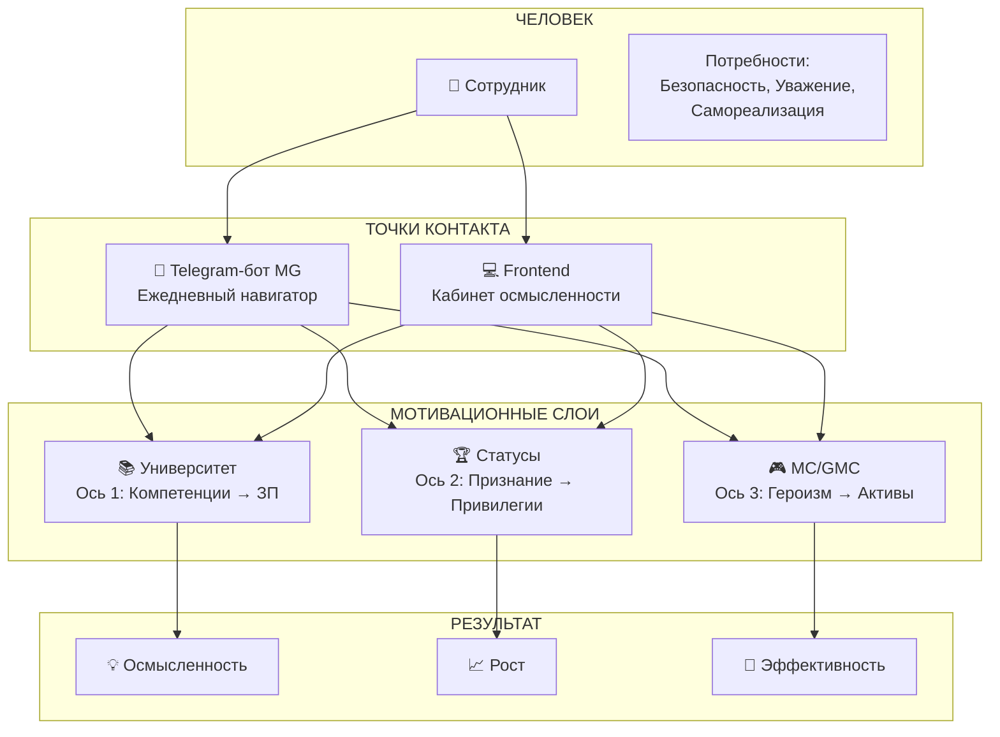

# 🌱 MATRIXGIN: ОТ СИСТЕМЫ УЧЁТА К ЖИВОМУ МОТИВАЦИОННОМУ ОРГАНИЗМУ

## СТРАТЕГИЧЕСКОЕ ИССЛЕДОВАНИЕ МОТИВАЦИОННОЙ ЭКОСИСТЕМЫ

**Дата:** 2026-01-19  
**Версия:** 2.0 (объединённый мастер-документ)
**Статус:** СТРАТЕГИЧЕСКИЙ ДОКУМЕНТ  
**Включает:** Стратегические якоря для сотрудников и управленцев
**Ключевой вопрос:** Как превратить MatrixGin в живой мотивационный организм, усиливающий внутреннюю мотивацию сотрудников, не разрушая этический и архитектурный фундамент проекта?

---

# 📊 EXECUTIVE SUMMARY

## Управленческое резюме (2 страницы)

### Проблема

MatrixGin сегодня — это **система учёта и контуров**. Она эффективна для:
- Регистрации данных
- Управления процессами
- Контроля результатов

Но она **не является** мотивационным инструментом. Сотрудник воспринимает её как **обязательство**, а не как **среду роста**.

### Целевое состояние

MatrixGin должен стать **живым мотивационным организмом**, где:

| От (сейчас) | К (цель) |
|-------------|----------|
| Система контроля | Среда роста |
| Обязательство | Возможность |
| Давление | Поддержка |
| Отчётность | Самоаналитика |
| Метрики о человеке | Метрики для человека |

### Ключевой инсайт

> **Мотивация — это не инструмент давления, а следствие среды.**

MatrixGin должен создавать среду, в которой:
1. Сотруднику **выгодно** быть внутри системы
2. Система **не давит**, а **усиливает**
3. Руководство может **доверять данным**
4. MatrixGin — это **не контроль, а рост**

### Трансформационная формула

```
MATRIXGIN = СРЕДА РОСТА
           = Telegram-бот (ежедневный навигатор)
           + Frontend (личный кабинет осмысленности)
           + MatrixCoin Economy (игровой слой для пассионариев)
           + Corporate University (путь компетентности)
           
РЕЗУЛЬТАТ = Естественное внутреннее желание:
            → Приходить на работу
            → Быть эффективным
            → Развиваться (Kaizen)
            → Получать достойное вознаграждение
```

### Критерии успеха

После реализации должно быть очевидно:

✅ **Почему сотруднику выгодно быть внутри MatrixGin:**
- Он видит свой прогресс
- Он понимает, что делать дальше
- Он чувствует поддержку, а не контроль

✅ **Почему система не давит, а усиливает:**
- Нет KPI/штрафов/рейтингов людей
- Есть выбор уровня вовлечённости
- Информация подаётся дозированно

✅ **Почему руководству можно доверять данным:**
- Данные собираются прозрачно
- Сотрудник видит свои данные
- Нет "чёрного ящика"

✅ **Почему MatrixGin — это среда роста:**
- Университет развивает компетенции
- Статусы признают достижения
- MC/GMC вознаграждает героизм

### Философский фундамент

```
┌─────────────────────────────────────────────────────────────┐
│                    ИЕРАРХИЯ МАСЛОУ                         │
│                                                             │
│                      ▲                                      │
│                     /│\                                     │
│                    / │ \     🎮 MC/GMC (Самореализация)    │
│                   /  │  \                                   │
│                  /   │   \   🏆 Статусы (Уважение)         │
│                 /    │    \                                 │
│                /     │     \ 👥 Команда (Принадлежность)   │
│               /      │      \                               │
│              /       │       \💰 Университет (Безопасность)│
│             /        │        \                             │
│            └─────────┴─────────┘                            │
│                                                             │
│            MatrixGin закрывает ВСЕ уровни                  │
└─────────────────────────────────────────────────────────────┘
```

---

# 🧬 СИСТЕМНАЯ МОДЕЛЬ МОТИВАЦИИ MATRIXGIN

## Как связаны компоненты



## Принцип "Среда, а не инструмент"

### Традиционный подход (❌ Плохо)

```
КОМПАНИЯ → [Инструмент давления] → СОТРУДНИК
           (KPI, штрафы, рейтинги)
           
Результат: Страх, стресс, выгорание, текучесть
```

### Подход MatrixGin (✅ Хорошо)

```
КОМПАНИЯ → [Среда роста] → СОТРУДНИК
           (Поддержка, прозрачность, выбор)
           
Результат: Вовлечённость, развитие, лояльность
```

## Три слоя мотивационной экосистемы

| Слой | Функция | Инструмент | Частота |
|------|---------|------------|---------|
| **Ежедневный** | Навигация | Telegram-бот MG | Каждый день |
| **Еженедельный** | Осмысление | Frontend | 1-2 раза в неделю |
| **Стратегический** | Развитие | Университет + MC | По мере готовности |

---

# 📱 КОНТУР 1: TELEGRAM-БОТ «MG»

## 1.1 Роль бота: Не «отчётник», а «навигатор»

### Чем бот НЕ является

| ❌ Анти-паттерн | Почему плохо |
|-----------------|--------------|
| **Отчётник** | "Отправь отчёт до 18:00" — давление, стресс |
| **Надсмотрщик** | "Ты не выполнил план" — контроль, страх |
| **Напоминалка** | "Сделай X, Y, Z" — перегруз, раздражение |
| **Метрикомат** | "Твои показатели: 73%" — оценка, тревога |

### Чем бот ЯВЛЯЕТСЯ

| ✅ Роль | Что это значит | Пример |
|---------|---------------|--------|
| **Помощник** | Отвечает на вопросы, упрощает рутину | "Как оформить заявку на отпуск?" |
| **Навигатор** | Показывает следующий шаг, не весь путь | "Для повышения квалификации осталось сдать 1 тест" |
| **Зеркало прогресса** | Отражает достижения, не недостатки | "За этот месяц ты прошёл 2 курса — это круто!" |
| **Инструмент самоаналитики** | Помогает задавать вопросы себе | "Хочешь посмотреть, как изменилась твоя эффективность за квартал?" |

### Философия бота

> **Бот — это личный коуч, который:**
> - Знает контекст сотрудника
> - Не давит, а поддерживает
> - Показывает возможности, не требования
> - Говорит на человеческом языке

```
┌─────────────────────────────────────────────────────────────┐
│                    МЕТАФОРА: БЕГУЩИЙ                       │
│                                                             │
│  ❌ Плохой тренер: "Ты бежишь слишком медленно!"           │
│                                                             │
│  ✅ Хороший коуч: "Смотри, сегодня ты пробежал на 200м     │
│                    больше, чем на прошлой неделе.          │
│                    Хочешь попробовать новый маршрут?"      │
└─────────────────────────────────────────────────────────────┘
```

---

## 1.2 Три измерения: Что анализирует бот

### Измерение 1: РАЦИОНАЛЬНОЕ (Университет / Компетенции)

**Что анализирует бот:**
- Текущий квалификационный уровень
- Прогресс по курсам Университета
- Расстояние до следующего уровня
- Влияние на коэффициент ЗП

**Какие сигналы отражает:**
```
📚 "Ты на уровне 'Специалист' (коэф. 1.0).
    До 'Профессионала' (коэф. 1.2) осталось:
    - Сдать тест по 'Продвинутым техникам'
    - Показать KPI 80%+ в течение 2 месяцев
    
    Это может увеличить твой доход на ~15%"
```

**Какие вопросы помогает задавать себе:**
- *"Готов ли я инвестировать время в обучение?"*
- *"Что мне мешает пройти следующий курс?"*
- *"Какой навык даст максимальный рост?"*

**Мотивационный эффект:**
- 💡 **Ясность** — понимание, что делать
- 🎯 **Цель** — видимость следующего шага
- 💰 **Выгода** — прямая связь с доходом

---

### Измерение 2: СОЦИАЛЬНОЕ (Статусы / Признание)

**Что анализирует бот:**
- Текущий статус и его привилегии
- Критерии следующего статуса
- История достижений
- Репутация в команде (без рейтингов!)

**Какие сигналы отражает:**
```
🏆 "Твой статус: Топчик
    
    Твои привилегии:
    ✓ Доступ к MC Market
    ✓ Приоритет на обучение
    
    Для статуса 'Кремень' нужно:
    - Стать наставником (у тебя уже 1 стажёр!)
    - 6+ месяцев стабильных результатов
    
    Кремень даёт: расширенный соцпакет, бюджет на конференции"
```

**Какие вопросы помогает задавать себе:**
- *"Готов ли я брать ответственность за других?"*
- *"Какой вклад я хочу оставить в команде?"*
- *"Чем я могу помочь коллегам расти?"*

**Мотивационный эффект:**
- 🌟 **Признание** — компания видит вклад
- 🤝 **Принадлежность** — часть чего-то большего
- 🔓 **Привилегии** — реальные бонусы, не виртуальные

---

### Измерение 3: ИГРОВОЕ (MC / GMC / Героизм)

**Что анализирует бот:**
- Баланс MC и GMC
- Срок жизни MC (напоминание о сгорании)
- Доступные лоты в магазине/аукционе
- История "героических" действий

**Какие сигналы отражает:**
```
🎮 "Твой капитал:
    🪙 MC: 75 (сгорают через 12 дней)
    💎 GMC: 2
    
    Что можешь сделать:
    [🛒 Магазин] — потратить MC на бенефиты
    [🏦 Сейф] — сохранить MC от сгорания
    [💱 Конвертация] — 5 MC → 1 GMC
    
    💡 На прошлой неделе ты получил 15 MC за рацпредложение 
       по оптимизации процесса. Круто!"
```

**Какие вопросы помогает задавать себе:**
- *"Что я могу улучшить в своей работе?"*
- *"Какой вклад выходит за рамки обязанностей?"*
- *"Как я хочу использовать свои 'активы'?"*

**Мотивационный эффект:**
- 🎯 **Азарт** — игровой элемент, но без манипуляций
- 🏆 **Достижение** — признание "героизма"
- 💎 **Инвестиция** — ощущение владения чем-то ценным

---

## 1.3 Функциональность по уровням сотрудников

> **Важно:** Бот — не разный продукт, а **контекстно адаптируемый**. Один бот, разные сценарии.

### Уровень 1: Рядовой сотрудник

**Основные сценарии:**

| Сценарий | Инициатор | Пример диалога |
|----------|-----------|----------------|
| **Проверка прогресса** | Сотрудник | "Где я сейчас?" → Краткий статус по 3 осям |
| **Вопрос по работе** | Сотрудник | "Как оформить возврат?" → Ссылка на регламент |
| **Напоминание (мягкое)** | Бот | "У тебя 30 MC сгорят через 3 дня. Хочешь выбрать подарок?" |
| **Признание** | Бот | "Поздравляю, ты прошёл курс 'Основы продаж'!" |

**Ключевые функции:**
- 📊 **Личный дашборд** — краткий статус "одной кнопкой"
- 🎓 **Гид по Университету** — следующий курс, прогресс
- 🪙 **MC-навигатор** — баланс, срок жизни, рекомендации
- ❓ **FAQ-помощник** — ответы на типовые вопросы

**Когнитивные и мотивационные эффекты:**
- ✅ Снижение тревожности ("я знаю, где я")
- ✅ Чувство контроля ("моя информация доступна")
- ✅ Мягкое подталкивание ("могу, но не обязан")

---

### Уровень 2: Тактический руководитель

**Основные сценарии:**

| Сценарий | Инициатор | Пример диалога |
|----------|-----------|----------------|
| **Обзор команды** | Руководитель | "Как моя команда?" → Агрегированная статистика (без рейтингов!) |
| **Помощь в развитии** | Руководитель | "Кому нужна поддержка?" → Рекомендации (анонимизированные) |
| **Коучинг-подсказки** | Бот | "Иван близок к повышению квалификации. Может, обсудить с ним?" |
| **Планирование** | Руководитель | "Какие курсы актуальны для команды?" → Рекомендации |

**Ключевые функции:**
- 👥 **Командный дашборд** — агрегированные данные, без персоналий
- 💡 **Коучинг-рекомендации** — как помочь команде расти
- 📅 **Планировщик развития** — какие навыки развивать
- 🔔 **Алерты поддержки** — кто близок к выгоранию (без имён, тренды)

**Когнитивные и мотивационные эффекты:**
- ✅ Роль лидера-наставника, не контролёра
- ✅ Данные для помощи, не для наказания
- ✅ Фокус на развитии, не на метриках

> **Критическое ограничение:**  
> Руководитель **НЕ видит** персональные MC-балансы, рейтинги, сравнения людей.  
> Только агрегированные тренды и рекомендации.

---

## 1.3.5 ЯКОРЯ ДЛЯ РЯДОВЫХ СОТРУДНИКОВ (Фотографы, Продавцы, Дизайнеры)

> **Принцип:** Бот и Frontend должны помогать ПОНЯТЬ систему, не пугать ей. Показывать возможности, не требования.

### 🌅 Якорь 1: Утреннее приветствие + ЦКП дня

**Для фотографа:**
```
🌅 Доброе утро, Алексей!

📸 Твой ЦКП сегодня: Создать яркие воспоминания для гостей

📊 Ориентир: 25+ компаний
💰 Средняя ценность: цель 1500₽

🎯 Микро-вызов дня: 
"Найди семью с ребёнком до 3 лет — улыбка гарантирована!"
(+3 MC за выполнение)

Хорошего дня! 🙌
```

**Для продавца:**
```
🌅 Доброе утро, Мария!

🛒 Твой ЦКП сегодня: Подарить гостям лучшие воспоминания

📊 Ориентир: Конверсия 60%+
💰 Средний чек: цель 2500₽

🎯 Микро-вызов дня:
"Спроси у 3 клиентов: А какой момент был самым ярким?"
(+3 MC за выполнение)
```

---

### 📈 Якорь 2: Мои KPI — понятно и без страха

> KPI показываем как **возможности заработать больше**, НЕ как контроль

**Пример для фотографа:**
```
📊 ТВОИ ПОКАЗАТЕЛИ (понятно)

Компаний за смену: 23 ▓▓▓▓▓▓▓▓▓▓▓░░░ (цель 25)
├─ Ставка сейчас: 70₽/компания
└─ +3 компании = 100₽/компания! 📈

Средняя ценность: 1 180₽ ▓▓▓▓▓▓▓▓░░░░░ (цель 1200)
├─ Бонус сейчас: НЕТ
└─ +20₽ = +70₽ за каждую компанию! 💰

🔑 Подсказка: Попробуй больше времени на контакт — это повышает ЦК
```

---

### 💸 Якорь 3: Сколько я заработаю?

```
💰 ПРЕДВАРИТЕЛЬНЫЙ РАСЧЁТ (по текущим показателям)

Базовая часть:     2 500 ₽
OKK-бонус:         1 610 ₽  (23 × 70₽)
CK-бонус:          0 ₽      (ЦК ниже порога)
MC-эквивалент:     340 ₽    (34 MC)
─────────────────────────────
ИТОГО:             ~4 450 ₽

📈 Если +3 компании и +20₽ ЦК:
ИТОГО:             ~6 200 ₽ (+39%!)
```

> **ВАЖНО:** Показываем НЕ "ты недоработал", а "сколько можешь получить, если чуть-чуть больше"

---

### 🏆 Якорь 4: Мой статус и путь роста

```
🌟 МОЙ СТАТУС

Сейчас: ⚡ ТОПЧИК (уровень 2 из 5)

Следующий: 💎 КРЕМЕНЬ
├─ Осталось: 2 месяца стабильного KPI ✅
├─ Нужно: Завершить "Продвинутые продажи" ⏳
└─ Нужно: 3 рацпредложения 📝 (сделано: 1)

Что даёт КРЕМЕНЬ:
✅ +5% к базовой ставке
✅ Приоритет в выборе смен
✅ Доступ к расширенному Магазину MC
```

---

### 🪙 Якорь 5: Мои MC — баланс и магазин

```
🪙 МОИ МАТРИКС КОИНЫ

Баланс: 847 MC
Срок жизни: до 31.03 (осталось 72 дня)

📥 Последние начисления:
+15 MC — Помощь коллеге (вчера)
+10 MC — Курс пройден (2 дня назад)
+5 MC — Утренний челлендж (3 дня назад)

🛒 Что могу купить?
• Дополнительный выходной — 500 MC ✅
• Сертификат ресторан — 700 MC ✅
• Обучение у топ-фотографа — 1200 MC ⏳
```

---

### 📚 Якорь 6: Моё обучение

```
📚 МОЁ ОБУЧЕНИЕ

Пройдено курсов: 7 из 12 базовых
[▓▓▓▓▓▓▓▓▓▓▓▓▓▓░░░░░░] 58%

⏳ В процессе:
• Продвинутые продажи — 3/8 уроков

📌 Рекомендуется:
• "Работа с возражениями" 
  (+15 MC за прохождение, открывает путь к КРЕМЕНЬ)
```

---

### 🎯 Якорь 7: Ежедневные микро-вызовы

> Каждый день — маленький вызов. Выполнение = +MC. НЕ обязательно, но весело.

| День | Микро-вызов | MC |
|------|-------------|-----|
| Пн | "Сделай 3 кадра с игрушкой локации" | +3 |
| Вт | "Найди ребёнка старше 5 лет — научи его позе" | +5 |
| Ср | "Сфотографируй 3 поколения (бабушка, родители, дети)" | +10 |
| Чт | "Собери 5 контактов за день" | +5 |
| Пт | "Помоги новичку с настройкой камеры" | +15 |

---

### 💼 Якорь 8: Моя смена — прогресс в реальном времени

**Для фотографа:**
```
📸 МОЯ СМЕНА (14:30)

Компаний создано: 18
├─ Ретушь готова: 12 ✅
├─ На ретуши: 4 ⏳
└─ Ожидают: 2

Продано: 9 (конверсия 75%!)
Отклонено: 3

💰 Прогноз за смену: ~5 800₽
```

---

### 🆘 Якорь 9: Нужна помощь — без страха

```
🆘 НУЖНА ПОМОЩЬ

• [📞 Позвать наставника]
• [🔧 Техническая проблема]
• [👥 Сложный клиент]
• [❓ Не понимаю задачу]

💡 Подсказка: Используй формат ЗРС:
"Проблема → Варианты → Твоя рекомендация"

Это покажет твою инициативу (+MC!) 
```

---

### 🌟 Якорь 10: Мои достижения и признание

```
⭐ МОИ ДОСТИЖЕНИЯ

За эту неделю:
🏆 Лучший по ЦК в среду (1 650₽!)
🎓 Пройден курс "Работа с возражениями"
💡 Рацпредложение принято

Благодарности от коллег:
💬 "Спасибо за помощь со сложным клиентом!" — Пётр
💬 "Научил меня новой технике!" — Мария
```

---

### 🧘 Якорь 11: Режим фокуса — отключить шум

```
🔇 РЕЖИМ ФОКУСА

Сейчас: Выключен

[🔕 Включить на 2 часа]

Что отключится:
• MC-уведомления
• Аукционы
• Напоминания

Что останется:
• Критические алерты
• Сообщения от руководителя
```

---

### 🔄 Якорь 12: Предложить идею (Кайдзен)

```
💡 ПРЕДЛОЖИТЬ ИДЕЮ

Твои идеи — это ценность! Мы слушаем каждого.

Опиши свою идею:
1. Что можно улучшить?
2. Как это сделать?
3. Какой будет эффект?

[📝 Отправить идею]

🎁 За принятую идею: +15-100 MC

Твои предыдущие идеи: 3
├─ Принято: 2 ✅
└─ На рассмотрении: 1 ⏳
```

---

### Интенты для сотрудников

```json
{
  "morning_greeting": {
    "trigger": ["доброе утро", "начать день", "мой ЦКП"],
    "access": "all"
  },
  "my_kpi": {
    "trigger": ["мои показатели", "как у меня", "мой KPI"],
    "access": "all"
  },
  "my_earnings": {
    "trigger": ["сколько заработаю", "расчёт зарплаты", "прогноз"],
    "access": "all"
  },
  "my_status": {
    "trigger": ["мой статус", "как повыситься", "следующий уровень"],
    "access": "all"
  },
  "my_mc_balance": {
    "trigger": ["мои коины", "баланс MC", "магазин"],
    "access": "all"
  },
  "my_training": {
    "trigger": ["мои курсы", "обучение", "квалификация"],
    "access": "all"
  },
  "daily_challenge": {
    "trigger": ["челлендж", "вызов дня", "микро-задание"],
    "access": "all"
  },
  "my_shift": {
    "trigger": ["моя смена", "прогресс", "сколько компаний"],
    "access": "all"
  },
  "need_help": {
    "trigger": ["помощь", "не знаю", "проблема"],
    "access": "all"
  },
  "my_achievements": {
    "trigger": ["мои достижения", "за что отметили", "признание"],
    "access": "all"
  },
  "focus_mode": {
    "trigger": ["не беспокоить", "режим фокуса", "тихий режим"],
    "access": "all"
  },
  "suggest_improvement": {
    "trigger": ["у меня идея", "предложить", "кайдзен"],
    "access": "all"
  }
}
```

---

### Сводка якорей для сотрудников

| Якорь | Бот | Frontend | Приоритет |
|-------|-----|----------|-----------|
| Утреннее приветствие + ЦКП | ✅ | — | 🔴 Критический |
| Мои KPI (понятно) | ✅ | ✅ | 🔴 Критический |
| Сколько я заработаю? | ✅ | ✅ | 🔴 Критический |
| Мой статус и путь роста | ✅ | ✅ | 🔴 Критический |
| Мои MC (баланс, магазин) | ✅ | ✅ | 🔴 Критический |
| Моё обучение | ✅ | ✅ | 🟡 Высокий |
| Микро-вызовы дня | ✅ | — | 🟡 Высокий |
| Моя смена (прогресс) | ✅ | ✅ | 🟡 Высокий |
| Нужна помощь | ✅ | — | 🟡 Высокий |
| Мои достижения | ✅ | ✅ | 🟢 Средний |
| Режим фокуса | ✅ | ✅ | 🟢 Средний |
| Предложить идею | ✅ | ✅ | 🟢 Средний |

---

## 1.3.6 ЯКОРЯ ИЗ СТРАТЕГИЧЕСКИХ ДОКУМЕНТОВ (для управленцев)

> **Источники:** Золотой Стандарт Управления, Внутренний Маркетинг, Кодекс Фотоматрицы

### 📅 1-on-1 встречи (Критический якорь)

| Параметр | Значение |
|----------|----------|
| **Частота** | Еженедельно |
| **Длительность** | 30-45 минут |
| **Охват** | 100% прямых подчинённых |
| **Максимум подчинённых** | 7-10 на руководителя |

**Функции бота:**
```
📅 МОДУЛЬ 1-on-1 ВСТРЕЧ

ДЛЯ РУКОВОДИТЕЛЯ:
• Напоминание о запланированных 1-on-1
• Статистика: "Проведено 4/5 встреч на этой неделе"
• MC за проведение качественных 1-on-1 (+15 MC)

ДЛЯ СОТРУДНИКА:
• Напоминание: "Завтра твоя встреча с руководителем"
• Подготовка: "Что хочешь обсудить?"
```

---

### 🔮 4 Магических вопроса (Gallup)

| Вопрос | Цель |
|--------|------|
| «Что для тебя сейчас важно?» | Выявление приоритетов |
| «Как я могу тебе помочь?» | Служение и поддержка |
| «Что можем улучшить?» | Инициация Кайдзен снизу |
| «Какие сильные стороны развивать?» | Фокус на потенциале |

---

### 📚 Наставничество и адаптация

| Этап | Фокус бота |
|------|-----------|
| День 1 | "Добро пожаловать! Твой наставник: [Имя]" |
| Неделя 1 | Ежедневная обратная связь, чек-листы |
| Месяц 1 | Промежуточная аттестация |
| Месяц 3 | Итоговая аттестация |

**MC за наставничество:** +25 MC за успешную адаптацию стажёра

---

### 🔥 Формат «Костров» (командные встречи)

| Блок | Время | Тема |
|------|-------|------|
| Личное | 10 мин | "Как дела у каждого как у человека?" |
| Профессиональное | 20 мин | "Что происходит в работе?" |
| Системное | 15 мин | "Что можем улучшить вместе?" |

---

### 📋 ЗРС (Законченная работа сотрудника)

> При проблеме сотрудник приходит с вариантами решения, а не только с вопросом.

```
❌ ПЛОХО:
"Принтер сломался"

✅ ПО ЗРС:
"Принтер сломался. Варианты:
1. Вызвать сервис (2000₽, 2 часа)
2. Использовать резервный (готов)
3. Отложить печать на завтра

Рекомендую: вариант 2"
```

---

### 😊 Индекс счастья команды

**Виджет для руководителя:**
```
😊 ИНДЕКС СЧАСТЬЯ КОМАНДЫ

Текущий: 8.2 / 10 ✅
Тренд: ↑ +0.3 за неделю

Цель: >8.0
```

---

### 📊 Интеграция с MC (управленческие действия)

| Действие | MC |
|----------|-----|
| Проведение качественной 1-on-1 | +15 MC |
| Создание психологически безопасной среды | +25 MC |
| Успешная адаптация стажёра (наставник) | +25 MC |
| Открытое признание ошибки с решением | +30 MC |
| Использование сильных сторон ежедневно | +10 MC |

---

## 1.4 Архитектура диалогов бота

### Принцип "Человеческий язык"

| ❌ Роботизированно | ✅ По-человечески |
|-------------------|-------------------|
| "Ваш баланс MC: 75. Срок действия: 12 дней." | "У тебя 75 MC, они сгорят через 12 дней. Может, выбрать подарок?" |
| "Квалификационный уровень: Специалист." | "Ты сейчас на уровне 'Специалист'. До 'Профессионала' осталось совсем немного!" |
| "Статус: Топчик. Критерии следующего уровня: ..." | "Твой статус — Топчик! Хочешь узнать, что даёт 'Кремень'?" |

### Принцип "Выбор, не давление"

```
❌ ПЛОХО:
"Ты должен пройти курс 'Продажи' до пятницы."

✅ ХОРОШО:
"Курс 'Продвинутые продажи' может помочь тебе быстрее дойти до 'Профессионала'.
Хочешь посмотреть программу?"
[Да, покажи] [Позже] [Мне это не нужно]
```

### Принцип "Признание, не оценка"

```
❌ ПЛОХО:
"Твой KPI: 78%. Это ниже среднего по отделу."

✅ ХОРОШО:
"Вижу, что последний месяц был насыщенным!
За это время ты прошёл 2 курса и получил 25 MC.
Хочешь посмотреть свой путь за квартал?"
```

---

## 1.5 Интенты и сценарии (техническая карта)

```json
{
  "intents": {
    "personal_dashboard": {
      "trigger": ["где я", "мой статус", "покажи прогресс"],
      "response": "personal_dashboard_view",
      "access": "all"
    },
    "axis1_progress": {
      "trigger": ["моя квалификация", "как повысить зп", "университет"],
      "response": "university_progress_view",
      "access": "all"
    },
    "axis2_status": {
      "trigger": ["мой статус", "что такое кремень", "привилегии"],
      "response": "status_info_view",
      "access": "all"
    },
    "axis3_capital": {
      "trigger": ["мои коины", "сколько mc", "магазин"],
      "response": "mc_balance_view",
      "access": "status >= TOPCHIK"
    },
    "team_overview": {
      "trigger": ["моя команда", "как отдел", "кому помочь"],
      "response": "team_aggregated_view",
      "access": "role >= TACTICAL_MANAGER"
    },
    "company_pulse": {
      "trigger": ["пульс компании", "культура", "вовлечённость"],
      "response": "strategic_dashboard",
      "access": "role >= STRATEGIC_MANAGER"
    }
  }
}
```

---

# 💻 КОНТУР 2: FRONTEND (ОБЩИЙ ИНТЕРФЕЙС)

## 2.1 Принципы дизайна: "Спокойствие, не тревога"

### Философия интерфейса

| Принцип | Что это значит | Как реализовать |
|---------|---------------|-----------------|
| **Понятно** | Сотрудник понимает всё с первого взгляда | Простой язык, минимум терминов |
| **Спокойно** | Интерфейс не вызывает стресс | Нейтральные цвета, плавные анимации |
| **Логично** | Структура интуитивна | Группировка по смыслу, не по модулям |
| **Не перегружено** | Минимум информации на экран | Progressive disclosure, раскрытие по запросу |

### Как интерфейс влияет на состояние

| Эффект | Как достигается |
|--------|-----------------|
| **Снижает тревожность** | Никаких красных индикаторов "проблема", никаких сравнений с другими |
| **Повышает контроль** | Сотрудник видит ВСЕ свои данные, нет "скрытых" метрик |
| **Усиливает доверие** | Прозрачные алгоритмы, объяснение каждой цифры |

### Цветовая палитра

```
┌─────────────────────────────────────────────────────────────┐
│  ПАЛИТРА СПОКОЙСТВИЯ                                       │
├─────────────────────────────────────────────────────────────┤
│  Основной фон:      Тёплый серый (#F5F5F0)                 │
│  Акцент прогресса:  Мягкий зелёный (#7CB342)               │
│  Нейтральный:       Синий-серый (#607D8B)                  │
│  Приглашение:       Тёплый оранжевый (#FFB74D)             │
│                                                             │
│  ❌ ЗАПРЕЩЕНО:                                              │
│  - Ярко-красный (стресс)                                    │
│  - Агрессивные градиенты                                    │
│  - Мигающие элементы                                        │
└─────────────────────────────────────────────────────────────┘
```

---

## 2.2 Информационная архитектура

### Что видит сотрудник

```
┌─────────────────────────────────────────────────────────────┐
│                    ЛИЧНЫЙ КАБИНЕТ                          │
├─────────────────────────────────────────────────────────────┤
│                                                             │
│  👤 Моё имя                                    [⚙️ Настройки]│
│  ────────────────────────────────────────────              │
│                                                             │
│  ┌─────────────────────────────────────────────────────┐   │
│  │  🎯 МОЙ ПУТЬ                                        │   │
│  │  ─────────────────────────────────────────          │   │
│  │                                                      │   │
│  │  📚 Квалификация: Специалист         [████████░░]   │   │
│  │      💰 Коэф: 1.0 → следующий: 1.2                  │   │
│  │      📝 Осталось: 1 курс + 2 месяца стаж            │   │
│  │                                                      │   │
│  │  🏆 Статус: Топчик                    ⭐⭐⚪⚪⚪      │   │
│  │      🎁 Привилегии: MC-доступ, приоритет обучения  │   │
│  │      📝 До Кремня: наставничество                   │   │
│  │                                                      │   │
│  │  [Подробнее о моём пути →]                           │   │
│  └─────────────────────────────────────────────────────┘   │
│                                                             │
│  ┌─────────────────────────────────────────────────────┐   │
│  │  🎮 МОЙ КАПИТАЛ (опционально)                       │   │
│  │  ─────────────────────────────────────────          │   │
│  │                                                      │   │
│  │  🪙 MC: 75 (сгорают через 12 дней)                  │   │
│  │  💎 GMC: 2                                          │   │
│  │                                                      │   │
│  │  [🛒 Магазин] [🏦 Сейф] [💱 Конвертация]           │   │
│  │                                                      │   │
│  └─────────────────────────────────────────────────────┘   │
│                                                             │
│  ┌─────────────────────────────────────────────────────┐   │
│  │  📚 МОЁ ОБУЧЕНИЕ                                    │   │
│  │  ─────────────────────────────────────────          │   │
│  │                                                      │   │
│  │  ✅ Пройдено: 5 курсов                              │   │
│  │  ⏳ В процессе: "Продвинутые техники" (60%)        │   │
│  │  💡 Рекомендуется: "Клиентский сервис"             │   │
│  │                                                      │   │
│  │  [Перейти в Университет →]                          │   │
│  └─────────────────────────────────────────────────────┘   │
│                                                             │
└─────────────────────────────────────────────────────────────┘
```

### Что сотрудник видит о СЕБЕ (✅) vs о СИСТЕМЕ (⚙️)

| О себе (личное) | О системе (общее) |
|-----------------|-------------------|
| Мой уровень | Как работает система уровней |
| Мой прогресс | Критерии перехода |
| Мои MC | Правила MC |
| Моя история | Глоссарий/FAQ |

### Как избежать ощущения контроля

| ❌ Ощущение контроля | ✅ Ощущение поддержки |
|---------------------|----------------------|
| "Система следит за вами" | "Система помогает вам расти" |
| Метрики о человеке | Метрики для человека |
| Скрытые алгоритмы | Прозрачные правила |
| Сравнение с другими | Сравнение с собой вчера |
| Красные индикаторы | Нейтральный прогресс |

---

## 2.3 Взаимодействие с мотивационными контурами

### Как Frontend дополняет Telegram-бот

| Telegram-бот | Frontend |
|--------------|----------|
| Быстрый статус "на бегу" | Глубокий анализ "в спокойствии" |
| Push-напоминания | Pull-информация по запросу |
| Диалоговый интерфейс | Визуальный интерфейс |
| Ежедневный контакт | Еженедельный анализ |

### Визуализация прогресса (Kaizen-мышление)

```
┌─────────────────────────────────────────────────────────────┐
│                    МОЙ ПУТЬ ЗА КВАРТАЛ                     │
├─────────────────────────────────────────────────────────────┤
│                                                             │
│  Январь          Февраль         Март           Сейчас     │
│     │               │               │               │       │
│     ●───────────────●───────────────●───────────────★       │
│  Стажёр         Сдал тест      Специалист    Топчик        │
│                 +5 MC                         +2 курса      │
│                                                             │
│  💬 "За 3 месяца ты прошёл путь от стажёра до Топчика.     │
│      Это быстрее, чем у 70% сотрудников. Молодец!"         │
│                                                             │
└─────────────────────────────────────────────────────────────┘
```

### Поддержка Kaizen-мышления

| Элемент | Как поддерживает Kaizen |
|---------|-------------------------|
| **Временная шкала** | Видно непрерывное улучшение |
| **Микро-достижения** | Каждый шаг отмечен |
| **Сравнение с собой** | Не с другими, а с прошлым "я" |
| **Положительный язык** | "Ты вырос", не "тебе осталось" |

### Усиление осмысленности

```
┌─────────────────────────────────────────────────────────────┐
│                    МОЙ ВКЛАД                               │
├─────────────────────────────────────────────────────────────┤
│                                                             │
│  📊 За этот месяц:                                         │
│                                                             │
│  ✅ Обработано заявок: 127                                 │
│  ⭐ Благодарностей от клиентов: 8                          │
│  💡 Рацпредложений: 1 (внедрено!)                          │
│  🎓 Помощь стажёрам: 12 часов                              │
│                                                             │
│  💬 "Твой вклад в команду растёт.                          │
│      Особенно заметно твоё влияние на стажёров —           │
│      они быстрее выходят на уровень благодаря тебе."       │
│                                                             │
└─────────────────────────────────────────────────────────────┘
```

---

## 2.4 ВИЗУАЛИЗАЦИЯ: «МАТРИЦА РОСТА» (Growth Web)

> **Концепция:** Интерактивная "паутина навыков" в стиле RPG, где сотрудник видит своё текущее состояние и может **спрогнозировать** эффект от развития.

### Референс из игровой индустрии

В RPG (Path of Exile, Diablo, Skyrim) есть skill trees:
- Видны взаимосвязи навыков
- Можно "примерить" прокачку
- Понятно, что разблокируется
- Фокус = результат

**Применяем к MatrixGin:**

```
                    📚 КОМПЕТЕНЦИИ
                         ●
                        /|\
                       / | \
                      /  |  \
              💰 ЗП ●────┼────● 🏆 СТАТУС
                      \  |  /
                       \ | /
                        \|/
                         ●
                    🎮 MC-КАПИТАЛ
                    
        ═══ Твоя паутина (текущее) ═══
        ─── Максимум (потенциал) ───
```

---

### 🔮 РЕЖИМ ПРОГНОЗА (Killer Feature)

**Идея:** Сотрудник двигает ползунок — видит, как изменятся ВСЕ измерения.

```
┌─────────────────────────────────────────────────────────────┐
│  🔮 СПЛАНИРУЙ СВОЙ РОСТ                                    │
├─────────────────────────────────────────────────────────────┤
│                                                             │
│  Что если я пройду курс "Продвинутые продажи"?             │
│  ─────────────────────────────────────────                  │
│                                                             │
│  📚 Компетенции:  70% ──► 85% ↑                            │
│  💰 ЗП-коэффициент: 1.0 ──► 1.2 (+20%! 💰)                 │
│  🏆 Статус: Топчик ──► ближе к Кремень                     │
│  🎮 MC: +15 за прохождение курса                           │
│                                                             │
│  ⏱️ Время на курс: ~4 часа                                 │
│  📈 ROI: +20% ЗП за 4 часа обучения                        │
│                                                             │
│  [📖 Начать курс]  [🔄 Другой сценарий]                    │
│                                                             │
└─────────────────────────────────────────────────────────────┘
```

---

### Матрица влияния между осями

| Измерение | Сейчас | Влияет на |
|-----------|--------|-----------|
| 📚 Компетенции | 70% | → ЗП (сильно 80%), → Статус (косвенно 40%) |
| 💰 ЗП-коэффициент | 1.0 | → MC (больше ЗП = больше можно вложить) |
| 🏆 Статус | Топчик | → MC-доступ (60%), → Привилегии |
| 🎮 MC-капитал | 847 | → Активы (прямо), → Признание |

**Техническая формула:**
```
Δ_dimension = base_change + Σ(influence[i] × Δ_other[i])
```

---

### Сценарии использования

**Сценарий 1: "Хочу больше зарабатывать"**

```
🎯 Цель: +30% к доходу

📊 Анализ путей:
├─ Путь А: Квалификация (коэф 1.0 → 1.3)
│   └─ Нужно: 2 курса + 3 месяца стажа → ~3 мес
│
├─ Путь Б: Статус до Кремень
│   └─ Нужно: наставничество + KPI → ~6 мес
│
└─ Путь В: Комбо (А + Б) → +45%, ~6 мес

💡 Рекомендация: Начни с Пути А — быстрее
```

**Сценарий 2: "Хочу стать наставником"**

```
🎯 Цель: Статус Кремень

📊 Чек-лист:
├─ Компетенции: 70% → 80% ✅ (почти)
├─ Стаж: 6+ мес ✅
├─ KPI стабильный: ⏳ (осталось 1 мес)
└─ Рацпредложения: 📝 (1/3)

⏱️ Примерное время: 2-3 месяца
```

---

### 3D-реализация во Frontend

**Вариант 1: Radar Chart (простой)**
```
┌─────────────────────────────────────┐
│  🧊 ТЫ В ПРОСТРАНСТВЕ MATRIXGIN    │
├─────────────────────────────────────┤
│                                     │
│      📚 Квалификация: ████░░ 70%    │
│      🏆 Статус: ██░░░░░░ 40%        │
│      🎮 MC-капитал: █████░ 80%      │
│      💰 Доход: ███░░░░ 55%          │
│                                     │
│  "Фокус на статусе даст прорыв!"   │
└─────────────────────────────────────┘
```

**Вариант 2: 3D Spider Web (продвинутый)**

Технологии:
- Three.js — полноценный 3D
- D3.js — 2D с анимациями
- Chart.js Radar — простой вариант

Функции:
- Вращение модели мышкой
- Hover на оси → подробности
- Режим "что если" → анимация перехода
- Сравнение текущего с прогнозом

---

### Интенты для бота

```json
{
  "growth_matrix": {
    "trigger": ["моя матрица", "паутина роста", "моё развитие"],
    "response": "growth_web_view",
    "access": "all"
  },
  "forecast_growth": {
    "trigger": ["что если", "спрогнозировать", "как вырасти"],
    "response": "forecast_mode",
    "access": "all"
  },
  "growth_path": {
    "trigger": ["как повысить зп", "путь к статусу", "план развития"],
    "response": "growth_scenarios",
    "access": "all"
  }
}
```

---

### Ограничения (этика)

| Принцип | Реализация |
|---------|------------|
| **Нет сравнения с другими** | Паутина показывает только ТВОЙ прогресс |
| **Нет давления** | Прогноз = возможность, не требование |
| **Прозрачность** | Формулы видны, нет "чёрного ящика" |
| **Нет "идеальной" паутины** | У каждого свой путь |

---

### Приоритет реализации

| Этап | Что делаем | Приоритет |
|------|-----------|-----------|
| MVP | Radar Chart 2D (Chart.js) | 🔴 Sprint 5-6 |
| v2 | Режим прогноза "Что если..." | 🟡 Sprint 7-8 |
| v3 | 3D Spider Web (Three.js) | 🟢 Sprint 9+ |
| v4 | AI-рекомендации путей | 🟢 Future |

---

# ⚠️ РИСКИ И АНТИ-ПАТТЕРНЫ

## Что может убить мотивацию (даже при благих намерениях)

### Риск 1: "Геймификация ради геймификации"

**Симптомы:**
- Бейджи за всё подряд
- Лидерборды
- "Уровни" без смысла

**Почему убивает мотивацию:**
- Обесценивает реальные достижения
- Создаёт конкуренцию вместо сотрудничества
- Превращает работу в "игру для детей"

**Антидот:**
- MC только за "выход за роль"
- Никаких публичных рейтингов
- Статусы = реальные привилегии, не бейджи

---

### Риск 2: "Прозрачность как панаптикон"

**Симптомы:**
- "Все видят всё обо всех"
- Публичные дашборды с именами
- Сравнения сотрудников

**Почему убивает мотивацию:**
- Страх быть "хуже других"
- Конкуренция вместо сотрудничества
- Ощущение тотальной слежки

**Антидот:**
- Каждый видит только СВОИ данные
- Руководители видят АГРЕГАТЫ, не персоналии
- Сравнение только с "собой вчера"

---

### Риск 3: "Уведомления как давление"

**Симптомы:**
- Слишком много напоминаний
- "Ты ещё не сделал X"
- Отрицательная формулировка

**Почему убивает мотивацию:**
- Перегруз → раздражение → отключение
- Ощущение "надзирателя"
- Потеря автономии

**Антидот:**
- Режим тишины по умолчанию для Оси 3
- Положительные формулировки
- Максимум 2-3 сообщения в день

---

### Риск 4: "Метрики ради метрик"

**Симптомы:**
- Измерение всего
- Графики, которые никто не понимает
- Данные без действий

**Почему убивает мотивацию:**
- Ощущение "винтика в системе"
- Отчуждение от смысла работы
- Тревога от непонятных цифр

**Антидот:**
- Каждая метрика → понятное объяснение
- Данные → рекомендация к действию
- Фокус на смысле, не на цифрах

---

### Риск 5: "Автоматизация человечности"

**Симптомы:**
- Бот заменяет руководителя
- Решения принимаются "алгоритмом"
- Нет личного контакта

**Почему убивает мотивацию:**
- Потеря ощущения "значимости"
- Недоверие к "машине"
- Отчуждение от команды

**Антидот:**
- Бот → помощник, не замена
- Обязательные личные встречи
- AI рекомендует, человек решает

---

## Матрица анти-паттернов

| Анти-паттерн | Признак | Альтернатива |
|--------------|---------|--------------|
| KPI как мотивация | "Твой план: 100 звонков" | "Что поможет тебе быть эффективнее?" |
| Штрафы | "За опоздание: -500₽" | "Как мы можем помочь с расписанием?" |
| Рейтинги людей | "Ты на 15 месте из 20" | "Ты вырос на 10% за месяц" |
| Манипулятивные механики | "Осталось 2 часа до конца акции!" | "Есть возможность, когда будет удобно" |
| Давление дедлайнами | "Сдай отчёт до 18:00!" | "Как спланировать задачи?" |

---

# 📋 РЕКОМЕНДАЦИИ ПО ПОЭТАПНОЙ РЕАЛИЗАЦИИ

## Принцип: Не ломать, а наращивать

```
┌─────────────────────────────────────────────────────────────┐
│              ЭВОЛЮЦИЯ, НЕ РЕВОЛЮЦИЯ                        │
├─────────────────────────────────────────────────────────────┤
│                                                             │
│  Этап 1        Этап 2        Этап 3        Этап 4          │
│     │             │             │             │             │
│     ▼             ▼             ▼             ▼             │
│  [Бот v1]  →  [Бот v2]  →  [Frontend]  →  [Полная]        │
│  Базовый      + Оси         Личный         интеграция      │
│  навигатор    мотивации     кабинет                        │
│                                                             │
│  Канонические модули НЕ МЕНЯЮТСЯ                           │
└─────────────────────────────────────────────────────────────┘
```

---

## Этап 1: Бот-навигатор (Sprint 1-2)

**Цель:** Бот становится полезным помощником

**Что делаем:**
- [ ] Интенты "личный статус", "FAQ", "помощь"
- [ ] Базовый дашборд по 3 осям
- [ ] Человеческий язык в ответах
- [ ] Режим тишины (opt-in для Оси 3)

**Не трогаем:**
- Канонические модули
- MC Economy
- Существующий Frontend

**Метрики успеха:**
- 50%+ сотрудников используют бота еженедельно
- NPS бота > 7

---

## Этап 2: Бот + Оси мотивации (Sprint 3-4)

**Цель:** Бот понимает контекст развития сотрудника

**Что делаем:**
- [ ] Интеграция с Университетом (прогресс курсов)
- [ ] Интеграция со Статусами (текущий, следующий)
- [ ] Интеграция с MC (баланс, напоминания)
- [ ] Проактивные подсказки (мягкие)

**Не трогаем:**
- Алгоритмы MC (CANONICAL)
- Критерии статусов

**Метрики успеха:**
- Рост прохождения курсов на 20%
- Снижение "сгорающих" MC на 30%

---

## Этап 3: Frontend — Личный кабинет (Sprint 5-8)

**Цель:** Сотрудник видит свой путь визуально

**Что делаем:**
- [ ] Раздел "Мой путь" (3 оси)
- [ ] Раздел "Мой капитал" (MC/GMC)
- [ ] Раздел "Моё обучение" (Университет)
- [ ] Временная шкала прогресса
- [ ] Режим тишины в настройках

**Не трогаем:**
- Существующие модули для руководителей
- Канонические сущности

**Метрики успеха:**
- 70%+ сотрудников заходят еженедельно
- Рост вовлечённости в обучение на 30%

---

## Этап 4: Полная интеграция (Sprint 9-12)

**Цель:** MatrixGin = единая среда роста

**Что делаем:**
- [ ] Синхронизация бот ↔ Frontend
- [ ] Командные дашборды для руководителей
- [ ] Стратегические дашборды для топов
- [ ] A/B тесты формулировок
- [ ] Обратная связь и итерации

**Метрики успеха:**
- NPS системы > 8
- Текучесть кадров снижена на 15%
- Рост компетенций (средний уровень) на 25%

---

# 🎯 КРИТЕРИИ УСПЕХА ИССЛЕДОВАНИЯ

## Чек-лист "4 очевидности"

После реализации должно быть очевидно:

### ✅ Почему сотруднику выгодно быть внутри MatrixGin

- [ ] Он видит свой прогресс в понятной форме
- [ ] Он знает, что делать для роста дохода
- [ ] Он чувствует признание своего вклада
- [ ] Он имеет выбор уровня вовлечённости

### ✅ Почему система не давит, а усиливает

- [ ] Нет KPI, штрафов, рейтингов людей
- [ ] Уведомления мягкие и редкие
- [ ] Можно включить "режим тишины"
- [ ] Всё добровольно, кроме базы (Ось 1)

### ✅ Почему руководству можно доверять данным

- [ ] Сотрудник видит все свои данные
- [ ] Алгоритмы прозрачны
- [ ] Нет "скрытых" метрик
- [ ] Данные для помощи, не для наказания

### ✅ Почему MatrixGin — это среда роста, а не контроль

- [ ] Университет развивает, а не экзаменует
- [ ] Статусы признают, а не ранжируют
- [ ] MC вознаграждает, а не измеряет
- [ ] Бот помогает, а не следит

---

# 📚 ЗАКЛЮЧЕНИЕ

## Трансформационная формула

```
MATRIXGIN (сейчас)     →    MATRIXGIN (цель)
─────────────────────────────────────────────
Система учёта          →    Среда роста
Обязательство          →    Возможность
Метрики О человеке     →    Метрики ДЛЯ человека
Контроль               →    Поддержка
```

## Главный принцип

> **Мотивация — это не инструмент. Это следствие среды.**
>
> MatrixGin должен создавать среду, в которой естественно хочется:
> - Приходить на работу
> - Быть эффективным
> - Развиваться
> - Получать достойное вознаграждение

## Метафора

```
┌─────────────────────────────────────────────────────────────┐
│                    ТЕПЛИЦА, НЕ ФАБРИКА                     │
├─────────────────────────────────────────────────────────────┤
│                                                             │
│  ❌ Фабрика: Человек = ресурс. Выжать максимум.            │
│                                                             │
│  ✅ Теплица: Человек = растение. Создать условия           │
│             для естественного роста.                        │
│                                                             │
│  MatrixGin = Теплица:                                       │
│  - Свет (Прозрачность)                                      │
│  - Тепло (Поддержка)                                        │
│  - Вода (Обучение)                                          │
│  - Почва (Культура)                                         │
│                                                             │
│  Результат: Естественный рост, а не искусственное давление │
└─────────────────────────────────────────────────────────────┘
```

---

**Документ подготовлен:** 2026-01-19  
**Статус:** ГОТОВО К ОБСУЖДЕНИЮ И РЕАЛИЗАЦИИ  
**Следующий шаг:** Включить в Sprint Planning

---

## 📎 ПРИЛОЖЕНИЯ

### Приложение А: Канонические ограничения (напоминание)

| Модуль | Статус | Можно менять |
|--------|--------|--------------|
| Module 08 (MatrixCoin Economy) | 🔒 CANONICAL | ❌ НЕТ |
| Telegram-бот MG | 🔧 Development | ✅ ДА (интенты, UX) |
| Frontend | 🔧 Development | ✅ ДА (новые разделы) |
| Corporate University | 🔧 Development | ✅ ДА (интеграция) |

### Приложение Б: Глоссарий мотивационных терминов

| Термин | Определение | Отличие от традиционного |
|--------|-------------|-------------------------|
| **Среда роста** | Условия для естественного развития | Не "система мотивации" |
| **Навигатор** | Показывает путь, не заставляет идти | Не "трекер" |
| **Зеркало прогресса** | Отражает достижения | Не "оценщик" |
| **Ось мотивации** | Независимое измерение развития | Не "KPI" |
| **Режим тишины** | Добровольное отключение уведомлений | Не "наказание" |
