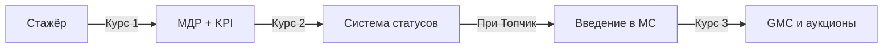

# 🎯 МОТИВАЦИОННАЯ АРХИТЕКТУРА MATRIXGIN

## ФИНАЛЬНЫЙ ВСЕОБЪЕМЛЮЩИЙ АНАЛИЗ

**Дата:** 2026-01-19  
**Версия:** 3.0 (объединённая)  
**Статус:** ГОТОВО К РЕАЛИЗАЦИИ

---

## 📊 EXECUTIVE SUMMARY

### Ответ на главный вопрос

| Вопрос | Ответ |
|--------|-------|
| Является ли система перегруженной по замыслу? | **НЕТ** |
| Возможен ли перегруз при внедрении? | **ДА, если нарушить принцип последовательного раскрытия** |
| Итоговый риск | 🟡 **УМЕРЕННЫЙ (35-45%)** при соблюдении архитектуры |

### Обоснование

Архитектура **«Трёх измерений»** является **ортогональной** — оси не дублируют, а дополняют друг друга, закрывая разные потребности:

| Ось | Потребность по Маслоу | Драйвер |
|-----|----------------------|---------|
| **Университет** | Безопасность | Деньги |
| **Статусы** | Уважение | Признание |
| **MC/GMC** | Самореализация | Азарт/Игра |

### Главный риск

> **«Слипание пельменей»** — когда игровые коины воспринимаются как часть зарплаты, или статус требует «фарминга» коинов.

**Решение:** Строгое разведение осей на всех уровнях (Backend, Frontend, MatrixGin AI).

---

## 🧭 МОДЕЛЬ ТРЁХ ОСЕЙ (3D-ПРОСТРАНСТВО)

```mermaid
graph TD
    subgraph "ОСЬ 1: РАЦИОНАЛЬНАЯ"
        direction TB
        R1["💰 УНИВЕРСИТЕТ"]
        R2["Драйвер: Безопасность + Доход"]
        R3["Механика: Знания = Деньги"]
        R4["Коэф: 0.8 → 1.0 → 1.6"]
        R5["Режим: ОБЯЗАТЕЛЬНЫЙ"]
    end
    
    subgraph "ОСЬ 2: СОЦИАЛЬНАЯ"
        direction TB
        S1["🏆 СТАТУСЫ"]
        S2["Драйвер: Уважение + Влияние"]
        S3["Механика: Репутация = Привилегии"]
        S4["Фотон → Universe"]
        S5["Режим: ПОЛУ-ПАССИВНЫЙ"]
    end
    
    subgraph "ОСЬ 3: ИГРОВАЯ"
        direction TB
        G1["🎮 MC / GMC"]
        G2["Драйвер: Азарт + Достижения"]
        G3["Механика: Героизм = Активы"]
        G4["Магазин, Аукционы, Сейф"]
        G5["Режим: ДОБРОВОЛЬНЫЙ"]
    end
```



### Характеристики осей

| Параметр | Ось 1: Университет | Ось 2: Статусы | Ось 3: MC/GMC |
|----------|-------------------|----------------|---------------|
| **Цель** | Компетентный профи | Признание и "важность" | Утилизация сверх-энергии |
| **Обязательность** | ✅ Да | ⚡ Следствие | ❌ Нет |
| **Охват** | 100% сотрудников | 100% сотрудников | ~30% (пассионарии) |
| **Темп изменений** | 3-12 месяцев | По достижениям | Ежедневно |
| **Влияет на** | Коэффициент ЗП | Привилегии | Внутренние активы |

---

## 🚶 USER JOURNEY: КАСКАДНОЕ ВКЛЮЧЕНИЕ ОСЕЙ

### Этап 1: «Выживание» (0–3 месяца)

```
┌─────────────────────────────────────────────────────────┐
│  ФОКУС: «Как мне заработать и не вылететь?»            │
├─────────────────────────────────────────────────────────┤
│  ✅ АКТИВНО:    Ось 1 (Университет) — сдать нормативы  │
│  👁️ ФОНОВО:     Ось 2 (Статус «Фотон» автоматом)       │
│  🔒 ЗАБЛОКИРОВАНО: Ось 3 (MC скрыты, не отвлекают)     │
├─────────────────────────────────────────────────────────┤
│  Когнитивная нагрузка: 5-7 концепций ✅ НОРМА          │
│  Риск перегруза: НИЗКИЙ                                │
└─────────────────────────────────────────────────────────┘
```

**Что знает сотрудник:**
- МДР (обязанности)
- KPI
- Коэффициент 0.8 → как выйти на 1.0
- Наставник

**Что НЕ знает (и не должен):**
- Правила аукционов
- Механика GMC
- Ранги

---

### Этап 2: «Стабилизация» (3–12 месяцев)

```
┌─────────────────────────────────────────────────────────┐
│  ФОКУС: «Я умею работать, хочу комфорта и плюшек»      │
├─────────────────────────────────────────────────────────┤
│  ✅ АКТИВНО:    Ось 1 (рост → Профессионал)            │
│  ✅ АКТИВНО:    Ось 2 (переход в «Топчик»)             │
│  🔓 ОТКРЫТО:    Ось 3 (MC базово, магазин)             │
├─────────────────────────────────────────────────────────┤
│  Когнитивная нагрузка: 12-15 концепций ⚠️ ПОВЫШЕННАЯ   │
│  Риск перегруза: СРЕДНИЙ → нужен MatrixGin AI          │
└─────────────────────────────────────────────────────────┘
```

**Что добавляется:**
- Статус «Топчик» и его привилегии
- MC: базовые правила
- Магазин (наушники, сертификаты)
- Понимание GMC как "будущего"

**Критический момент:**
> MatrixGin AI: «Ты набрал 50 MC, они сгорят через 7 дней. Предлагаю: а) купить кофе, б) кинуть в сейф»

---

### Этап 3: «Самореализация» (12+ месяцев)

```
┌─────────────────────────────────────────────────────────┐
│  ФОКУС: «Я профи, хочу влиять и большие призы»         │
├─────────────────────────────────────────────────────────┤
│  ✅ АКТИВНО:    Ось 1 (Мастер/Тренер)                  │
│  ✅ АКТИВНО:    Ось 2 («Кремень» / «Звезда»)           │
│  ✅ АКТИВНО:    Ось 3 (GMC, аукционы, инвестиции)      │
├─────────────────────────────────────────────────────────┤
│  Когнитивная нагрузка: 20-25 концепций ✅ ОСОЗНАННЫЙ   │
│  Риск перегруза: НИЗКИЙ (сотрудник «в игре»)           │
└─────────────────────────────────────────────────────────┘
```

**Полная картина:**
- Преподавание в Университете
- Стратегические сессии
- Охота за GMC
- Участие в аукционах

---

## ⚠️ РИСКИ «СЛИПАНИЯ ОСЕЙ» И АРХИТЕКТУРНЫЕ РЕШЕНИЯ

| Точка риска | Почему плохо | Решение |
|-------------|--------------|---------|
| **Зарплата в Коинах** | Нестабильность, страх | MC ≠ Зарплата. ЗП = только Ось 1 |
| **Покупка Квалификации** | Обесценивание знаний | MC нельзя потратить на экзамен |
| **Обязательный Героизм** | Героизм становится нормой | MC — это *сверх* ожиданий, не KPI |
| **Инфляция Статуса** | Статус за накопление монет | Статус (Ось 2) ≠ Ранг (Ось 3) |

---

## 🛡️ ТРИ ФИЛЬТРА ЗАЩИТЫ ОТ ПЕРЕГРУЗА

### Фильтр 1: Университет (Дозатор информации)



**Принцип:** Информация о сложных механиках выдаётся ТОЛЬКО в курсах, которые открываются ПОСЛЕ достижения уровней.

---

### Фильтр 2: MatrixGin AI (Навигатор)

**Принцип:** Сотруднику НЕ нужно помнить все правила — это задача AI.

| ❌ Плохо | ✅ Хорошо |
|----------|-----------|
| Сотрудник сам считает дни до сгорания MC | MatrixGin: «50 MC сгорят в пятницу. Купи кино или кинь в сейф» |
| Сотрудник ищет правила в регламентах | MatrixGin: «Для повышения квалификации осталось сдать тест X» |
| Сотрудник гадает о следующем статусе | MatrixGin: «До Кремня тебе нужно: наставничество 2 стажёров» |

---

### Фильтр 3: Режим тишины (Opt-in)

**Принцип:** По умолчанию уведомления Оси 3 выключены. Сотрудник сам «подписывается» на игру.

| Уровень | MC-уведомления | Аукционы | Ранги |
|---------|---------------|----------|-------|
| Фотон | 🔇 Скрыты | 🔒 Недоступны | 🔒 Недоступны |
| Топчик | 🔔 По желанию | 🔇 Минимум | 🔇 Скрыты |
| Кремень+ | 🔔 Активны | 🔔 По желанию | 🔔 По желанию |

---

## 🚫 КРАСНЫЕ ЛИНИИ (КАТЕГОРИЧЕСКИ НЕЛЬЗЯ)

### 1. Ось 3 не должна быть обязательной
❌ План по заработку MC  
❌ MC как часть KPI  
❌ Наказание за отсутствие MC  

### 2. Бюджеты должны быть изолированы
❌ ЗП-фонд = MC-фонд  
❌ Кризис продаж → обнуление GMC  
❌ Экономия на ЗП за счёт коинов  

### 3. GMC не автоматизировать
❌ Автоматическая выдача GMC за достижения  
✅ Только аукцион или решение Комитета  

### 4. Фарминг запрещён
❌ Лёгкие MC за рутинные действия  
✅ MC только за «выход за роль» (верификация)  

---

## 💻 РЕКОМЕНДАЦИИ ДЛЯ РАЗРАБОТКИ

### BACKEND: Архитектурные требования

#### 1. Гварды доступа по осям

```typescript
// Пример: AccessGuard для Оси 3 (MC)
@Injectable()
export class MCAxisAccessGuard implements CanActivate {
  canActivate(context: ExecutionContext): boolean {
    const user = context.getUser();
    // Доступ к MC только с статуса "Топчик"
    return user.status.level >= StatusLevel.TOPCHIK;
  }
}
```

**Требования:**
- [ ] `AxisAccessGuard` — проверка доступа к осям по статусу
- [ ] `MCVisibilityFilter` — фильтрация MC-данных для новичков
- [ ] `GMCAuctionGuard` — доступ к аукционам только для Кремень+

---

#### 2. API разделение по осям

```
/api/v1/
├── axis1/                    # Ось 1: Университет
│   ├── qualification/        # Квалификационные уровни
│   ├── courses/              # Курсы
│   └── exams/                # Экзамены
│
├── axis2/                    # Ось 2: Статусы
│   ├── status/               # Текущий статус
│   ├── privileges/           # Привилегии
│   └── criteria/             # Критерии перехода
│
└── axis3/                    # Ось 3: MC/GMC
    ├── mc/                   # Matrix Coin
    │   ├── balance/
    │   ├── transactions/
    │   └── store/
    ├── gmc/                  # Golden Matrix Coin
    │   ├── portfolio/
    │   └── auctions/
    └── vault/                # Сейф
```

---

#### 3. Фильтры видимости

```typescript
// Сервис фильтрации данных по уровню доступа
@Injectable()
export class AxisVisibilityService {
  getVisibleAxes(user: User): AxisVisibility {
    return {
      axis1: true,  // Всегда видна
      axis2: true,  // Всегда видна (но привилегии по статусу)
      axis3: {
        mc: user.status.level >= StatusLevel.TOPCHIK,
        gmc: user.status.level >= StatusLevel.KREMEN,
        auctions: user.status.level >= StatusLevel.KREMEN,
      }
    };
  }
}
```

---

#### 4. Анти-слипание Guards

```typescript
// Защита от покупки квалификации за MC
@Injectable()
export class AntiAxisMixingGuard {
  validateTransaction(tx: Transaction): boolean {
    // MC нельзя потратить на элементы Оси 1
    if (tx.currency === 'MC' && tx.target.axis === 1) {
      throw new ArchitecturalViolationError(
        'AXIS_MIXING_FORBIDDEN',
        'MC cannot be used for Axis 1 (Qualification) items'
      );
    }
    return true;
  }
}
```

---

### FRONTEND: UI/UX требования

#### 1. Визуальное разделение осей

```
┌─────────────────────────────────────────────────────────────┐
│                    ЛИЧНЫЙ КАБИНЕТ                          │
├─────────────────────────────────────────────────────────────┤
│                                                             │
│  ┌─────────────────────────────────────────────────────┐   │
│  │  📚 МОЯ КАРЬЕРА (Ось 1 + Ось 2)                     │   │
│  ├─────────────────────────────────────────────────────┤   │
│  │  💰 Квалификация: Специалист (1.0x)  [████████░░]   │   │
│  │  🏆 Статус: Топчик                    ⭐⭐⚪⚪⚪      │   │
│  │  📈 До следующего уровня: 2 курса + 3 месяца        │   │
│  └─────────────────────────────────────────────────────┘   │
│                                                             │
│  ┌─────────────────────────────────────────────────────┐   │
│  │  🎮 МОЙ КАПИТАЛ (Ось 3) — опционально               │   │
│  ├─────────────────────────────────────────────────────┤   │
│  │  🪙 MC: 125 (сгорают через 12 дней)                 │   │
│  │  💎 GMC: 3                                          │   │
│  │  [🛒 Магазин] [🏦 Сейф] [⚡ Аукцион]                │   │
│  └─────────────────────────────────────────────────────┘   │
│                                                             │
└─────────────────────────────────────────────────────────────┘
```

**Принципы:**
- ✅ Оси визуально разделены
- ✅ Ось 3 помечена как «опционально»
- ✅ Прогресс по каждой оси виден отдельно

---

#### 2. Режим тишины (Quiet Mode)

```typescript
// Настройки пользователя
interface UserPreferences {
  quietMode: {
    enabled: boolean;           // Полный режим тишины
    axis3Notifications: boolean; // Уведомления по MC
    auctionAlerts: boolean;     // Алерты по аукционам
    rankUpdates: boolean;       // Обновления рангов
  };
}
```

**UI-переключатель:**
```
┌─────────────────────────────────────────┐
│  ⚙️ Настройки уведомлений              │
├─────────────────────────────────────────┤
│  🔔 Карьера (Ось 1+2)     [✅ Вкл]     │
│  🎮 Капитал (Ось 3)       [⬜ Выкл]    │
│  ├─ MC напоминания        [⬜ Выкл]    │
│  ├─ Аукционы              [⬜ Выкл]    │
│  └─ Ранги                 [⬜ Выкл]    │
│                                         │
│  💡 Хочу просто работать  [🔘 Вкл]     │
└─────────────────────────────────────────┘
```

---

#### 3. Дашборды по ролям

**Стажёр (Фотон):**
```
┌─────────────────────────────────────┐
│  👋 Добро пожаловать!               │
│                                     │
│  📚 Ваш фокус: Обучение             │
│  ────────────────────               │
│  ✅ Пройти курс "Стандарты"         │
│  ⬜ Сдать тест по регламенту        │
│  ⬜ Выйти на KPI 70%                │
│                                     │
│  💰 Ваш коэффициент: 0.8x           │
│  🎯 Цель: выйти на 1.0x             │
│                                     │
│  [Ось 3 скрыта — откроется позже]   │
└─────────────────────────────────────┘
```

**Опытный (Топчик):**
```
┌─────────────────────────────────────┐
│  💪 Вы на уровне Топчик!            │
│                                     │
│  📊 КАРЬЕРА        │  🎮 КАПИТАЛ    │
│  ───────────       │  ──────────    │
│  Квалиф: Специалист│  MC: 75 🪙     │
│  KPI: 82%          │  GMC: 1 💎     │
│  До Кремня: 4 мес  │  [Магазин →]   │
│                                     │
│  🔔 MC сгорают через 5 дней!        │
└─────────────────────────────────────┘
```

---

#### 4. Визуализация 3D-пространства

```
           Ось 3: Капитал (MC/GMC)
                    ▲
                    │
                    │    ★ Вы здесь
                    │   /
                    │  /
                    │ /
                    │/
    ────────────────┼────────────────► Ось 2: Статусы
                   /│
                  / │
                 /  │
                /   │
               ▼
        Ось 1: Квалификация
```

**Интерактивный виджет:**
- Показывает позицию сотрудника в 3D-пространстве
- Можно вращать и масштабировать
- Клик на ось — детали прогресса

---

### MATRIXGIN AI: Требования к интентам и сценариям

#### 1. Навигационные интенты

```json
{
  "intents": {
    "motivation_explain": {
      "description": "Объяснение системы мотивации",
      "examples": [
        "Как работает система мотивации?",
        "Что такое MC?",
        "Чем статус отличается от квалификации?"
      ],
      "response_template": "axis_explainer"
    },
    "axis_progress": {
      "description": "Прогресс по конкретной оси",
      "examples": [
        "Как мне повысить квалификацию?",
        "Что нужно для статуса Кремень?",
        "Сколько у меня MC?"
      ],
      "response_template": "axis_progress_report"
    }
  }
}
```

---

#### 2. Проактивные подсказки

```typescript
// Триггеры для проактивных сообщений
const proactiveTriggers = {
  // MC скоро сгорят
  mcExpiringSoon: {
    condition: (user) => user.mc.expiringIn <= 7,
    message: (user) => 
      `🔔 У тебя ${user.mc.expiring} MC сгорят через ${user.mc.expiringIn} дней. ` +
      `Предлагаю: [Купить в магазине] или [Кинуть в сейф]`
  },
  
  // Новый уровень доступа
  newAxisAccess: {
    condition: (user) => user.status.justReached === 'TOPCHIK',
    message: () =>
      `🎉 Поздравляю с Топчик! Теперь тебе доступна система MC. ` +
      `Хочешь узнать, как это работает? [Да, расскажи]`
  },
  
  // Приближение к следующему статусу
  statusProgress: {
    condition: (user) => user.status.progressToNext >= 80,
    message: (user) =>
      `🚀 Ты близко к статусу ${user.status.nextLevel}! ` +
      `Осталось: ${user.status.remainingCriteria.join(', ')}`
  }
};
```

---

#### 3. Контекстные ответы по осям

```typescript
// Шаблоны ответов с учётом контекста оси
const axisResponses = {
  axis1: {
    template: 'career_focus',
    tone: 'professional',
    cta: 'Пройти курс',
    metrics: ['qualification', 'courses_completed', 'kpi']
  },
  axis2: {
    template: 'status_focus', 
    tone: 'encouraging',
    cta: 'Посмотреть критерии',
    metrics: ['status', 'privileges', 'progress']
  },
  axis3: {
    template: 'game_focus',
    tone: 'playful',
    cta: 'Открыть магазин',
    metrics: ['mc_balance', 'gmc_portfolio', 'rank']
  }
};
```

---

#### 4. Защита от перегруза

```typescript
// Лимит сообщений по Оси 3 для новичков
const messageFilters = {
  axis3: {
    minStatus: 'TOPCHIK',
    maxMessagesPerDay: 2,
    quietHours: { start: 22, end: 8 },
    respectQuietMode: true
  }
};

// Проверка перед отправкой
function shouldSendAxis3Message(user: User, message: Message): boolean {
  if (user.preferences.quietMode.enabled) return false;
  if (user.status.level < StatusLevel.TOPCHIK) return false;
  if (user.axis3MessagesToday >= 2) return false;
  return true;
}
```

---

## 📋 ROADMAP РЕАЛИЗАЦИИ

### Фаза 1: Базовая инфраструктура (Sprint 1-2)

| Компонент | Задача | Приоритет |
|-----------|--------|-----------|
| Backend | Создать `AxisAccessGuard` для всех осей | 🔴 Критический |
| Backend | Реализовать `AxisVisibilityService` | 🔴 Критический |
| Backend | Разделить API по осям `/axis1/`, `/axis2/`, `/axis3/` | 🟡 Высокий |
| Frontend | Создать компонент `AxisDashboard` | 🔴 Критический |
| Frontend | Реализовать переключатель Quiet Mode | 🟡 Высокий |

---

### Фаза 2: MatrixGin AI интеграция (Sprint 3-4)

| Компонент | Задача | Приоритет |
|-----------|--------|-----------|
| MatrixGin | Добавить интенты `motivation_explain`, `axis_progress` | 🔴 Критический |
| MatrixGin | Реализовать проактивные триггеры | 🟡 Высокий |
| MatrixGin | Настроить фильтры сообщений по осям | 🟡 Высокий |
| Backend | API для MatrixGin: `/api/v1/user/axis-state` | 🔴 Критический |

---

### Фаза 3: Визуализация и UX (Sprint 5-6)

| Компонент | Задача | Приоритет |
|-----------|--------|-----------|
| Frontend | 3D-виджет позиции в пространстве осей | 🟢 Средний |
| Frontend | Дашборды по ролям (Стажёр, Топчик, Кремень) | 🟡 Высокий |
| Frontend | Анимация перехода между статусами | 🟢 Средний |
| MatrixGin | Объяснение с использованием визуализации | 🟢 Средний |

---

## 🎯 МЕТРИКИ УСПЕХА

### Когнитивная нагрузка

| Индикатор | Целевое значение | Как измерять |
|-----------|-----------------|--------------|
| Понимание разницы осей | >80% сотрудников | Опрос после 3 месяцев |
| Жалобы на сложность | <10% | Обратная связь |
| Использование Quiet Mode | <20% | Аналитика |
| Обращения к MatrixGin по осям | >5 в месяц | Логи |

### Вовлечённость

| Индикатор | Целевое значение | Как измерять |
|-----------|-----------------|--------------|
| Активность в Оси 3 | 30-40% сотрудников | MC транзакции |
| Прохождение курсов | >2 в месяц | LMS статистика |
| Достижение Топчик | 70% за 6 месяцев | Статусы |

### Разделение осей

| Индикатор | Целевое значение | Как измерять |
|-----------|-----------------|--------------|
| Попытки "купить квалификацию" | 0 | Логи Guards |
| MC как % от дохода | 0% (разные бюджеты) | Финансы |
| Корреляция статус↔MC | <0.3 | Аналитика |

---

## 📚 ГЛОССАРИЙ

| Термин | Определение |
|--------|-------------|
| **Ось 1 (Рациональная)** | Университет + Квалификация. Влияет на ЗП |
| **Ось 2 (Социальная)** | Статусы. Влияет на привилегии |
| **Ось 3 (Игровая)** | MC/GMC. Влияет на внутренние активы |
| **Слипание осей** | Смешение мотиваторов в восприятии |
| **Режим тишины** | Opt-out от уведомлений Оси 3 |
| **Каскадное включение** | Постепенное открытие осей по мере роста |

---

## 🎓 ЗАКЛЮЧЕНИЕ

### Главный вывод

> **Система НЕ перегружена по замыслу.** Три ортогональные оси закрывают разные потребности человеческой психологии (Безопасность, Уважение, Самореализация).

### Условия успеха

1. ✅ **Визуальное разделение осей** в интерфейсе
2. ✅ **Каскадное открытие** через Университет
3. ✅ **MatrixGin AI как буфер** между сложностью и сотрудником
4. ✅ **Режим тишины** для тех, кто хочет "просто работать"
5. ✅ **Гварды на бэкенде** против смешения осей

### Метафора собственника

> *«Один котёл, но разные уровни приготовления: в воде, на пару, в духовке. Они не смешиваются, потому что разные условия, время и назначение.»*

**Это идеальное объяснение для сотрудников. Рекомендуется использовать в онбординге и обучающих материалах.**

---

**Документ подготовлен:** 2026-01-19  
**Статус:** ГОТОВО К РЕАЛИЗАЦИИ  
**Следующий шаг:** Включить в Sprint Planning
