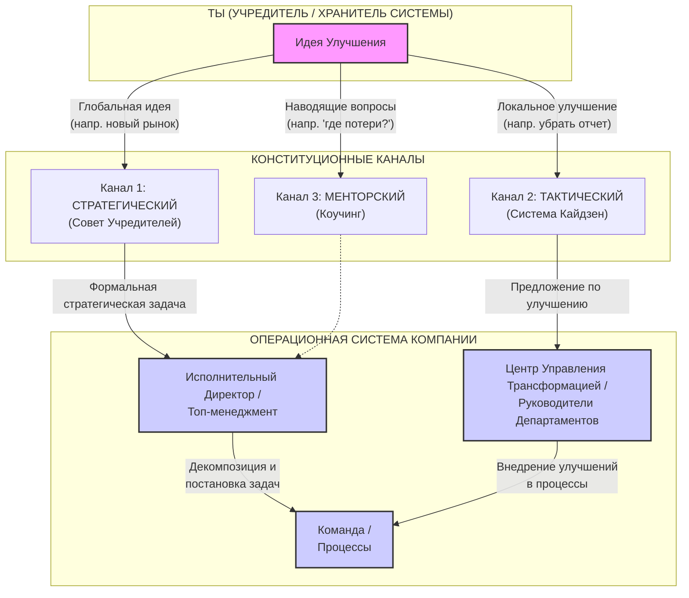

# 📋 Роль Учредителя и Идейного Вдохновителя в Системе Управления "Фотоматрица"

Этот документ визуализирует и формализует, как Учредитель (Хранитель Системы) взаимодействует с операционной структурой компании, не нарушая, а усиливая её.

## Ключевой Принцип: Архитектор, а не Прораб

Роль Учредителя — **стратегическое развитие системы**, а не операционное управление. Он — Хранитель Конституции и Золотого Стандарта, который обеспечивает, чтобы компания строилась по утвержденным чертежам. Прямое вмешательство в работу сотрудников в обход формальных руководителей создает хаос и является **потерей (муда)**.

## Конституционные Каналы Внедрения Идей

Все улучшения, инициированные Учредителем, должны проходить через три официальных канала:

### Описание Каналов:

1.  **Канал 1: Стратегический**
    *   **Что:** Глобальные идеи (новые продукты, рынки, стратегии).
    *   **Как:** Реализуются через **Совет Учредителей**, который ставит официальную задачу высшему руководству (Исполнительному Директору).

2.  **Канал 2: Тактический**
    *   **Что:** Локальные улучшения процессов (убрать лишний отчет, изменить процедуру).
    *   **Как:** Реализуются через общую для всех **систему Кайдзен**. Учредитель подает предложение по улучшению, как и любой другой сотрудник, тем самым подавая пример и уважая систему.

3.  **Канал 3: Менторский**
    *   **Что:** Развитие мышления и компетенций руководства.
    *   **Как:** Реализуются через **коучинг и наставничество**. Учредитель не дает прямых приказов, а задает руководству правильные вопросы ("Где мы видим потери в этом процессе?", "Как это соотносится с принципами ЗСФ?"), чтобы они сами находили решения.

Этот подход позволяет Учредителю эффективно влиять на развитие компании, не разрушая, а укрепляя управленческую структуру и корпоративную культуру. 