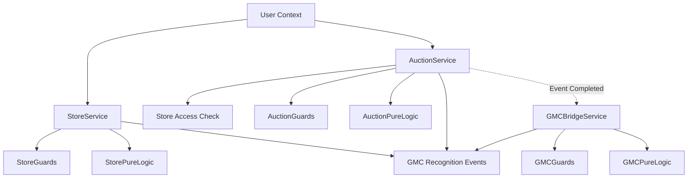

# STEP-3-CANONICAL-SNAPSHOT.md
## Module 08 — MatrixCoin-Economy — Step 3

**Статус документа:** FROZEN / IMPLEMENTED
**MPP-фаза:** Step 3 — Store, Auction & GMC Recognition
**Дата фиксации:** 2026-01-17
**Основание:** Codebase Implementation (Step 3.1, 3.2, 3.3)

---

## 0. Назначение документа

Данный документ фиксирует **техническую реализацию** и **инварианты** для:
1. **Store Access Logic** (Pure Domain Layer)
2. **Auction Event Logic** (Pure Domain Layer)
3. **GMC Recognition Bridge** (Audit-Only Mechanism)

Этот документ является **источником истины** для проверки кода и аудита.

---

## 1. STORE ACCESS LOGIC (Step 3.1)

### 1.1 Core Enums

| Enum | Значения | Описание |
|------|----------|----------|
| `StoreEligibilityStatus` | `ELIGIBLE`, `INELIGIBLE` | Бинарный статус доступа. |
| `StoreAccessDeniedReason` | `NO_ACTIVE_MC`, `ALL_MC_FROZEN`, `USER_RESTRICTED`, `SYSTEM_MAINTENANCE`, `INVALID_CONTEXT` | Причины отказа (Domain Errors). |

### 1.2 Access Invariants

| ID | Инвариант | Реализация |
|----|-----------|------------|
| SA-INV-001 | **No Persistence** | Логика не делает запросов в БД. Работает только со snapshot. |
| SA-INV-002 | **Maintenance Block** | Если `isSystemMaintenance=true`, доступ всегда `INELIGIBLE`. |
| SA-INV-003 | **Restricted Block** | Если `isUserRestricted=true`, доступ всегда `INELIGIBLE`. |
| SA-INV-004 | **Active MC Requirement** | Доступ разрешен ТОЛЬКО если есть хотя бы 1 `ACTIVE` MC. |
| SA-INV-005 | **Frozen MC Exclusion** | `FROZEN` MC не учитываются при расчете доступности. |
| SA-INV-006 | **Audit Emission** | Каждая проверка генерирует `STORE_ACCESS_EVALUATED` или `STORE_ACCESS_DENIED`. |

---

## 2. AUCTION EVENT LOGIC (Step 3.2)

### 2.1 Core Enums

| Enum | Значения | Описание |
|------|----------|----------|
| `AuctionEventStatus` | `SCHEDULED`, `ACTIVE`, `COMPLETED`, `CANCELLED` | Жизненный цикл события. |
| `AuctionParticipationOutcome` | `WON`, `LOST` | Результат участия (вероятностный). |
| `AuctionDeniedReason` | `AUCTION_CLOSED`, `AUCTION_NOT_STARTED`, `INSUFFICIENT_FUNDS`, `ACCESS_DENIED`, `INVALID_CONTEXT`, `ALREADY_PARTICIPATED` | Причины отказа участвовать. |

### 2.2 Event Invariants

| ID | Инвариант | Реализация |
|----|-----------|------------|
| AE-INV-001 | **Bounded Window** | Участие возможно только если `now >= startsAt` и `now < endsAt`. |
| AE-INV-002 | **Store Access Prerequisite** | Пользователь должен быть `StoreEligibilityStatus.ELIGIBLE`. |
| AE-INV-003 | **MC Consumption** | Участие потребляет (сжигает) 1 MC (минимальная стоимость участия). |
| AE-INV-004 | **Deterministic Outcome** | Результат (`WON`/`LOST`) зависит от injected `randomFactor`. Внутри функции нет `Math.random()`. |
| AE-INV-005 | **No Guaranteed Win** | Победа — это шанс, а не покупка. (Порог вероятности 90%). |
| AE-INV-006 | **Audit Mandatory** | Любое участие генерирует `AUCTION_PARTICIPATION` или `AUCTION_DENIED`. |

### 2.3 Pure Logic Flow

1. **Open:** `SCHEDULED` -> `ACTIVE` (Pure State Transition).
2. **Participate:**
   - Check Context (Status, Time).
   - Check Access (Store Eligibility).
   - Check Funds (Has Active MC).
   - Consume MC (Burn logic).
   - Determine Outcome (Input Randomness vs Threshold).
   - Return Result (Success/Fail + Outcome).
3. **Close:** `ACTIVE` -> `COMPLETED`.

---

## 3. GMC RECOGNITION BRIDGE (Step 3.3)

### 3.1 Core Enums

| Enum | Значения | Описание |
|------|----------|----------|
| `GMCRecognitionStatus` | `ELIGIBLE`, `NOT_ELIGIBLE`, `DENIED` | Статус сигнала (не решения!). |
| `GMCRecognitionTrigger` | `PROBABILISTIC_CHECK`, `MANUAL_SIGNAL` | Тип триггера. |
| `GMCRecognitionDeniedReason` | `AUCTION_NOT_CLOSED`, `NO_PARTICIPANTS`, `INVALID_CONTEXT`, `BELOW_THRESHOLD`, `MISSING_SNAPSHOT` | Причины отсутствия сигнала. |

### 3.2 Bridge Invariants (The "Air Gap")

| ID | Инвариант | Реализация |
|----|-----------|------------|
| GR-INV-001 | **Audit Only** | Bridge **НИКОГДА** не создает GMC. Он только эмитит Audit Event. |
| GR-INV-002 | **Post-Factum** | Работает только с `COMPLETED` аукционами. |
| GR-INV-003 | **No Guarantees** | Сигнал `ELIGIBLE` — это просто флаг для человека, а не обещание. |
| GR-INV-004 | **Injected Randomness** | Недетерминизм (вероятность) инжектится извне (`randomFactor`). |
| GR-INV-005 | **Evaluation Audit** | Каждая проверка фиксируется в `GMC_RECOGNITION_EVALUATED`. |
| GR-INV-006 | **Signal Visibility** | Успешный сигнал генерирует `GMC_RECOGNITION_FLAGGED`. |

### 3.3 Logic Flow

1. **Trigger:** Аукцион завершен.
2. **Evaluate:**
   - Проверка наличия участников/снапшота.
   - Сравнение `randomFactor` с порогом (98%).
3. **Result:**
   - Если >= 98%: `ELIGIBLE`.
   - Иначе: `NOT_ELIGIBLE`.
4. **Effect:**
   - Emit Audit Event.
   - **NO DB WRITE.**
   - **NO STATE CHANGE.**

---

## 4. ARCHITECTURAL SUMMARY

### 4.1 Dependency Graph

### 4.2 Prohibited Patterns (Verified In Code)

- ❌ **No Persistence:** Все сервисы принимают Context/Snapshot и возвращают Result/Event.
- ❌ **No Financials:** Нет цен, курсов, скидок.
- ❌ **No Side Effects:** Логика чистая, сайд-эффекты только через возврат Event объектов.
- ❌ **No Automation:** Все действия инициируются (или симулируются от имени) Human Actor или System Trigger по факту Human Action.

---

## 5. NEXT STEPS

Step 3 зафиксирован.
Переход к Step 4 (Integration/Persistence) разрешен.
Код Step 3 **не подлежит изменению** без пересмотра этого канонического документа.
