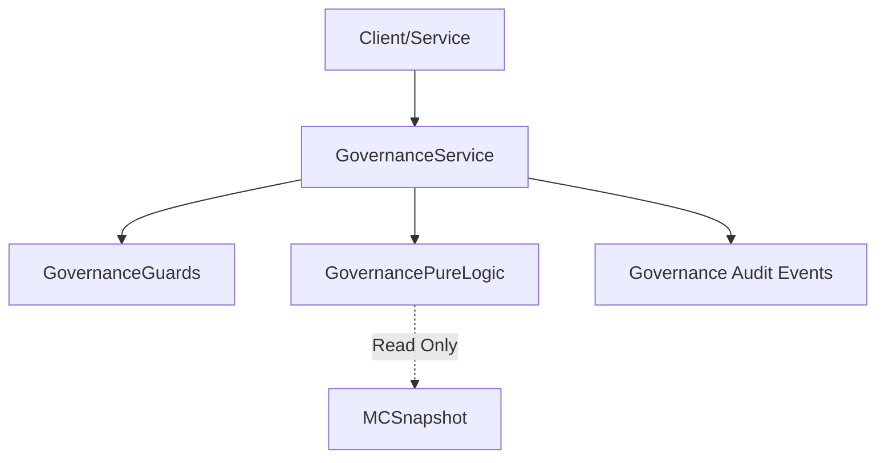

# STEP-4-CANONICAL-SNAPSHOT.md
## Module 08 — MatrixCoin-Economy — Step 4

**Статус документа:** FROZEN / IMPLEMENTED
**MPP-фаза:** Step 4 — Post-Economy Governance
**Дата фиксации:** 2026-01-17
**Основание:** Codebase Implementation (Step 4 Logic, Guards, Service)

---

## 0. Назначение документа

Данный документ фиксирует **техническую реализацию** и **инварианты** для:
1. **Post-Economy Governance Layer** (Pure Domain Layer)
2. **Governance Audit Mechanism** (Audit-Only)

Этот документ является **источником истины** для проверки кода и аудита Step 4.

---

## 1. GOVERNANCE ENUMS & TYPES

### 1.1 Core Enums

| Enum | Значения | Описание |
|------|----------|----------|
| `GovernanceStatus` | `ALLOWED`, `ALLOWED_WITH_REVIEW`, `DISALLOWED` | Результат проверки (Verdict). |
| `GovernanceRestriction` | `NONE`, `FLAG_FOR_AUDIT`, `BLOCK_OPERATION` | Накладываемое ограничение. |
| `GovernanceReviewLevel` | `NONE`, `ROUTINE`, `ELEVATED`, `CRITICAL` | Уровень требуемого вмешательства человека. |
| `GovernanceViolationReason` | `ANOMALOUS_VOLUME`, `SUSPICIOUS_FREQUENCY`, `RESTRICTED_DOMAIN`, `SYSTEM_INVARIANT_BREACH`, `DATA_INTEGRITY_ISSUE` | Причины нарушений. |

### 1.2 Core Context (Input)

Все решения принимаются **только** на основе `EconomyUsageContext`:
- `userId` (Actor)
- `domain` (Target Domain: STORE, AUCTION, etc.)
- `operation` (Action: SPEND, FREEZE, etc.)
- `mcSnapshot` (Read-Only State)
- `metadata` (Additional signals)

---

## 2. GOVERNANCE INVARIANTS

| ID | Инвариант | Реализация |
|----|-----------|------------|
| G-INV-001 | **No Mutability** | Governance Layer никогда не меняет балансы или состояние MC. |
| G-INV-002 | **Pure Evaluation** | Логика детерминирована. Один Context = Одна Decision. |
| G-INV-003 | **Audit Mandatory** | Любое обращение к Governance Layer генерирует Audit Event. |
| G-INV-004 | **Fail-Safe Blocking** | Если Guard падает или Context невалиден -> `DISALLOWED` + `BLOCK_OPERATION`. |
| G-INV-005 | **No Automation** | Layer только диагностирует и флагает. Решения об эскалации принимает человек (через аудит). |

---

## 3. PURE LOGIC RULES

### 3.1 Evaluation Flow

1. **Guards:**
   - Valid Context? (User, Domain present)
   - Known Domain? (Allowed list check)
   - Snapshot Integrity? (MC data exists)
   
2. **Rule Checks (In Order):**
   - **Volume Check:** `Total MC Amount > Threshold` -> `ALLOWED_WITH_REVIEW` (Elevated).
   - **Domain Check:** `Restricted Domain` -> `DISALLOWED` (Critical).
   - **Frequency Check:** `Metadata Count > Cap` -> `ALLOWED_WITH_REVIEW` (Routine).
   
3. **Default:**
   - `ALLOWED` / `NONE`.

### 3.2 Audit Emission

Layer генерирует события в зависимости от вердикта:

| Verdict | Event Type | Description |
|---------|------------|-------------|
| `ALLOWED` | `GOVERNANCE_EVALUATED` | Обычная запись факта проверки. |
| `ALLOWED_WITH_REVIEW` | `GOVERNANCE_FLAGGED` | Требуется внимание (Reason + ReviewLevel). |
| `DISALLOWED` | `GOVERNANCE_VIOLATION` | Блокировка операции (Reason + Restriction). |

---

## 4. ARCHITECTURAL SUMMARY

### 4.1 Dependency Graph

### 4.2 Prohibited Patterns (Verified In Code)

- ❌ **No Side Effects:** Сервис возвращает `GovernanceDecision`. Не вызывает другие сервисы.
- ❌ **No DB Writes:** Никакой персистенции внутри логики.
- ❌ **No Async:** Вся логика синхронна и in-memory.
- ❌ **No Scores:** Нет "Social Credit Score" или накопительной репутации.

---

## 5. NEXT STEPS

Step 4 зафиксирован.
Переход к Step 5 (Persistence & Integration) разрешен.
Код Step 4 **не подлежит изменению** без пересмотра этого канонического документа.
