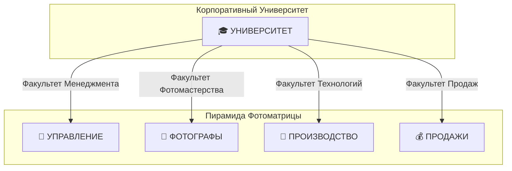
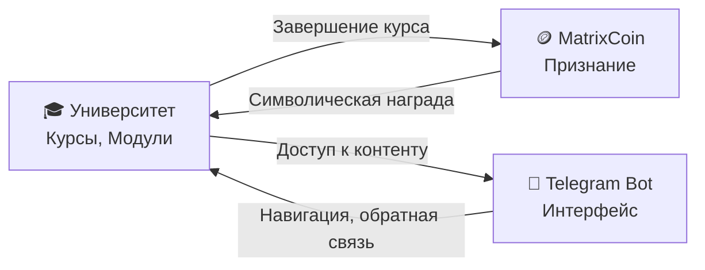
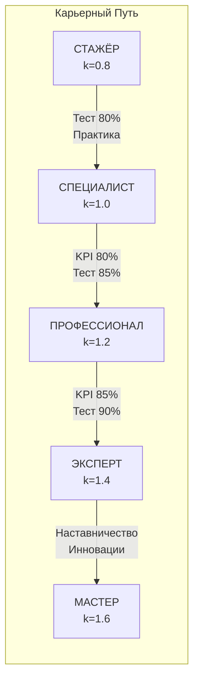
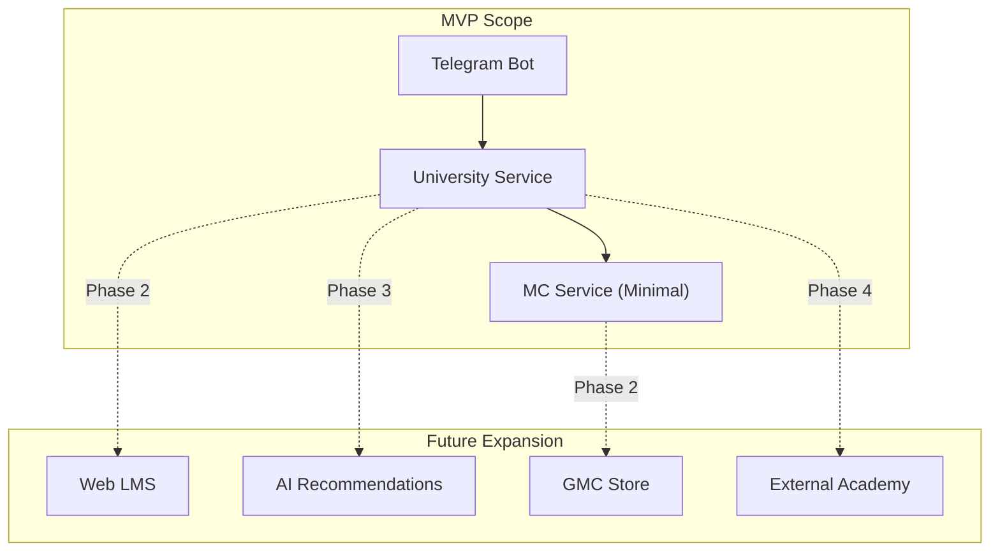
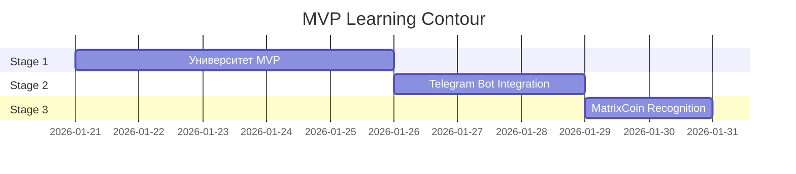

# 🏛️ Deep Research: Корпоративный Университет в Экосистеме MatrixGin

> [!CAUTION]
> ## ARCHITECTURAL NOTE
> В случае противоречий между философскими и техническими документами,
> **приоритет имеет [TECHNICAL_RESEARCH_UNIVERSITY.md](file:///f:/Matrix_Gin/documentation/01-modules/13-Corporate-University/TECHNICAL_RESEARCH_UNIVERSITY.md) (CANONICAL)**.
> 
> Данный документ описывает философский контекст и бизнес-обоснование.
> Техническая реализация определяется каноническим документом.

## Цель Анализа

Глубокое исследование системной роли Корпоративного Университета (Модуль 13) и его влияния на бизнес-результаты, поведение сотрудников, стабильность системы и масштабируемость компании.

---

## 1. Философский Фундамент

### 1.1 Центральный Принцип

> **«Знания = Реализация, Процветание»** — развивая знания и навыки, сотрудник не только увеличивает доход, но и раскрывает потенциал, достигая личного благополучия.

Этот принцип **прямо интегрирован** во все три стратегических документа:
- Внутренняя Конституция (§4)
- Корпоративный Университет (Миссия)
- Золотой Стандарт (§4.4)

### 1.2 Связка с Lean-философией

Университет является **инструментом устранения 7-го вида потерь** (Муда):

| Вид Потерь | Как Университет Устраняет |
|------------|---------------------------|
| **Неиспользованный потенциал сотрудников** | Системное развитие навыков, освобождение от рутины для творчества |

### 1.3 Место в Пирамиде Взаимозависимости



**Ключевой вывод:** Университет — **горизонтальный интегратор**, питающий все четыре вершины пирамиды компетенциями.

---

## 1.5 Трёхосевая Модель Мотивации (из Motivational Organism)

> **Источник:** [matrixgin_motivational_organism.md](file:///f:/Matrix_Gin/documentation/00-strategic/matrixgin_motivational_organism.md) — стратегический документ трансформации MatrixGin из "системы учёта" в "среду роста"

### Университет как Ось 1: Рациональная мотивация

```
┌─────────────────────────────────────────────────────────────┐
│                    ИЕРАРХИЯ МАСЛОУ                         │
│                                                             │
│                      ▲                                      │
│                     /│\                                     │
│                    / │ \     🎮 MC/GMC (Самореализация)    │
│                   /  │  \                                   │
│                  /   │   \   🏆 Статусы (Уважение)         │
│                 /    │    \                                 │
│                /     │     \ 👥 Команда (Принадлежность)   │
│               /      │      \                               │
│              /       │       \💰 УНИВЕРСИТЕТ (Снижает      │
│             /        │        \ неопределённость результата)│
│            └─────────┴─────────┘                            │
│                                                             │
│     Университет НЕ даёт безопасность напрямую.             │
│     Безопасность = следствие стабильной результативности.  │
└─────────────────────────────────────────────────────────────┘
```

### Три оси мотивационной экосистемы

| Ось | Модуль | Потребность | Связь с Доходом | MVP Приоритет |
|-----|--------|-------------|-----------------|---------------|
| **📚 Ось 1** | **Университет** | Снижение неопределённости результата | **Опосредованная** через результат и квалификацию | 🔴 Первый |
| 🏆 Ось 2 | Статусы | Уважение | Косвенная (привилегии, признание) | 🟡 Второй |
| 🎮 Ось 3 | MC/GMC | Самореализация | Символическая (признание достижений) | 🟢 Третий |

### Критический инсайт: "Среда роста, не контроль"

> **"Мотивация — это не инструмент давления, а следствие среды."**

| ❌ Плохо (Контроль) | ✅ Хорошо (Среда роста) |
|---------------------|------------------------|
| Система учёта | Среда роста |
| Обязательство | Возможность |
| Метрики О человеке | Метрики ДЛЯ человека |
| Давление | Поддержка |

### Как это влияет на MVP Университета

1. **Университет развивает, а не экзаменует** — тесты = маркеры прогресса, не барьеры
2. **Курс = гипотеза улучшения метрики PhotoCompany** (OKK, CK, Conversion)
3. **Прозрачность** — сотрудник видит весь путь и понимает "что делать дальше"
4. **Добровольность** — никаких дедлайнов, только возможности

> [!CAUTION]
> **КАНОНИЧЕСКАЯ ФОРМУЛА (из Technical Research v2.0):**
> ```
> Доход = f(Результат, Квалификация)
> ```
> **Курс расширяет доступный диапазон коэффициентов при подтверждённом результате.**
> 
> Курс НЕ повышает ЗП напрямую!
> 
> Правильная цепочка:
> ```
> Курс → Практика → Результат (OKK/CK) → Квалификация → Диапазон коэффициентов
> ```

> [!NOTE]
> **Тесты не блокируют доход**, а только ограничивают потолок квалификации.
> Реальный доход определяется результатами деятельности (PhotoCompany метрики).

---

## 2. Системная Роль Университета

### 2.1 Источник Ценности (Value Source)

В контексте MVP Learning Contour Университет выступает **первичным источником ценности**:



### 2.2 Влияние на Другие Модули

| Модуль | Зависимость от Университета | Тип Связи |
|--------|----------------------------|-----------|
| **MatrixCoin (08)** | Курсы — основание для начисления MC | Producer → Consumer |
| **Статусы/Ранги (09)** | Квалификация влияет на статус | Data Feed |
| **Telegram Bot (07)** | Отображает курсы, прогресс | Read-Only Consumer |
| **Матрицы Должностей** | Курсы соответствуют МДР | Reference Alignment |

### 2.3 Модель Данных Университета

Из [prisma/schema.prisma](file:///f:/Matrix_Gin/backend/prisma/schema.prisma):

```
Academy ──< Course ──< CourseModule ──< Material
                   └── Enrollment ──< ModuleProgress
                   └── Certification
```

> [!IMPORTANT]
> В MVP **не используются**: `Trainer`, `TrainerAssignment`, `LearningPath`, `AIFeedbackData`

---

## 3. Влияние на Бизнес-Результаты

### 3.1 Прямые Эффекты (из документации)

| Метрика | Ожидаемый Эффект | Источник |
|---------|------------------|----------|
| Время адаптации новичков | ↓ в 2-3 раза | Корпоративный Университет §7 |
| Производительность/средний чек | ↑ 20-30% | Корпоративный Университет §7 |
| Текучесть кадров | ↓ в 2 раза | Корпоративный Университет §7 |
| ROI платформы | Окупаемость за 6-8 месяцев | Корпоративный Университет §7 |

### 3.2 Косвенные Эффекты

1. **Стандартизация качества** — все сотрудники обучаются по единым стандартам ЗСФ
2. **Кадровый резерв** — система градации создает пул готовых к продвижению специалистов
3. **Культурная интеграция** — Факультет Корпоративной Культуры транслирует ценности

---

## 4. Влияние на Поведение Сотрудников

### 4.1 Система Градации Квалификации



### 4.2 Якоря для сотрудников (из Motivational Organism)

> Бот и Frontend должны помогать **ПОНЯТЬ** систему, не пугать ей.

| Якорь | Описание | Приоритет MVP |
|-------|----------|---------------|
| 📚 **Моё обучение** | Прогресс курсов, рекомендации | 🔴 Критический |
| 📊 **Мой результат** | OKK, CK, Conversion — связь с курсами | 🔴 Критический |
| 🏆 **Мой статус и путь** | Где я, что дальше | 🟡 Высокий |
| 🎯 **Микро-вызовы** | +MC за маленькие задачи | 🟢 Средний |

### 4.3 Интеграция с Системой Статусов (Конституция §4)

| Статус Конституции | Университетская Градация | MC Мультипликатор |
|--------------------|--------------------------|-------------------|
| Фотон | Стажёр → Специалист | Базовый |
| Топчик | Специалист → Профессионал | Стандарт |
| Кремень | Профессионал → Эксперт | Фиксация курса |
| Звезда | Эксперт → Мастер | ×1.3 |
| Universe | Мастер/Тренер | ×1.5+ |

### 4.3 Поведенческие Паттерны

> [!TIP]
> **MVP Принцип:** MC в MVP — **символ признания**, не валюта обмена

- **Регулярность обучения** — MC сгорают через 60 дней → мотивация постоянной активности
- **Качество над количеством** — GMC только за реальные достижения (повышение квалификации)
- **Наставничество** — прямая связь с карьерным ростом (условие перехода на Эксперт)

> [!IMPORTANT]
> **Тесты и квалификация (из Technical Research v2.0):**
> 
> Тесты (80%, 85%, 90%) = **маркеры готовности**, НЕ gate к деньгам.
> 
> Реальная квалификация подтверждается:
> - Результатами работы (OKK, CK, Conversion)
> - Стабильностью показателей
> - Подтверждением через Approval Workflow
> 
> **Тест открывает потолок, результат определяет доход.**

---

## 5. Стабильность Системы

### 5.1 "Безопасность" Модуля

| Критерий | Оценка | Обоснование |
|----------|--------|-------------|
| Зависимость от AI Core | 🟢 Низкая | MVP не использует AI-аналитику |
| Зависимость от сложных модулей | 🟢 Низкая | Не требует GMC Store, Аукционов |
| Влияние на критические процессы | 🟢 Низкая | Read-only для сотрудников |
| Частичная реализация | 🟢 Есть | [UniversityService](file:///f:/Matrix_Gin/backend/src/services/university.service.ts#9-301) уже существует |

### 5.2 Границы MVP

> [!CAUTION]
> **Исключено из MVP:**
> - KPI-трекинг и аналитика производительности
> - AI Core интеграция (рекомендации, персонализация)
> - Веб-интерфейс для сотрудников (только Telegram)
> - Финансовая привязка MC (только символика)

---

## 6. Масштабируемость

### 6.1 Текущая Архитектура



### 6.2 Точки Расширения

1. **Внешняя Академия** — документ предусматривает коммерческий учебный центр (§8)
2. **AI Персонализация** — инфраструктура готова, но отключена в MVP
3. **Геймификация** — MC/GMC система уже заложена

---

## 7. Рекомендации по Приоритизации

### 7.1 Почему Университет — Первый

| Фактор | Обоснование |
|--------|-------------|
| **Источник ценности** | Генерирует контент, который потребляют другие модули |
| **Низкий риск** | Минимальные зависимости, частичная реализация |
| **Быстрая валидация** | Можно проверить с простыми курсами через Telegram |
| **Философское соответствие** | Прямо реализует принцип «Знания = Процветание» |

### 7.2 Предложенная Последовательность



---

## 8. Заключение

Корпоративный Университет является **фундаментальным элементом** экосистемы MatrixGin:

1. **Философски** — прямая реализация принципа «Знания = Процветание»
2. **Мотивационно** — снижает неопределённость результата → стабильная результативность → безопасность
3. **Архитектурно** — Курс = гипотеза улучшения метрики PhotoCompany
4. **Операционно** — безопасный для старта, с минимальными зависимостями
5. **Стратегически** — закладывает основу для масштабирования (внешняя академия)

### Главный принцип (из Motivational Organism)

> **"Университет развивает, а не экзаменует. Статусы признают, а не ранжируют. MC вознаграждает, а не измеряет."**

```
MATRIXGIN = ТЕПЛИЦА, НЕ ФАБРИКА
├─ 💡 Свет = Прозрачность (сотрудник видит свой путь)
├─ 🔥 Тепло = Поддержка (бот как коуч, не надзиратель)
├─ 💧 Вода = Обучение (Университет)
└─ 🌱 Почва = Культура (признание, не контроль)
```

> **Приоритет 1:** Реализовать MVP Университета как фундамент «среды роста».

---

## Источники

| Документ | Путь |
|----------|------|
| Внутренняя Конституция v3 | [documentation/00-strategic/Внутренняя_Конституция_Фотоматрица_v3.md](file:///f:/Matrix_Gin/documentation/00-strategic/%D0%92%D0%BD%D1%83%D1%82%D1%80%D0%B5%D0%BD%D0%BD%D1%8F%D1%8F_%D0%9A%D0%BE%D0%BD%D1%81%D1%82%D0%B8%D1%82%D1%83%D1%86%D0%B8%D1%8F_%D0%A4%D0%BE%D1%82%D0%BE%D0%BC%D0%B0%D1%82%D1%80%D0%B8%D1%86%D0%B0_v3.md) |
| Корпоративный Университет | [documentation/00-strategic/Корпоративный_Университет_Фотоматрица.md](file:///f:/Matrix_Gin/documentation/00-strategic/%D0%9A%D0%BE%D1%80%D0%BF%D0%BE%D1%80%D0%B0%D1%82%D0%B8%D0%B2%D0%BD%D1%8B%D0%B9_%D0%A3%D0%BD%D0%B8%D0%B2%D0%B5%D1%80%D1%81%D0%B8%D1%82%D0%B5%D1%82_%D0%A4%D0%BE%D1%82%D0%BE%D0%BC%D0%B0%D1%82%D1%80%D0%B8%D1%86%D0%B0.md) |
| Золотой Стандарт v3 | [documentation/00-strategic/🏆_Золотой_Стандарт_Фотоматрицы_v3.md](file:///f:/Matrix_Gin/documentation/00-strategic/%F0%9F%8F%86_%D0%97%D0%BE%D0%BB%D0%BE%D1%82%D0%BE%D0%B9_%D0%A1%D1%82%D0%B0%D0%BD%D0%B4%D0%B0%D1%80%D1%82_%D0%A4%D0%BE%D1%82%D0%BE%D0%BC%D0%B0%D1%82%D1%80%D0%B8%D1%86%D1%8B_v3.md) |
| MVP Scope | [documentation/06-MVP-LEARNING-CONTOUR/01-MVP_SCOPE_v1.md](file:///f:/Matrix_Gin/documentation/06-MVP-LEARNING-CONTOUR/01-MVP_SCOPE_v1.md) |
| Corporate University MVP | [documentation/06-MVP-LEARNING-CONTOUR/07-CORPORATE-UNIVERSITY-MVP.md](file:///f:/Matrix_Gin/documentation/06-MVP-LEARNING-CONTOUR/07-CORPORATE-UNIVERSITY-MVP.md) |
| **Motivational Organism** | `brain/.../matrixgin_motivational_organism.md` |
