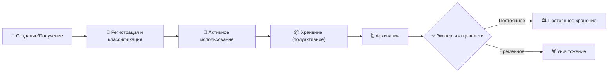
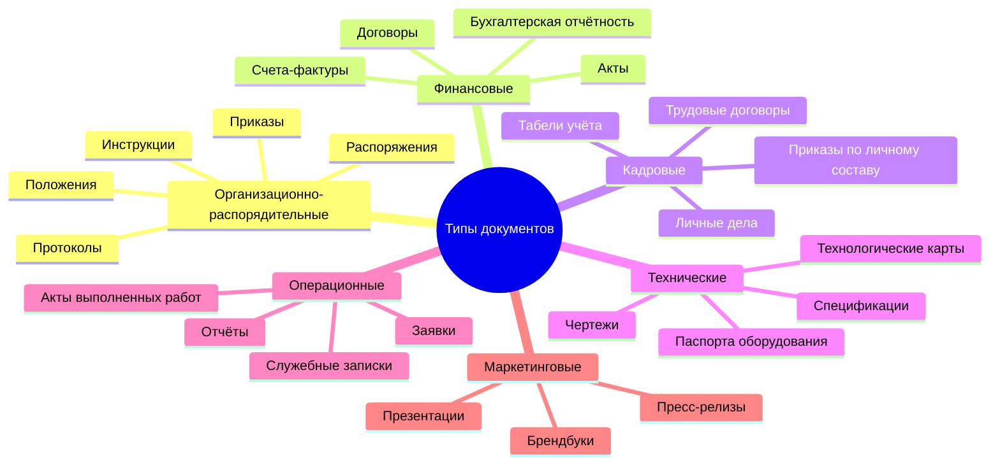
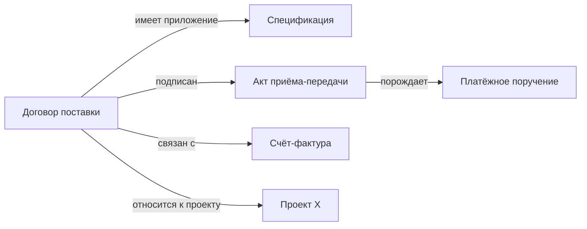
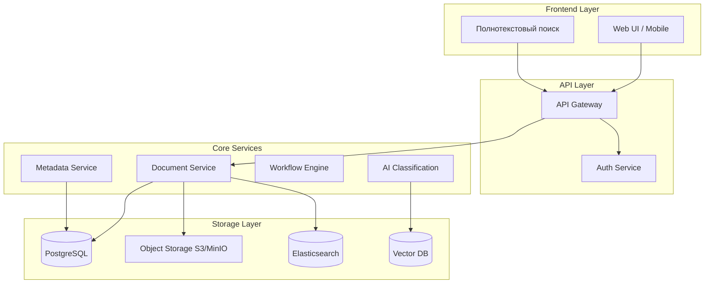
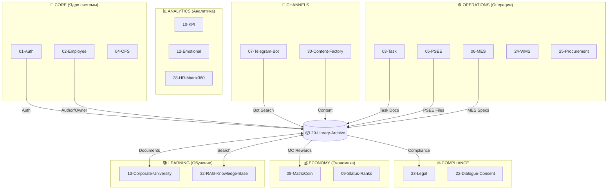
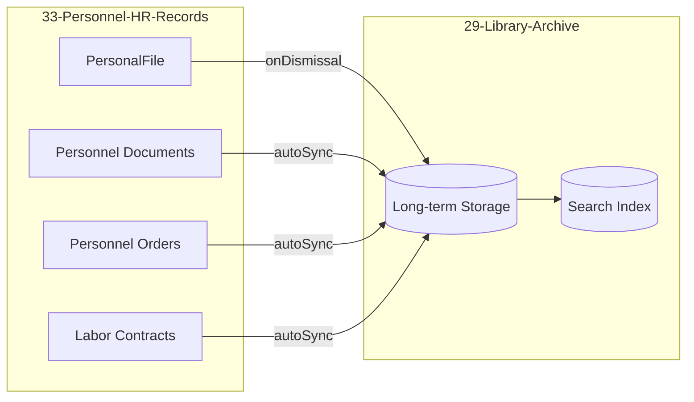
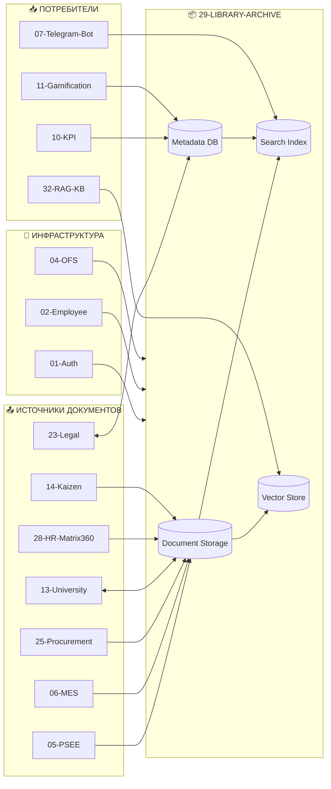

# 📚 Исследование: Организация корпоративных библиотек и архивов

> **Версия:** 1.0  
> **Дата:** 2026-01-22  
> **Статус:** Завершено  
> **Контекст:** Модуль 29 — Library-Archive (MatrixGin)

---

## 1. Введение и базовые концепции

### 1.1. Ключевые термины

| Термин | Определение |
|--------|-------------|
| **Корпоративная (электронная) библиотека** | Централизованное хранилище документов компании с возможностью поиска, каталогизации и контролируемого доступа. В отличие от архива, ориентирована на активное использование актуальных материалов. |
| **Корпоративный архив** | Система долгосрочного хранения документов, завершивших активный жизненный цикл, но требующих сохранения по регуляторным, юридическим или историческим причинам. |
| **СЭД (Система электронного документооборота)** | Программное решение для автоматизации процессов создания, обработки, маршрутизации и согласования документов внутри организации. Акцент на workflow и деловые процессы. |
| **Документ** | Зафиксированная информация (текст, изображение, запись), которая может быть использована как доказательство или свидетельство деловой деятельности. |
| **Электронный документ** | Документ, созданный, обработанный и хранимый в цифровой форме, включающий контент, структуру и метаданные. |
| **Физический документ** | Материальный носитель информации (бумага, микрофильм, фото), требующий специальных условий хранения. |
| **Метаданные** | Структурированные данные, описывающие контекст, содержание, структуру и управление документом (автор, дата, тип, срок хранения, гриф доступа). |

### 1.2. Цели и задачи организации корпоративных фондов

1. **Регуляторное соответствие (Compliance):**
   - Соблюдение требований законодательства (ФЗ-152 о персональных данных, отраслевые требования)
   - Обеспечение юридической силы документов (электронная подпись, хронологическая целостность)
   - Сроки хранения согласно нормативным актам

2. **Сохранение корпоративных знаний (Knowledge Retention):**
   - Предотвращение потери критической информации при увольнении сотрудников
   - Создание базы знаний для обучения и онбординга
   - Историческая память организации

3. **Повышение операционной эффективности:**
   - Сокращение времени на поиск документов (по статистике, сотрудники тратят до 20% рабочего времени на поиск информации)
   - Устранение дублирования и версионных конфликтов
   - Ускорение процессов согласования

4. **Минимизация рисков:**
   - Защита от утечки конфиденциальной информации
   - Аудиторские следы (кто, когда, что изменил)
   - Резервное копирование и восстановление

---

## 2. Методологии и этапы организации документальных фондов

### 2.1. Жизненный цикл документа (Records Lifecycle)



**Этапы:**

| Этап | Описание | Ответственные |
|------|----------|---------------|
| **Создание/Получение** | Документ создаётся внутри организации или поступает извне. Присваивается уникальный идентификатор. | Автор, секретарь, СЭД |
| **Регистрация** | Внесение в систему учёта, присвоение метаданных, классификация по типу и категории. | Делопроизводитель, СЭД |
| **Активное использование** | Документ участвует в бизнес-процессах: согласование, редактирование, подписание. | Сотрудники, workflow |
| **Полуактивное хранение** | Документ завершил основной процесс, но может потребоваться для справок. | Ответственный за хранение |
| **Архивация** | Передача на долгосрочное хранение с соблюдением сроков и условий. | Архивист |
| **Экспертиза ценности** | Решение о дальнейшей судьбе: постоянное хранение или уничтожение. | Экспертная комиссия |
| **Уничтожение** | Безопасное удаление с актом уничтожения. | Комиссия, ИБ |

### 2.2. Ключевые стандарты

#### Международные стандарты

| Стандарт | Область применения |
|----------|-------------------|
| **ISO 15489-1:2016** | Базовый стандарт управления документами. Определяет понятия, принципы, требования к метаданным и системам. |
| **ISO 23081-1/2** | Метаданные для управления документами. Детализирует модель метаданных, принципы их применения. |
| **ISO 16175** | Принципы и функциональные требования к ПО для управления документами. |
| **ISO 14641** | Электронная архивация — требования к долгосрочному хранению электронных документов. |
| **ISO 27001** | Информационная безопасность — обеспечение конфиденциальности, целостности, доступности. |

#### Российские стандарты (ГОСТ Р)

| Стандарт | Описание |
|----------|----------|
| **ГОСТ Р ИСО 15489-1-2019** | Национальный стандарт, идентичный ISO 15489-1:2016. Вступил в силу 01.01.2020. |
| **ГОСТ Р 7.0.8-2013** | Делопроизводство и архивное дело. Термины и определения. |
| **ГОСТ Р 7.0.97-2016** | Требования к оформлению организационно-распорядительной документации. |
| **Правила организации хранения (Минкультуры)** | Приказ №526 от 31.03.2015. Регламентирует сроки хранения, экспертизу ценности, комплектование архивов. |
| **ФЗ-125 «Об архивном деле»** | Базовый закон, определяющий правовые основы архивного дела в РФ. |

---

## 3. Типизация документов

### 3.1. Классификация по типу носителя

| Категория | Примеры | Особенности хранения |
|-----------|---------|---------------------|
| **Электронные** | PDF, DOCX, emails, записи в БД, сканы | Требуют форматов долгосрочного хранения (PDF/A), резервирования, миграции |
| **Физические** | Бумажные подлинники, чертежи, микрофильмы | Климат-контроль, защита от пожаров, ограниченный доступ |
| **Гибридные** | Бумажный оригинал + электронная копия | Синхронизация, определение "мастер-копии" |

### 3.2. Классификация по юридическому статусу

| Статус | Описание | Пример |
|--------|----------|--------|
| **Оригинал** | Первоначальный экземпляр с юридической силой | Подписанный договор |
| **Копия** | Воспроизведение оригинала | Скан для ознакомления |
| **Заверенная копия** | Копия с подтверждением соответствия оригиналу | Нотариальная копия |
| **Входящий** | Документ, поступивший извне | Письмо от контрагента |
| **Исходящий** | Документ, направленный вовне | Ответ клиенту |
| **Внутренний** | Документ для внутреннего использования | Служебная записка |
| **Черновик/Проект** | Предварительная версия | Draft договора |
| **Финальная версия** | Утверждённый документ | Подписанный приказ |

### 3.3. Классификация по функциональному назначению



### 3.4. Классификация по степени доступа

| Уровень | Описание | Пример | Срок хранения |
|---------|----------|--------|---------------|
| **Открытый (Public)** | Общедоступная информация | Публичные отчёты, новости | Стандартный |
| **Для служебного пользования (Internal)** | Только для сотрудников | Внутренние регламенты | Стандартный |
| **Конфиденциально** | Ограниченный круг лиц | Финансовые показатели | Повышенный |
| **Коммерческая тайна** | Строго ограниченный доступ | Ноу-хау, стратегии | Максимальный |
| **Персональные данные** | Согласно ФЗ-152 | Личные дела сотрудников | По законодательству |

### 3.5. Влияние типизации на управление

> **Ключевой принцип:** Тип документа определяет его "судьбу" — сроки хранения, уровень доступа, процедуры согласования и требования к архивации.

**Примеры:**
- **Приказы по основной деятельности** → Постоянное хранение
- **Договоры** → 5 лет после окончания срока действия
- **Бухгалтерские документы** → 5 лет (НК РФ), первичка — 6 лет
- **Кадровые документы** → 50-75 лет

---

## 4. Каталогизация и метаданные

### 4.1. Номенклатура дел

**Номенклатура дел** — систематизированный перечень наименований дел, заводимых в организации, с указанием сроков их хранения.

**Принципы построения:**
1. **Иерархичность:** Подразделение → Вид деятельности → Тип документа → Дело
2. **Уникальность индексов:** Каждое дело имеет уникальный код (например, `01-05-2026` — Канцелярия, Приказы, 2026 год)
3. **Стабильность:** Структура не меняется в течение года
4. **Полнота охвата:** Все документы организации должны быть учтены

**Пример структуры:**

```
01 - Канцелярия
  01-01 - Организационные документы (Постоянно)
  01-02 - Протоколы совещаний (5 лет)
  01-03 - Переписка с гос. органами (5 лет)
02 - Бухгалтерия
  02-01 - Годовые отчёты (Постоянно)
  02-02 - Первичная документация (6 лет)
03 - HR
  03-01 - Личные дела (75 лет)
  03-02 - Приказы по личному составу (75 лет)
```

### 4.2. Модель метаданных документа

#### Обязательные поля (Core Metadata)

| Поле | Тип | Описание |
|------|-----|----------|
| `document_id` | UUID | Уникальный идентификатор |
| `title` | String | Заголовок документа |
| `document_type` | Enum | Тип документа (из справочника) |
| `created_at` | DateTime | Дата создания |
| `author_id` | FK → Employee | Автор/создатель |
| `status` | Enum | Статус (draft, active, archived, destroyed) |
| `confidentiality_level` | Enum | Уровень конфиденциальности |
| `retention_period` | Integer/Date | Срок хранения |
| `department_id` | FK → Department | Подразделение-владелец |

#### Рекомендуемые поля (Extended Metadata)

| Поле | Тип | Описание |
|------|-----|----------|
| `keywords` | Array[String] | Ключевые слова для поиска |
| `tags` | Array[Tag] | Теги (свободная таксономия) |
| `related_documents` | Array[UUID] | Связанные документы |
| `version` | Integer | Номер версии |
| `approver_id` | FK → Employee | Утвердивший |
| `approved_at` | DateTime | Дата утверждения |
| `source` | Enum | Источник (internal, external) |
| `language` | String | Язык документа |
| `file_format` | String | Формат файла (PDF, DOCX) |
| `file_size` | Integer | Размер в байтах |
| `checksum` | String | Контрольная сумма (SHA-256) |

#### Метаданные жизненного цикла

| Поле | Описание |
|------|----------|
| `registration_number` | Регистрационный номер |
| `registration_date` | Дата регистрации |
| `archive_date` | Дата передачи в архив |
| `destruction_date` | Дата уничтожения |
| `destruction_act_id` | Ссылка на акт уничтожения |
| `access_log` | История доступа |

### 4.3. Современные подходы к классификации

#### Теги (Folksonomies)

**Преимущества:**
- Гибкость и адаптивность
- Не требует строгой иерархии
- Пользователи сами создают теги

**Недостатки:**
- Дублирование и несогласованность (Tag: "договор", "Договор", "контракт")
- Требует нормализации и модерации

**Рекомендация:** Использовать контролируемые словари тегов с возможностью предложения новых.

#### Онтологии (для сложных взаимосвязей)



**Применение:** Knowledge Graphs, Semantic Search, AI-рекомендации связанных документов.

#### AI/ML автоматическая классификация

**Технологии:**
- **NLP (Natural Language Processing):** Анализ текста для определения темы, тональности, ключевых сущностей
- **OCR + ICR:** Распознавание текста с изображений, включая рукописный
- **LLM (Large Language Models):** Семантическое понимание контекста, автоматическое создание резюме
- **Vector Embeddings:** Поиск похожих документов по смысловой близости

**Возможности AI-классификации:**
1. Автоматическое определение типа документа (договор, счёт, акт)
2. Извлечение сущностей (контрагент, сумма, даты)
3. Присвоение тегов на основе содержания
4. Предложение категории в номенклатуре дел
5. Выявление дубликатов и связей

**Точность:** Современные системы достигают 95%+ точности на типовых документах.

---

## 5. Технологические решения и системы

### 5.1. Классы систем

| Класс | Назначение | Фокус | Примеры |
|-------|------------|-------|---------|
| **СЭД** | Автоматизация документооборота | Workflow, согласования, маршруты | 1С:ДО, Directum, ELMA |
| **ECM** (Enterprise Content Management) | Управление всем контентом | Интеграция контента из разных источников | OpenText, SharePoint, Alfresco |
| **DMS** (Document Management System) | Хранение и управление файлами | Версионирование, доступ, поиск | M-Files, DocuWare, eFileCabinet |
| **RMS** (Records Management System) | Строгий контроль записей | Соответствие compliance, retention | IBM FileNet, Documentum |
| **DAM** (Digital Asset Management) | Управление медиа-активами | Изображения, видео, бренд-материалы | Bynder, Canto |
| **Цифровые архивы** | Долгосрочное хранение | Миграция форматов, целостность | Preservica, Archivematica |

### 5.2. Архитектурные паттерны



### 5.3. Интеграции

| Система | Тип интеграции | Ценность |
|---------|---------------|----------|
| **CRM** | Привязка документов к клиентам | Полная история взаимодействия |
| **ERP** | Синхронизация договоров, накладных | Единый источник финансовых документов |
| **Email** | Автоматическое сохранение вложений | Capture всей корреспонденции |
| **1С** | Импорт/экспорт первичной документации | Бухгалтерский учёт |
| **HR-системы** | Кадровые документы | Электронные личные дела |
| **Мессенджеры** (Telegram, Teams) | Доступ к документам | Мобильность |

---

## 6. Процессы и роли

### 6.1. Organizational Roles

| Роль | Зона ответственности |
|------|---------------------|
| **Ответственный за документы (Document Owner)** | Владелец документа в подразделении, отвечает за актуальность и полноту |
| **Делопроизводитель (Records Clerk)** | Регистрация, классификация, маршрутизация входящих/исходящих |
| **Архивист (Archivist)** | Приём документов в архив, экспертиза ценности, уничтожение |
| **Администратор СЭД (System Admin)** | Настройка системы, справочники, права доступа, интеграции |
| **Специалист по ИБ (Security Officer)** | Контроль доступа, аудит, расследование инцидентов |
| **Эксперт по compliance** | Мониторинг соответствия регуляторным требованиям |

### 6.2. Ключевые процессы

| Процесс | Описание | Автоматизация |
|---------|----------|---------------|
| **Регистрация** | Присвоение номера, внесение в систему | СЭД, автозаполнение метаданных |
| **Индексация** | Полнотекстовое индексирование для поиска | OCR + Elasticsearch |
| **Маршрутизация (Routing)** | Автоматическое определение пути согласования | BPMN-движок |
| **Контроль версий** | Сохранение истории изменений | Git-подобная модель |
| **Поиск и извлечение** | Быстрый доступ к нужному документу | Семантический поиск, фильтры |
| **Архивация** | Перенос в долгосрочное хранилище | Scheduled jobs |
| **Экспертиза ценности** | Оценка нужности документа | Комиссия + рекомендации AI |
| **Уничтожение** | Безвозвратное удаление с актом | Процедура с подтверждением |

---

## 7. Лучшие практики и основные проблемы

### 7.1. Best Practices (7 ключевых)

| # | Практика | Описание |
|---|----------|----------|
| 1 | **Единая точка входа (Single Search)** | Один поисковый интерфейс для всех документов, независимо от источника |
| 2 | **Принцип однократной регистрации** | Документ регистрируется один раз, все остальные ссылаются на него |
| 3 | **Регламентация процессов** | Чёткие SLA на согласование, архивацию, уничтожение |
| 4 | **Регулярный аудит** | Периодическая проверка соответствия метаданных, сроков, доступа |
| 5 | **Контролируемые словари** | Справочники типов, тегов, категорий вместо свободного ввода |
| 6 | **Автоматизация рутины** | AI-классификация, OCR, автозаполнение метаданных |
| 7 | **Governance и владельцы** | Назначение ответственных за каждый класс документов |

### 7.2. Типичные проблемы и риски

| Проблема | Симптомы | Решение |
|----------|----------|---------|
| **Сопротивление пользователей** | Сотрудники не используют систему, хранят локально | UX-ориентированный дизайн, обучение, KPI |
| **Информационные силосы (Silos)** | Документы разбросаны по отделам, нет единого доступа | Централизация + федерированный поиск |
| **Недостаток ресурсов** | Нет выделенных архивистов, устаревшее ПО | Приоритизация, постепенное внедрение |
| **Устаревание технологий** | Форматы не читаются, системы не поддерживаются | Миграция форматов (PDF/A), регулярное обновление |
| **Сложность миграции данных** | Тысячи файлов без метаданных | Поэтапная миграция + AI-обогащение метаданных |
| **Compliance-риски** | Штрафы за нарушение сроков хранения | Автоматические retention policies |
| **Дубликаты и версионный хаос** | "Договор_final_v3_FINAL(2).docx" | Strict versioning + check-in/check-out |

---

## 8. Кейсы и тренды

### 8.1. Отраслевые примеры

| Отрасль | Специфика | Приоритеты |
|---------|-----------|------------|
| **Финансы/Банки** | Строгий compliance (ФЗ-115, Basel III), длительные сроки хранения | Аудит, неизменяемость, электронная подпись |
| **Производство** | Техническая документация, чертежи, паспорта оборудования | Интеграция с PLM, версионирование, форматы CAD |
| **Здравоохранение** | Медицинские карты, ФЗ-323, конфиденциальность | Персональные данные, долгосрочное хранение |
| **ИТ-компании** | Контракты, спецификации, код-документация | Интеграция с GitOps, Confluence, API-first |
| **Ритейл** | Договоры с поставщиками, товарные накладные | Интеграция с 1С, EDI |

### 8.2. Тренды 2024-2026

| Тренд | Описание |
|-------|----------|
| **🌥️ Cloud-native / SaaS** | Переход от on-premise к облачным DMS (Google Drive, SharePoint Online). Гибридные архивы. |
| **🤖 AI-first Document Processing** | IDP (Intelligent Document Processing) — рынок растёт на 25% в год. LLM для понимания контекста. |
| **🔗 Blockchain для верификации** | Timestamping, proof of existence, неизменяемость документов (пока нишевое применение). |
| **🔐 Zero Trust Security** | Каждый запрос к документу верифицируется, даже изнутри сети. |
| **📱 Mobile-first доступ** | Полноценная работа с документами с мобильных устройств. |
| **🧠 Knowledge Graphs** | Связи между документами, проектами, людьми для AI-рекомендаций. |
| **♻️ Sustainability** | Сокращение бумаги, digital-first workflows, ESG-отчётность. |

---

## 9. Применение к MatrixGin (Module 29)

### 9.1. Карта интеграций со всеми модулями MatrixGin

Модуль **29-Library-Archive** является **горизонтальным инфраструктурным модулем**, который интегрируется практически со всеми остальными модулями системы. Ниже представлена полная карта интеграций с 32 модулями MatrixGin.



### 9.2. Детальная таблица интеграций по модулям

#### 🔐 CORE — Ядро системы

| # | Модуль | Тип связи | Интеграция с Library-Archive |
|---|--------|-----------|------------------------------|
| 01 | **Authentication-Authorization** | ← Source | RBAC для доступа к документам. Уровни конфиденциальности маппятся на роли. Владелец документа = Employee с соответствующими permissions. |
| 02 | **Employee-Management** | ← Source | `author_id`, `owner_id`, `approver_id` — FK на Employee. Личные дела сотрудников хранятся в архиве. |
| 03 | **Task-Management** | ↔ Bidirectional | Задачи могут иметь прикреплённые документы. Документы могут порождать задачи (например, на согласование). |
| 04 | **OFS-Organizational-Structure** | ← Source | `department_id` для определения владельца-подразделения. Номенклатура дел строится по оргструктуре. |

#### 💰 ECONOMY — Экономическая система

| # | Модуль | Тип связи | Интеграция с Library-Archive |
|---|--------|-----------|------------------------------|
| 08 | **MatrixCoin-Economy** | → Consumer | **Мотивация за систематизацию знаний:** начисление MC за загрузку, классификацию, актуализацию документов. Anti-fraud проверки через Eligibility Guard. |
| 09 | **Participation-Status-Ranks** | → Consumer | Вклад в базу знаний влияет на статус сотрудника. "Хранитель знаний" как возможный статус. |

#### ⚙️ OPERATIONS — Операционные модули

| # | Модуль | Тип связи | Интеграция с Library-Archive |
|---|--------|-----------|------------------------------|
| 05 | **PhotoSession-Economic-Engine (PSEE)** | ← Source | Фотографии сессий, акты приёма работ, финансовые документы сессий → автоматическая архивация. |
| 06 | **Production-MES-Quality** | ← Source | Технологические карты, паспорта оборудования, чертежи, спецификации продукции. Интеграция с PLM-документацией. |
| 24 | **Warehouse-WMS** | ← Source | Накладные, акты инвентаризации, документы приёмки/отгрузки. |
| 25 | **Procurement** | ← Source | Договоры с поставщиками, тендерная документация, коммерческие предложения, счета-фактуры. |
| 26 | **Budgeting-Planning** | ← Source | Бюджетные планы, финансовые отчёты, аналитические записки. |
| 27 | **Fixed-Assets-Management** | ← Source | Акты ввода в эксплуатацию, паспорта основных средств, акты списания. |

#### 📚 LEARNING — Обучение и знания

| # | Модуль | Тип связи | Интеграция с Library-Archive |
|---|--------|-----------|------------------------------|
| 13 | **Corporate-University** | ↔ Bidirectional | **Ключевая интеграция!** Учебные материалы, методички, презентации курсов, сертификаты. Библиотека = репозиторий учебного контента. |
| 32 | **RAG-Knowledge-Base** | ↔ Bidirectional | **AI-поиск:** Документы индексируются в Vector DB для семантического поиска. RAG использует архив как источник знаний для ответов на вопросы. |

#### 📊 ANALYTICS — Аналитика и HR

| # | Модуль | Тип связи | Интеграция с Library-Archive |
|---|--------|-----------|------------------------------|
| 10 | **KPI-Analytics** | ← Source | Аналитические отчёты, дашборды как документы для архивации. KPI по работе с документами. |
| 11 | **Advanced-Gamification** | → Consumer | Достижения за работу с документами: "Первый загруженный документ", "100 документов в архиве", "Эксперт по каталогизации". |
| 12 | **Emotional-Analytics** | ← Source | Отчёты эмоциональной аналитики как документы. |
| 28 | **HR-Analytics-Matrix360** | ↔ Bidirectional | HR-документация: оценки 360°, планы развития, результаты ассессментов. Интеграция с личными делами. |

#### 👔 PERSONNEL HR — Кадровое делопроизводство (NEW!)

> ⚠️ **Критически важный модуль!** Module 33 является основным источником кадровых документов с длительными сроками хранения (75 лет).

| # | Модуль | Тип связи | Интеграция с Library-Archive |
|---|--------|-----------|------------------------------|
| 33 | **Personnel-HR-Records** | ↔ Bidirectional | **КЛЮЧЕВАЯ ИНТЕГРАЦИЯ!** Личные дела, приказы по личному составу, трудовые договоры, справки. Автоматическая архивация при увольнении. |

##### Документы из Module 33 для архивации:

| Тип документа | Описание | Срок хранения | Уровень доступа |
|---------------|----------|---------------|-----------------|
| **PersonalFile** | Личное дело сотрудника | 75 лет | HR, ADMIN |
| **PASSPORT** | Скан паспорта | 75 лет | HR only |
| **SNILS** | СНИЛС | 75 лет | HR only |
| **INN** | ИНН | 75 лет | HR only |
| **EDUCATION_DIPLOMA** | Диплом | 75 лет | HR, EMPLOYEE |
| **MILITARY_ID** | Военный билет | 75 лет | HR only |
| **WORK_BOOK** | Трудовая книжка (скан) | 75 лет | HR only |
| **MEDICAL_BOOK** | Медицинская книжка | 75 лет | HR, HSE |
| **ORDER_HIRING** | Приказ о приёме | 75 лет | HR, ADMIN |
| **ORDER_DISMISSAL** | Приказ об увольнении | 75 лет | HR, ADMIN |
| **ORDER_TRANSFER** | Приказ о переводе | 75 лет | HR, ADMIN |
| **ORDER_SALARY_CHANGE** | Приказ об изменении оклада | 75 лет | HR, ADMIN |
| **ORDER_DISCIPLINARY** | Дисциплинарное взыскание | 75 лет | HR, ADMIN |
| **ORDER_VACATION** | Приказ об отпуске | 5 лет | HR |
| **ORDER_BUSINESS_TRIP** | Приказ о командировке | 5 лет | HR |
| **ORDER_BONUS** | Приказ о премировании | 5 лет | HR |
| **LABOR_CONTRACT** | Трудовой договор | 75 лет | HR, EMPLOYEE |
| **CONTRACT_AMENDMENT** | Доп. соглашение к договору | 75 лет | HR, EMPLOYEE |
| **NDA** | Соглашение о неразглашении | 75 лет | HR, LEGAL |
| **PD_CONSENT** | Согласие на обработку ПД | 75 лет | HR, LEGAL |
| **JOB_DESCRIPTION** | Должностная инструкция | 75 лет | HR |
| **CERTIFICATE_WORK** | Справка с работы | 5 лет | HR |

##### Интеграционный процесс Module 33 → Module 29:



##### API интеграции:

```typescript
// Module 29 предоставляет API для Module 33
interface PersonnelArchiveAPI {
  // Архивация личного дела при увольнении
  archivePersonalFile(personalFileId: string): Promise<ArchiveRecord>;
  
  // Синхронизация документов (real-time)
  syncPersonnelDocument(document: PersonnelDocument): Promise<void>;
  
  // Поиск кадровых документов
  searchPersonnelDocuments(query: PersonnelSearchQuery): Promise<SearchResult[]>;
  
  // Получение retention policy для типа документа
  getRetentionPolicy(documentType: PersonnelDocumentType): RetentionPolicy;
}

#### 🧠 HUMAN-CENTRIC — Человекоцентричные модули

| # | Модуль | Тип связи | Интеграция с Library-Archive |
|---|--------|-----------|------------------------------|
| 14 | **Kaizen-Continuous-Improvement** | ← Source | Предложения по улучшению, отчёты о реализации, бест-практики как документы. |
| 15 | **Branch-Feedback-System** | ← Source | Записи обратной связи, протоколы встреч, планы действий. |
| 16 | **Emotional-Passport** | → Consumer | Эмоциональные паспорта сотрудников — конфиденциальные документы с особым доступом. |
| 17 | **State-of-Being-Engine** | ← Source | Логи состояний, аналитические срезы — для историчности. |
| 18 | **Joy-Value-Converter** | — Minimal | Косвенная связь через аналитику. |
| 19 | **Interest-Gravity-Engine** | ← Source | Карты интересов сотрудников как документы для HR. |
| 20 | **Meaningful-Events-Layer** | ← Source | Записи значимых событий, поздравления, благодарности — архивация корпоративной истории. |
| 21 | **Human-Dialogue-Support** | ← Source | Транскрипты диалогов (с согласия), протоколы 1-on-1. |

#### ⚖️ COMPLIANCE — Соответствие требованиям

| # | Модуль | Тип связи | Интеграция с Library-Archive |
|---|--------|-----------|------------------------------|
| 22 | **Dialogue-Capture-Consent** | ← Source | **Критично!** Согласия на обработку ПД, NDA, формы consent — юридически значимые документы с обязательным хранением. |
| 23 | **Legal-Compliance** | ↔ Bidirectional | **Ключевая интеграция!** Retention policies, audit log, GDPR-совместимое уничтожение, экспорт данных. Все действия логируются. |

#### 📱 CHANNELS — Каналы доступа

| # | Модуль | Тип связи | Интеграция с Library-Archive |
|---|--------|-----------|------------------------------|
| 07 | **Telegram-Bot** | → Consumer | **Поиск документов через бота:** "Найди договор с ООО Ромашка", "Покажи последний приказ директора". Quick actions для загрузки файлов. |
| 30 | **Content-Factory** | ↔ Bidirectional | Контент-фабрика генерирует документы (пресс-релизы, посты) → архив. Архив предоставляет бренд-материалы для контента. |
| 31 | **Psychological-Support** | ← Source | Конфиденциальные записи психологической поддержки — максимальный уровень доступа. |

### 9.3. Диаграмма зависимостей



### 9.4. Рекомендации по архитектуре

На основе анализа интеграций с 32 модулями MatrixGin, рекомендуется:

1. **Registry-Driven Metadata Model:**
   - Типы документов определяются через System Registry (существующий паттерн)
   - Метаданные как Entity Cards с наследованием от модуля-источника
   - FSM для жизненного цикла: `draft → active → archived → destroyed`

2. **Интеграционные паттерны:**
   - **Event-Driven:** Модули публикуют события о создании документов → Archive Service подписывается
   - **API-First:** REST/GraphQL для поиска и извлечения
   - **File Upload Service:** Единый сервис загрузки для всех модулей

3. **AI-классификация (интеграция с Module 32 RAG):**
   - Автоматическое определение типа документа через NLP
   - Vector embeddings для семантического поиска
   - Связь с RAG Knowledge Base для ответов на вопросы по документам

4. **Compliance (интеграция с Module 23 Legal):**
   - Retention policies через конфигурацию per document type
   - Audit log (существует в системе) → расширить для документов
   - GDPR: право на удаление, экспорт персональных данных

5. **Мотивация (интеграция с Module 08 MatrixCoin):**
   - MC за загрузку документов (лимит anti-fraud)
   - MC за качественную каталогизацию (валидация AI)
   - GMC-влияние за вклад в корпоративную базу знаний

### 9.5. Предлагаемая структура типов документов

```typescript
enum DocumentType {
  // Организационно-распорядительные
  ORDER = 'order',                    // Приказ
  DIRECTIVE = 'directive',            // Распоряжение
  REGULATION = 'regulation',          // Положение
  INSTRUCTION = 'instruction',        // Инструкция
  MEETING_MINUTES = 'meeting_minutes', // Протокол совещания
  
  // Финансовые (← Module 25, 26)
  CONTRACT = 'contract',              // Договор
  INVOICE = 'invoice',                // Счёт
  ACT = 'act',                        // Акт
  BUDGET_PLAN = 'budget_plan',        // Бюджетный план
  
  // Кадровые (← Module 33 Personnel-HR-Records) — КЛЮЧЕВОЙ ИСТОЧНИК!
  PERSONAL_FILE = 'personal_file',    // Личное дело
  LABOR_CONTRACT = 'labor_contract',  // Трудовой договор
  CONTRACT_AMENDMENT = 'contract_amendment', // Доп. соглашение
  PASSPORT_SCAN = 'passport_scan',    // Скан паспорта
  SNILS = 'snils',                    // СНИЛС
  INN_DOCUMENT = 'inn_document',      // ИНН
  EDUCATION_DIPLOMA = 'education_diploma', // Диплом
  MILITARY_ID = 'military_id',        // Военный билет
  WORK_BOOK = 'work_book',            // Трудовая книжка
  MEDICAL_BOOK = 'medical_book',      // Мед. книжка
  JOB_DESCRIPTION = 'job_description', // Должностная инструкция
  
  // Приказы по личному составу (← Module 33) — 75 лет хранения!
  ORDER_HIRING = 'order_hiring',           // Приказ о приёме
  ORDER_DISMISSAL = 'order_dismissal',     // Приказ об увольнении
  ORDER_TRANSFER = 'order_transfer',       // Приказ о переводе
  ORDER_SALARY_CHANGE = 'order_salary_change', // Изменение оклада
  ORDER_DISCIPLINARY = 'order_disciplinary',   // Дисциплинарное
  
  // Приказы краткосрочного хранения (← Module 33) — 5 лет
  ORDER_VACATION = 'order_vacation',       // Приказ об отпуске
  ORDER_BUSINESS_TRIP = 'order_business_trip', // Командировка
  ORDER_BONUS = 'order_bonus',             // Премирование
  
  // HR-аналитика (← Module 28)
  ASSESSMENT_360 = 'assessment_360',  // Оценка 360°
  DEVELOPMENT_PLAN = 'development_plan', // План развития
  
  // Технические (← Module 05, 06)
  SPECIFICATION = 'specification',    // Спецификация
  DRAWING = 'drawing',                // Чертёж
  TECH_CARD = 'tech_card',            // Технологическая карта
  EQUIPMENT_PASSPORT = 'equipment_passport', // Паспорт оборудования
  
  // Учебные (← Module 13)
  COURSE_MATERIAL = 'course_material', // Материал курса
  TRAINING_MANUAL = 'training_manual', // Методичка
  CERTIFICATE = 'certificate',         // Сертификат
  
  // Операционные
  REPORT = 'report',                  // Отчёт
  MEMO = 'memo',                      // Служебная записка
  KAIZEN_PROPOSAL = 'kaizen_proposal', // Предложение Кайдзен (← Module 14)
  
  // Compliance (← Module 22, 23)
  CONSENT_FORM = 'consent_form',      // Согласие на обработку ПД
  NDA = 'nda',                        // Соглашение о неразглашении
  AUDIT_REPORT = 'audit_report',      // Аудиторский отчёт
  
  // Контент (← Module 30)
  PRESS_RELEASE = 'press_release',    // Пресс-релиз
  BRAND_ASSET = 'brand_asset',        // Бренд-материал
  PRESENTATION = 'presentation'       // Презентация
}

// Маппинг типов на модули-источники
const DocumentSourceModule: Record<DocumentType, number[]> = {
  [DocumentType.CONTRACT]: [25],           // Procurement
  [DocumentType.COURSE_MATERIAL]: [13],    // Corporate University
  [DocumentType.TECH_CARD]: [6],           // MES
  [DocumentType.PERSONAL_FILE]: [2, 28],   // Employee, HR-Analytics
  [DocumentType.CONSENT_FORM]: [22, 23],   // Consent, Legal
  // ... и так далее
};
```

### 9.6. API интеграции

```typescript
// Пример интеграционного контракта
interface LibraryArchiveAPI {
  // Для модулей-источников
  upload(file: File, metadata: DocumentMetadata): Promise<Document>;
  
  // Для Telegram Bot (Module 07)
  search(query: string, employeeId: string): Promise<SearchResult[]>;
  
  // Для RAG (Module 32)
  getVectorEmbeddings(documentId: string): Promise<Float32Array>;
  semanticSearch(embedding: Float32Array, limit: number): Promise<Document[]>;
  
  // Для Legal Compliance (Module 23)
  applyRetentionPolicy(documentId: string, policy: RetentionPolicy): Promise<void>;
  scheduleDestruction(documentId: string, date: Date): Promise<void>;
  exportUserData(employeeId: string): Promise<DataExport>;
  
  // Для MatrixCoin (Module 08)
  recordContribution(employeeId: string, action: 'upload' | 'classify' | 'review'): Promise<MCReward>;
}

---

## 10. Заключение

Организация корпоративных библиотек и архивов — это **критическая инфраструктура** для любой организации, переходящей к цифровой зрелости. Ключевые выводы:

1. **Типизация и каталогизация — основа управляемости.** Без чёткой классификации документы превращаются в "цифровую свалку".

2. **Метаданные важнее контента.** Правильно размеченный документ найдётся за секунды, неразмеченный — никогда.

3. **AI меняет правила игры.** Автоматическая классификация, OCR, семантический поиск — это уже не будущее, а настоящее.

4. **Compliance — не опция, а требование.** Штрафы и репутационные риски делают грамотное управление документами бизнес-необходимостью.

5. **Registry-Driven подход MatrixGin идеально подходит** для построения системы управления документами как расширения существующей архитектуры.

---

> **Следующие шаги:**
> 1. Создать спецификацию модуля 29 (MODULE-SPEC.md)
> 2. Определить Prisma-модели для Document, DocumentType, DocumentVersion
> 3. Интегрировать с System Registry для типов документов
> 4. Добавить AI-классификацию через существующий AI Core

---

*Документ подготовлен: Antigravity Software Factory (TECHLEAD)*  
*Дата: 2026-01-22*
