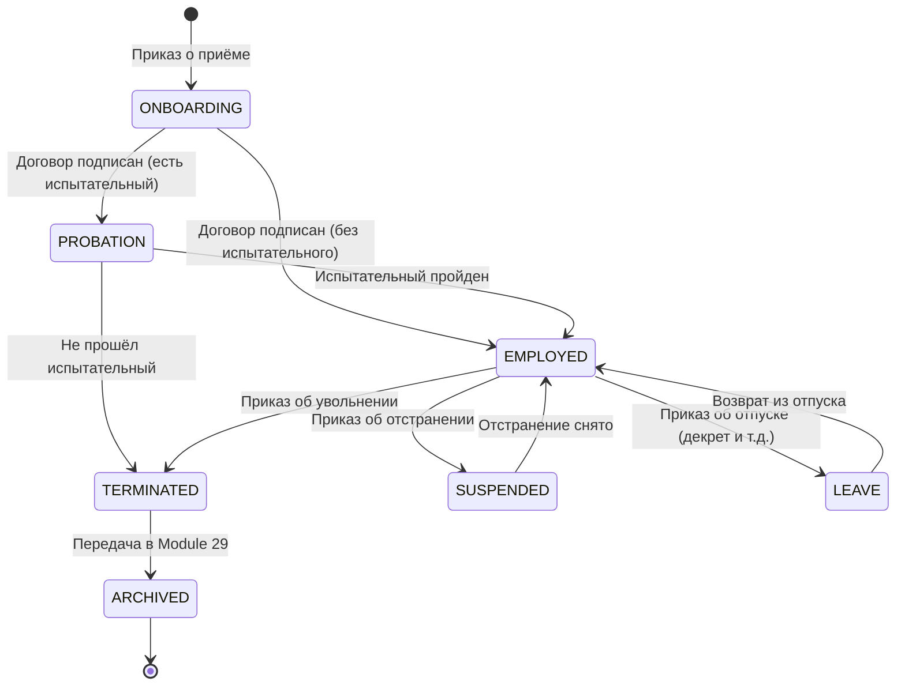
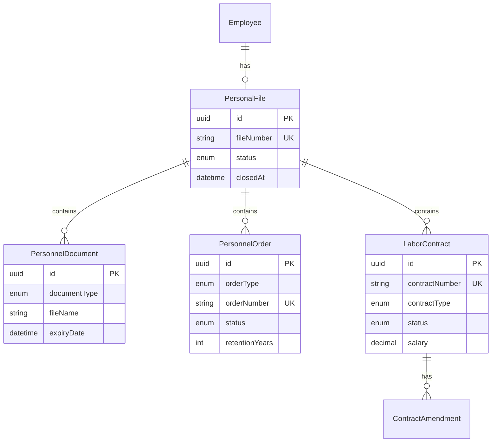
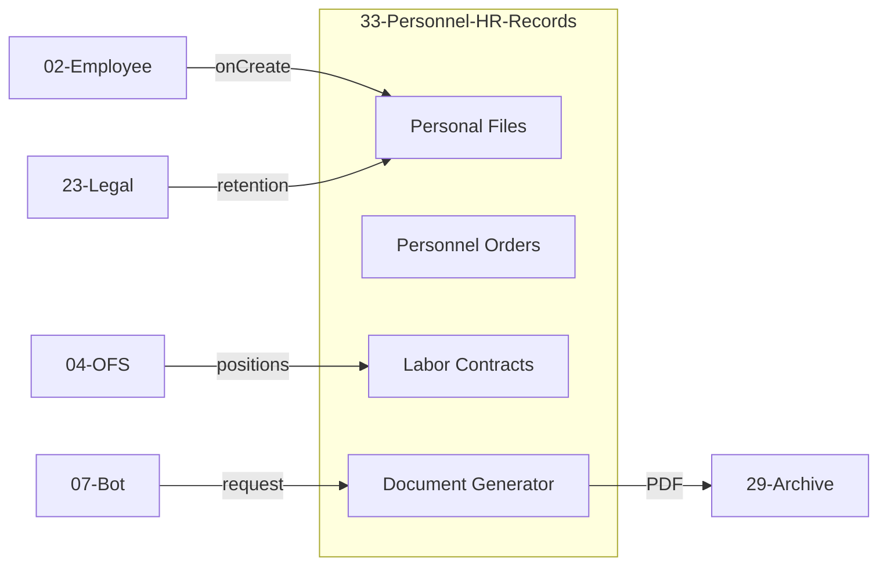

# 📋 Module 33: Personnel HR Records (Кадровое делопроизводство)

> **Версия:** 1.0  
> **Статус:** 🔴 Не начат  
> **Приоритет:** HIGH (Compliance-critical)  
> **Зависимости:** 01-Auth, 02-Employee, 04-OFS, 23-Legal, 29-Library-Archive

---

## 1. Описание модуля

### 1.1. Назначение

Модуль **Personnel-HR-Records** — это система **кадрового делопроизводства**, обеспечивающая полный жизненный цикл HR-документации: от приёма сотрудника до увольнения. Модуль критичен для соответствия трудовому законодательству РФ и требованиям ФЗ-152 о персональных данных.

### 1.2. Бизнес-цели

1. **Compliance:** Соответствие ТК РФ, ФЗ-152, требованиям трудовой инспекции
2. **Цифровизация:** Переход от бумажных личных дел к электронным
3. **Автоматизация:** Генерация типовых документов (приказы, справки, договоры)
4. **Аудит:** Полная история изменений кадровых документов
5. **Интеграция:** Связь с архивом (Module 29) для долгосрочного хранения

### 1.3. Ключевые отличия от других модулей

| Модуль | Фокус |
|--------|-------|
| **02-Employee-Management** | Оперативные данные сотрудника (ФИО, должность, контакты) |
| **28-HR-Analytics-Matrix360** | Аналитика, оценка 360°, развитие |
| **33-Personnel-HR-Records** | **Кадровые документы**: личные дела, приказы, договоры, справки |

---

## 2. ФИЛОСОФСКИЕ И ЭТИЧЕСКИЕ ИНВАРИАНТЫ (MatrixGin)

### 2.1. Базовые принципы (НЕИЗМЕНЯЕМЫЕ)

> **Кадровый документ = юридический след, а не файл.**

1. **Event-Sourcing обязателен** — любое юридически значимое действие = неизменяемое событие
2. **Прошлое нельзя переписать** — история изменений сохраняется навсегда
3. **Нет удаления — есть судьба** — документы архивируются, не удаляются
4. **Человек всегда в контуре** — автоматизация assistive, не autonomous
5. **ФЗ-152 выше удобства** — персональные данные защищены по закону

### 2.2. Event-Sourcing Layer (КРИТИЧНО!)

Любое юридически значимое действие порождает **неизменяемое событие**:

```prisma
// Доменные события HR (ОБЯЗАТЕЛЬНАЯ СУЩНОСТЬ!)
model HRDomainEvent {
  id              String   @id @default(uuid())
  eventType       HREventType
  aggregateType   HRAggregateType
  aggregateId     String   // ID личного дела / приказа / договора
  
  // Инициатор (ОБЯЗАТЕЛЬНО!)
  actorId         String   // Кто совершил действие
  actorRole       String   // В какой роли
  
  // Данные события
  payload         Json     // Детали события
  previousState   Json?    // Состояние ДО (для rollback-аудита)
  newState        Json?    // Состояние ПОСЛЕ
  
  // Юридическое основание (для HIRING, DISMISSAL и др.)
  legalBasis      String?  // Номер заявления, приказа и т.д.
  
  // Immutable timestamp
  occurredAt      DateTime @default(now())
  
  // Запрет на изменение
  @@map("hr_domain_events")
}

enum HREventType {
  // Жизненный цикл сотрудника
  EMPLOYEE_HIRED           // Приём на работу
  EMPLOYEE_TRANSFERRED     // Перевод
  EMPLOYEE_PROMOTED        // Повышение
  EMPLOYEE_DEMOTED         // Понижение
  EMPLOYEE_SUSPENDED       // Отстранение
  EMPLOYEE_DISMISSED       // Увольнение
  
  // Документы
  DOCUMENT_UPLOADED        // Документ загружен
  DOCUMENT_VERIFIED        // Документ проверен
  DOCUMENT_EXPIRED         // Срок документа истёк
  
  // Приказы
  ORDER_CREATED            // Приказ создан
  ORDER_SIGNED             // Приказ подписан
  ORDER_CANCELLED          // Приказ отменён
  
  // Договоры
  CONTRACT_SIGNED          // Договор подписан
  CONTRACT_AMENDED         // Договор изменён
  CONTRACT_TERMINATED      // Договор расторгнут
  
  // Архивация
  FILE_ARCHIVED            // Дело передано в архив
}

enum HRAggregateType {
  PERSONAL_FILE
  PERSONNEL_ORDER
  LABOR_CONTRACT
  PERSONNEL_DOCUMENT
}
```

> ⚠️ **ИНВАРИАНТ:** Таблица `hr_domain_events` не имеет UPDATE/DELETE операций. Только INSERT.

### 2.3. HRStatus — канонический FSM (ОБЯЗАТЕЛЬНО!)

Статус сотрудника в кадровой системе — **отдельный от Employee-статуса**:

```prisma
enum HRStatus {
  ONBOARDING      // В процессе оформления
  EMPLOYED        // Трудоустроен (штатный)
  PROBATION       // На испытательном сроке
  SUSPENDED       // Отстранён от работы
  LEAVE           // В отпуске (декрет, уход за ребёнком)
  TERMINATED      // Уволен, дело в оперативном хранении
  ARCHIVED        // Дело передано в архив (Module 29)
}
```

**FSM переходы:**



> ⚠️ **HRStatus ≠ Employee.status** — это разные контексты:
> - `Employee.status` = оперативное состояние для бизнес-логики
> - `HRStatus` = юридический статус для кадрового делопроизводства

### 2.4. AI Boundaries (ЖЁСТКИЕ ОГРАНИЧЕНИЯ!)

> **По Security-Architecture.md — это обязательный явный пункт.**

```yaml
AI Core Access Policy:
  personnel_documents:
    READ: ❌ ЗАПРЕЩЕНО
    WRITE: ❌ ЗАПРЕЩЕНО
    REASON: "Персональные данные ФЗ-152"
    
  labor_contracts:
    READ: ❌ ЗАПРЕЩЕНО
    WRITE: ❌ ЗАПРЕЩЕНО
    REASON: "Коммерческая тайна, зарплаты"
    
  personnel_orders:
    READ: ❌ ЗАПРЕЩЕНО
    WRITE: ❌ ЗАПРЕЩЕНО
    REASON: "Юридически значимые документы"
    
  hr_domain_events:
    READ: ❌ ЗАПРЕЩЕНО
    WRITE: ❌ ЗАПРЕЩЕНО
    REASON: "Аудит-лог, персональные данные"
    
  aggregated_flags:
    READ: ✅ РАЗРЕШЕНО (обезличенное)
    EXAMPLES:
      - "Всего сотрудников: N"
      - "Вакантных позиций: M"
      - "Средний стаж: X лет"
```

**AI в Module 33:**

| Действие | Разрешение | Причина |
|----------|------------|---------|
| Читать личные дела | ❌ | ФЗ-152 |
| Читать договоры | ❌ | Коммерческая тайна |
| Читать приказы | ❌ | Юридическая значимость |
| Создавать документы | ❌ | Требуется human-action |
| Подписывать приказы | ❌ | Юридическая ответственность |
| Получать агрегаты | ✅ | Обезличенная статистика |
| Предлагать шаблоны | ✅ | Advisory only |

### 2.5. Human-Only Actions (ЗАПРЕТ НА АВТОНОМНУЮ АВТОМАТИЗАЦИЮ!)

> **В MatrixGin: HR = человек в контуре. Автоматизация = assistive, не autonomous.**

**Следующие действия ТРЕБУЮТ явного human-action и НЕ МОГУТ происходить автоматически:**

| Действие | Требуется | Автоматизация |
|----------|-----------|---------------|
| Приём на работу (`HIRING`) | Подпись директора | ❌ Запрещена |
| Увольнение (`DISMISSAL`) | Подпись директора | ❌ Запрещена |
| Перевод (`TRANSFER`) | Подпись директора | ❌ Запрещена |
| Расторжение договора | Подпись директора | ❌ Запрещена |
| Дисциплинарное взыскание | Подпись директора | ❌ Запрещена |
| Изменение оклада | Подпись директора | ❌ Запрещена |
| Отпуск | Подпись HR + руководитель | ❌ Запрещена |
| Загрузка документа | Действие HR | ✅ Assistive |
| Напоминания | Система | ✅ Полная автоматизация |
| Расчёт стажа | Система | ✅ Полная автоматизация |
| Генерация PDF | Система | ✅ Полная автоматизация |

**Правило:**
```
Если действие имеет юридические последствия →
  ОБЯЗАТЕЛЬНО: human_action = true
  ОБЯЗАТЕЛЬНО: signed_by NOT NULL
  ОБЯЗАТЕЛЬНО: HRDomainEvent с actorId
```

**API Guard:**
```typescript
// Все мутирующие endpoints для юридически значимых действий
// ОБЯЗАНЫ проверять:
@RequireHumanAction()
@RequireSignature(Role.DIRECTOR)
async signOrder(@Param('id') id: string, @CurrentUser() user: Employee) {
  // Без подписи — 403 Forbidden
}

## 2. Функциональные требования

### 2.1. Основные функции

#### 📁 Личные дела (Personal Files)

| Функция | Описание |
|---------|----------|
| Создание личного дела | Автоматически при приёме сотрудника |
| Структура дела | Стандартизированные разделы (документы, приказы, награды) |
| Версионирование | История всех изменений |
| Доступ | RBAC: HR-специалист, руководитель, сам сотрудник (ограниченно) |
| Архивация | Автоматическая передача в Module 29 при увольнении |

#### 📝 Приказы по личному составу (Personnel Orders)

| Тип приказа | Описание | Срок хранения |
|-------------|----------|---------------|
| `HIRING` | О приёме на работу | 75 лет |
| `TRANSFER` | О переводе | 75 лет |
| `VACATION` | Об отпуске | 5 лет |
| `BUSINESS_TRIP` | О командировке | 5 лет |
| `BONUS` | О премировании | 5 лет |
| `DISCIPLINARY` | Дисциплинарное взыскание | 75 лет |
| `DISMISSAL` | Об увольнении | 75 лет |
| `SALARY_CHANGE` | Об изменении оклада | 75 лет |

#### 📄 Трудовые договоры (Labor Contracts)

| Функция | Описание |
|---------|----------|
| Генерация договора | По шаблону с автозаполнением данных сотрудника |
| Дополнительные соглашения | Версионирование изменений условий |
| Электронная подпись | Интеграция с УКЭП (опционально) |
| Срок хранения | 75 лет после увольнения |

#### 📊 Справки и выписки (Certificates)

| Тип | Описание |
|-----|----------|
| Справка о работе | 2-НДФЛ, для визы, для банка |
| Копия трудовой книжки | Заверенная выписка |
| Характеристика | По запросу |
| Справка об отпусках | История использования |

#### 🔔 Уведомления и напоминания

| Событие | Действие |
|---------|----------|
| Окончание испытательного срока | Напоминание руководителю за 7 дней |
| Окончание срочного договора | Напоминание за 30 дней |
| День рождения | Уведомление HR и руководителю |
| Годовщина работы | Автоматический расчёт стажа |
| Просроченные документы | Ежедневный отчёт HR |

---

## 3. Модель данных

### 3.1. Core Entities

```prisma
// Личное дело
model PersonalFile {
  id            String   @id @default(uuid())
  employeeId    String   @unique
  employee      Employee @relation(fields: [employeeId], references: [id])
  fileNumber    String   @unique // Номер личного дела
  createdAt     DateTime @default(now())
  closedAt      DateTime? // Дата закрытия (при увольнении)
  status        PersonalFileStatus @default(ACTIVE)
  archivedAt    DateTime? // Дата передачи в архив
  archiveId     String?   // Ссылка на Module 29
  
  documents     PersonnelDocument[]
  orders        PersonnelOrder[]
  contracts     LaborContract[]
  
  @@map("personal_files")
}

enum PersonalFileStatus {
  ACTIVE      // Действующий сотрудник
  CLOSED      // Уволен, дело в оперативном хранении
  ARCHIVED    // Передано в архив
}

// Кадровый документ
model PersonnelDocument {
  id              String   @id @default(uuid())
  personalFileId  String
  personalFile    PersonalFile @relation(fields: [personalFileId], references: [id])
  
  documentType    PersonnelDocumentType
  title           String
  description     String?
  
  // Файл
  fileId          String   // Ссылка на File Storage
  fileName        String
  fileSize        Int
  mimeType        String
  
  // Метаданные
  issueDate       DateTime?  // Дата выдачи документа
  expiryDate      DateTime?  // Срок действия (для паспорта, прав и т.д.)
  issuer          String?    // Кем выдан
  documentNumber  String?    // Номер документа
  
  // Audit
  uploadedById    String
  uploadedBy      Employee @relation("DocumentUploader", fields: [uploadedById], references: [id])
  createdAt       DateTime @default(now())
  updatedAt       DateTime @updatedAt
  
  // Версионирование
  version         Int      @default(1)
  previousVersionId String?
  
  @@map("personnel_documents")
}

enum PersonnelDocumentType {
  // Обязательные при приёме
  PASSPORT              // Паспорт
  SNILS                 // СНИЛС
  INN                   // ИНН
  EDUCATION_DIPLOMA     // Диплом об образовании
  MILITARY_ID           // Военный билет
  WORK_BOOK             // Трудовая книжка (скан)
  PHOTO                 // Фотография 3x4
  
  // Дополнительные
  MEDICAL_BOOK          // Медицинская книжка
  DRIVING_LICENSE       // Водительское удостоверение
  CERTIFICATE           // Сертификат/удостоверение
  REFERENCE_LETTER      // Рекомендательное письмо
  
  // Генерируемые системой
  NDA                   // Соглашение о неразглашении
  PD_CONSENT            // Согласие на обработку ПД
  JOB_DESCRIPTION       // Должностная инструкция
  
  // Прочее
  OTHER                 // Прочие документы
}

// Приказ по личному составу
model PersonnelOrder {
  id              String   @id @default(uuid())
  personalFileId  String
  personalFile    PersonalFile @relation(fields: [personalFileId], references: [id])
  
  orderType       PersonnelOrderType
  orderNumber     String   @unique // Номер приказа (автогенерация)
  orderDate       DateTime
  effectiveDate   DateTime // Дата вступления в силу
  
  title           String   // Заголовок приказа
  content         String   // Содержание (текст приказа)
  basis           String?  // Основание (заявление, служебная записка)
  
  // Файл сгенерированного приказа
  fileId          String?
  
  // Подписи
  signedById      String?  // Кто подписал (директор)
  signedAt        DateTime?
  
  // Статус
  status          OrderStatus @default(DRAFT)
  
  // Связь с изменениями в Employee
  employeeChangeId String? // Ссылка на изменение в модуле 02
  
  // Audit
  createdById     String
  createdBy       Employee @relation("OrderCreator", fields: [createdById], references: [id])
  createdAt       DateTime @default(now())
  updatedAt       DateTime @updatedAt
  
  // Retention
  retentionYears  Int      @default(75)
  
  @@map("personnel_orders")
}

enum PersonnelOrderType {
  HIRING              // Приём на работу
  TRANSFER            // Перевод
  VACATION            // Отпуск
  VACATION_CANCEL     // Отзыв из отпуска
  BUSINESS_TRIP       // Командировка
  BONUS               // Премирование
  SALARY_CHANGE       // Изменение оклада
  DISCIPLINARY        // Дисциплинарное взыскание
  DISCIPLINARY_REMOVE // Снятие взыскания
  DISMISSAL           // Увольнение
  POSITION_CHANGE     // Изменение должности
  SCHEDULE_CHANGE     // Изменение графика работы
  LEAVE_WITHOUT_PAY   // Отпуск без сохранения з/п
  MATERNITY_LEAVE     // Декретный отпуск
  PARENTAL_LEAVE      // Отпуск по уходу за ребёнком
}

enum OrderStatus {
  DRAFT               // Черновик
  PENDING_APPROVAL    // На согласовании
  APPROVED            // Согласован
  SIGNED              // Подписан
  CANCELLED           // Отменён
}

// Трудовой договор
model LaborContract {
  id              String   @id @default(uuid())
  personalFileId  String
  personalFile    PersonalFile @relation(fields: [personalFileId], references: [id])
  
  contractNumber  String   @unique
  contractDate    DateTime
  startDate       DateTime
  endDate         DateTime? // null = бессрочный
  contractType    ContractType
  
  // Условия
  positionId      String
  departmentId    String
  salary          Decimal  @db.Decimal(12, 2)
  salaryType      SalaryType @default(MONTHLY)
  workSchedule    String   // Описание графика
  probationDays   Int      @default(0) // Испытательный срок в днях
  
  // Файл договора
  fileId          String?
  
  // Статус
  status          ContractStatus @default(ACTIVE)
  terminationDate DateTime?
  terminationReason String?
  
  // Дополнительные соглашения
  amendments      ContractAmendment[]
  
  createdAt       DateTime @default(now())
  updatedAt       DateTime @updatedAt
  
  @@map("labor_contracts")
}

enum ContractType {
  PERMANENT         // Бессрочный
  FIXED_TERM        // Срочный
  PART_TIME         // Совместительство
  CIVIL             // ГПХ (гражданско-правовой)
  INTERNSHIP        // Стажировка
}

enum ContractStatus {
  ACTIVE            // Действующий
  SUSPENDED         // Приостановлен
  TERMINATED        // Расторгнут
}

enum SalaryType {
  MONTHLY           // Оклад
  HOURLY            // Почасовая
  PIECEWORK         // Сдельная
}

// Дополнительное соглашение к договору
model ContractAmendment {
  id              String   @id @default(uuid())
  contractId      String
  contract        LaborContract @relation(fields: [contractId], references: [id])
  
  amendmentNumber Int      // Порядковый номер доп. соглашения
  amendmentDate   DateTime
  effectiveDate   DateTime
  
  changes         Json     // Описание изменений
  fileId          String?
  
  createdAt       DateTime @default(now())
  
  @@map("contract_amendments")
}

// Шаблоны документов
model DocumentTemplate {
  id              String   @id @default(uuid())
  templateType    TemplateType
  name            String
  description     String?
  content         String   // Содержимое шаблона (HTML/Markdown с переменными)
  variables       Json     // Список переменных для подстановки
  isActive        Boolean  @default(true)
  version         Int      @default(1)
  
  createdAt       DateTime @default(now())
  updatedAt       DateTime @updatedAt
  
  @@map("document_templates")
}

enum TemplateType {
  LABOR_CONTRACT        // Трудовой договор
  ORDER_HIRING          // Приказ о приёме
  ORDER_DISMISSAL       // Приказ об увольнении
  ORDER_VACATION        // Приказ об отпуске
  ORDER_TRANSFER        // Приказ о переводе
  CERTIFICATE_WORK      // Справка с работы
  NDA                   // Соглашение о неразглашении
  PD_CONSENT            // Согласие на обработку ПД
}
```

### 3.2. ER-диаграмма



---

## 4. API Endpoints

### 4.1. Personal Files

| Method | Endpoint | Description | Roles |
|--------|----------|-------------|-------|
| `GET` | `/api/personnel/files` | Список личных дел | HR, ADMIN |
| `GET` | `/api/personnel/files/:id` | Детали личного дела | HR, ADMIN, Owner |
| `POST` | `/api/personnel/files` | Создать личное дело | HR, ADMIN |
| `PUT` | `/api/personnel/files/:id/close` | Закрыть дело (увольнение) | HR, ADMIN |
| `POST` | `/api/personnel/files/:id/archive` | Передать в архив | HR, ADMIN |

### 4.2. Documents

| Method | Endpoint | Description | Roles |
|--------|----------|-------------|-------|
| `GET` | `/api/personnel/files/:fileId/documents` | Документы в деле | HR, ADMIN, Owner |
| `POST` | `/api/personnel/files/:fileId/documents` | Загрузить документ | HR, ADMIN |
| `GET` | `/api/personnel/documents/:id` | Скачать документ | HR, ADMIN, Owner |
| `DELETE` | `/api/personnel/documents/:id` | Удалить документ | HR, ADMIN |

### 4.3. Orders

| Method | Endpoint | Description | Roles |
|--------|----------|-------------|-------|
| `GET` | `/api/personnel/orders` | Список приказов | HR, ADMIN |
| `POST` | `/api/personnel/orders` | Создать приказ | HR, ADMIN |
| `GET` | `/api/personnel/orders/:id` | Детали приказа | HR, ADMIN |
| `PUT` | `/api/personnel/orders/:id` | Редактировать приказ | HR, ADMIN |
| `POST` | `/api/personnel/orders/:id/sign` | Подписать приказ | DIRECTOR, ADMIN |
| `GET` | `/api/personnel/orders/:id/pdf` | Скачать PDF | HR, ADMIN |

### 4.4. Contracts

| Method | Endpoint | Description | Roles |
|--------|----------|-------------|-------|
| `GET` | `/api/personnel/contracts` | Список договоров | HR, ADMIN |
| `POST` | `/api/personnel/contracts` | Создать договор | HR, ADMIN |
| `POST` | `/api/personnel/contracts/:id/amendments` | Доп. соглашение | HR, ADMIN |
| `PUT` | `/api/personnel/contracts/:id/terminate` | Расторгнуть | HR, ADMIN |

### 4.5. Templates & Generation

| Method | Endpoint | Description | Roles |
|--------|----------|-------------|-------|
| `GET` | `/api/personnel/templates` | Список шаблонов | HR, ADMIN |
| `POST` | `/api/personnel/generate` | Генерация документа | HR, ADMIN |
| `GET` | `/api/personnel/certificates/:employeeId` | Справки сотрудника | HR, ADMIN, Owner |

---

## 5. Интеграции

### 5.1. С другими модулями

| Модуль | Интеграция |
|--------|------------|
| **01-Auth** | RBAC: роли HR, ADMIN, DIRECTOR |
| **02-Employee** | Синхронизация данных сотрудника, автосоздание личного дела |
| **04-OFS** | Должности, подразделения для договоров |
| **07-Telegram-Bot** | Запрос справок через бота |
| **23-Legal** | Соблюдение ФЗ-152, retention policies |
| **29-Library-Archive** | Архивация личных дел (75 лет) |

### 5.2. Диаграмма интеграций



---

## 6. Compliance & Security

### 6.1. Требования законодательства

| Требование | Реализация |
|------------|------------|
| **ТК РФ** | Все обязательные документы при приёме (ст. 65) |
| **ФЗ-152** | Шифрование ПД, согласие на обработку, право на удаление |
| **ФЗ-125** | Сроки хранения кадровых документов |
| **Приказ Минкультуры №526** | Номенклатура дел, архивация |

### 6.2. Сроки хранения

| Категория документов | Срок |
|---------------------|------|
| Приказы по личному составу (приём, увольнение, перевод) | 75 лет |
| Трудовые договоры | 75 лет |
| Личные дела | 75 лет |
| Приказы об отпусках, командировках | 5 лет |
| Табели учёта рабочего времени | 5 лет |
| Графики отпусков | 3 года |

### 6.3. Уровни доступа

| Роль | Доступ |
|------|--------|
| **HR_SPECIALIST** | Полный доступ к своему подразделению |
| **HR_MANAGER** | Полный доступ ко всей компании |
| **DEPARTMENT_HEAD** | Чтение документов подчинённых |
| **EMPLOYEE** | Только свои документы (ограниченно) |
| **DIRECTOR** | Подписание приказов, полный доступ |

---

## 7. UI/UX Requirements

### 7.1. Экраны

1. **Список личных дел** — таблица с фильтрами (статус, подразделение, дата приёма)
2. **Карточка личного дела** — табы: Документы, Приказы, Договоры, История
3. **Реестр приказов** — фильтр по типу, дате, статусу
4. **Генератор документов** — выбор шаблона, предпросмотр, экспорт
5. **Дашборд HR** — просроченные документы, истекающие договоры, напоминания

### 7.2. Wireframe: Карточка личного дела

```
┌─────────────────────────────────────────────────────────┐
│ 👤 Иванов Иван Иванович              Личное дело #0042 │
│ Менеджер по продажам | Отдел продаж                     │
│ Принят: 15.03.2024 | Стаж: 1 год 10 мес                 │
├─────────────────────────────────────────────────────────┤
│ [Документы] [Приказы] [Договоры] [История] [Справки]    │
├─────────────────────────────────────────────────────────┤
│ 📄 Документы (8)                                        │
│ ┌───────────────────────────────────────────────────┐   │
│ │ ✅ Паспорт            | 12.01.2020 | до 12.01.2030│   │
│ │ ✅ СНИЛС              | 05.03.2015 | бессрочно    │   │
│ │ ✅ Диплом             | 25.06.2018 | бессрочно    │   │
│ │ ⚠️ Мед. книжка        | 10.05.2024 | до 10.05.2025│   │
│ │ ✅ Согласие на ПД     | 15.03.2024 | бессрочно    │   │
│ │ ✅ NDA                | 15.03.2024 | бессрочно    │   │
│ └───────────────────────────────────────────────────┘   │
│                                    [+ Добавить документ]│
└─────────────────────────────────────────────────────────┘
```

---

## 8. Технический стек

| Компонент | Технология |
|-----------|------------|
| **Backend** | Node.js (Express) + Prisma |
| **Database** | PostgreSQL |
| **File Storage** | MinIO / S3-compatible |
| **PDF Generation** | Puppeteer / PDFKit |
| **Frontend** | React + Ant Design |
| **Search** | PostgreSQL Full-text / Elasticsearch |

---

## 9. Roadmap

### Phase 1: Core (MVP)
- [ ] Prisma models & migrations
- [ ] Personal Files CRUD
- [ ] Document upload/download
- [ ] Basic orders (hiring, dismissal)
- [ ] Integration with Module 02

### Phase 2: Advanced
- [ ] All order types
- [ ] Labor contracts management
- [ ] Document templates & generation
- [ ] PDF export

### Phase 3: Automation
- [ ] Reminders (expiring documents, contracts)
- [ ] Telegram Bot integration
- [ ] Archive integration (Module 29)
- [ ] Bulk operations

### Phase 4: Analytics
- [ ] HR Dashboard
- [ ] Reports (turnover, headcount)
- [ ] Audit log UI

---

## 10. Связанные документы

- [02-Employee-Management](../02-Employee-Management/MODULE-SPEC.md)
- [23-Legal-Compliance](../23-Legal-Compliance/MODULE-SPEC.md)
- [29-Library-Archive](../29-Library-Archive/MODULE-SPEC.md)
- [Исследование Library-Archive](../29-Library-Archive/RESEARCH-Library-Archive-Organization.md)

---

*Документ создан: Antigravity Software Factory (TECHLEAD)*  
*Дата: 2026-01-22*
