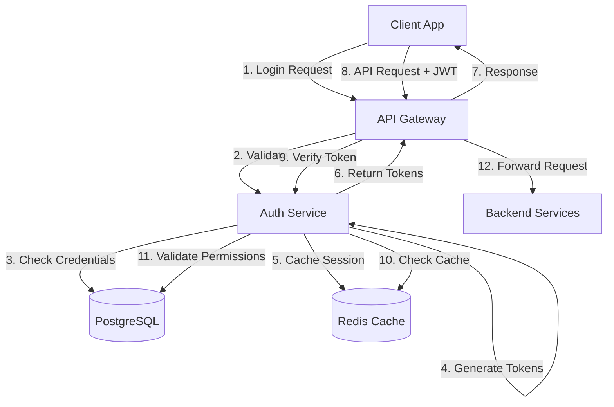
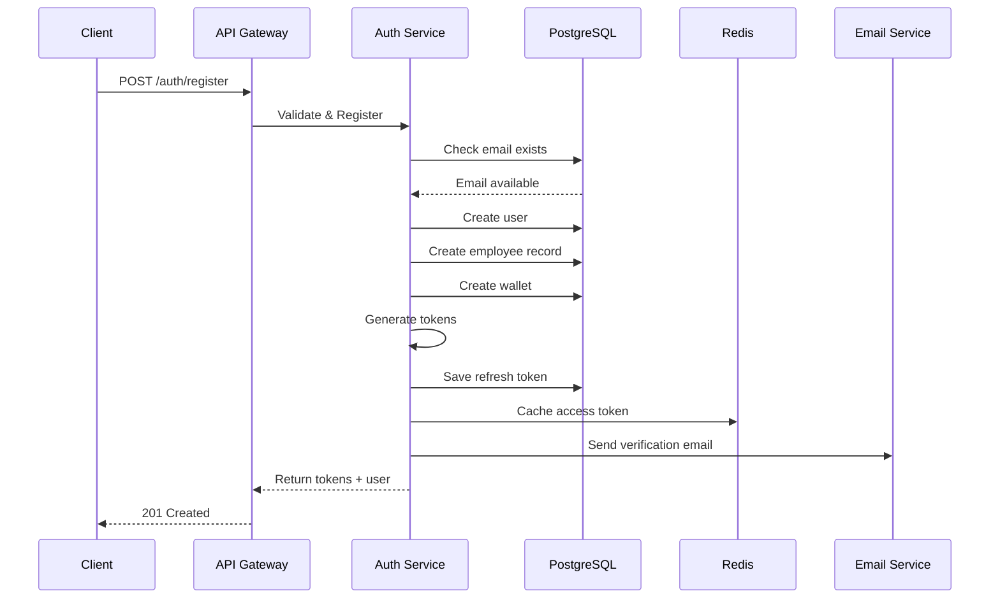
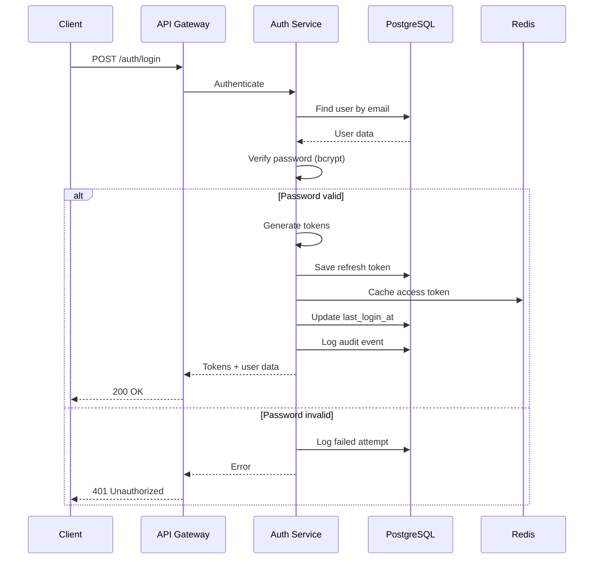
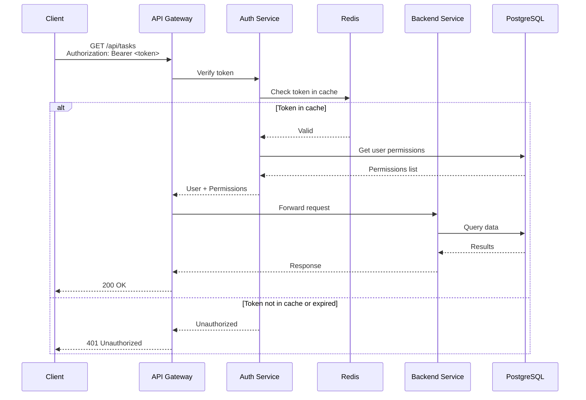
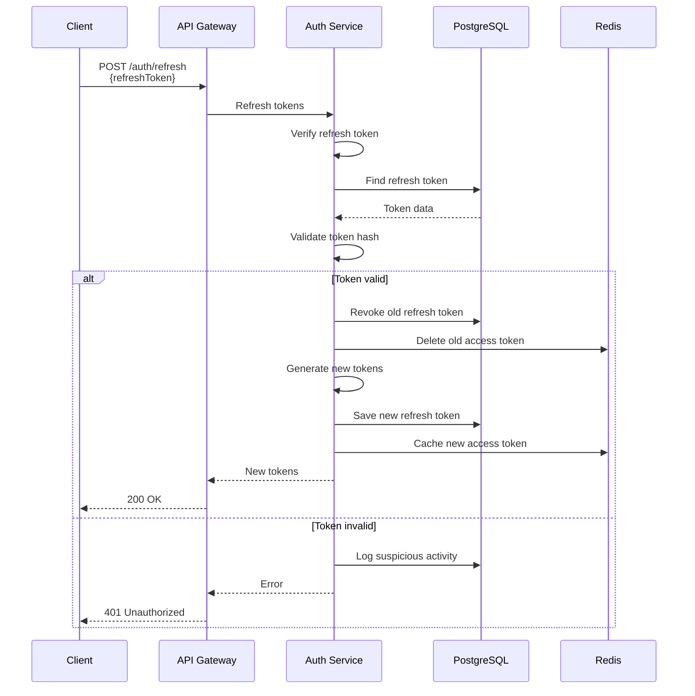
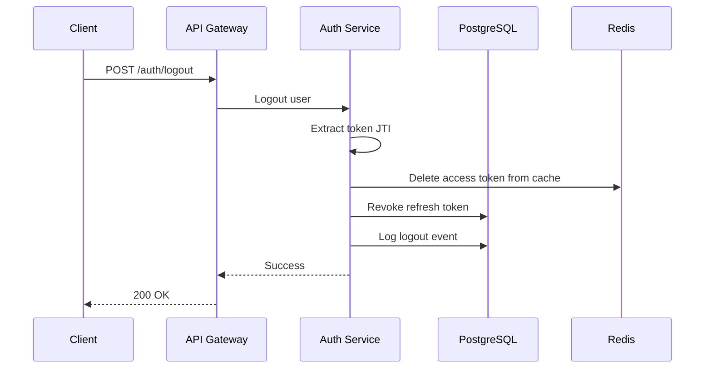

# MatrixGin v2.0 - Authentication & Authorization Flow

> **Версия:** 1.0  
> **Стратегия:** JWT + RBAC  
> **Дата:** 2025-11-21

---

## 📋 Оглавление

1. [Обзор системы аутентификации](#обзор-системы-аутентификации)
2. [JWT Token Strategy](#jwt-token-strategy)
3. [RBAC (Role-Based Access Control)](#rbac-role-based-access-control)
4. [Sequence Diagrams](#sequence-diagrams)
5. [Реализация](#реализация)
6. [Безопасность](#безопасность)

---

## Обзор системы аутентификации

### Архитектура



### Ключевые компоненты

1. **JWT Tokens** - Stateless аутентификация
2. **Refresh Tokens** - Продление сессии без повторного логина
3. **RBAC** - Гранулярный контроль доступа
4. **Redis Cache** - Быстрая валидация токенов
5. **Audit Log** - Логирование всех действий

---

## JWT Token Strategy

### Access Token

**Назначение:** Краткосрочный токен для доступа к API

**Время жизни:** 24 часа (86400 секунд)

**Payload:**

```typescript
interface AccessTokenPayload {
  sub: string; // user_id (UUID)
  email: string;
  role: UserRole;
  departmentId?: string;
  iat: number; // issued at (timestamp)
  exp: number; // expiration (timestamp)
  jti: string; // JWT ID (для отзыва)
}
```

**Пример:**

```json
{
  "sub": "user-123-456-789",
  "email": "ivan@photomatrix.ru",
  "role": "employee",
  "departmentId": "dept-abc-def",
  "iat": 1732197600,
  "exp": 1732284000,
  "jti": "jwt-abc-123"
}
```

### Refresh Token

**Назначение:** Долгосрочный токен для получения нового access token

**Время жизни:** 30 дней (2592000 секунд)

**Хранение:** 
- База данных (таблица `refresh_tokens`)
- Хэшированный (bcrypt)

**Payload:**

```typescript
interface RefreshTokenPayload {
  sub: string; // user_id
  jti: string; // token ID
  iat: number;
  exp: number;
}
```

### Token Generation

```typescript
import * as jwt from 'jsonwebtoken';
import * as bcrypt from 'bcrypt';

class TokenService {
  private readonly ACCESS_TOKEN_SECRET = process.env.JWT_ACCESS_SECRET;
  private readonly REFRESH_TOKEN_SECRET = process.env.JWT_REFRESH_SECRET;
  private readonly ACCESS_TOKEN_EXPIRY = '24h';
  private readonly REFRESH_TOKEN_EXPIRY = '30d';

  /**
   * Генерация пары токенов
   */
  async generateTokenPair(user: User): Promise<TokenPair> {
    const jti = generateUUID();
    
    // Access Token
    const accessToken = jwt.sign(
      {
        sub: user.id,
        email: user.email,
        role: user.role,
        departmentId: user.departmentId,
        jti,
      },
      this.ACCESS_TOKEN_SECRET,
      { expiresIn: this.ACCESS_TOKEN_EXPIRY }
    );
    
    // Refresh Token
    const refreshTokenJti = generateUUID();
    const refreshToken = jwt.sign(
      {
        sub: user.id,
        jti: refreshTokenJti,
      },
      this.REFRESH_TOKEN_SECRET,
      { expiresIn: this.REFRESH_TOKEN_EXPIRY }
    );
    
    // Сохранить refresh token в БД
    const tokenHash = await bcrypt.hash(refreshToken, 10);
    await this.saveRefreshToken({
      userId: user.id,
      tokenHash,
      jti: refreshTokenJti,
      expiresAt: new Date(Date.now() + 30 * 24 * 60 * 60 * 1000),
    });
    
    // Кэшировать access token в Redis
    await this.cacheAccessToken(jti, user.id);
    
    return {
      accessToken,
      refreshToken,
      expiresIn: 86400,
    };
  }

  /**
   * Валидация access token
   */
  async validateAccessToken(token: string): Promise<AccessTokenPayload> {
    try {
      const payload = jwt.verify(token, this.ACCESS_TOKEN_SECRET) as AccessTokenPayload;
      
      // Проверить в Redis (для быстрой валидации)
      const cached = await this.redis.get(`token:${payload.jti}`);
      if (!cached) {
        throw new UnauthorizedException('Token revoked');
      }
      
      return payload;
    } catch (error) {
      throw new UnauthorizedException('Invalid token');
    }
  }

  /**
   * Обновление access token через refresh token
   */
  async refreshAccessToken(refreshToken: string): Promise<TokenPair> {
    // Валидировать refresh token
    const payload = jwt.verify(refreshToken, this.REFRESH_TOKEN_SECRET) as RefreshTokenPayload;
    
    // Проверить в БД
    const storedToken = await this.findRefreshToken(payload.jti);
    if (!storedToken || storedToken.revokedAt) {
      throw new UnauthorizedException('Refresh token invalid or revoked');
    }
    
    // Проверить хэш
    const isValid = await bcrypt.compare(refreshToken, storedToken.tokenHash);
    if (!isValid) {
      throw new UnauthorizedException('Invalid refresh token');
    }
    
    // Получить пользователя
    const user = await this.userRepository.findById(payload.sub);
    if (!user) {
      throw new UnauthorizedException('User not found');
    }
    
    // Отозвать старый refresh token
    await this.revokeRefreshToken(payload.jti);
    
    // Сгенерировать новую пару токенов
    return this.generateTokenPair(user);
  }

  /**
   * Отзыв токена
   */
  async revokeToken(jti: string): Promise<void> {
    // Удалить из Redis
    await this.redis.del(`token:${jti}`);
    
    // Пометить как отозванный в БД
    await this.revokeRefreshToken(jti);
  }
}
```

---

## RBAC (Role-Based Access Control)

### Роли

```typescript
enum UserRole {
  ADMIN = 'admin',                    // Полный доступ
  HR_MANAGER = 'hr_manager',          // Управление персоналом
  DEPARTMENT_HEAD = 'department_head', // Управление департаментом
  BRANCH_MANAGER = 'branch_manager',   // Управление филиалом
  EMPLOYEE = 'employee',               // Базовый доступ
}
```

### Иерархия ролей

```
ADMIN (level 100)
  ├── HR_MANAGER (level 80)
  ├── DEPARTMENT_HEAD (level 60)
  │   └── BRANCH_MANAGER (level 50)
  │       └── EMPLOYEE (level 10)
```

### Разрешения (Permissions)

Формат: `<resource>.<action>`

**Примеры:**

```typescript
const permissions = [
  // Employees
  'employees.read',
  'employees.create',
  'employees.update',
  'employees.delete',
  'employees.read_all', // Все сотрудники (не только своего департамента)
  
  // Tasks
  'tasks.read',
  'tasks.create',
  'tasks.update',
  'tasks.delete',
  'tasks.assign',
  'tasks.assign_any', // Назначать любому сотруднику
  
  // Economy
  'economy.read_own',
  'economy.read_all',
  'economy.transfer',
  'economy.admin', // Начислять/списывать MC/GMC
  
  // KPI
  'kpi.read_own',
  'kpi.read_team',
  'kpi.read_all',
  'kpi.update_own',
  'kpi.update_any',
  
  // Reports
  'reports.read_department',
  'reports.read_all',
  'reports.export',
  
  // Admin
  'admin.users',
  'admin.roles',
  'admin.settings',
  'admin.audit_logs',
];
```

### Матрица разрешений

| Permission | EMPLOYEE | BRANCH_MANAGER | DEPARTMENT_HEAD | HR_MANAGER | ADMIN |
|-----------|----------|----------------|-----------------|------------|-------|
| employees.read | Own | Branch | Department | All | All |
| employees.create | ❌ | ❌ | ❌ | ✅ | ✅ |
| employees.update | Own | Branch | Department | All | All |
| employees.delete | ❌ | ❌ | ❌ | ✅ | ✅ |
| tasks.create | ✅ | ✅ | ✅ | ✅ | ✅ |
| tasks.assign | Own | Branch | Department | All | All |
| economy.transfer | ✅ | ✅ | ✅ | ✅ | ✅ |
| economy.admin | ❌ | ❌ | ❌ | ❌ | ✅ |
| reports.read_all | ❌ | ❌ | ❌ | ✅ | ✅ |
| admin.* | ❌ | ❌ | ❌ | ❌ | ✅ |

### Реализация RBAC

```typescript
// Декоратор для проверки разрешений
import { SetMetadata } from '@nestjs/common';

export const PERMISSIONS_KEY = 'permissions';
export const RequirePermissions = (...permissions: string[]) =>
  SetMetadata(PERMISSIONS_KEY, permissions);

// Guard для проверки разрешений
import { Injectable, CanActivate, ExecutionContext } from '@nestjs/common';
import { Reflector } from '@nestjs/core';

@Injectable()
export class PermissionsGuard implements CanActivate {
  constructor(
    private reflector: Reflector,
    private permissionsService: PermissionsService,
  ) {}

  async canActivate(context: ExecutionContext): Promise<boolean> {
    const requiredPermissions = this.reflector.getAllAndOverride<string[]>(
      PERMISSIONS_KEY,
      [context.getHandler(), context.getClass()],
    );

    if (!requiredPermissions) {
      return true; // Нет требований к разрешениям
    }

    const request = context.switchToHttp().getRequest();
    const user = request.user;

    if (!user) {
      return false;
    }

    // Получить разрешения пользователя
    const userPermissions = await this.permissionsService.getUserPermissions(user.id);

    // Проверить наличие всех требуемых разрешений
    return requiredPermissions.every((permission) =>
      userPermissions.includes(permission),
    );
  }
}

// Использование в контроллере
@Controller('employees')
@UseGuards(JwtAuthGuard, PermissionsGuard)
export class EmployeesController {
  @Get()
  @RequirePermissions('employees.read')
  async findAll() {
    // ...
  }

  @Post()
  @RequirePermissions('employees.create')
  async create(@Body() dto: CreateEmployeeRequest) {
    // ...
  }

  @Delete(':id')
  @RequirePermissions('employees.delete')
  async remove(@Param('id') id: string) {
    // ...
  }
}
```

### Динамические разрешения

Для более сложных сценариев (например, "может редактировать только своих сотрудников"):

```typescript
@Injectable()
export class EmployeeOwnershipGuard implements CanActivate {
  constructor(private employeesService: EmployeesService) {}

  async canActivate(context: ExecutionContext): Promise<boolean> {
    const request = context.switchToHttp().getRequest();
    const user = request.user;
    const employeeId = request.params.id;

    // Админ может все
    if (user.role === UserRole.ADMIN) {
      return true;
    }

    // Проверить, что сотрудник принадлежит департаменту пользователя
    const employee = await this.employeesService.findOne(employeeId);
    
    if (user.role === UserRole.DEPARTMENT_HEAD) {
      return employee.departmentId === user.departmentId;
    }

    // Сотрудник может редактировать только себя
    return employee.userId === user.id;
  }
}
```

---

## Sequence Diagrams

### 1. Регистрация и первый вход



### 2. Вход в систему



### 3. API запрос с JWT



### 4. Обновление токена



### 5. Выход из системы



---

## Реализация

### NestJS Auth Module

```typescript
// auth.module.ts
import { Module } from '@nestjs/common';
import { JwtModule } from '@nestjs/jwt';
import { PassportModule } from '@nestjs/passport';
import { AuthService } from './auth.service';
import { AuthController } from './auth.controller';
import { JwtStrategy } from './strategies/jwt.strategy';
import { LocalStrategy } from './strategies/local.strategy';

@Module({
  imports: [
    PassportModule,
    JwtModule.register({
      secret: process.env.JWT_ACCESS_SECRET,
      signOptions: { expiresIn: '24h' },
    }),
  ],
  controllers: [AuthController],
  providers: [AuthService, JwtStrategy, LocalStrategy],
  exports: [AuthService],
})
export class AuthModule {}
```

### JWT Strategy

```typescript
// strategies/jwt.strategy.ts
import { Injectable, UnauthorizedException } from '@nestjs/common';
import { PassportStrategy } from '@nestjs/passport';
import { ExtractJwt, Strategy } from 'passport-jwt';
import { AuthService } from '../auth.service';

@Injectable()
export class JwtStrategy extends PassportStrategy(Strategy) {
  constructor(private authService: AuthService) {
    super({
      jwtFromRequest: ExtractJwt.fromAuthHeaderAsBearerToken(),
      ignoreExpiration: false,
      secretOrKey: process.env.JWT_ACCESS_SECRET,
    });
  }

  async validate(payload: AccessTokenPayload) {
    // Проверить, что токен не отозван
    const isValid = await this.authService.validateToken(payload.jti);
    if (!isValid) {
      throw new UnauthorizedException('Token revoked');
    }

    // Получить актуальные данные пользователя
    const user = await this.authService.getUserById(payload.sub);
    if (!user || user.status !== 'active') {
      throw new UnauthorizedException('User inactive');
    }

    return user;
  }
}
```

### Auth Guard

```typescript
// guards/jwt-auth.guard.ts
import { Injectable, ExecutionContext } from '@nestjs/common';
import { AuthGuard } from '@nestjs/passport';
import { Reflector } from '@nestjs/core';

@Injectable()
export class JwtAuthGuard extends AuthGuard('jwt') {
  constructor(private reflector: Reflector) {
    super();
  }

  canActivate(context: ExecutionContext) {
    // Проверить, есть ли декоратор @Public()
    const isPublic = this.reflector.getAllAndOverride<boolean>('isPublic', [
      context.getHandler(),
      context.getClass(),
    ]);

    if (isPublic) {
      return true;
    }

    return super.canActivate(context);
  }
}
```

### Public Decorator

```typescript
// decorators/public.decorator.ts
import { SetMetadata } from '@nestjs/common';

export const IS_PUBLIC_KEY = 'isPublic';
export const Public = () => SetMetadata(IS_PUBLIC_KEY, true);
```

---

## Безопасность

### 1. Хранение секретов

```bash
# .env (НИКОГДА не коммитить!)
JWT_ACCESS_SECRET=<сгенерировать 256-bit ключ>
JWT_REFRESH_SECRET=<сгенерировать 256-bit ключ>
BCRYPT_ROUNDS=12
```

Генерация секретов:

```bash
node -e "console.log(require('crypto').randomBytes(32).toString('hex'))"
```

### 2. Password Hashing

```typescript
import * as bcrypt from 'bcrypt';

const SALT_ROUNDS = 12;

// Хэширование пароля
async function hashPassword(password: string): Promise<string> {
  return bcrypt.hash(password, SALT_ROUNDS);
}

// Проверка пароля
async function verifyPassword(password: string, hash: string): Promise<boolean> {
  return bcrypt.compare(password, hash);
}
```

### 3. Rate Limiting

```typescript
import { ThrottlerModule } from '@nestjs/throttler';

@Module({
  imports: [
    ThrottlerModule.forRoot({
      ttl: 60, // 60 секунд
      limit: 10, // 10 запросов
    }),
  ],
})
export class AppModule {}

// В контроллере
@Controller('auth')
@UseGuards(ThrottlerGuard)
export class AuthController {
  @Post('login')
  @Throttle(5, 60) // 5 попыток входа в минуту
  async login(@Body() dto: LoginRequest) {
    // ...
  }
}
```

### 4. CSRF Protection

```typescript
import * as csurf from 'csurf';

app.use(csurf());
```

### 5. Helmet (Security Headers)

```typescript
import helmet from 'helmet';

app.use(helmet());
```

### 6. CORS

```typescript
app.enableCors({
  origin: process.env.ALLOWED_ORIGINS.split(','),
  credentials: true,
});
```

### 7. Audit Logging

Все действия аутентификации логируются:

```typescript
async logAuthEvent(event: AuthEvent): Promise<void> {
  await this.auditLogRepository.create({
    userId: event.userId,
    action: event.action, // 'login', 'logout', 'refresh', 'failed_login'
    ipAddress: event.ipAddress,
    userAgent: event.userAgent,
    metadata: event.metadata,
    severity: event.severity,
  });
}
```

---

## Резюме

### Ключевые особенности

✅ **JWT + Refresh Tokens** - Безопасная stateless аутентификация  
✅ **RBAC** - Гранулярный контроль доступа  
✅ **Redis Cache** - Быстрая валидация токенов  
✅ **Audit Logging** - Полная прослеживаемость  
✅ **Rate Limiting** - Защита от brute-force  
✅ **Password Hashing** - Bcrypt с cost factor 12  

### Следующие шаги

1. ✅ Реализовать Multi-Factor Authentication (MFA)
2. ✅ Добавить OAuth2 провайдеры (Google, Yandex)
3. ✅ Настроить Session Management
4. ✅ Реализовать Password Reset Flow
5. ✅ Добавить Email Verification
