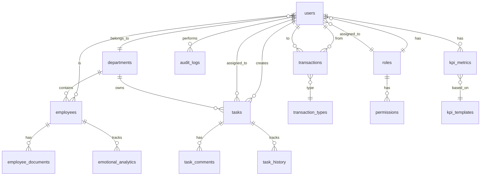

# MatrixGin v2.0 - Database Schema & ERD

> **Версия:** 1.0  
> **СУБД:** PostgreSQL 16  
> **ORM:** Prisma  
> **Дата:** 2025-11-21

---

## 📋 Оглавление

1. [Entity-Relationship Diagram (ERD)](#entity-relationship-diagram-erd)
2. [Таблицы MVP модулей](#таблицы-mvp-модулей)
3. [Индексы и оптимизация](#индексы-и-оптимизация)
4. [Партиционирование](#партиционирование)
5. [Миграции](#миграции)
6. [Constraints и валидация](#constraints-и-валидация)

---

## Entity-Relationship Diagram (ERD)

### Основная ERD диаграмма (MVP модули)



---

## Таблицы MVP модулей

### 1. Authentication & Authorization

#### 1.1 `users` (Пользователи)

```sql
CREATE TABLE users (
    -- Primary Key
    id UUID PRIMARY KEY DEFAULT gen_random_uuid(),
    
    -- Authentication
    email VARCHAR(255) UNIQUE NOT NULL,
    password_hash VARCHAR(255) NOT NULL,
    telegram_id VARCHAR(50) UNIQUE,
    
    -- Personal Info
    first_name VARCHAR(100) NOT NULL,
    last_name VARCHAR(100) NOT NULL,
    middle_name VARCHAR(100),
    avatar_url TEXT,
    
    -- Relations
    role_id UUID NOT NULL REFERENCES roles(id) ON DELETE RESTRICT,
    department_id UUID REFERENCES departments(id) ON DELETE SET NULL,
    
    -- Status
    status VARCHAR(50) NOT NULL DEFAULT 'active' 
        CHECK (status IN ('active', 'inactive', 'suspended', 'deleted')),
    email_verified BOOLEAN DEFAULT FALSE,
    
    -- Timestamps
    created_at TIMESTAMPTZ NOT NULL DEFAULT NOW(),
    updated_at TIMESTAMPTZ NOT NULL DEFAULT NOW(),
    last_login_at TIMESTAMPTZ,
    deleted_at TIMESTAMPTZ
);

-- Indexes
CREATE INDEX idx_users_email ON users(email) WHERE deleted_at IS NULL;
CREATE INDEX idx_users_telegram_id ON users(telegram_id) WHERE telegram_id IS NOT NULL;
CREATE INDEX idx_users_department ON users(department_id) WHERE deleted_at IS NULL;
CREATE INDEX idx_users_status ON users(status) WHERE deleted_at IS NULL;

-- Comments
COMMENT ON TABLE users IS 'Основная таблица пользователей системы';
COMMENT ON COLUMN users.password_hash IS 'Bcrypt hash пароля (cost factor 12)';
COMMENT ON COLUMN users.telegram_id IS 'Telegram User ID для интеграции с ботом';
```

#### 1.2 `roles` (Роли)

```sql
CREATE TABLE roles (
    id UUID PRIMARY KEY DEFAULT gen_random_uuid(),
    name VARCHAR(100) UNIQUE NOT NULL,
    display_name VARCHAR(100) NOT NULL,
    description TEXT,
    
    -- Hierarchy
    level INTEGER NOT NULL DEFAULT 0,
    
    -- Timestamps
    created_at TIMESTAMPTZ NOT NULL DEFAULT NOW(),
    updated_at TIMESTAMPTZ NOT NULL DEFAULT NOW(),
    
    CONSTRAINT roles_name_check CHECK (name ~ '^[a-z_]+$')
);

-- Seed data
INSERT INTO roles (name, display_name, level) VALUES
    ('admin', 'Администратор', 100),
    ('hr_manager', 'HR Менеджер', 80),
    ('department_head', 'Руководитель департамента', 60),
    ('branch_manager', 'Управляющий филиалом', 50),
    ('employee', 'Сотрудник', 10);
```

#### 1.3 `permissions` (Разрешения)

```sql
CREATE TABLE permissions (
    id UUID PRIMARY KEY DEFAULT gen_random_uuid(),
    name VARCHAR(100) UNIQUE NOT NULL,
    resource VARCHAR(100) NOT NULL,
    action VARCHAR(50) NOT NULL,
    description TEXT,
    
    created_at TIMESTAMPTZ NOT NULL DEFAULT NOW(),
    
    CONSTRAINT permissions_unique_resource_action UNIQUE (resource, action)
);

-- Examples
INSERT INTO permissions (name, resource, action) VALUES
    ('employees.read', 'employees', 'read'),
    ('employees.create', 'employees', 'create'),
    ('employees.update', 'employees', 'update'),
    ('employees.delete', 'employees', 'delete'),
    ('tasks.read', 'tasks', 'read'),
    ('tasks.create', 'tasks', 'create'),
    ('tasks.assign', 'tasks', 'assign'),
    ('economy.transfer', 'economy', 'transfer');
```

#### 1.4 `role_permissions` (Связь ролей и разрешений)

```sql
CREATE TABLE role_permissions (
    role_id UUID NOT NULL REFERENCES roles(id) ON DELETE CASCADE,
    permission_id UUID NOT NULL REFERENCES permissions(id) ON DELETE CASCADE,
    
    created_at TIMESTAMPTZ NOT NULL DEFAULT NOW(),
    
    PRIMARY KEY (role_id, permission_id)
);

CREATE INDEX idx_role_permissions_role ON role_permissions(role_id);
CREATE INDEX idx_role_permissions_permission ON role_permissions(permission_id);
```

#### 1.5 `refresh_tokens` (Refresh токены)

```sql
CREATE TABLE refresh_tokens (
    id UUID PRIMARY KEY DEFAULT gen_random_uuid(),
    user_id UUID NOT NULL REFERENCES users(id) ON DELETE CASCADE,
    token_hash VARCHAR(255) UNIQUE NOT NULL,
    
    -- Metadata
    user_agent TEXT,
    ip_address INET,
    
    -- Expiration
    expires_at TIMESTAMPTZ NOT NULL,
    revoked_at TIMESTAMPTZ,
    
    created_at TIMESTAMPTZ NOT NULL DEFAULT NOW()
);

CREATE INDEX idx_refresh_tokens_user ON refresh_tokens(user_id);
CREATE INDEX idx_refresh_tokens_expires ON refresh_tokens(expires_at) WHERE revoked_at IS NULL;

-- Auto-cleanup старых токенов
CREATE INDEX idx_refresh_tokens_cleanup ON refresh_tokens(created_at) 
    WHERE revoked_at IS NOT NULL OR expires_at < NOW();
```

---

### 2. Employee Management

#### 2.1 `employees` (Сотрудники - расширение users)

```sql
CREATE TABLE employees (
    -- Primary Key (совпадает с users.id)
    user_id UUID PRIMARY KEY REFERENCES users(id) ON DELETE CASCADE,
    
    -- Employment Info
    employee_number VARCHAR(50) UNIQUE NOT NULL,
    position VARCHAR(255) NOT NULL,
    hire_date DATE NOT NULL,
    termination_date DATE,
    
    -- Classification
    rank VARCHAR(50) NOT NULL DEFAULT 'trainee'
        CHECK (rank IN ('trainee', 'junior', 'middle', 'senior', 'lead', 'expert')),
    employment_type VARCHAR(50) NOT NULL DEFAULT 'full_time'
        CHECK (employment_type IN ('full_time', 'part_time', 'contractor', 'intern')),
    
    -- Status
    work_status VARCHAR(50) NOT NULL DEFAULT 'active'
        CHECK (work_status IN ('active', 'on_vacation', 'sick_leave', 'maternity_leave', 'dismissed')),
    
    -- Manager
    manager_id UUID REFERENCES employees(user_id) ON DELETE SET NULL,
    
    -- Timestamps
    created_at TIMESTAMPTZ NOT NULL DEFAULT NOW(),
    updated_at TIMESTAMPTZ NOT NULL DEFAULT NOW()
);

-- Indexes
CREATE INDEX idx_employees_department ON employees(user_id);
CREATE INDEX idx_employees_manager ON employees(manager_id);
CREATE INDEX idx_employees_status ON employees(work_status);
CREATE INDEX idx_employees_rank ON employees(rank);
CREATE UNIQUE INDEX idx_employees_number ON employees(employee_number);

-- Trigger для автогенерации employee_number
CREATE OR REPLACE FUNCTION generate_employee_number()
RETURNS TRIGGER AS $$
BEGIN
    IF NEW.employee_number IS NULL THEN
        NEW.employee_number := 'EMP' || LPAD(nextval('employee_number_seq')::TEXT, 6, '0');
    END IF;
    RETURN NEW;
END;
$$ LANGUAGE plpgsql;

CREATE SEQUENCE employee_number_seq START 1000;

CREATE TRIGGER trg_generate_employee_number
    BEFORE INSERT ON employees
    FOR EACH ROW
    EXECUTE FUNCTION generate_employee_number();
```

#### 2.2 `departments` (Департаменты)

```sql
CREATE TABLE departments (
    id UUID PRIMARY KEY DEFAULT gen_random_uuid(),
    name VARCHAR(255) NOT NULL,
    code VARCHAR(50) UNIQUE NOT NULL,
    description TEXT,
    
    -- Hierarchy
    parent_id UUID REFERENCES departments(id) ON DELETE SET NULL,
    level INTEGER NOT NULL DEFAULT 0,
    path LTREE, -- Materialized path для быстрых запросов иерархии
    
    -- Head
    head_id UUID REFERENCES users(id) ON DELETE SET NULL,
    
    -- Budget
    budget_annual DECIMAL(15,2),
    
    -- Status
    is_active BOOLEAN DEFAULT TRUE,
    
    -- Timestamps
    created_at TIMESTAMPTZ NOT NULL DEFAULT NOW(),
    updated_at TIMESTAMPTZ NOT NULL DEFAULT NOW()
);

-- Indexes
CREATE INDEX idx_departments_parent ON departments(parent_id);
CREATE INDEX idx_departments_head ON departments(head_id);
CREATE INDEX idx_departments_path ON departments USING GIST(path);
CREATE INDEX idx_departments_active ON departments(is_active) WHERE is_active = TRUE;

-- Seed data (основные департаменты)
INSERT INTO departments (name, code, level) VALUES
    ('Коммерческий департамент', 'COMM', 1),
    ('Производственный департамент', 'PROD', 1),
    ('Финансовый департамент', 'FIN', 1),
    ('Департамент развития', 'DEV', 1),
    ('Департамент квалификации', 'EDU', 1),
    ('HR департамент', 'HR', 1),
    ('IT департамент', 'IT', 1);
```

#### 2.3 `employee_documents` (Кадровые документы)

```sql
CREATE TABLE employee_documents (
    id UUID PRIMARY KEY DEFAULT gen_random_uuid(),
    employee_id UUID NOT NULL REFERENCES employees(user_id) ON DELETE CASCADE,
    
    -- Document Info
    document_type VARCHAR(100) NOT NULL
        CHECK (document_type IN ('contract', 'nda', 'job_description', 'certificate', 'other')),
    title VARCHAR(255) NOT NULL,
    file_path TEXT NOT NULL,
    file_size INTEGER,
    mime_type VARCHAR(100),
    
    -- Signing
    signed BOOLEAN DEFAULT FALSE,
    signed_at TIMESTAMPTZ,
    signature_hash VARCHAR(255),
    
    -- Metadata
    metadata JSONB DEFAULT '{}',
    
    -- Timestamps
    created_at TIMESTAMPTZ NOT NULL DEFAULT NOW(),
    updated_at TIMESTAMPTZ NOT NULL DEFAULT NOW()
);

CREATE INDEX idx_employee_documents_employee ON employee_documents(employee_id);
CREATE INDEX idx_employee_documents_type ON employee_documents(document_type);
CREATE INDEX idx_employee_documents_signed ON employee_documents(signed);
```

---

### 3. Task Management

#### 3.1 `tasks` (Задачи)

```sql
CREATE TABLE tasks (
    id UUID PRIMARY KEY DEFAULT gen_random_uuid(),
    
    -- Content
    title VARCHAR(255) NOT NULL,
    description TEXT,
    
    -- Classification
    status VARCHAR(50) NOT NULL DEFAULT 'pending'
        CHECK (status IN ('pending', 'in_progress', 'completed', 'cancelled', 'on_hold')),
    priority VARCHAR(50) NOT NULL DEFAULT 'medium'
        CHECK (priority IN ('low', 'medium', 'high', 'urgent')),
    
    -- Assignment
    created_by UUID NOT NULL REFERENCES users(id) ON DELETE RESTRICT,
    assignee_id UUID REFERENCES users(id) ON DELETE SET NULL,
    department_id UUID REFERENCES departments(id) ON DELETE SET NULL,
    
    -- Timing
    due_date TIMESTAMPTZ,
    estimated_hours DECIMAL(5,2),
    actual_hours DECIMAL(5,2),
    
    -- Rewards
    mc_reward INTEGER DEFAULT 100 CHECK (mc_reward >= 0),
    
    -- Metadata
    tags TEXT[] DEFAULT '{}',
    metadata JSONB DEFAULT '{}',
    
    -- Timestamps
    created_at TIMESTAMPTZ NOT NULL DEFAULT NOW(),
    updated_at TIMESTAMPTZ NOT NULL DEFAULT NOW(),
    completed_at TIMESTAMPTZ,
    
    -- Constraints
    CONSTRAINT tasks_completion_check CHECK (
        (status = 'completed' AND completed_at IS NOT NULL) OR
        (status != 'completed' AND completed_at IS NULL)
    )
);

-- Indexes
CREATE INDEX idx_tasks_status ON tasks(status) WHERE status != 'completed';
CREATE INDEX idx_tasks_assignee ON tasks(assignee_id) WHERE assignee_id IS NOT NULL;
CREATE INDEX idx_tasks_department ON tasks(department_id);
CREATE INDEX idx_tasks_created_by ON tasks(created_by);
CREATE INDEX idx_tasks_due_date ON tasks(due_date) WHERE due_date IS NOT NULL AND status != 'completed';
CREATE INDEX idx_tasks_priority ON tasks(priority) WHERE status != 'completed';
CREATE INDEX idx_tasks_tags ON tasks USING GIN(tags);
CREATE INDEX idx_tasks_created_at ON tasks(created_at DESC);

-- Full-text search
CREATE INDEX idx_tasks_fulltext ON tasks USING GIN(
    to_tsvector('russian', coalesce(title, '') || ' ' || coalesce(description, ''))
);
```

#### 3.2 `task_comments` (Комментарии к задачам)

```sql
CREATE TABLE task_comments (
    id UUID PRIMARY KEY DEFAULT gen_random_uuid(),
    task_id UUID NOT NULL REFERENCES tasks(id) ON DELETE CASCADE,
    user_id UUID NOT NULL REFERENCES users(id) ON DELETE CASCADE,
    
    content TEXT NOT NULL,
    
    -- Metadata
    metadata JSONB DEFAULT '{}',
    
    created_at TIMESTAMPTZ NOT NULL DEFAULT NOW(),
    updated_at TIMESTAMPTZ NOT NULL DEFAULT NOW(),
    deleted_at TIMESTAMPTZ
);

CREATE INDEX idx_task_comments_task ON task_comments(task_id) WHERE deleted_at IS NULL;
CREATE INDEX idx_task_comments_user ON task_comments(user_id);
CREATE INDEX idx_task_comments_created ON task_comments(created_at DESC);
```

#### 3.3 `task_history` (История изменений задач)

```sql
CREATE TABLE task_history (
    id UUID PRIMARY KEY DEFAULT gen_random_uuid(),
    task_id UUID NOT NULL REFERENCES tasks(id) ON DELETE CASCADE,
    user_id UUID NOT NULL REFERENCES users(id) ON DELETE CASCADE,
    
    -- Change tracking
    action VARCHAR(50) NOT NULL
        CHECK (action IN ('created', 'updated', 'assigned', 'completed', 'cancelled', 'commented')),
    field_name VARCHAR(100),
    old_value TEXT,
    new_value TEXT,
    
    -- Metadata
    metadata JSONB DEFAULT '{}',
    
    created_at TIMESTAMPTZ NOT NULL DEFAULT NOW()
);

CREATE INDEX idx_task_history_task ON task_history(task_id, created_at DESC);
CREATE INDEX idx_task_history_user ON task_history(user_id);
CREATE INDEX idx_task_history_action ON task_history(action);

-- Партиционирование по месяцам
ALTER TABLE task_history PARTITION BY RANGE (created_at);
```

---

### 4. KPI & Analytics

#### 4.1 `kpi_templates` (Шаблоны KPI)

```sql
CREATE TABLE kpi_templates (
    id UUID PRIMARY KEY DEFAULT gen_random_uuid(),
    name VARCHAR(255) NOT NULL,
    description TEXT,
    
    -- Metric
    metric_type VARCHAR(100) NOT NULL,
    unit VARCHAR(50),
    
    -- Calculation
    calculation_formula TEXT,
    calculation_period VARCHAR(50) NOT NULL
        CHECK (calculation_period IN ('daily', 'weekly', 'monthly', 'quarterly', 'yearly')),
    
    -- Target
    default_target_value DECIMAL(15,2),
    
    -- Department specific
    department_id UUID REFERENCES departments(id) ON DELETE CASCADE,
    
    -- Status
    is_active BOOLEAN DEFAULT TRUE,
    
    created_at TIMESTAMPTZ NOT NULL DEFAULT NOW(),
    updated_at TIMESTAMPTZ NOT NULL DEFAULT NOW()
);

CREATE INDEX idx_kpi_templates_department ON kpi_templates(department_id);
CREATE INDEX idx_kpi_templates_active ON kpi_templates(is_active) WHERE is_active = TRUE;
```

#### 4.2 `kpi_metrics` (KPI метрики сотрудников)

```sql
CREATE TABLE kpi_metrics (
    id UUID PRIMARY KEY DEFAULT gen_random_uuid(),
    employee_id UUID NOT NULL REFERENCES employees(user_id) ON DELETE CASCADE,
    template_id UUID NOT NULL REFERENCES kpi_templates(id) ON DELETE CASCADE,
    
    -- Period
    period_start DATE NOT NULL,
    period_end DATE NOT NULL,
    
    -- Values
    target_value DECIMAL(15,2) NOT NULL,
    current_value DECIMAL(15,2) DEFAULT 0,
    achievement_percentage DECIMAL(5,2) GENERATED ALWAYS AS (
        CASE 
            WHEN target_value > 0 THEN (current_value / target_value * 100)
            ELSE 0
        END
    ) STORED,
    
    -- Status
    status VARCHAR(50) DEFAULT 'in_progress'
        CHECK (status IN ('in_progress', 'completed', 'failed')),
    
    -- Metadata
    metadata JSONB DEFAULT '{}',
    
    created_at TIMESTAMPTZ NOT NULL DEFAULT NOW(),
    updated_at TIMESTAMPTZ NOT NULL DEFAULT NOW(),
    
    CONSTRAINT kpi_metrics_unique_employee_template_period 
        UNIQUE (employee_id, template_id, period_start, period_end)
);

CREATE INDEX idx_kpi_metrics_employee ON kpi_metrics(employee_id);
CREATE INDEX idx_kpi_metrics_template ON kpi_metrics(template_id);
CREATE INDEX idx_kpi_metrics_period ON kpi_metrics(period_start, period_end);
CREATE INDEX idx_kpi_metrics_status ON kpi_metrics(status);
```

#### 4.3 `kpi_snapshots` (Снимки KPI для истории)

```sql
CREATE TABLE kpi_snapshots (
    id UUID PRIMARY KEY DEFAULT gen_random_uuid(),
    employee_id UUID NOT NULL REFERENCES employees(user_id) ON DELETE CASCADE,
    
    snapshot_date DATE NOT NULL,
    snapshot_data JSONB NOT NULL,
    
    created_at TIMESTAMPTZ NOT NULL DEFAULT NOW(),
    
    CONSTRAINT kpi_snapshots_unique_employee_date UNIQUE (employee_id, snapshot_date)
) PARTITION BY RANGE (snapshot_date);

CREATE INDEX idx_kpi_snapshots_employee ON kpi_snapshots(employee_id);
CREATE INDEX idx_kpi_snapshots_date ON kpi_snapshots(snapshot_date DESC);
```

---

### 5. MatrixCoin Economy

#### 5.1 `wallets` (Кошельки)

```sql
CREATE TABLE wallets (
    user_id UUID PRIMARY KEY REFERENCES users(id) ON DELETE CASCADE,
    
    -- Balances
    mc_balance INTEGER DEFAULT 0 CHECK (mc_balance >= 0),
    gmc_balance INTEGER DEFAULT 0 CHECK (gmc_balance >= 0),
    mc_frozen INTEGER DEFAULT 0 CHECK (mc_frozen >= 0),
    
    -- Safe (заморозка MC на 30 дней)
    safe_active BOOLEAN DEFAULT FALSE,
    safe_activated_at TIMESTAMPTZ,
    safe_unlock_at TIMESTAMPTZ,
    
    -- Timestamps
    created_at TIMESTAMPTZ NOT NULL DEFAULT NOW(),
    updated_at TIMESTAMPTZ NOT NULL DEFAULT NOW()
);

CREATE INDEX idx_wallets_mc_balance ON wallets(mc_balance DESC);
CREATE INDEX idx_wallets_gmc_balance ON wallets(gmc_balance DESC);
CREATE INDEX idx_wallets_safe ON wallets(safe_active, safe_unlock_at) WHERE safe_active = TRUE;

-- Trigger для автоматического создания кошелька при регистрации
CREATE OR REPLACE FUNCTION create_wallet_for_user()
RETURNS TRIGGER AS $$
BEGIN
    INSERT INTO wallets (user_id) VALUES (NEW.id);
    RETURN NEW;
END;
$$ LANGUAGE plpgsql;

CREATE TRIGGER trg_create_wallet
    AFTER INSERT ON users
    FOR EACH ROW
    EXECUTE FUNCTION create_wallet_for_user();
```

#### 5.2 `transactions` (Транзакции)

```sql
CREATE TABLE transactions (
    id UUID PRIMARY KEY DEFAULT gen_random_uuid(),
    
    -- Parties
    from_user_id UUID REFERENCES users(id) ON DELETE SET NULL,
    to_user_id UUID NOT NULL REFERENCES users(id) ON DELETE RESTRICT,
    
    -- Amount
    amount INTEGER NOT NULL CHECK (amount > 0),
    currency VARCHAR(10) NOT NULL CHECK (currency IN ('MC', 'GMC')),
    
    -- Type
    transaction_type VARCHAR(50) NOT NULL
        CHECK (transaction_type IN ('task_reward', 'transfer', 'purchase', 'bonus', 'penalty', 'refund')),
    
    -- Description
    description TEXT,
    
    -- Relations
    related_entity_type VARCHAR(50),
    related_entity_id UUID,
    
    -- Metadata
    metadata JSONB DEFAULT '{}',
    
    created_at TIMESTAMPTZ NOT NULL DEFAULT NOW()
);

-- Indexes
CREATE INDEX idx_transactions_from ON transactions(from_user_id, created_at DESC);
CREATE INDEX idx_transactions_to ON transactions(to_user_id, created_at DESC);
CREATE INDEX idx_transactions_type ON transactions(transaction_type);
CREATE INDEX idx_transactions_currency ON transactions(currency);
CREATE INDEX idx_transactions_created ON transactions(created_at DESC);
CREATE INDEX idx_transactions_related ON transactions(related_entity_type, related_entity_id);

-- Партиционирование по месяцам
ALTER TABLE transactions PARTITION BY RANGE (created_at);

-- Trigger для обновления балансов
CREATE OR REPLACE FUNCTION update_wallet_balances()
RETURNS TRIGGER AS $$
BEGIN
    IF NEW.currency = 'MC' THEN
        -- Списание с отправителя
        IF NEW.from_user_id IS NOT NULL THEN
            UPDATE wallets 
            SET mc_balance = mc_balance - NEW.amount,
                updated_at = NOW()
            WHERE user_id = NEW.from_user_id;
            
            IF NOT FOUND OR (SELECT mc_balance FROM wallets WHERE user_id = NEW.from_user_id) < 0 THEN
                RAISE EXCEPTION 'Insufficient MC balance';
            END IF;
        END IF;
        
        -- Начисление получателю
        UPDATE wallets 
        SET mc_balance = mc_balance + NEW.amount,
            updated_at = NOW()
        WHERE user_id = NEW.to_user_id;
        
    ELSIF NEW.currency = 'GMC' THEN
        -- Аналогично для GMC
        IF NEW.from_user_id IS NOT NULL THEN
            UPDATE wallets 
            SET gmc_balance = gmc_balance - NEW.amount,
                updated_at = NOW()
            WHERE user_id = NEW.from_user_id;
            
            IF NOT FOUND OR (SELECT gmc_balance FROM wallets WHERE user_id = NEW.from_user_id) < 0 THEN
                RAISE EXCEPTION 'Insufficient GMC balance';
            END IF;
        END IF;
        
        UPDATE wallets 
        SET gmc_balance = gmc_balance + NEW.amount,
            updated_at = NOW()
        WHERE user_id = NEW.to_user_id;
    END IF;
    
    RETURN NEW;
END;
$$ LANGUAGE plpgsql;

CREATE TRIGGER trg_update_wallet_balances
    AFTER INSERT ON transactions
    FOR EACH ROW
    EXECUTE FUNCTION update_wallet_balances();
```

---

### 6. Legal Compliance

#### 6.1 `audit_logs` (Журнал аудита)

```sql
CREATE TABLE audit_logs (
    id UUID PRIMARY KEY DEFAULT gen_random_uuid(),
    
    -- Actor
    user_id UUID REFERENCES users(id) ON DELETE SET NULL,
    
    -- Action
    action VARCHAR(100) NOT NULL,
    entity_type VARCHAR(100) NOT NULL,
    entity_id UUID,
    
    -- Details
    changes JSONB,
    
    -- Request info
    ip_address INET,
    user_agent TEXT,
    request_id UUID,
    
    -- Severity
    severity VARCHAR(20) DEFAULT 'info'
        CHECK (severity IN ('debug', 'info', 'warning', 'error', 'critical')),
    
    created_at TIMESTAMPTZ NOT NULL DEFAULT NOW()
) PARTITION BY RANGE (created_at);

CREATE INDEX idx_audit_logs_user ON audit_logs(user_id, created_at DESC);
CREATE INDEX idx_audit_logs_entity ON audit_logs(entity_type, entity_id, created_at DESC);
CREATE INDEX idx_audit_logs_action ON audit_logs(action);
CREATE INDEX idx_audit_logs_severity ON audit_logs(severity) WHERE severity IN ('error', 'critical');
CREATE INDEX idx_audit_logs_created ON audit_logs(created_at DESC);
```

#### 6.2 `consent_records` (Согласия на обработку ПДн - 152-ФЗ)

```sql
CREATE TABLE consent_records (
    id UUID PRIMARY KEY DEFAULT gen_random_uuid(),
    user_id UUID NOT NULL REFERENCES users(id) ON DELETE CASCADE,
    
    -- Consent type
    consent_type VARCHAR(100) NOT NULL
        CHECK (consent_type IN ('personal_data', 'marketing', 'analytics', 'third_party')),
    
    -- Status
    granted BOOLEAN NOT NULL,
    
    -- Details
    consent_text TEXT NOT NULL,
    version VARCHAR(50) NOT NULL,
    
    -- Metadata
    ip_address INET,
    user_agent TEXT,
    
    -- Timestamps
    granted_at TIMESTAMPTZ,
    revoked_at TIMESTAMPTZ,
    created_at TIMESTAMPTZ NOT NULL DEFAULT NOW(),
    
    CONSTRAINT consent_records_granted_check CHECK (
        (granted = TRUE AND granted_at IS NOT NULL) OR
        (granted = FALSE AND revoked_at IS NOT NULL)
    )
);

CREATE INDEX idx_consent_records_user ON consent_records(user_id);
CREATE INDEX idx_consent_records_type ON consent_records(consent_type);
CREATE INDEX idx_consent_records_granted ON consent_records(granted) WHERE granted = TRUE;
```

---

### 7. Emotional Analytics

#### 7.1 `emotional_analytics` (Эмоциональная аналитика)

```sql
CREATE TABLE emotional_analytics (
    id UUID PRIMARY KEY DEFAULT gen_random_uuid(),
    employee_id UUID NOT NULL REFERENCES employees(user_id) ON DELETE CASCADE,
    
    -- Emotional tone (0.0 - 4.0)
    tone_score DECIMAL(3,2) NOT NULL CHECK (tone_score >= 0 AND tone_score <= 4),
    
    -- Source
    source VARCHAR(50) NOT NULL
        CHECK (source IN ('message', 'feedback', 'survey', 'social_media', 'task_comment')),
    source_id UUID,
    
    -- Analysis
    sentiment VARCHAR(50) NOT NULL
        CHECK (sentiment IN ('very_negative', 'negative', 'neutral', 'positive', 'very_positive')),
    keywords TEXT[],
    
    -- ML Model
    model_version VARCHAR(50),
    confidence_score DECIMAL(3,2),
    
    -- Metadata
    metadata JSONB DEFAULT '{}',
    
    analyzed_at TIMESTAMPTZ NOT NULL DEFAULT NOW()
);

CREATE INDEX idx_emotional_analytics_employee ON emotional_analytics(employee_id, analyzed_at DESC);
CREATE INDEX idx_emotional_analytics_tone ON emotional_analytics(tone_score);
CREATE INDEX idx_emotional_analytics_sentiment ON emotional_analytics(sentiment);
CREATE INDEX idx_emotional_analytics_source ON emotional_analytics(source, source_id);
CREATE INDEX idx_emotional_analytics_analyzed ON emotional_analytics(analyzed_at DESC);

-- Партиционирование по месяцам
ALTER TABLE emotional_analytics PARTITION BY RANGE (analyzed_at);
```

---

## Индексы и оптимизация

### Стратегия индексирования

1. **Primary Keys**: Автоматически создаются B-tree индексы
2. **Foreign Keys**: Индексы на всех FK для JOIN оптимизации
3. **Часто фильтруемые поля**: status, department_id, created_at
4. **Полнотекстовый поиск**: GIN индексы для tsvector
5. **JSONB поля**: GIN индексы для metadata
6. **Массивы**: GIN индексы для tags

### Composite индексы

```sql
-- Для частых запросов "активные задачи пользователя"
CREATE INDEX idx_tasks_assignee_status ON tasks(assignee_id, status) 
    WHERE status IN ('pending', 'in_progress');

-- Для запросов "транзакции пользователя за период"
CREATE INDEX idx_transactions_user_period ON transactions(to_user_id, created_at DESC);

-- Для KPI дашборда
CREATE INDEX idx_kpi_metrics_employee_period ON kpi_metrics(employee_id, period_start, period_end);
```

---

## Партиционирование

### Таблицы для партиционирования

```sql
-- 1. audit_logs - по месяцам (retention 24 месяца)
CREATE TABLE audit_logs_2025_01 PARTITION OF audit_logs
    FOR VALUES FROM ('2025-01-01') TO ('2025-02-01');

-- 2. transactions - по месяцам (retention бессрочно)
CREATE TABLE transactions_2025_01 PARTITION OF transactions
    FOR VALUES FROM ('2025-01-01') TO ('2025-02-01');

-- 3. emotional_analytics - по месяцам (retention 12 месяцев)
CREATE TABLE emotional_analytics_2025_01 PARTITION OF emotional_analytics
    FOR VALUES FROM ('2025-01-01') TO ('2025-02-01');

-- 4. task_history - по месяцам (retention 24 месяца)
CREATE TABLE task_history_2025_01 PARTITION OF task_history
    FOR VALUES FROM ('2025-01-01') TO ('2025-02-01');
```

### Автоматическое создание партиций

```sql
CREATE OR REPLACE FUNCTION create_monthly_partitions(
    table_name TEXT,
    start_date DATE,
    end_date DATE
)
RETURNS VOID AS $$
DECLARE
    partition_date DATE := start_date;
    partition_name TEXT;
    start_range DATE;
    end_range DATE;
BEGIN
    WHILE partition_date < end_date LOOP
        partition_name := table_name || '_' || to_char(partition_date, 'YYYY_MM');
        start_range := partition_date;
        end_range := partition_date + INTERVAL '1 month';
        
        EXECUTE format(
            'CREATE TABLE IF NOT EXISTS %I PARTITION OF %I FOR VALUES FROM (%L) TO (%L)',
            partition_name, table_name, start_range, end_range
        );
        
        partition_date := end_range;
    END LOOP;
END;
$$ LANGUAGE plpgsql;

-- Создать партиции на год вперед
SELECT create_monthly_partitions('audit_logs', '2025-01-01', '2026-01-01');
SELECT create_monthly_partitions('transactions', '2025-01-01', '2026-01-01');
SELECT create_monthly_partitions('emotional_analytics', '2025-01-01', '2026-01-01');
SELECT create_monthly_partitions('task_history', '2025-01-01', '2026-01-01');
```

---

## Миграции

### Структура миграций

```
/prisma/migrations/
├── 20250101000000_init/
│   └── migration.sql
├── 20250102000000_add_employees/
│   └── migration.sql
├── 20250103000000_add_tasks/
│   └── migration.sql
└── ...
```

### Пример миграции

```sql
-- Migration: 20250101000000_init
-- Description: Initial schema setup

BEGIN;

-- Create extensions
CREATE EXTENSION IF NOT EXISTS "uuid-ossp";
CREATE EXTENSION IF NOT EXISTS "ltree";
CREATE EXTENSION IF NOT EXISTS "pg_trgm";

-- Create roles table
CREATE TABLE roles (
    -- ... (см. выше)
);

-- Create users table
CREATE TABLE users (
    -- ... (см. выше)
);

-- Create indexes
CREATE INDEX idx_users_email ON users(email);

COMMIT;
```

---

## Constraints и валидация

### Check Constraints

```sql
-- Email validation
ALTER TABLE users ADD CONSTRAINT users_email_format 
    CHECK (email ~* '^[A-Za-z0-9._%+-]+@[A-Za-z0-9.-]+\.[A-Z|a-z]{2,}$');

-- Phone validation (российский формат)
ALTER TABLE users ADD CONSTRAINT users_phone_format 
    CHECK (phone IS NULL OR phone ~ '^\+7\d{10}$');

-- Positive amounts
ALTER TABLE transactions ADD CONSTRAINT transactions_amount_positive 
    CHECK (amount > 0);

-- Date ranges
ALTER TABLE kpi_metrics ADD CONSTRAINT kpi_metrics_period_valid 
    CHECK (period_end >= period_start);
```

### Foreign Key Constraints

```sql
-- Каскадное удаление
ALTER TABLE employees 
    ADD CONSTRAINT fk_employees_user 
    FOREIGN KEY (user_id) REFERENCES users(id) ON DELETE CASCADE;

-- Запрет удаления
ALTER TABLE tasks 
    ADD CONSTRAINT fk_tasks_created_by 
    FOREIGN KEY (created_by) REFERENCES users(id) ON DELETE RESTRICT;

-- Установка NULL
ALTER TABLE tasks 
    ADD CONSTRAINT fk_tasks_assignee 
    FOREIGN KEY (assignee_id) REFERENCES users(id) ON DELETE SET NULL;
```

---

## Дополнительные таблицы (для будущих фаз)

### Telegram Integration

```sql
CREATE TABLE telegram_messages (
    id UUID PRIMARY KEY DEFAULT gen_random_uuid(),
    user_id UUID REFERENCES users(id) ON DELETE CASCADE,
    telegram_message_id BIGINT NOT NULL,
    chat_id BIGINT NOT NULL,
    message_text TEXT,
    message_type VARCHAR(50),
    metadata JSONB DEFAULT '{}',
    created_at TIMESTAMPTZ NOT NULL DEFAULT NOW()
);
```

### Notifications

```sql
CREATE TABLE notifications (
    id UUID PRIMARY KEY DEFAULT gen_random_uuid(),
    user_id UUID NOT NULL REFERENCES users(id) ON DELETE CASCADE,
    type VARCHAR(100) NOT NULL,
    title VARCHAR(255) NOT NULL,
    message TEXT NOT NULL,
    read BOOLEAN DEFAULT FALSE,
    read_at TIMESTAMPTZ,
    metadata JSONB DEFAULT '{}',
    created_at TIMESTAMPTZ NOT NULL DEFAULT NOW()
);

CREATE INDEX idx_notifications_user_unread ON notifications(user_id, read) WHERE read = FALSE;
```

---

## Резюме

### Статистика схемы MVP

- **Таблицы:** 20+
- **Индексы:** 60+
- **Constraints:** 30+
- **Triggers:** 5+
- **Партиционированные таблицы:** 4

### Следующие шаги

1. ✅ Создать Prisma schema на основе этой SQL схемы
2. ✅ Написать seed скрипты для тестовых данных
3. ✅ Настроить автоматические миграции
4. ✅ Создать backup стратегию
5. ✅ Настроить мониторинг производительности
