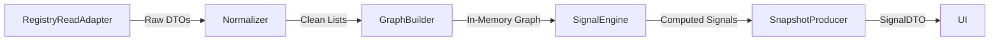

# OFS Data Aggregation & Signals Layer

**Status:** DRAFT
**Version:** 1.0
**Context:** Module 04 (OFS) - Executive Intelligence Logic

## 1. Overview
This document defines the logic for the **OFS Data Aggregation Layer**, which transforms raw Foundation Entities (from System Registry) into high-level **System Signals**.

**Philosophy:**
- **No Business Logic:** We do not calculate profit, efficiency, or performance.
- **Structural Integrity:** We analyze the *completeness*, *consistency*, and *connectedness* of the system.
- **Tension Detection:** We highlight areas where the architecture is broken (e.g., a Function without a Producer, an OrgUnit without a Function).

## 2. Aggregation Pipeline



1.  **Normalization:** Fetch all required entities (`org_unit`, `function`, `cpk`, etc.) in parallel.
2.  **Graph Construction:** Build a coherent graph where nodes are Entities and edges are Relations (e.g., `OrgUnit -> has -> Function`).
3.  **Signal Computation:** Traverse the graph to detect patterns (signals).
4.  **Snapshot Production:** Package results into a DTO for the Frontend.

## 3. Signal Indicators (The Executive Snapshot)

### 3.1. Structural Stability (Org Graph)
**Goal:** Detect fragmentation and isolation in the organizational chart.

*   **Metric 1: Connectivity Risk**
    *   *Logic:* Count `org_unit` nodes where `indegree == 0` AND `outdegree == 0` (excluding root).
    *   *Interpretation:* "Ghost Units" - exist in registry but unconnected to hierarchy.
    *   *Signal:* `LOW` (0 ghosts), `MEDIUM` (1-2), `HIGH` (>2).

*   **Metric 2: Hierarchy Depth**
    *   *Logic:* Calculate max depth of the Org Tree. Compare against `org_unit_type` rules (e.g., Squadron shouldn't be under Division without Department).
    *   *Signal:* `OK` or `ANOMALY`.

### 3.2. Functional Coverage (Func Graph)
**Goal:** Ensure every part of the organization has a defined purpose.

*   **Metric 1: Orphan Functions**
    *   *Logic:* Count `function` nodes not linked to any `org_unit`.
    *   *Signal:* `GAP` (>0 orphans).

*   **Metric 2: Hollow Units**
    *   *Logic:* Count `org_unit` nodes (non-abstract) that have 0 linked `function` nodes.
    *   *Signal:* `PARTIAL` (Units exist but do nothing).

### 3.3. CPK Alignment (Value Graph)
**Goal:** Ensure every function produces a defined Valuable Final Product (CPK).

*   **Metric 1: Unproductive Functions**
    *   *Logic:* Count `function` nodes not linked to any `cpk`.
    *   *Signal:* `TENSION` (Doing work, but output undefined).

*   **Metric 2: Ownerless CPK**
    *   *Logic:* Count `cpk` nodes not linked to a `cpk_owner` (Position/Role).
    *   *Signal:* `CONFLICT` (Value defined, but nobody responsible).

### 3.4. Intellectual Support (Knowledge Graph)
**Goal:** Ensure the organization knows *how* to do its work.

*   **Metric 1: Methodological Gap**
    *   *Logic:* Count `function` nodes not linked to any `methodology` or `knowledge_unit`.
    *   *Signal:* `WEAK` (Function defined, but no instructions/SOPs).

*   **Metric 2: Qualification Gap**
    *   *Logic:* Count `position` nodes requiring a `qualification` that has no enabling `course` or `program`.
    *   *Signal:* `UNSUPPORTED`.

## 4. Scenario Mode Logic

In Scenario Mode, the Executive modifies the system structure in-memory (Sandbox). The Signals Layer must react dynamically.

### 4.1. Differential Computation
Instead of just showing the new state, we show the **Delta** ($\Delta$).

**Algorithm:**
1.  Compute `BaselineSnapshot` (from Real Registry).
2.  Apply User Changes to In-Memory Graph (e.g., "Archive Dept A", "Create Function B").
3.  Compute `ScenarioSnapshot`.
4.  **Signal Delta:**
    *   $\Delta$ Stability = Scenario.Stability - Baseline.Stability
    *   $\Delta$ Coverage = Scenario.Coverage - Baseline.Coverage

**UI Representation:**
- "Stability Risk: HIGH → MEDIUM (Improved)"
- "Functional Gaps: 5 → 7 (Worsened)"

**Constraint:**
- The computation must be fast (< 200ms) to support interactive "What-If" modeling.
- Extensive caching of the baseline graph is required.

## 5. Output DTOs

```typescript
export interface SignalSnapshotDTO {
  timestamp: string;
  mode: 'LIVE' | 'SCENARIO';
  
  structural: {
    status: 'STABLE' | 'AT_RISK' | 'CRITICAL';
    ghost_units_count: number;
    depth_anomaly: boolean;
  };
  
  functional: {
    status: 'FULL' | 'PARTIAL' | 'GAP';
    orphan_functions_count: number;
    hollow_units_count: number;
  };
  
  value: {
    status: 'ALIGNED' | 'TENSION' | 'CONFLICT';
    unproductive_functions_count: number;
  };
  
  intellectual: {
    status: 'SUPPORTED' | 'WEAK' | 'EMPTY';
    methodology_coverage_percent: number;
  };
}
```

## 6. Implementation Notes
- **Performance:** For N < 10,000 entities, full in-memory graph re-computation is acceptable.
- **Latency:** Initial load ~500ms (fetch from Registry). Scenario updates ~50ms.
- **Isolation:** Signals never trigger Registry writes.
