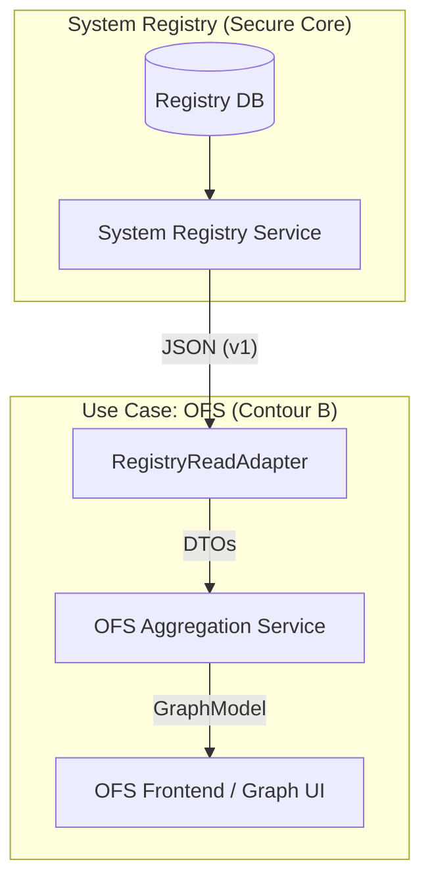

# OFS-Registry Integration Specification

**Status:** DRAFT
**Version:** 1.0
**Context:** Module 04 (OFS) Integration with System Registry (Module 00)

## 1. Overview
This document defines the architectural integration between the **System Registry** (Single Source of Truth) and the **OFS Module** (Executive Strategic & Tactical Panel).

**Strategic Principle:**
OFS is a **pure consumer** of foundation data. It visualizes and aggregates data but **never owns or mutates** the foundational entities defined in the Registry.

## 2. Integration Contract

### 2.1. Source of Truth
The **System Registry** is the exclusive master for the following entities. OFS must **NOT** maintain local copies or shadow tables for these types.

| Entity Category | Entities Consumed by OFS |
|-----------------|--------------------------|
| **Structure** | `organization`, `org_unit`, `org_unit_type`, `org_relation`, `structural_role` |
| **Function** | `function_group`, `function`, `function_relation` |
| **Position** | `position`, `appointment`, `status`, `qualification`, `qualification_level` |
| **Value** | `cpk`, `cpk_hierarchy`, `cpk_owner` |

### 2.2. The Read-Only Rule
- **NO Direct DB Access:** OFS services must NOT connect to the `registry` schema.
- **NO Direct API Calls:** OFS services should not construct raw HTTP requests.
- **Mandatory Adapter:** All data access is mediated strictly via the **`RegistryReadAdapter`** library.

## 3. Data Flow Architecture



## 4. OFS Aggregation Layer
Since the Registry provides normalized, flat lists of entities, the **OFS Aggregation Layer** is responsible for reconstructing the semantic graph structure required for visualization.

### 4.1. Responsibilities
1.  **Fetch & Cache:** Retrieve raw lists (e.g., all units, all relations) via `RegistryReadAdapter`.
2.  **Graph Construction:**
    - Link `org_unit` nodes using `org_relation` edges.
    - Attach `function` nodes to `org_unit` nodes.
    - Attach `position` nodes to `org_unit` nodes.
    - Map `cpk` outputs to `function` or `position` producers.
3.  **Filtering:** Apply lifecycle and context filters (see Section 5).

### 4.2. Constraints
- **Ephemeral State:** The aggregation layer calculates the graph on-demand (with caching). It does NOT persist the graph structure back to a database.
- **No Mutation:** The aggregation layer cannot modify entity properties (e.g., renaming a unit). All edits must happen via the **Registry Admin UI**, not OFS.

## 5. Filtering & Scenario Mode

The Registry contains entities in various states (`draft`, `active`, `archived`). OFS consumes them based on the active mode.

### 5.1. Default Mode (Operational View)
- **Filter:** `lifecycle_status = 'active'`
- **Purpose:** Show the currently approved and operating structure of the company.
- **Behavior:**
    - `RegistryReadAdapter.listEntities(type)` is called.
    - Aggregator filters out non-active items.

### 5.2. Scenario Mode (Strategic Sandbox)
- **Filter:** `lifecycle_status IN ('active', 'draft', 'archived')` (Configurable)
- **Purpose:** Allow executives to model changes (e.g., "What if we activate this Draft unit?" or "What if we archive this Department?").
- **Behavior:**
    - Fetches **ALL** entities.
    - UI allows toggling visibility of `draft` (future) or `archived` (past) nodes.
    - **Crucial:** Any "new" nodes created during a scenario session exists **ONLY in browser memory** or a temporary user-session state. They are NOT written to the Registry until formally implemented via the Registry Admin process.

## 6. Technical Implementation Guidelines

### 6.1. Dependency Injection
The `OFSBackendService` should inject `RegistryReadAdapter`.

```typescript
class OFSBackendService {
  constructor(private registry: RegistryReadAdapter) {}

  async getStructureGraph(): Promise<GraphModel> {
    const units = await this.registry.listEntities('org_unit');
    const relations = await this.registry.listEntities('org_relation');
    // ... aggregate and return
  }
}
```

### 6.2. Caching Strategy
- The `RegistryReadAdapter` implements read-through caching (Redis).
- OFS relies on this cache for performance.
- OFS Dashboard updates are "near real-time" (dependent on Adapter TTL).

### 6.3. Fail-Safe
- If `System Registry` is down, `RegistryReadAdapter` serves stale data from cache.
- If cache is empty and Service is down, OFS enters **"Offline/Read-Only"** mode (displaying last known snapshot or error, but preventing crashes).

## 7. Prohibitions & Anti-Patterns
1.  **XP-001:** Creating a `ofs.org_units` table is **FORBIDDEN**. Use `registry.org_unit` via Adapter.
2.  **XP-002:** Writing strictly to Registry from OFS (e.g., "Add Unit" button in OFS) is **FORBIDDEN**. OFS is a dashboard; Registry Admin is the control plane.
3.  **XP-003:** Implementing `soft-delete` or `is_deleted` logic in OFS. Use Registry's `lifecycle_status`.
