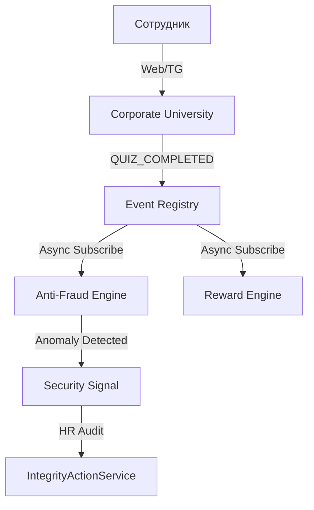

# ARCHITECTURE-MVP — Learning Contour (v1.1)

## 0. Назначение документа

Данный документ описывает реальную архитектуру **MVP Learning Contour** MatrixGin после завершения 5 этапов рефакторинга.

## 1. Архитектурный принцип

MVP Learning Contour основан на **Passive Analysis & Human-in-the-loop** управлении. Система поощряет обучение и наставничество, детектирует аномалии, но исключает автоматические санкции.

## 2. Активные архитектурные компоненты

### 2.1 Интерфейсный слой
- **Telegram Bot (Module 07)**: Нотификации и оперативный статус.
- **Web UI (Frontend)**: Полнофункциональная визуализация курсов, аналитических дашбордов и интерфейсов аудита.

### 2.2 Прикладные модули
- **Corporate University (Module 13)**: Центральный узел (Courses, Quizzes, Anti-Fraud Engine, IntegrityActionService).
- **MatrixCoin Economy (Module 08)**: Начисление MC за достижение квалификационных уровней.
- **Personnel HR Records (Module 33)**: Источник данных о грейдах и ролях.

### 2.3 Службы безопасности и аналитики
- **Anti-Fraud Engine**: Пассивный анализатор событий на предмет аномалий (IP, Time, Patterns).
- **Analytics Service**: Генерация read-only срезов по успеваемости и популярности курсов.

## 3. Поток событий (Event-Driven)

### 3.1 Основной поток обучения

## 4. Этическая изоляция
- **No Profile Tracking**: Система не отслеживает время вне учебного процесса.
- **Read-Only Analytics**: Дашборды не позволяют сравнивать сотрудников "лоб в лоб" (только агрегаты).
- **Human Decision**: Отзыв сертификата возможен только после ручного обоснованного действия в Audit Log.

## 5. Статус документа
- **Статус**: Active / Canonical (Update v1.1)
- **Контур**: MVP Learning Contour
