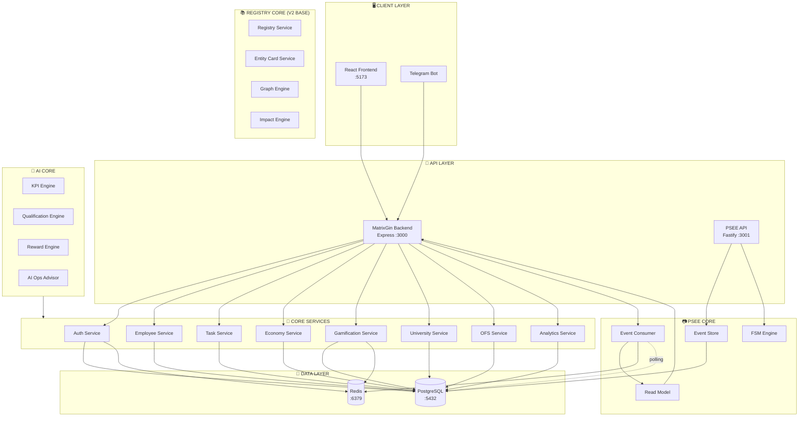
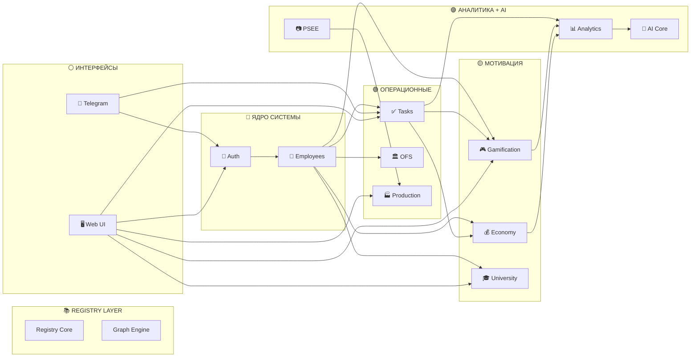
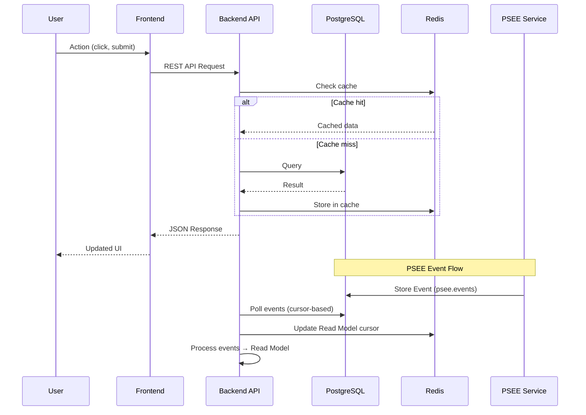
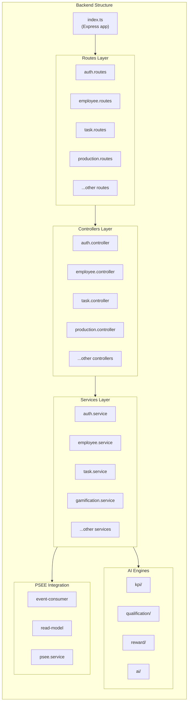
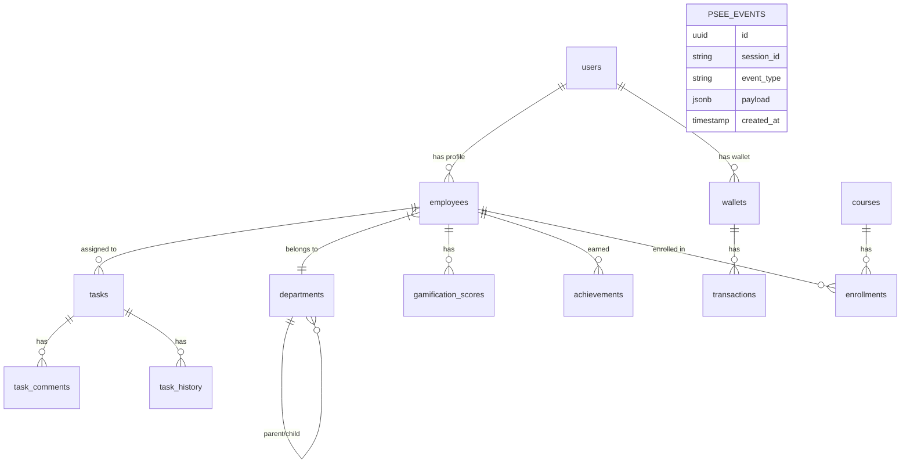
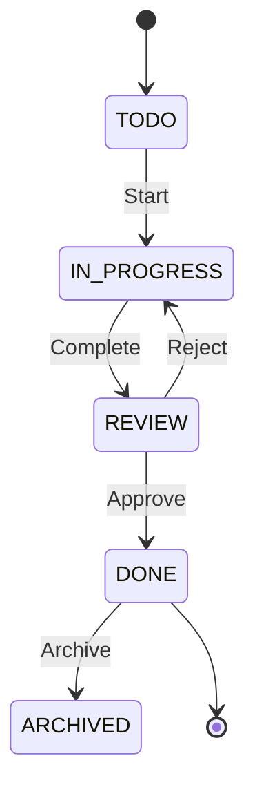
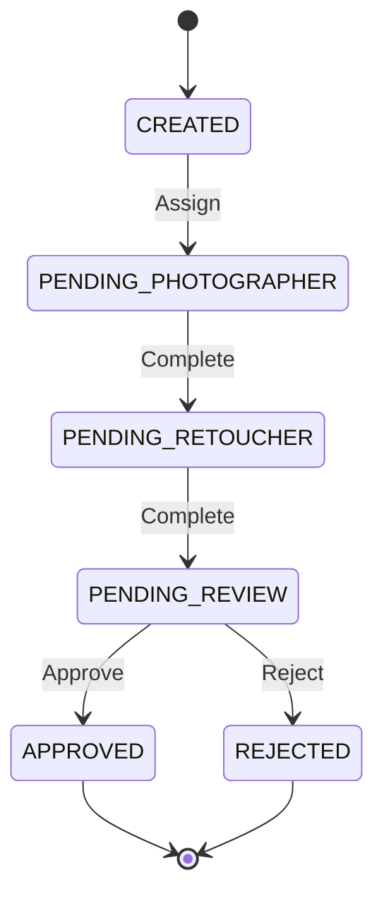

# MatrixGin — ARCHITECTURE

> **Версия:** 2.1  
> **Дата обновления:** 2026-01-19

---

## 🏗️ Общая архитектура системы



---

## 📊 Схема взаимодействия модулей



---

## 🔄 Поток данных



---

## 📦 Структура модулей



---

## 🎯 Зависимости модулей

| Модуль | Зависит от | Используется в |
|--------|-----------|----------------|
| **Auth** | - | Все модули |
| **Employees** | Auth | Tasks, OFS, Gamification, Economy, University, Analytics |
| **Tasks** | Auth, Employees | Gamification, Economy, Analytics, Telegram |
| **OFS** | Auth, Employees | - |
| **Gamification** | Auth, Employees, Tasks, Economy | Analytics |
| **Economy** | Auth, Employees | Gamification, Store |
| **University** | Auth, Employees | Gamification |
| **Analytics** | All modules | AI Core |
| **PSEE** | - | Production |
| **Production** | PSEE | UI |
| **AI Core** | Analytics, Events | Recommendations |
| **Telegram** | Auth, Tasks, Gamification | Notifications |

---

## 🗄️ Схема базы данных (упрощённая)



---

## 🚪 Жизненный цикл и Admission Gate

Система реализует строгий **Base-First** допуск. Ни один пользователь не получает доступ к функционалу или возможности ввода данных до принятия Базы.

См. детальный канон: [ADMISSION_FLOW.md](file:///f:/Matrix_Gin/documentation/ADMISSION_FLOW.md)

### Стадии Admission FSM:
1. **PENDING_BASE**: Только чтение Базы.
2. **BASE_ACCEPTED**: Разрешен ввод анкеты.
3. **PROFILE_COMPLETE**: Ожидание проверки HR.
4. **ADMITTED**: Полный доступ.

### Механизм защиты:
- **Frontend**: `FoundationGuard` принудительно редиректит на нужный этап.
- **Backend**: JWT содержит `scopes` (напр. `foundation:read`), ограничивающие доступ к API на уровне инфраструктуры.

---

## 🚦 Статусы и переходы (FSM примеры)

### Task Workflow


### PSEE Session Workflow


---

## 📡 API Mapping

```
/api
├── /auth
│   ├── POST /register
│   ├── POST /login
│   └── POST /refresh
├── /employees
│   ├── GET /
│   ├── POST /
│   ├── GET /:id
│   └── PUT /:id
├── /tasks
│   ├── GET /
│   ├── POST /
│   ├── GET /:id
│   ├── PUT /:id
│   └── POST /:id/complete
├── /production
│   └── GET /sessions
├── /gamification
│   ├── GET /leaderboard/:type/:period
│   ├── GET /my-status
│   └── GET /achievements
├── /economy
│   ├── GET /wallet
│   └── GET /transactions
├── /university
│   ├── GET /courses
│   └── GET /my-enrollments
└── /analytics
    ├── GET /personal
    └── GET /executive
```

---

## ⚖️ Governance & Architectural Boundaries

### Status & Ranks — Canonical Constraint

Система **Status & Ranks** зафиксирована на стратегическом (CANON) уровне и **НЕ является реализуемым модулем** на текущем этапе.

- Status отражает профессиональную и социальную роль человека в системе.
- Rank отражает форму участия в экономике коинов.
- Status и Rank **не являются частью MatrixCoin Economy** и **не участвуют в расчёте MC**.

Любая логика, при которой:
- статус или ранг умножает начисление MC;
- влияет на базовый расчёт вознаграждений;
- используется как KPI или показатель эффективности,

считается **архитектурным нарушением**.

Каноническое описание и запреты зафиксированы в документе:  
`documentation/00-strategic/STATUS-RANKS-CANON.md`.

Реализация Status & Ranks возможна **только после отдельного архитектурного решения** и не входит в текущие фазы разработки.

---

## 💖 Emotional & Ethical Layer (v2.0)

MatrixGin включает надсистемный слой, влияющий на поведение всех модулей,
но не являющийся отдельным сервисом или API.

### Ключевые компоненты слоя:
- Emotional Passport (Module 25)
- State of Being Engine (Module 26)

### Роль слоя:
- не управляет логикой напрямую
- не принимает решений
- не вмешивается в бизнес-процессы

### Функция:
- адаптация поведения системы
- защита человека в уязвимых состояниях
- обеспечение этичности AI, экономики и управления

### Архитектурный принцип:
Emotional & Ethical Layer = **Policy + Context**, а не Execution.

Ни один модуль не может:
- усиливать давление
- повышать требования
- изменять экономические стимулы

без учёта Emotional & Ethical Layer.

---

## 🤖 AI Advisory Layer (v4.0)

Реализация интерфейса AI-рекомендаций (Phase 4) следует строгому разделению между аналитикой и исполнением.

### Ключевые принципы AI UI:
- **Advisory only**: AI предоставляет рекомендации, решения принимает человек.
- **Read-only**: Интерфейс AI не содержит кнопок действия (Apply, Fix, Execute).
- **Explainability**: Каждая рекомендация сопровождается панелью "Why?" с указанием входных данных (Snapshots).
- **Non-binding**: Рекомендации не являются обязательными к исполнению.

### Компоненты слоя:
- `PersonalAIRecommendationsPage`: Персональные советы для сотрудников.
- `ExecutiveAIRecommendationsPage`: Системная аналитика и поиск узких мест для руководства.
- `AIAdvisoryBanner`: Сквозной компонент, информирующий об архитектурных ограничениях AI.

**Архитектурное правило:** AI-слой имеет доступ только к чтению агрегированных данных через `aiApi`. Прямая модификация сущностей через AI-интерфейс запрещена.

---

**Последнее обновление:** 2026-01-19
