# MatrixGin — ARCHITECTURE

> **Версия:** 2.0  
> **Дата обновления:** 2026-01-10

---

## 🏗️ Общая архитектура системы

```mermaid
flowchart TB
    subgraph CLIENT["🖥️ CLIENT LAYER"]
        UI["React Frontend<br/>:5173"]
        TG["Telegram Bot"]
    end

    subgraph API["🔌 API LAYER"]
        GW["MatrixGin Backend<br/>Express :3000"]
        PSEE_API["PSEE API<br/>Fastify :3001"]
    end

    subgraph CORE["🧠 CORE SERVICES"]
        AUTH["Auth Service"]
        EMP["Employee Service"]
        TASK["Task Service"]
        ECON["Economy Service"]
        GAMIF["Gamification Service"]
        UNI["University Service"]
        OFS["OFS Service"]
        ANAL["Analytics Service"]
    end

    subgraph REGISTRY["📚 REGISTRY CORE (V2 BASE)"]
        REG["Registry Service"]
        CARD["Entity Card Service"]
        GRAPH["Graph Engine"]
        IMPACT["Impact Engine"]
    end

    subgraph AI["🤖 AI CORE"]
        KPI_E["KPI Engine"]
        QUAL_E["Qualification Engine"]
        REW_E["Reward Engine"]
        OPS_E["AI Ops Advisor"]
    end

    subgraph PSEE_CORE["📷 PSEE CORE"]
        EVT["Event Store"]
        FSM["FSM Engine"]
        CONSUMER["Event Consumer"]
        READ["Read Model"]
    end

    subgraph DATA["💾 DATA LAYER"]
        PG[("PostgreSQL<br/>:5432")]
        REDIS[("Redis<br/>:6379")]
    end

    UI --> GW
    TG --> GW
    
    GW --> AUTH
    GW --> EMP
    GW --> TASK
    GW --> ECON
    GW --> GAMIF
    GW --> UNI
    GW --> OFS
    GW --> ANAL
    
    GW --> CONSUMER
    CONSUMER --> READ
    READ --> GW
    
    PSEE_API --> EVT
    PSEE_API --> FSM
    EVT --> PG
    
    AUTH --> PG
    AUTH --> REDIS
    EMP --> PG
    TASK --> PG
    ECON --> PG
    GAMIF --> PG
    GAMIF --> REDIS
    UNI --> PG
    OFS --> PG
    ANAL --> PG
    
    CONSUMER --> REDIS
    CONSUMER -.->|polling| PG
    
    AI --> CORE
```



---

## 📊 Схема взаимодействия модулей

```mermaid
flowchart LR
    subgraph CORE_MODULES["🔵 ЯДРО СИСТЕМЫ"]
        AUTH["🔐 Auth"]
        EMP["👥 Employees"]
    end

    subgraph OPERATIONAL["🟢 ОПЕРАЦИОННЫЕ"]
        TASK["✅ Tasks"]
        OFS["🏛️ OFS"]
        PROD["🏭 Production"]
    end

    subgraph MOTIVATION["🟡 МОТИВАЦИЯ"]
        GAMIF["🎮 Gamification"]
        ECON["💰 Economy"]
        UNI["🎓 University"]
    end

    subgraph REGISTRY_LAYER["📚 REGISTRY LAYER"]
        REG["Registry Core"]
        GRAPH["Graph Engine"]
    end

    subgraph INTELLIGENCE["🟣 АНАЛИТИКА + AI"]
        ANAL["📊 Analytics"]
        AI["🧠 AI Core"]
        PSEE["📷 PSEE"]
    end

    subgraph INTERFACE["⚪ ИНТЕРФЕЙСЫ"]
        TG["🤖 Telegram"]
        WEB["🖥️ Web UI"]
    end

    %% Core dependencies
    AUTH --> EMP
    EMP --> TASK
    EMP --> OFS
    EMP --> GAMIF
    EMP --> ECON
    EMP --> UNI

    %% Operational flow
    TASK --> GAMIF
    TASK --> ECON
    PSEE --> PROD

    %% Analytics
    TASK --> ANAL
    GAMIF --> ANAL
    ECON --> ANAL
    ANAL --> AI

    %% Interfaces
    TG --> AUTH
    TG --> TASK
    WEB --> AUTH
    WEB --> TASK
    WEB --> GAMIF
    WEB --> UNI
    WEB --> PROD
```



---

## 🔄 Поток данных


---

## 📦 Структура модулей


---

## 🎯 Зависимости модулей

| Модуль | Зависит от | Используется в |
|--------|-----------|----------------|
| **Auth** | - | Все модули |
| **Employees** | Auth | Tasks, OFS, Gamification, Economy, University, Analytics |
| **Tasks** | Auth, Employees | Gamification, Economy, Analytics, Telegram |
| **OFS** | Auth, Employees | - |
| **Gamification** | Auth, Employees, Tasks, Economy | Analytics |
| **Economy** | Auth, Employees | Gamification, Store |
| **University** | Auth, Employees | Gamification |
| **Analytics** | All modules | AI Core |
| **PSEE** | - | Production |
| **Production** | PSEE | UI |
| **AI Core** | Analytics, Events | Recommendations |
| **Telegram** | Auth, Tasks, Gamification | Notifications |

---

## 🗄️ Схема базы данных (упрощённая)


---

## 🚦 Статусы и переходы (FSM примеры)

### Task Workflow


### PSEE Session Workflow


---

## 📡 API Mapping

```
/api
├── /auth
│   ├── POST /register
│   ├── POST /login
│   └── POST /refresh
├── /employees
│   ├── GET /
│   ├── POST /
│   ├── GET /:id
│   └── PUT /:id
├── /tasks
│   ├── GET /
│   ├── POST /
│   ├── GET /:id
│   ├── PUT /:id
│   └── POST /:id/complete
├── /production
│   └── GET /sessions
├── /gamification
│   ├── GET /leaderboard/:type/:period
│   ├── GET /my-status
│   └── GET /achievements
├── /economy
│   ├── GET /wallet
│   └── GET /transactions
├── /university
│   ├── GET /courses
│   └── GET /my-enrollments
└── /analytics
    ├── GET /personal
    └── GET /executive
```

---
---

## 💖 Emotional & Ethical Layer (v2.0)

MatrixGin включает надсистемный слой, влияющий на поведение всех модулей,
но не являющийся отдельным сервисом или API.

### Ключевые компоненты слоя:
- Emotional Passport (Module 25)
- State of Being Engine (Module 26)

### Роль слоя:
- не управляет логикой напрямую
- не принимает решений
- не вмешивается в бизнес-процессы

### Функция:
- адаптация поведения системы
- защита человека в уязвимых состояниях
- обеспечение этичности AI, экономики и управления

### Архитектурный принцип:
Emotional & Ethical Layer = **Policy + Context**, а не Execution.

Ни один модуль не может:
- усиливать давление
- повышать требования
- изменять экономические стимулы

без учёта Emotional & Ethical Layer.

**Последнее обновление:** 2026-01-11
