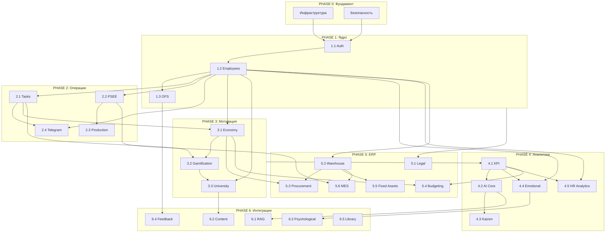

# MatrixGin — ГЕНЕРАЛЬНЫЙ ПЛАН РЕАЛИЗАЦИИ

> **Цель:** Полная реализация корпоративной ERP-системы MatrixGin  
> **Подход:** Пошаговый, от фундамента к специализированным модулям  
> **Дата обновления:** 2026-01-10

---

## 📋 Содержание

1. [Принцип построения](#-принцип-построения)
2. [Phase 0: Фундамент](#-phase-0-фундамент)
3. [Phase 1: Ядро системы](#-phase-1-ядро-системы)
4. [Phase 2: Операционный блок](#-phase-2-операционный-блок)
5. [Phase 3: Мотивация и развитие](#-phase-3-мотивация-и-развитие)
6. [Phase 4: Аналитика и AI](#-phase-4-аналитика-и-ai)
7. [Phase 5: ERP-модули](#-phase-5-erp-модули)
8. [Phase 6: Интеграции](#-phase-6-интеграции)
9. [Диаграмма зависимостей](#-диаграмма-зависимостей)
10. [Текущий статус](#-текущий-статус)

---

## 🎯 Принцип построения

### Логика последовательности
```
ФУНДАМЕНТ → ЯДРО → ОПЕРАЦИИ → МОТИВАЦИЯ → АНАЛИТИКА → ERP → ИНТЕГРАЦИИ
```

### Правила зависимостей
- Каждый модуль может зависеть только от модулей предыдущих фаз
- Модули внутри фазы могут разрабатываться параллельно
- Переход к следующей фазе после завершения критических модулей текущей
---

## 🧭 Parallel Emotional Track (v2.0)

Начиная с Phase 1, MatrixGin развивается по двум синхронным трекам:

### 1. Functional Track
Классическое развитие модулей:
Auth → Employees → Tasks → Economy → Analytics → ERP

### 2. Emotional & Ethical Track
Надсистемные модули:
- 25 — Emotional Passport
- 26 — State of Being Engine

### Принцип:
- Emotional Track не блокирует Functional Track
- но накладывает ограничения и адаптацию
- особенно для AI, Economy и Management

### Критическое правило:
Ни один AI-модуль Phase 4+ не считается готовым,
если он не учитывает Emotional & Ethical Track.

---

## 🏗️ PHASE 0: ФУНДАМЕНТ

> **Цель:** Техническая база, без которой невозможна работа системы

### 0.1 Инфраструктура
| Компонент | Описание | Статус |
|-----------|----------|--------|
| PostgreSQL | Основная база данных | ✅ Done |
| Redis | Кэш и очереди | ✅ Done |
| Express.js | Backend framework | ✅ Done |
| Prisma ORM | Работа с БД | ✅ Done |
| React + Vite | Frontend framework | ✅ Done |
| Docker Compose | Локальная среда | ✅ Done |

### 0.2 Безопасность и логирование
| Компонент | Описание | Статус |
|-----------|----------|--------|
| Helmet | Security headers | ✅ Done |
| Rate Limiting | Защита от DDoS | ✅ Done |
| CORS | Cross-origin policy | ✅ Done |
| Winston Logger | Логирование | ✅ Done |
| Audit Log | Аудит действий | ✅ Done |

**Результат Phase 0:** Работающий сервер с базой данных, готовый к разработке модулей.

---

## 🔐 PHASE 1: ЯДРО СИСТЕМЫ

> **Цель:** Идентификация и базовые сущности — кто есть кто в системе

### 1.1 Authentication & Authorization
**Зависимости:** Phase 0  
**Приоритет:** 🔴 CRITICAL

| Компонент | Описание | Статус |
|-----------|----------|--------|
| JWT Auth | Аутентификация токенами | ✅ Done |
| Passport Strategy | Стратегия авторизации | ✅ Done |
| RBAC | Role-Based Access Control | ✅ Done |
| Refresh Tokens | Обновление токенов | ✅ Done |
| Login UI | Страница входа | ✅ Done |
| Password Reset | Восстановление пароля | ⏳ TODO |
| 2FA | Двухфакторная (optional) | ⏳ TODO |

### 1.2 Employee Management
**Зависимости:** 1.1 Authentication  
**Приоритет:** 🔴 CRITICAL

| Компонент | Описание | Статус |
|-----------|----------|--------|
| Employee CRUD | Создание/редактирование сотрудников | ✅ Done |
| Department CRUD | Управление отделами | ✅ Done |
| Employee Registration | Онбординг сотрудников | ✅ Done |
| Status System | Strategic Canon (см. STATUS-RANKS-CANON.md) | ✅ Canon |
| Employee List UI | Страница списка сотрудников | ⏳ TODO |
| Employee Profile UI | Профиль сотрудника | ⏳ TODO |
| Department Tree UI | Дерево отделов | ⏳ TODO |

### 1.3 OFS (Organizational Structure)
**Зависимости:** 1.2 Employees  
**Приоритет:** 🟡 HIGH

| Компонент | Описание | Статус |
|-----------|----------|--------|
| Org Units CRUD | Подразделения | ✅ Done |
| Hierarchy | Иерархия подчинения | ✅ Done |
| Role Matrix | Матрица ролей | ✅ Done |
| Org Chart | Визуализация структуры | ✅ Done |
| OFS Page UI | Страница оргструктуры | ✅ Done |

**Результат Phase 1:** Система знает всех сотрудников, их роли, отделы и структуру подчинения.

### 1.5 System Registry (New Foundation)
**Зависимости:** Phase 1 (Auth)
**Приоритет:** 🔴 CRITICAL (Architecture Shift)

| Компонент | Описание | Статус |
|-----------|----------|--------|
| Registry Core | Мета-модель системы (Entities, Relations) | ✅ Done |
| Entity Cards | Единый контракт UI/Backend | ✅ Done |
| Dynamic UI | Registry-Driven Forms & Tables | ✅ Done |
| Graph Engine | Траверсинг связей (Graph Projection) | ✅ Done |
| Impact Engine | Анализ влияния (Impact Projection) | ✅ Done |
| AI Ops | Операционный советник (Advisory) | ✅ Done |

**Результат Phase 1.5:** Вся система описывается декларативно. UI строится автоматически. AI понимает контекст через Граф.

---

## ⚙️ PHASE 2: ОПЕРАЦИОННЫЙ БЛОК

> **Цель:** Ежедневная операционная работа — задачи, производство, коммуникации

### 2.1 Task Management
**Зависимости:** 1.2 Employees  
**Приоритет:** 🔴 CRITICAL

| Компонент | Описание | Статус |
|-----------|----------|--------|
| Task CRUD | Создание/редактирование задач | ✅ Done |
| Task Workflow | Статусы (TODO → DONE) | ✅ Done |
| Assignment | Назначение исполнителей | ✅ Done |
| Comments | Комментарии к задачам | ✅ Done |
| History | История изменений | ✅ Done |
| Tasks List UI | Список задач | ✅ Done |
| Task Details UI | Детали задачи | ✅ Done |
| Kanban Board | Доска задач | ⏳ TODO |

### 2.2 PSEE (PhotoSession Economic Engine)
**Зависимости:** 1.2 Employees  
**Приоритет:** 🔴 CRITICAL

| Компонент | Описание | Статус |
|-----------|----------|--------|
| Event Sourcing | Хранение событий | ✅ Done |
| FSM Engine | Конечный автомат | ✅ Done |
| Session CRUD | Создание сессий | ✅ Done |
| Transitions | Переходы между статусами | ✅ Done |
| PSEE API | Fastify сервис (:3001) | ✅ Done |

### 2.3 Production Integration
**Зависимости:** 2.2 PSEE  
**Приоритет:** 🟡 HIGH

| Компонент | Описание | Статус |
|-----------|----------|--------|
| Event Consumer | Чтение событий из PSEE | ✅ Done |
| Read Model | In-memory проекция | ✅ Done |
| Production API | Эндпоинт для UI | ✅ Done |
| Sessions Page UI | Таблица производства | ✅ Done |
| Session Details UI | Детали сессии | ⏳ TODO |
| Filters & Pagination | Фильтры и пагинация | ⏳ TODO |

### 2.4 Telegram Bot
**Зависимости:** 2.1 Tasks, 1.2 Employees  
**Приоритет:** 🟡 HIGH

| Компонент | Описание | Статус |
|-----------|----------|--------|
| Bot Setup | Webhooks/Polling | ✅ Done |
| Auth via Telegram | Связка аккаунтов | ✅ Done |
| Intent Classification | Распознавание намерений | ✅ Done |
| Agent System | Агенты обработки | ✅ Done |
| Notifications | Уведомления | ✅ Done |
| Task Creation | Создание задач через бот | ✅ Done |

**Результат Phase 2:** Ежедневная работа — задачи ставятся, производство отслеживается, коммуникация через Telegram.

---

## 🎮 PHASE 3: МОТИВАЦИЯ И РАЗВИТИЕ

> **Цель:** Мотивационные механизмы — экономика, геймификация, обучение

### 3.1 MatrixCoin Economy
**Зависимости:** 2.1 Tasks, 1.2 Employees  
**Приоритет:** 🟡 HIGH

| Компонент | Описание | Статус |
|-----------|----------|--------|
| Wallet Service | Кошельки MC/GMC/RUB | ✅ Done |
| Transaction Service | Переводы и начисления | ✅ Done |
| Store Service | Магазин наград | ✅ Done |
| Economy API | Эндпоинты | ✅ Done |
| Wallet Page UI | Страница кошелька | ⏳ TODO |
| Transaction History UI | История операций | ⏳ TODO |
| Store Page UI | Магазин | ⏳ TODO |
| MC Lifecycle | Сгорание монет | ⏳ TODO |
| Auctions | Аукционы | ⏳ TODO |

### 3.2 Advanced Gamification
**Зависимости:** 3.1 Economy, 2.1 Tasks  
**Приоритет:** 🟡 HIGH

| Компонент | Описание | Статус |
|-----------|----------|--------|
| Gamification Service | Основной сервис | ✅ Done |
| Gamification Cron | Автоматические начисления | ✅ Done |
| Leaderboards | Рейтинги | ✅ Done |
| Achievements | Достижения | ✅ Done |
| Quests | Квесты | ✅ Done |
| Leaderboard UI | Страница рейтингов | ✅ Done |
| Achievements UI | Галерея достижений | ✅ Done |
| Quest Tracker UI | Трекер квестов | ✅ Done |

### 3.3 Corporate University
**Зависимости:** 1.2 Employees, 3.2 Gamification  
**Приоритет:** 🟡 HIGH

| Компонент | Описание | Статус |
|-----------|----------|--------|
| University Service | Курсы и программы | ✅ Done |
| Enrollment Service | Запись на курсы | ✅ Done |
| Trainer Service | Управление тренерами | ✅ Done |
| University Page UI | Главная страница | ✅ Done |
| My Courses UI | Мои курсы | ✅ Done |
| Institute Pages UI | Институты (6 шт) | ✅ Done |
| Trainers Section UI | Секция тренеров | ✅ Done |
| Course Content | Контент курсов | ⏳ TODO |
| Certifications | Сертификаты | ⏳ TODO |

**Результат Phase 3:** Сотрудники мотивированы (монеты, достижения), развиваются (курсы), соревнуются (рейтинги).

---

## 📊 PHASE 4: АНАЛИТИКА И AI

> **Цель:** Понимание происходящего — метрики, отчёты, рекомендации

### 4.1 KPI & Analytics
**Зависимости:** Phase 1-3 (все данные)  
**Приоритет:** 🟡 HIGH

| Компонент | Описание | Статус |
|-----------|----------|--------|
| KPI Service | Расчёт метрик | ✅ Done |
| KPI Engine | Движок вычислений | ✅ Done |
| Analytics API | Personal/Executive endpoints | ✅ Done |
| Personal Dashboard UI | Личные метрики | ⏳ TODO |
| Executive Dashboard UI | Управленческие отчёты | ⏳ TODO |
| Charts & Graphs | Визуализации | ⏳ TODO |
| Daily Snapshots | Снимки метрик | ⏳ TODO |

### 4.2 AI Core
**Зависимости:** 4.1 Analytics  
**Приоритет:** 🟡 HIGH

| Компонент | Описание | Статус |
|-----------|----------|--------|
| Qualification Engine | Оценка квалификации | ✅ Done |
| Reward Engine | Расчёт наград | ✅ Done |
| AI Ops Advisor | Операционные рекомендации | ✅ Done |
| AI Guardrails | Ограничения AI | ✅ Done |
| LLM Adapter | Интеграция с LLM | ✅ Done |
| AI Recommendations UI | Отображение рекомендаций | ⏳ TODO |

### 4.3 Kaizen (Continuous Improvement)
**Зависимости:** 4.2 AI Core, 1.2 Employees  
**Приоритет:** 🔵 MEDIUM

| Компонент | Описание | Статус |
|-----------|----------|--------|
| Kaizen DTO | Структуры данных | ✅ Done |
| Idea Submission | Подача идей | ⏳ TODO |
| Voting System | Голосование | ⏳ TODO |
| Implementation Tracking | Отслеживание внедрения | ⏳ TODO |
| Kaizen Page UI | Интерфейс идей | ⏳ TODO |

### 4.4 Emotional Analytics
**Зависимости:** 1.2 Employees, 4.1 Analytics  
**Приоритет:** 🔵 MEDIUM

| Компонент | Описание | Статус |
|-----------|----------|--------|
| Emotional DTO | Структуры данных | ✅ Done |
| Mood Tracking | Отслеживание состояния | ⏳ TODO |
| Burnout Detection | Выявление выгорания | ⏳ TODO |
| Wellbeing Dashboard | Дашборд благополучия | ⏳ TODO |

### 4.5 HR Analytics (Matrix360)
**Зависимости:** 1.2 Employees, 4.1 Analytics  
**Приоритет:** 🔵 MEDIUM

| Компонент | Описание | Статус |
|-----------|----------|--------|
| 360 Feedback | Круговая обратная связь | ⏳ TODO |
| Turnover Prediction | Прогноз текучести | ⏳ TODO |
| Performance Reviews | Оценка эффективности | ⏳ TODO |
| HR Dashboard UI | HR-дашборд | ⏳ TODO |

**Результат Phase 4:** Руководство видит полную картину, AI даёт рекомендации, идеи собираются и внедряются.

---

## 🏭 PHASE 5: ERP-МОДУЛИ

> **Цель:** Полноценные ERP-функции — склад, закупки, бюджеты, активы

### 5.1 Legal Compliance
**Зависимости:** Phase 1 (все)  
**Приоритет:** 🟡 HIGH

| Компонент | Описание | Статус |
|-----------|----------|--------|
| Legal DTO | Структуры данных | ✅ Done |
| Consent Tracking | Согласия 152-ФЗ | ⏳ TODO |
| NDA Signatures | Электронные подписи | ⏳ TODO |
| Data Export | Экспорт персональных данных | ⏳ TODO |
| Right to Delete | Право на удаление | ⏳ TODO |
| Compliance Dashboard | Дашборд соответствия | ⏳ TODO |

### 5.2 Warehouse WMS
**Зависимости:** 1.2 Employees  
**Приоритет:** 🔵 MEDIUM

| Компонент | Описание | Статус |
|-----------|----------|--------|
| Warehouse Structure | Склады и зоны | ⏳ TODO |
| Inventory Management | Учёт остатков | ⏳ TODO |
| Stock Movements | Перемещения | ⏳ TODO |
| QR/Barcode | Сканирование | ⏳ TODO |
| WMS UI | Интерфейс склада | ⏳ TODO |

### 5.3 Procurement
**Зависимости:** 5.2 Warehouse, 3.1 Economy  
**Приоритет:** 🔵 MEDIUM

| Компонент | Описание | Статус |
|-----------|----------|--------|
| Supplier Management | Поставщики | ⏳ TODO |
| Purchase Orders | Заказы на закупку | ⏳ TODO |
| Receiving | Приёмка товаров | ⏳ TODO |
| Procurement UI | Интерфейс закупок | ⏳ TODO |

### 5.4 Budgeting & Planning
**Зависимости:** 3.1 Economy, 4.1 Analytics  
**Приоритет:** 🔵 MEDIUM

| Компонент | Описание | Статус |
|-----------|----------|--------|
| Budget Structure | Структура бюджетов | ⏳ TODO |
| Budget Planning | Планирование | ⏳ TODO |
| Budget Execution | Исполнение | ⏳ TODO |
| Forecasting | Прогнозирование | ⏳ TODO |
| Budget UI | Интерфейс бюджетов | ⏳ TODO |

### 5.5 Fixed Assets
**Зависимости:** 5.2 Warehouse  
**Приоритет:** ⚪ LOW

| Компонент | Описание | Статус |
|-----------|----------|--------|
| Asset Registry | Реестр ОС | ⏳ TODO |
| Depreciation | Амортизация | ⏳ TODO |
| Maintenance | Обслуживание | ⏳ TODO |
| Assets UI | Интерфейс активов | ⏳ TODO |

### 5.6 Production MES & Quality
**Зависимости:** 2.2 PSEE, 5.2 Warehouse  
**Приоритет:** ⚪ LOW

| Компонент | Описание | Статус |
|-----------|----------|--------|
| Production Orders | Производственные заказы | ⏳ TODO |
| Quality Control | Контроль качества | ⏳ TODO |
| MES Integration | Интеграция с MES | ⏳ TODO |
| Production Dashboard | Дашборд производства | ⏳ TODO |

**Результат Phase 5:** Полноценные ERP-функции — учёт активов, управление закупками, бюджетирование.

---

## 🔗 PHASE 6: ИНТЕГРАЦИИ И РАСШИРЕНИЯ

> **Цель:** Дополнительные модули и внешние интеграции

### 6.1 RAG Knowledge Base
**Зависимости:** 4.2 AI Core  
**Приоритет:** ⚪ LOW

| Компонент | Описание | Статус |
|-----------|----------|--------|
| Vector DB (Chroma) | Векторная база | ⏳ TODO |
| Document Indexing | Индексация документов | ⏳ TODO |
| Semantic Search | Семантический поиск | ⏳ TODO |
| RAG Integration | Интеграция с LLM | ⏳ TODO |

### 6.2 Content Factory
**Зависимости:** 3.3 University  
**Приоритет:** ⚪ LOW

| Компонент | Описание | Статус |
|-----------|----------|--------|
| Content CMS | Система управления контентом | ⏳ TODO |
| Media Library | Библиотека медиа | ⏳ TODO |
| Templates | Шаблоны | ⏳ TODO |

### 6.3 Psychological Support
**Зависимости:** 4.4 Emotional Analytics  
**Приоритет:** ⚪ LOW

| Компонент | Описание | Статус |
|-----------|----------|--------|
| Counseling | Консультации | ⏳ TODO |
| Resources | Ресурсы поддержки | ⏳ TODO |
| Anonymous Feedback | Анонимная обратная связь | ⏳ TODO |

### 6.4 Branch Feedback System
**Зависимости:** 1.3 OFS  
**Приоритет:** ⚪ LOW

| Компонент | Описание | Статус |
|-----------|----------|--------|
| Feedback DTO | Структуры данных | ✅ Done |
| NPS Collection | Сбор NPS | ⏳ TODO |
| Feedback Dashboard | Дашборд обратной связи | ⏳ TODO |

### 6.5 Library & Archive
**Зависимости:** Phase 1  
**Приоритет:** ⚪ LOW

| Компонент | Описание | Статус |
|-----------|----------|--------|
| Document Storage | Хранение документов | ⏳ TODO |
| Version Control | Версионирование | ⏳ TODO |
| Search | Поиск | ⏳ TODO |

---

## 🔀 Диаграмма зависимостей



---

## 📈 Текущий статус

### По фазам

| Фаза | Модулей | Готово | Прогресс |
|------|---------|--------|----------|
| Phase 0: Фундамент | 2 | 2 | ✅ 100% |
| Phase 1: Ядро | 3 | 2.5 | 🟡 85% |
| Phase 2: Операции | 4 | 3.5 | 🟡 87% |
| Phase 3: Мотивация | 3 | 2.5 | 🟡 83% |
| Phase 4: Аналитика | 5 | 2 | 🟡 40% |
| Phase 5: ERP | 6 | 0.5 | 🔴 8% |
| Phase 6: Интеграции | 5 | 0.5 | 🔴 10% |

### Приоритеты на ближайший спринт

3. **Статусы и Ранги:**
   - Status & Ranks — зафиксированы на стратегическом уровне (CANON). Реализация отложена осознанно. См. [STATUS-RANKS-CANON.md](./00-strategic/STATUS-RANKS-CANON.md).

4. **Завершить Phase 1-3 UI:**
   - [ ] Employee List/Profile UI
   - [ ] Analytics Dashboard UI
   - [ ] Economy/Wallet UI

2. **Начать Phase 4:**
   - [ ] Personal Dashboard
   - [ ] Executive Dashboard
   - [ ] AI Recommendations UI

3. **Подготовить Phase 5:**
   - [ ] Legal Compliance (требуется для production)

---

## 📚 Связанные документы

- [MASTER_CHECKLIST.md](./MASTER_CHECKLIST.md) — детальный чеклист
- [ARCHITECTURE.md](./ARCHITECTURE.md) — визуальные схемы
- [MODULES-IMPLEMENTATION-STATUS.md](./MODULES-IMPLEMENTATION-STATUS.md) — статус модулей
- [README.md](./README.md) — главный README

---

**Последнее обновление:** 2026-01-10  
**Ответственный:** TECHLEAD
