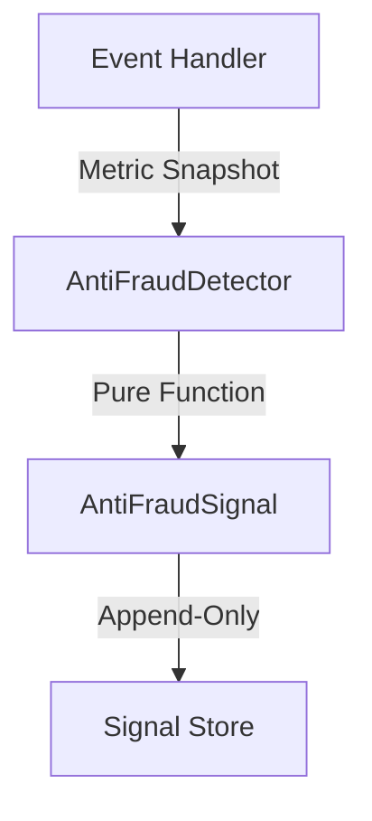

# Component 5: Anti-Fraud Mechanisms — Implementation Plan

## PHASE 0: Invariants & Boundaries

### Цель
Зафиксировать роль Anti-Fraud как **Detection & Signaling system**, строго отделённого от принятия решений и наказаний.

> [!CAUTION]
> **Anti-Fraud = Detection & Signaling, NOT Punishment Engine**
> 
> **Formula:** `Event → Metrics → Signal → Human / Policy Decision`
> 
> Anti-Fraud останавливается на **Signal**.

---

## 1. Роль Anti-Fraud в системе

### 1.1 Архитектурная роль

**Anti-Fraud — это:**
- ✅ Слой наблюдения
- ✅ Слой сигналов
- ✅ Слой причинно-следственной фиксации

**Anti-Fraud НЕ:**
- ❌ Не блокирует действия
- ❌ Не отменяет начисления
- ❌ Не меняет статусы
- ❌ Не принимает решений

### 1.2 Формула
```
Event → Metrics → Signal → Human / Policy Decision
```

---

## 2. Уровни Anti-Fraud (обязательное разделение)

### 2.1 Metric-Level (LOW Signal)

**Источник:** События, агрегаты, KPI

**Примеры:**
- 100% conversion за период
- Средний чек без дисперсии
- Одинаковые суммы подряд
- Аномально быстрое закрытие PhotoCompany

**Свойства:**
- Статистические
- Контекст-независимые
- Не персонализированные

### 2.2 Behavioral-Level (MEDIUM Signal)

**Источник:** Последовательности действий

**Примеры:**
- Всегда один и тот же порядок переходов
- Систематическое избегание отказов
- Резкие скачки метрик без внешних причин

**Свойства:**
- Требуют истории
- Зависят от роли
- Ещё не обвинение

### 2.3 Rule-Violation Level (HIGH Signal)

**Источник:** Нарушение жёстких правил регламента

**Примеры:**
- Нарушение жизненного цикла PhotoCompany
- Редактирование после финализации
- Действия вне смены
- Несоответствие ролей

**Свойства:**
- Бинарные
- Формальные
- Всегда фиксируются

---

## 3. Anti-Fraud Signals (не санкции)

### 3.1 Signal Model (канонический)

```typescript
interface AntiFraudSignal {
    id: string;
    entity_type: 'User' | 'PhotoCompany' | 'Shift' | 'Course';
    entity_id: string;
    level: 'LOW' | 'MEDIUM' | 'HIGH';
    type: SignalType;
    metric_snapshot: any;
    detected_at: Date;
    context: any; // read-only
}

enum SignalType {
    // Metric-Level (LOW)
    CONVERSION_ANOMALY = 'CONVERSION_ANOMALY',
    UNIFORM_METRICS = 'UNIFORM_METRICS',
    
    // Behavioral-Level (MEDIUM)
    NO_RESULT_IMPROVEMENT = 'NO_RESULT_IMPROVEMENT',
    EXCESSIVE_RETESTS = 'EXCESSIVE_RETESTS',
    
    // Rule-Violation (HIGH)
    NO_PRODUCTION_ACTIVITY = 'NO_PRODUCTION_ACTIVITY',
    ROLE_METRIC_MISMATCH = 'ROLE_METRIC_MISMATCH',
    LIFECYCLE_VIOLATION = 'LIFECYCLE_VIOLATION'
}
```

**Важно:**
- Signals **не удаляются**
- Signals **не редактируются**
- Signals **не триггерят автоматические действия**

---

## 4. Видимость и доступы

### 4.1 Кто видит сигналы

| Роль | Доступ |
|------|--------|
| Employee | ❌ |
| Telegram Bot | ❌ |
| AI Core | ❌ |
| Manager (location) | 🔶 aggregated only |
| Security / Ops | ✅ full |

### 4.2 Критические запреты

❌ **Сам сотрудник** не видит сигналы
❌ **Telegram** не имеет доступа
❌ **AI Engines** не используют для обучения
❌ **Frontend user UI** не отображает

> [!WARNING]
> Anti-Fraud данные **НИКОГДА** не используются как training data.

---

## 5. Интеграция с Event Flow

### 5.1 Где живёт Anti-Fraud



**Detector = pure function:**
- Read-only input
- Append-only output
- No side effects

### 5.2 Что запрещено

❌ **Anti-Fraud НЕ может:**
- Влиять на расчёт KPI
- Блокировать начисления
- Менять qualification
- Триггерить уведомления сотруднику

---

## 6. Связь с мотивацией

### Ключевой принцип

```
Anti-Fraud ≠ Anti-Motivation
Signal ≠ Штраф
Signal ≠ Обнуление бонуса
Signal = Повод для анализа
```

**Любые последствия:**
- ✅ Только через человека
- ✅ Только через регламент
- ✅ Только с audit-trail

---

## 7. Инварианты Component 5

Зафиксировать как **архитектурные законы:**

1. **Signals are not decisions**
2. **No automatic punishment**
3. **Append-only, immutable**
4. **Read-only detectors**
5. **No AI involvement**
6. **No Telegram access**
7. **Separation of detection and action**

---

## 8. Implementation Plan

### 8.1 Database Schema

```prisma
model AntiFraudSignal {
  id              String   @id @default(uuid())
  entity_type     String   // User, PhotoCompany, Shift, Course
  entity_id       String
  level           String   // LOW, MEDIUM, HIGH
  type            String   // SignalType enum
  metric_snapshot Json
  detected_at     DateTime @default(now())
  context         Json     // read-only metadata
  
  @@index([entity_type, entity_id])
  @@index([level, type])
  @@index([detected_at])
  @@map("anti_fraud_signals")
}
```

### 8.2 Detector Service

```typescript
class AntiFraudDetector {
    // Main detection method (pure function)
    async detectSignals(
        entityType: string,
        entityId: string,
        eventData: any
    ): Promise<AntiFraudSignal[]>
    
    // Level-specific detectors
    private detectMetricLevel(data: any): AntiFraudSignal[]
    private detectBehavioralLevel(data: any): AntiFraudSignal[]
    private detectRuleViolationLevel(data: any): AntiFraudSignal[]
    
    // Signal persistence (append-only)
    async persistSignals(signals: AntiFraudSignal[]): Promise<void>
}
```

### 8.3 University-Specific Signals

**For Module 13: Corporate University**

| Signal Type | Level | Detection Logic |
|-------------|-------|-----------------|
| `NO_RESULT_IMPROVEMENT` | MEDIUM | PhotoCompany metrics before/after course |
| `NO_PRODUCTION_ACTIVITY` | HIGH | Shift count < 3 in 14 days after course |
| `EXCESSIVE_RETESTS` | MEDIUM | Test attempts >= 4 per module |
| `ROLE_METRIC_MISMATCH` | HIGH | Course target_metric vs user role |

### 8.4 Integration Points

**1. Course Completion (Detection Only):**
```typescript
// In enrollment.service.ts completeCourse()
const signals = await antiFraudDetector.detectSignals('Course', courseId, {
    userId,
    completionDate: new Date(),
    // ... event data
});

await antiFraudDetector.persistSignals(signals);

// CANON: Signals do NOT block completion
// Course completes regardless of signals
```

**2. Qualification Proposal (Signal Awareness):**
```typescript
// In qualification.service.ts proposeQualificationUpgrade()
const signals = await prisma.antiFraudSignal.findMany({
    where: {
        entity_type: 'User',
        entity_id: userId,
        level: 'HIGH'
    }
});

// If HIGH signals exist, proposal metadata includes flag
// Human reviewer sees signals, makes decision
```

---

## 9. Proposed Changes

### 9.1 New Files
- `src/services/anti-fraud-detector.service.ts` — detection logic
- `src/types/anti-fraud.types.ts` — Signal interfaces
- `prisma/migrations/add_anti_fraud_signals.sql` — schema migration

### 9.2 Modified Files
- [src/services/enrollment.service.ts](file:///f:/Matrix_Gin/backend/src/services/enrollment.service.ts) — call detector on course completion
- [src/services/qualification.service.ts](file:///f:/Matrix_Gin/backend/src/services/qualification.service.ts) — check signals before proposal (awareness only)

---

## 10. Verification Plan

### 10.1 Unit Tests
- Test each signal detector independently
- Test signal persistence (append-only)
- Test level assignment logic

### 10.2 Integration Tests
- Complete course with no production activity → verify HIGH signal created
- Complete course with no improvement → verify MEDIUM signal created
- Excessive retests → verify MEDIUM signal created
- Role mismatch → verify HIGH signal created

### 10.3 Manual Scenarios

**Scenario 1: Honest User**
- Complete course
- Work in production (6+ shifts)
- Metrics improve
- Result: No signals or LOW signals only

**Scenario 2: Suspicious Pattern**
- Complete course
- No production activity
- Result: HIGH signal created, visible to Security/Ops only

**Scenario 3: Struggling User**
- Complete course with 5 retests
- Work in production
- Metrics improve slightly
- Result: MEDIUM signal (retests), but course completes normally

---

## 11. Next Steps

1. ✅ **PHASE 0:** Invariants & Boundaries (this document)
2. ⏳ **PHASE 1:** Create Database Schema & Migration
3. ⏳ **PHASE 2:** Implement AntiFraudDetector Service
4. ⏳ **PHASE 3:** Integrate with Enrollment & Qualification
5. ⏳ **PHASE 4:** Testing & Verification


### 1.1 Flag Definitions

| Flag | Severity | Description | Detection Logic |
|------|----------|-------------|-----------------|
| `NO_RESULT_IMPROVEMENT` | WARNING | Курс завершён, но метрики не улучшились | Compare PhotoCompany metrics before/after course |
| `NO_PRODUCTION_ACTIVITY` | CRITICAL | Курс завершён без практики в production | Check shift count in period after course completion |
| `EXCESSIVE_RETESTS` | INFO | Слишком много пересдач тестов | Count test attempts per module (threshold: 4+) |
| `ROLE_METRIC_MISMATCH` | WARNING | Метрики не соответствуют роли | Course target_metric vs user role mismatch |

### 1.2 Severity Levels

**INFO:**
- Просто логируем
- Не влияет на approval

**WARNING:**
- Добавляем в review queue
- Требует внимания, но не блокирует

**CRITICAL:**
- Требует manual approval для qualification
- Автоматический approval невозможен

---

## 2. Fraud Detector Service

### 2.1 Core Methods

```typescript
class UniversityFraudDetector {
    // Main detection method
    async detectFraudFlags(userId: string, courseId: string): Promise<FraudFlag[]>
    
    // Individual flag checks
    private async checkNoResultImprovement(userId: string, courseId: string): Promise<FraudFlag | null>
    private async checkNoProductionActivity(userId: string, courseId: string): Promise<FraudFlag | null>
    private async checkExcessiveRetests(userId: string, courseId: string): Promise<FraudFlag | null>
    private async checkRoleMetricMismatch(userId: string, courseId: string): Promise<FraudFlag | null>
    
    // Logging
    async logFraudFlags(userId: string, courseId: string, flags: FraudFlag[]): Promise<void>
}
```

### 2.2 FraudFlag Interface

```typescript
interface FraudFlag {
    type: 'NO_RESULT_IMPROVEMENT' | 'NO_PRODUCTION_ACTIVITY' | 'EXCESSIVE_RETESTS' | 'ROLE_METRIC_MISMATCH';
    severity: 'INFO' | 'WARNING' | 'CRITICAL';
    message: string;
    metadata: any;
    detected_at: Date;
}
```

---

## 3. Integration Points

### 3.1 Course Completion (NO BLOCKING)

```typescript
// In enrollment.service.ts completeCourse()
const fraudFlags = await fraudDetector.detectFraudFlags(userId, courseId);
await fraudDetector.logFraudFlags(userId, courseId, fraudFlags);

// CANON: Flags do NOT block completion
// Course completes regardless of flags
```

### 3.2 Qualification Proposal (ADVISORY)

```typescript
// In qualification.service.ts proposeQualificationUpgrade()
const fraudFlags = await fraudDetector.getFraudFlags(userId);

const hasCriticalFlags = fraudFlags.some(f => f.severity === 'CRITICAL');

if (hasCriticalFlags) {
    // Create proposal with requiresManualApproval: true
    // Auto-approval disabled
} else {
    // Normal proposal flow
}
```

---

## 4. Detection Logic Details

### 4.1 NO_RESULT_IMPROVEMENT

**Logic:**
1. Get course completion date
2. Fetch PhotoCompany metrics BEFORE course (last 6 shifts before enrollment)
3. Fetch PhotoCompany metrics AFTER course (first 6 shifts after completion)
4. Compare target_metric values
5. Flag if AFTER <= BEFORE (no improvement)

**Metadata:**
```json
{
    "target_metric": "OKK",
    "before_value": 85.5,
    "after_value": 84.2,
    "improvement": -1.3
}
```

### 4.2 NO_PRODUCTION_ACTIVITY

**Logic:**
1. Get course completion date
2. Count shifts in 14 days after completion
3. Flag if shift_count < 3

**Metadata:**
```json
{
    "completion_date": "2026-01-15",
    "check_period_days": 14,
    "shift_count": 1,
    "threshold": 3
}
```

### 4.3 EXCESSIVE_RETESTS

**Logic:**
1. Get all module progress for this enrollment
2. Count test attempts per module
3. Flag if any module has attempts >= 4

**Metadata:**
```json
{
    "module_id": "abc123",
    "module_title": "Основы ретуши",
    "attempt_count": 5,
    "threshold": 4
}
```

### 4.4 ROLE_METRIC_MISMATCH

**Logic:**
1. Get user role
2. Get course target_metric
3. Check if metric is relevant for role
4. Flag if mismatch

**Mapping:**
```typescript
const roleMetricMap = {
    'PHOTOGRAPHER': ['OKK', 'CK', 'CONVERSION'],
    'SALES': ['CONVERSION', 'AVG_CHECK'],
    'RETOUCH': ['QUALITY', 'RETOUCH_TIME'],
    'GENERAL': ['*'] // All metrics allowed
};
```

**Metadata:**
```json
{
    "user_role": "PHOTOGRAPHER",
    "course_target_metric": "RETOUCH_TIME",
    "expected_metrics": ["OKK", "CK", "CONVERSION"]
}
```

---

## 5. Database Schema

### 5.1 FraudLog Table (Optional)

```prisma
model FraudLog {
  id         String   @id @default(uuid())
  user_id    String
  course_id  String
  flag_type  String
  severity   String
  message    String
  metadata   Json
  detected_at DateTime @default(now())
  
  user   User   @relation(fields: [user_id], references: [id])
  course Course @relation(fields: [course_id], references: [id])
  
  @@index([user_id, course_id])
  @@index([flag_type, severity])
  @@map("fraud_logs")
}
```

**Alternative:** Store in Event metadata or QualificationProposal metadata

---

## 6. Proposed Changes

### 6.1 New Files

- `src/services/university-fraud-detector.service.ts` — fraud detection logic
- `src/types/fraud.types.ts` — FraudFlag interface

### 6.2 Modified Files

- [src/services/enrollment.service.ts](file:///f:/Matrix_Gin/backend/src/services/enrollment.service.ts) — call fraud detector on course completion
- [src/services/qualification.service.ts](file:///f:/Matrix_Gin/backend/src/services/qualification.service.ts) — check fraud flags before proposal
- [prisma/schema.prisma](file:///f:/Matrix_Gin/backend/prisma/schema.prisma) — add FraudLog model (optional)

---

## 7. Verification Plan

### 7.1 Unit Tests

- Test each flag detection logic independently
- Test severity assignment
- Test flag logging

### 7.2 Integration Tests

- Complete course with no production activity → verify CRITICAL flag
- Complete course with no improvement → verify WARNING flag
- Excessive retests → verify INFO flag
- Role mismatch → verify WARNING flag

### 7.3 Manual Scenarios

**Scenario 1: Honest User**
- Complete course
- Work in production (6+ shifts)
- Metrics improve
- Result: No flags, auto-approval possible

**Scenario 2: Gaming Attempt**
- Complete course
- No production activity
- Result: CRITICAL flag, requires manual approval

**Scenario 3: Struggling User**
- Complete course with 5 retests
- Work in production
- Metrics improve slightly
- Result: INFO flag (retests), auto-approval still possible

---

## 8. Next Steps

1. ✅ **PHASE 0:** Architecture & Canon (this document)
2. ⏳ **PHASE 1:** Create FraudDetector Service
3. ⏳ **PHASE 2:** Implement Detection Logic
4. ⏳ **PHASE 3:** Integrate with Enrollment & Qualification
5. ⏳ **PHASE 4:** Testing & Verification
